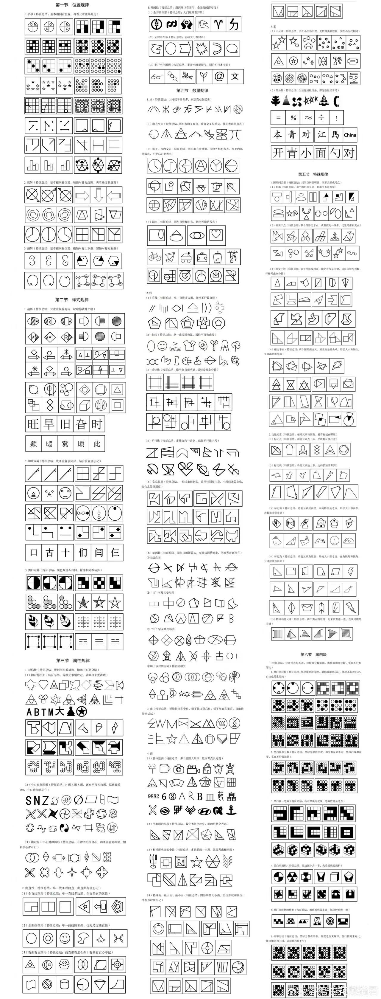
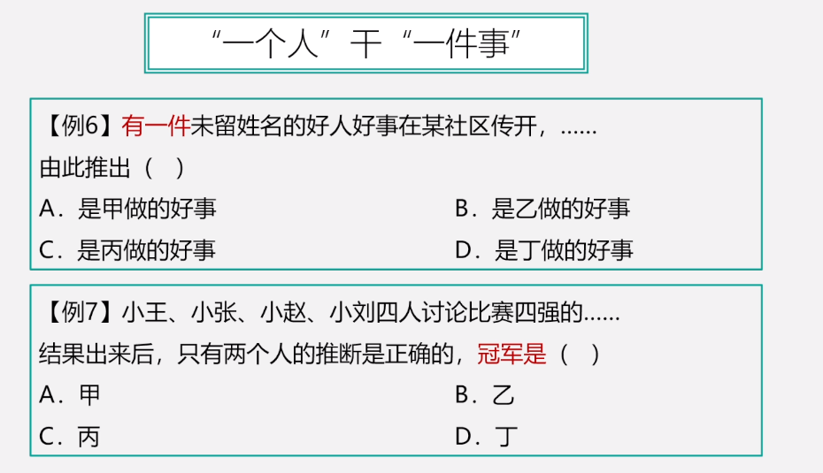
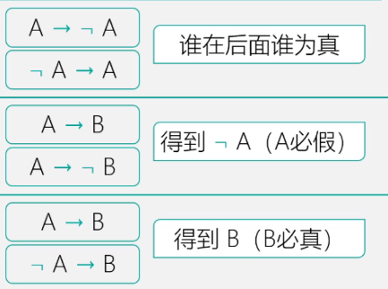
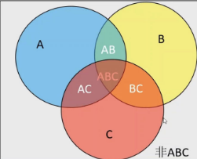

# Table of Contents

* [资料分析](#资料分析)
  * [如何找到关键点？](#如何找到关键点)
  * [方法技巧](#方法技巧)
  * [基础概念](#基础概念)
    * [比重公式](#比重公式)
    * [ABRX](#abrx)
  * [注意点](#注意点)
  * [实战](#实战)
* [言语理解](#言语理解)
  * [逻辑填空](#逻辑填空)
  * [中心理解](#中心理解)
  * [意图理解题](#意图理解题)
  * [细节理解](#细节理解)
  * [态度观点](#态度观点)
  * [语句排序](#语句排序)
  * [语句填空](#语句填空)
  * [下文推断](#下文推断)
  * [词语成语总结](#词语成语总结)
* [判断推理](#判断推理)
  * [图形推理](#图形推理)
    * [折叠图](#折叠图)
    * [立体图](#立体图)
    * [截面图](#截面图)
  * [类比判断](#类比判断)
  * [定义判断](#定义判断)
  * [逻辑判断](#逻辑判断)
    * [翻译推理](#翻译推理)
      * [假言-基于假设](#假言-基于假设)
      * [选言-基于事实](#选言-基于事实)
      * [集合推理](#集合推理)
    * [形式推理：下列xx结构相似的是？](#形式推理下列xx结构相似的是)
    * [真假推理](#真假推理)
    * [分析推理](#分析推理)
      * [题干确定](#题干确定)
      * [题干不确定](#题干不确定)
    * [排列组合](#排列组合)
    * [填字](#填字)
    * [归谬](#归谬)
    * [至少一个 至少2个](#至少一个-至少2个)
  * [加强削弱](#加强削弱)
    * [加强](#加强)
    * [削弱](#削弱)
  * [科学推理](#科学推理)
* [数量关系](#数量关系)
  * [数字推理](#数字推理)
  * [数字特性](#数字特性)
  * [数量技巧](#数量技巧)
  * [工程问题](#工程问题)
  * [利润问题](#利润问题)
  * [牛吃草问题](#牛吃草问题)
  * [空瓶换水](#空瓶换水)
  * [最值问题](#最值问题)
  * [容斥问题](#容斥问题)
  * [行程问题](#行程问题)
  * [日期问题](#日期问题)
  * [方阵问题](#方阵问题)
  * [数据与数据之间特殊因子关系](#数据与数据之间特殊因子关系)
  * [植树问题](#植树问题)
  * [年龄问题](#年龄问题)
  * [溶液问题](#溶液问题)
  * [买卖销售-份数](#买卖销售-份数)
  * [工程问题](#工程问题-1)
  * [排列组合](#排列组合-1)
    * [平均分堆问题-插板法](#平均分堆问题-插板法)
* [错题整理](#错题整理)
* [待办](#待办)

# 资料分析

[具体学习资料](../2.课程学习/2.资料分析)

资料分析其实就是三步走

1. 看问题，问的是什么？
2. 看材料。时间、重点、单位
3. 进行计算

## 如何找到关键点？

[读题找数](../2.课程学习/资料分析/读题找数.md)

## 方法技巧

+ [加减乘除](../2.课程学习/资料分析/加减乘除技巧.md)
+ [百化分](../2.课程学习/资料分析/百化分.md)
+ [弥差取整法-待定](../2.课程学习/资料分析/弥差取整法.md)  
+ [假设分配](../2.课程学习/资料分析/假设分配.md)
+ [化除为乘](../2.课程学习/资料分析/化除为乘-平方差.md)
+ [如何快速计算BX](../2.课程学习/资料分析/如何快速计算BX.md)
  + 注意：这里是直接BR，相当于直接用现期乘R，增长量会大一点！！！
+ [十字相乘](../2.课程学习/资料分析/十字交叉法解析.md)
+ [年均增长率](../2.课程学习/资料分析/年均增长率.md)
+ [预测将来](../2.课程学习/资料分析/预测将来.md)
+ [分数比较大小](../2.课程学习/资料分析/分数比较大小.md)
+ [速算2位数乘法](../2.课程学习/资料分析/2位数乘法.md)
+ [基期差](../2.课程学习/资料分析/基期差计算技巧.md)
+ [等比例放缩]
+ 一般来说 综合题目选CDBA是最多的

## 基础概念

### 比重公式

1. 现期比重：【A/B】
2. 隔期比重：【小集合 × 中集合】
3. 基期比重：【A（1+b%）/B（1+a%）】 
   1. 题型变种：  A B C 给 b c的增长率。求基期b/a的比重 先求出基期b/c的比重。在置换出b/a
   2. 快速计算基期比重：现期比重-比重差  [分析](../2.课程学习/资料分析/基期比重快速技巧.md)
4. 比重差：【（A/B） * （a-b）/（1+a）】

### ABRX

1. A : B/(1+r)  =B-X 【推荐错位加减 比列完美份数法】

   1. 基期差： 特征：一正一负 一大一小  方法：正负看现期差，且选项大概不等于现期差 [分析](../2.课程学习/资料分析/基期差计算技巧.md)

2. B: A x (1+r)

3. R

   1. 比较2个R趋势大小  【增长趋势比较法】

   2. 柱状图一排R趋势大小

      > 看本期增长趋势，看增长幅度趋势 然后把特殊的找出来进行比较

   3. 间隔增长率： 【R=r1+r2+r1*r2】

      > 现在一般都是给一个R和r1 求r2

   4. 年均增长率：

      1. 【基期×（1+r）^n =现期】
      2. R=（2 * 差 ）/( n * 和)  0.6 2.2 5

   5. 混合增长率： [分析](../2.课程学习/资料分析/十字交叉法解析.md)

      > 特征：凡是a=b+c都可以用混合增长率
      >
      > 解答:   十字相乘 整体的增长率介于两部分增长率之间，且靠近基期较大的一方
      >
      > 列子：盈余=收入-支出 收入=支出+盈余 收入5 支出1.8 盈余肯定是大于5 如果要求具体值可用十字相乘或者线段法

   6. 比值增长率：

      > 特征：题干一般都会出现平均/均增长率等字眼，但是一定要注意有的专有名词中含有「平均」，不要混淆。 选项出现百分比点是比重 %是比值
      >
      > 解答：(a-b)/(1+b)
      [分析](../2.课程学习/资料分析/比值增长率.md)
4. 乘积增长率

   > 特征：①实际乘积关系，例如总额=单价×数量 
   >
   > ​			②部分=整体×占比【(当前-上年)/上一年】 第二个很难想到
   >
   > 公式 a=b+c+ b*c

     8. 未来增长率： 明年=今年*今年/去年  [分析](../2.课程学习/资料分析/预测将来.md)

5. X

   1. 直接求x

      > 1. 当R小于10%时，X约等于B*R
      > 2. 用假设分配进行排除
      > 3. 用百化分进行排除

   2. 比较2个增长量

      > 1. B越大 R越大则X越大
      > 2. 我的B是你的2倍，你的R至少是我的2倍以上，x才有可能相等

## 注意点

1. 看题目问的时间，是不是跟材料一样。注意单位 年 月份 ！！！

   > 1. 有的题目会出现年份不同的情况 比如题目问的1-3 材料给的1-4
   > 2. 图标 柱状图注意对应的名字
   > 3. 2010年末就是2011年初

2. 日常坑

    1. 倍数

       > 1.是几倍数=A/B
       >
       > 2.是几倍=增长率+1
       >
       > 3.多几倍数=A/B - 1

    2. 增长率

       > 1. 高百分之几 是问增长率

3. 看题目问的关键词在材料中找到出处

4. 掌握常用技巧

   > 1. 尾数 21法 百化分 拆分 估算 截位直除 假设分配 份数法 增长趋势
   > 2. 柱状图问某某年同比增长超过百分之10的 可以用基期* 百分之10在与本期相比
   > 3. 均前每后是分母

## 实战

[学习资料](../2.课程学习/资料分析/资料实战.md)

# 言语理解

[学习资料](../2.课程学习/1.言语理解)

## 逻辑填空

- 理解语境

  - 关联词关系
    - 转折：含义相反、色彩相反
    - 递进：含义递进、色彩一致
    - 因果：含义相关、色彩一致
    - 正、反并列：含义相关、色彩一致
      - 分号、逗号、顿号
    - 引号： 表示强调、反讽
  - 逻辑提示
    - 解释性语句：根据上下文对空格处解释说明的语句
      - 有因为没所以
    - 提示性词：语境中的提示词往往和空上词修饰的是同一个中心词
  
- 辨析选项

  - 词义轻重、

    + 正确对待经典中可能存在有的某些？ 不足、缺陷、弊病、瑕疵 

  - 固定搭配

    > 1. 首先要排除的，就是不符合用词习惯的词，也就是不搭配的词 只需要提炼出主/谓/宾
    
  - 感情色彩【褒义、中性、贬义】

## 中心理解

- 先读问题，再看题目

- 主体分析法，准确把主体中心词

  - 高频出现
  - 首句下定义
  - 重点句强调的
  - 以代词形式转移和重复出现的词

- 关联词( 中心语句，强调句，转折句，原因句等语法结构，忽略举例，背景句，解释句等)

  - 转折：转折之后是重点
  - 因果：
    - 一般因果关系【所以】后面是重点，因为A，所有B  B是重点
    - 之所以是因为强调的是【对结果的解释】 之所以A是因为B
  - 递进：递进之后是重点
  - 条件: 只有A才能B，A才是重点。
  - 并列：选项需要概括所有关系
    - 一主体+多方面
    - 多主体+一方面
    - 多主体+多方面
  - 观点援引法：引出作者的观点，援引之后的语句很重要
    - 正向：观点=结论
    - 反向：
  - 举例论证：例子不重要，是干扰选项
  - 反面论证：反面论证都是为了加强观点。
  - 背景铺垫：

- 注意

  - 原因解释不重要
  - 首尾句要关注
  - 如果有具体对策的，选具体对策，不能太泛
  
- 看选项，一般是用排除法。对比择优

  > 1. 过于绝对
  > 2. 过于片面
  > 3. 无中生有
  > 4. 偷换概念

## 意图理解题

意图理解是基于主旨题做得扩展

解题思路：基于主旨的引申项，没有就选主旨

引申方向

+ 好的越好
+ 坏的要警惕
+ 濒危要保护
+ 造成问题的原因要解决

## 细节理解

+ 切记看清提问
+ 四个选项全部看完
+ 匹配与原文得意思

## 态度观点

+ 明确观点
+ 隐含观点
+ 杂糅观点
+ 没有观点

## 语句排序

- 读选项：筛选头尾； 逻辑顺序、时间顺序
- 读句子：确定抱团； 看是否有相近话题可以构成捆绑
- 代入检查

## 语句填空

+ 话题一致 内容连贯

+  空格前有“因此”一词，其前是逗号，这表明结合最后一句即可得到答案。 其前是句号，是对全文的总结

## 下文推断

+ 话题一致 内容连贯

+  一般是看最后一句话

## 词语成语总结

[易错成语](成语词语辨析.md)

# 判断推理

[学习资料](../2.课程学习/4.判断推理.md)

## 图形推理

大纲图

+ 元素组成不同，优先考虑属性规律

    + 对称 ：
        1. 图形出现箭头、“Z”字变形图、等腰三角形等，优先考虑对称性
        2. 对称轴 数量（面或者其他z）、方向、与点或者线重合
    + 曲直
        + 考曲直之间的数量关系。交点、曲线数量、直线数量
    +  凹凸
    + 封闭
+ 元素组成相似，优先考虑样式规律
    + 加减同异
      + 整体求同、部分求同、22求同
    + 样式遍历
    + 黑白相加、元素置换、自定义规律
    + 元素换算：要么递增、要么递减 关键是找包含
+ 元素组成相同，优先考虑位置规律
    + 动态
      + 平移
        + 特别注意，是可以斜着移动的 这种主要是找关键图形的变动！！
      + 翻转：时钟法
    + 静态
      + 相切
      + 点交
+ 元素组成不同，无明显属性规律，优先考虑数量规律
    + 点：
    + 线：线的方向 平行线 
    + 角：
      + 电话卡出现是直角
    + 面：
      + 最大面
      + 面积
      + 面和外框：图形中都是非常相同的外框
      + 相同面
    + 素：
      + 部分数：生活化图形经常考
    + 形：
      + 延长线和图形的交点
    + 总量没有规律、看分量
+ 黑白球
    + 整体：对称、移动（看一坨）、叠加
    + 部分：部分、个数、相邻比较（是否有相同）
+ 常见规律
    + 有内有外，考察内外关系的数量 比如对称轴、面等
    + 对于分组的，看图形共性，有没有相同的属性
    + 九宫格优先横着看（横竖S米）、16宫格内部黑快数量不变，优先考虑回字型
    + 汉字三板斧： 笔画、封闭、结构(横竖撇捺)
    + 数字： 笔画、封闭、结构、对称
    + 万般无奈一笔画：日字、田字、 多端点、 十字、圆的切点 优先考虑笔画数  多部份必多笔

### 折叠图

点线面定位法

+ 直四

+  弯三 

+ 双弯三
  

[学习资料](../2.课程学习/判读推理/折叠图.md)

### 立体图

###  截面图

1. 2个图形比较相似，要么同队，要么同错，可以先看其他图形
2. 关注特殊图形、直钝角三角形，直角题型、正五方体
3. 多看虚线标记
4. 简单图形越容易是正确的
5. 想不出答案，直接选复杂的

##  类比判断

[学习资料](../2.课程学习/4.判断推理.md)

题目出现，有语义、语法、逻辑 优先看那个？

优先看逻辑，比较类比属于判断推理

+ 语义
  
    + 近义/反义/比喻义/引申义
    
+ 语法
    + 主谓
    + 动宾
    + 偏正
    
+ 逻辑
    + 全同
    + 并列
      + 反对
      + /矛盾
    + 种属/组成
    + 交叉
    + **高频考点**一直都是对应关系，其中：**功能-目的-先后顺序-原因-必要条件**，基本上代入，就能解题。
    
+ 对应关系

    + 功能：[净水器：除杂质]

    + 时间顺序：[下单：付款：送货]

    + 必要条件: 天下雨：地上湿  

    + 原材料： 大豆：酱油

    + 目的关系 ：

    + 先后顺序 二级辨析看主体  备课∶授课∶复习

    + 必然属性：花椒：麻

    + 

      

##  定义判断

1. 看主体和客体
2. 拆分关键词进行匹配

[分析](../2.课程学习/判读推理/定义判断技巧.md)

## 逻辑判断

### 翻译推理 

[分析](../2.课程学习/判读推理/翻译推理.md)

#### 假言-基于假设

+ 先翻译在推理
+ 肯前必肯后，否后必否前 -> 其实就是逆否公式
+ 否前肯后，无必然结论
+ 关注关联词：谁是必要谁在后  
+ 不 不 也是只有才
+ 如果 那么 是可以省略 只有才不行

#### 选言-基于事实

+ 或关系的三种形式 至少一个 至多一个
+ 摩根定律 
+ 否定肯定式/假言联言转换 -看到A->B 立马要想到-A->B
+ 要么要么 只有一真 否定:都成立 都不成立

#### 集合推理

+ 4个基本
  +  没有一个S是P 等于所有S都不是P   没有一个S不是P等同余所有S都是P
  +  绝大多数更接近所有
  + 有的S是P  1到所有
  + 有得S不是P  不确定，无言下之意
  + 有的不可逆否
+ 3个转换
  + 所有S都是P ->有的P是S
  + 所有S都不是P <->所有的P不是S
  + 有的S是P <->有的P是S
  + 有得S不是P  [无法直接换位]  
+ 2组推理：
  + 所有->某个->有的 只能正着推
+ 1个递推：
  + 来自不同条件，必考递推
  + 有得S->P P->Q  有得S-->Q  找桥梁
+ 常考：
  + 换位、言下之意、递推

### 形式推理：下列xx结构相似的是？

+  直接写A->B的形式，然后套选项

### 真假推理

[分析](../2.课程学习/判读推理/真假推理.md)

找X关系，看其他

+ 矛盾关系
  + 直言矛盾：x
  + 假言矛盾：摩根定律
  + 选言矛盾： A->B矛盾命题为 A且-B 牢记！！
+ 并列关系：可能同真或者同假
  
  + 下反对：必有一真
  
    + 有的有的必有一真
    + 推出关系的整体与【单独肯前】【单独否后】为下反对关系
  
  + 上反对：所有所有必有一假
+ 等价关系：必定同真、同假
+ A->B 就是 -A或B
+ 推出关系：本质是直言命题中的推出 全部->某个->有的
    + 一真前假  一假后真
    + 这里注意：一真前假，不代表后面就一定是真的，是用这个假的信息，在去题目中找矛盾。
+ 极端情况：
    + 一个人干一件事 
### 分析推理

[分析](../2.课程学习/判读推理/分析推理.md)

+ 排除优先
+ 最大信息
+ 确定信息：本质就是稳定性强
+ 不确定信息代入

#### 题干确定

+ 4321：最大找不同，不同找队友 [分析](../2.课程学习/判读推理/分析推理-4321.md)
+ 三人成 [分析](../2.课程学习/判读推理/分析推理-三人成众.md)
+ 2111数量模型[分析](../2.课程学习/判读推理/分析推理-2111模型.md)

#### 题干不确定

+ 只对一半：最小信息法 [分析](../2.课程学习/判读推理/分析推理-只对一半.md)
+ 一个人干一件事：
### 排列组合

+ [并列关系](../2.课程学习/判读推理/排列组合-并列条件.md)
+ 4321：最大找不同，不同找队友 [分析](../2.课程学习/判读推理/分析推理-4321.md)

### 填字

+ [填字-言语](../2.课程学习/判读推理/排列组合-并列条件.md)
    [分析](../2.课程学习/判读推理/填字-言语化.md)

### 归谬

[分析](../2.课程学习/判读推理/归缪推理.md)

### 至少一个 至少2个

直接选至少一个和至少2个的重复选项

## 加强削弱

1. 看清题目是加强还是削弱
2. 找到论点和论据
3. 提取论据推导论点的关键词
4. 锁定关键词的选项
5. 分析重点选项
    1. 肯定现有事实优于否定现有事实
    2. 切断联系大于重复论点/重复论据
6. 错误不能选
    1. 扩大/缩小主体
    2. 无关选项
    3. 不明确选项

### 加强
[分析](../2.课程学习/判读推理/加强削弱.md)
+ 通用类加强
  + 论点
  + 论据
    + 代表性
    + 大多数
    + 其他都一样
  + 隐含前提
  + 建立联系可以看作隐含前提
  + **建立联系大于论据 同理虚弱也一样**
+ 因果类
  + 排除他因
  + 没a没b
  + 有a有b
+ 对比实验类
  + 单因子变量

### 削弱

[分析](../2.课程学习/判读推理/论证提升.md)

除了上面得通用类之外

+ 方法不可行
  + 反 白 副 客 主观
+ 方法本可行
  + 不用更差
  + 等等
+ 因果导致-尽量用自己证明自己
+ 样本不科学-样本越大，越稀释

## 科学推理

[材料](../2.课程学习/判读推理/科学推理.md)

# 数量关系

## 数字推理

[分析](../2.课程学习/数量关系/数推.md)

+ 完成可以利用数字特性做题 ，不一定说非要找到某种规律
+ 关注
  + 质数列 ：1 3 5 7 11 13 17 19 
  + 幂数列：8 9 16 27 64 125
+ 做差：整个数列的递增不明显 幅度小（ 2-3倍） 满足三倍关系
  - 优先考虑做差
  - 考虑二次做差
  - 如果()在中间，可以利用【隔项差】来实现
+ 多项数列：大于7
  + 隔项：奇偶
  + 分组：前后 22
+ 分数
  - 化同：就把整个数列的分子或者分母化成同一个数，然后找规律。
  - 反约分：**可以把分母通分成一样的最好，不能的话就把就需要我们“造”一个数列出来，一般是分母和分子分别弄成一个明显关系的数列**。
  - 前后关系：顾名思义，这类数列前后项之间是有一定的关系的，一般是**乘或者除，作差作和**之类的比较少。
+ 幂数列
  + 观察数字是否在常用幂数列附近
  + 如何快速推算平方数(X+1)2=X2+1+X
+ 递推数列：**是指前后项存在着一定的关系，然后按这个关系递推出结果，也就是后面的数是根据前面的数按照一定的关系得来的，最基本的递推关系就是和、差、积、商**

- 机械拆分
  - 这些题目有个特征，就是**数与数之间毫无特征**，有时**突然增大或突然增小**，或者**都是很大的数**。
  - 数字内部规律一般是**内部相加减或相乘**之类的，行内一般叫机械拆分
- 画图
  - 如“九宫格”“四宫圆”等
  - 一般解法都是相邻数之间找关系，不外乎加减乘除，或者平方之类的。做这些题首要的是找到对应“？”所在位置的关系。
  - 横线或者对角线

## 数字特性

[数字特性](../2.课程学习/数量关系/数字特性.md)

+ 等差数列
+ 最小公倍数
+ 奇数偶数
+ 倍数关系
+ 倍数关系-不定方程
+ 余数关系

##  数量技巧

[a+b碰面](../2.课程学习/数量关系/a+b碰面技巧.md)

## 工程问题

[工程问题](../2.课程学习/数量关系/工程问题.md)

## 利润问题

售价-利润=成本
[利润问题](../2.课程学习/数量关系/利润问题.md)

## 牛吃草问题

a/b体系快速速解牛吃草

1. 牛-分子=V草
2. 分母=S原来草

[利润问题](../2.课程学习/数量关系/牛吃草.md)

 

## 空瓶换水

当前喝的酒+当前喝的酒产生的空瓶可以换的酒=一共喝的酒

[资料](../2.课程学习/数量关系/空瓶换酒.md)

## 最值问题

+ 和定最值
+ 最不利
+ 最不利分类

## 容斥问题

要用面积的思想来做容斥

+ 2集合：总面积=A+B-AB+非AB
  + 注意 【只喜欢】
+ 3集合：总面积=A+B+C-AB-AC-BC+ABC+非AB

[容斥问题](../2.课程学习/数量关系/容斥.md)

## 行程问题

[资料](../2.课程学习/数量关系/行程问题.md)

+ 等距离公式：2v1v2/(v1+v2)
+ 等比例

[资料](../2.课程学习/数量关系/星期几问题.md)

## 日期问题

[资料](../2.课程学习/数量关系/日期问题.md)

+ 星期几

  平年星期数加1，闰年星期数加2
  直接用当前周+（x%7）得到未来的
+ 周期循环

    最小公倍数
+ 星期个数 
  + 画圈法：把一个月当作28天来看，第一个余数就是当月1号 为什么是28 就是当月最大7的倍数
  + 一个月 奇数 偶数 奇数 偶数 或者偶数 奇数 偶数 奇数
  + 画圈法原理：以某个固定间隔为循环，循环结束的时候，余数一定是第一个循环的第一个
  
  
## 方阵问题

[资料](../2.课程学习/数量关系/方阵问题.md)

a 是最外层每边人数

+ 方正总人数=a*a
+ 方正最外层总人数=4a-4  【需要减去顶点重复的】
+ 最外层和内层相差= 每边相差2*4=8
+ 方阵减少一行一列，剩下和原来的还是平方数，直接秒杀平方数

## 数据与数据之间特殊因子关系

[资料](../2.课程学习/数量关系/数据与数据之间特殊因子关系.md)

+ 某个对象的定值因子思维
+ 整体对象因子思维
+ 十字交叉思维
+ 归元进阶思维

## 植树问题

[资料](../2.课程学习/数量关系/植树问题.md)

2端植树问题：植树棵树=间隔数+1

1端植树问题：植树棵树=间隔数

没有端植树问题：植树棵树=间隔数-1

+ 已知间隔求棵数
+ 间隔相对变化模型
  + 先求出2个不同间隔的最小公倍数，再用总距离/间隔得到一共有几个间隔，最后间隔+1
+ 植树中距离、时间和速度关系。

## 年龄问题 

[资料](../2.课程学习/数量关系/年龄问题.md)

+ 年龄差不变
  + 相同人数，过去现通年，年龄差不变
+ 年龄等差
  + 
+ 年龄中特征因子
+ 出生年份问题

## 溶液问题

[资料](../2.课程学习/数量关系/溶液问题.md)

## 买卖销售-份数

[买卖销售](../2.课程学习/数量关系/买卖销售问题.md)

## 工程问题

[工程问题](../2.课程学习/数量关系/工程问题1.md)

## 排列组合

### 平均分堆问题-插板法
利用插板法，解决相关元素分配问题

+ 元素相同
+ 每人至少分一个 

 9个相同的球，装三个盒子，每个盒子至少一个有多少种装法？

   是不是很简单，8C2

   题目改为每个盒子至少装2个有多少装法呢？

   先给每个盒子一个球，还剩下6个球，5C2

# 错题整理

[广东省考错题23-20](../2.课程学习/错题收集/广东省考错题收集.md)

# 待办

+ 如何快速求解24的平方 ？

【个位的平方做个位 】6

【个位的2倍*十位 】 8 * 2 +1=7
【个位的平方做个位】 4+1=5

+ 拆分因子

70=10*7 那么能被70整除得数一定含 10 7 因子

+ 奇数 偶数
  a比b多C,C是奇数，a就是奇数，C是偶数，a就是偶数
  x +x +C=2x+C
+ 看因子只看奇数、看奇不看偶

