# Table of Contents

* [成语辨析](#成语辨析)
  * [耸人听闻、骇人听闻、危言耸听](#耸人听闻骇人听闻危言耸听)
  * [驾轻就熟 耳熟能详](#驾轻就熟-耳熟能详)
  * [深思熟虑 深谋远虑](#深思熟虑-深谋远虑)
  * [无可厚非 无可非议](#无可厚非-无可非议)
  * [一以贯之 一如既往 始终如一](#一以贯之-一如既往-始终如一)
* [词语辨析](#词语辨析)
  * [流传 留传](#流传-留传)
  * [流露 表露](#流露-表露)
  * [径自 径直](#径自-径直)
  * [传颂 传诵](#传颂-传诵)
  * [巨变 剧变](#巨变-剧变)
  * [理想 目标](#理想-目标)
  * [克制 克服](#克制-克服)
  * [驱除 祛除 湮灭](#驱除-祛除-湮灭)


# 成语辨析

## 耸人听闻、骇人听闻、危言耸听

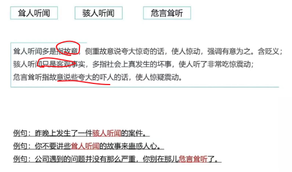

骇人听闻：重点是**客观事实**

**耸人听闻**：故意夸大、贬义


列题：

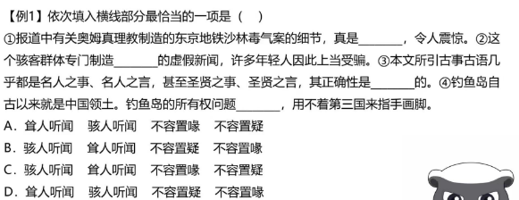

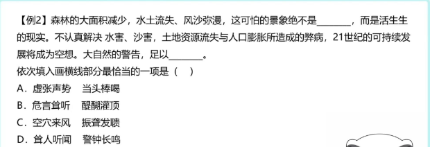


## 驾轻就熟 耳熟能详

驾轻就熟：比喻对某事有经验，很熟悉，做起来容易

耳熟能详：听的多了，可以复述出来


## 深思熟虑 深谋远虑

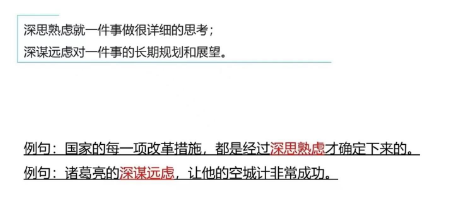

例题：

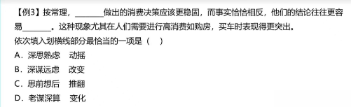

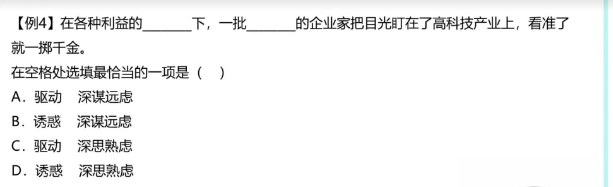


## 无可厚非 无可非议

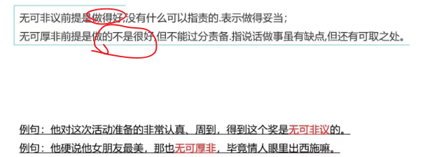

列题：

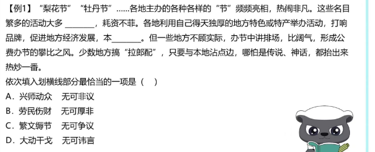

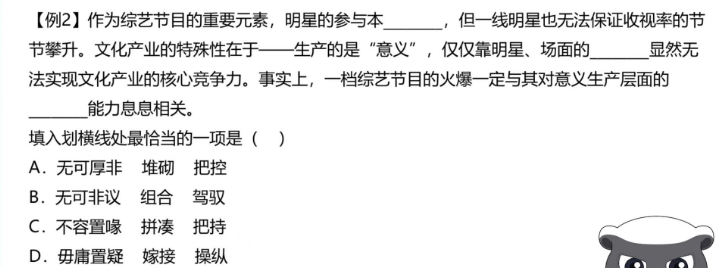


## 一以贯之 一如既往 始终如一

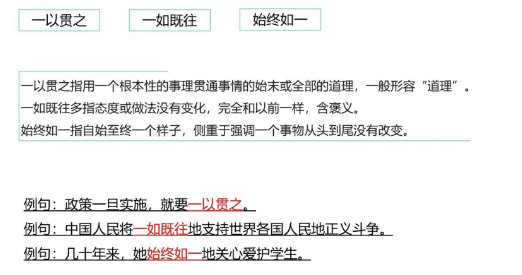

始终如一：一直没变过

一如既往：和之前一样，注意体会这里的时态问题，和始终如一不太一样


例题

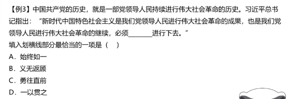


+ 走马观花vs浮光掠影vs蜻蜓点水vs浅尝辄止

  ```
  走马观花 侧重看的过程很粗
  浮光掠影 最后得到印象很肤浅
  蜻蜓点水 不深入 停留在表面
  浅尝辄止 研究学习知识领域不够深入
  ```

+ 方兴未艾 如日中天 声名鹊起 如火如荼 炙手可热

  ```java
  方兴未艾：新生事物蓬勃发展
  如日中天：发展到鼎盛时期
  声名鹊起：强调出名快、搭配顿时声名鹊起
  如火如荼：形容大规模活动，气氛比较热烈
  炙手可热：形容受欢迎
  ```

+ 一蹴而就 一劳永逸 一步登天 一挥而就 一气呵成 信手拈来 唾手可得

  ```java
  一蹴而就：蹴：踏;就：成功;踏一步就成功。比喻事情轻而易举，一下子就可以成功 侧重时间很短
  
  一劳永逸：逸：安逸;辛苦一次，把事情办好，以后就可以不再费力了。
  
  一步登天：一下子就达到很高境界
  
  一挥而就：形容写、画很流畅，快 
  
  一气呵成：搭配广，写、画、动作
  
  信手拈来：强调写作运用材料自如
  
  唾手可得：强调容易
  ```

+ 按部就班 循规蹈矩 墨守成规 固步自封 一成不变

  ```java
  按部就班：侧重按照原定计划或原有习惯有步骤或顺序地办事。中性
  循规蹈矩：侧重按规定的方式方法或旧例办事，不敢变通。    中性
  墨守成规：侧重不改变，不创新       贬义
  固步自封：侧重自大自满，不求进步    贬义
  一成不变：一经形成，不再改变。指守旧不变或固守成规
  ```

+ 泥沙俱下、鱼龙混杂、良莠不齐、参差不齐和鱼目混珠

  ```
  鱼目混珠:拿鱼眼睛冒充珍珠。比喻用假的冒充真的。
  
  参差不齐:原意是长短、高低、大小不一致，形容很不整齐或水平不一。
  
  良莠不齐:解释为指好的坏的混杂在一起。侧重于品质，不能用于形容水平、成绩等。
  
  泥沙俱下:意思是好人和坏人混杂在一起，成分复杂。 人和事物
  
  鱼龙混杂:一般只用于人，范围较小。即好人和坏人混杂在一起。 人
  ```

+ 脱胎换骨 另起炉灶 破釜沉舟 壮士断腕

  ```
  “破釜沉舟”比喻下决心，不顾一切干到底；
  “壮士断腕”比喻在紧要关头当机立断，为保存整体不惜牺牲局部，二者均可体现“敢于破除、舍弃”的意思
  “脱胎换骨”形容通过教育改造，根本改变一个人的立场和世界观。也比喻重新做人
  “另起炉灶”指另外重支炉灶。比喻放弃原来的，另外从头做起
  ```


+ 食古不化 照本宣科 生搬硬套 钻故纸堆

  ```
  “食古不化”：指学习古代知识不善于吸收、理解和运用，就好像吃了东西不能消化一样，“古”对应后文“中国传统建筑设计风格”，符合文意，
  “照本宣科”一般形容讲课、发言等死板地按照课文、讲稿，没有发挥，不生动
  “生搬硬套”形容不顾实际情况，机械地搬用别人的经验和方法，均不能体现出套用以前的、传统的意思，z
  ```

+ 花拳绣腿 叶公好龙 金玉其外 沽名钓誉

  ```
  “花拳绣腿”指只做些表面上好看实际上并无用处的工作，
  “叶公好龙”比喻自称爱好某种事物，实际上并不是真正爱好
  “金玉其外”常与“败絮其中”连用，比喻外表好看
  “沽名钓誉”指用某种不正当的手段捞取名誉
  ```

+ 错落有致  星罗棋布

  ```
  错落有致”形容事物的布局虽然参差不齐，但却极有情趣，使人看了有好感，与文意相符
  “星罗棋布”指数量很多、分布很广
  ```

+ 大行其道  风靡一时 蔚然成风 大张旗鼓

  ```
  “大行其道”指某种观点或某种事物盛行（多含贬义），
  “风靡一时”形容一个事物在一个时期非常盛行，文段并未强调快餐文化流行的时间段，
  “蔚然成风”形容一种事物逐渐发展、盛行，形成风气，多用于积极的语境中，与文段感情色彩不符，
  “大张旗鼓”形容进攻的声势和规模很大，也形容群众活动的声势和规模很大，
  ```

+ 层出不穷 VS 屡见不鲜

  ```
  层出不穷：表示接连不断的地出现，没有穷尽。侧重强调连续出现，数量很多。
  屡见不鲜：形容常常看见，并不新奇。侧重强调常见，不新奇、不新鲜。
  ```

+ **大相径庭 VS 背道而驰**

  ```
  大相径庭：指相差很远，大不相同。侧重强调相差很大，不同之处很多。
  背道而驰：表示彼此的方向完全相反或背离正确的目标，朝相反方向走。侧重指与正确的目标完全相反。
  ```

+ **历久弥新** **持之以恒**

  ```
  历久弥新：经历的时间长久而更加新鲜，更显价值。“历久弥新”侧重强调随着时间的推移而变新、更有价值。
  “持之以恒”表示长久地坚持做某事。“持之以恒”侧重强调长时间地坚持，不放弃。
  ```

+ 理所当然  无可厚非

  ```
   理所当然：从道理上说应当这样。“理所当然”侧重应当如此。
   无可厚非 ：不能过分责备。形容说话做事虽有缺点，但还有可取之处，应予谅解。“无可厚非”侧重强调有问题但可以接受。
  ```

+ 相辅相成vs相得益彰

  ```
  相辅相成：相互补充，相互促成。 “相辅相成”指两者形成互补，重在缺一不可。
  相得益彰：相互配合，使事物更加完美
  ```

  + 旗鼓相当vs毫不逊色

  ```
  旗鼓相当：比喻双方实力或者能力不相上下。
  毫不逊色：指丝毫不差
  ```

  + 独树一帜vs一枝独秀 vs 独领风骚 首屈一指

  ```
  独树一帜”比喻与众不同，自成一家，可表示独特的意思
  “独领风骚”形容超群出众，没有谁可与之相比，
  “一枝独秀”比喻技高一筹，优势明显，文段并未提及其优势
  “首屈一指”表示居第一位
  ```

+ **不言而喻**

  ```
  不言而喻：不用说就可以明白。形容道理很浅显。“不言而喻”侧重道理浅显，不用说就明白
  ```

+ **根深蒂固** **潜移默化**

  ```
  根深蒂固:比喻基础稳固，不容易动摇。
  
  “根深蒂固”多指存在时间很久，基础牢固。
  
  “根深蒂固”常搭配抽象的事物，比如观念。
  
  “根深蒂固”是中性词，可以搭配陈旧的观念。
  
  潜移默化：指人的思想或性格受其他方面的感染而不知不觉地起了变化。
  
  “潜移默化”强调影响是无形的，看不到的；
  
  “潜移默化”常搭配物或事，多用于性格、习惯、作风等方面；
  
  “潜移默化”是中性词。
  ```

+ **推陈出新**

  ```
  推陈出新：去掉旧事物的糟粕，取其精华，并使它向新的方向发展。“推陈出新”感情色彩较积极。“推陈出新”强调去糟粕，取精华，有去掉旧的，提出新的之意。
  ```

+ **南辕北辙**

  ```
  南辕北辙:原指本要往南边去却驾车向北，比喻行动和目的相反。“南辕北辙”侧重强调行动和目的相反（文段中一般会出现行动和目的）。
  ```

+ **望洋兴叹**

  ```
  原指在伟大事物面前感叹自己的渺小，现多指做事时因力量不够或缺乏条件而感到无可奈何。“望洋兴叹”侧重指因能力、条件不足而没有办法，表示客观方面做不到。
  ```

+ **纸上谈兵 **画饼充饥  言之无物 作壁上观

  ```
  “纸上谈兵”比喻空谈理论，不能解决实际问题
  “画饼充饥”比喻用空想来安慰自己，
  “言之无物”指文章或言论空空洞洞，没有实际内容
  作壁上观 置身事外，在一旁观望
  ```

+ **莫衷一是**

  ```
  意见有分歧，没有一致的看法。“莫衷一是”侧重强调观点、言论不一致。
  ```

+ **如出一辙**

  ```
  如出一辙:好像出自同一个车辙，形容事物非常相似。“如出一辙”强调相似，感情色彩为中性。
  ```

+ **曲高和寡**

  ```
  比喻言论或艺术作品不通俗，能理解或欣赏的人很少。
  
  “曲高和寡”侧重作品不通俗，能理解的人很少，常适用于略显消极的语境。
  ```

+ **耸人听闻**

  ```
  耸人听闻:使人听了非常震惊。“耸人听闻”一般用于故意夸大或捏造的事件造成的影响。
  骇人听闻：指使人听了感到非常吃惊、害怕，它是一个反映客观现象的词
  ```

+ 淋漓尽致 酣畅淋漓

   ```
   淋漓尽致：基本信息为形容文章或说话表达得非常充分、透彻，或非常痛快
   酣畅淋漓　：酣畅：畅快；淋漓：饱满畅快的样子。形容非常畅快。 常指文章绘画，文艺作品感情饱满，笔意流畅，情感得到充分抒发。
   ```

+ 不孚众望”与“不负众望”

  ```java
  不孚众望:不能使大家信服
  不负众望:不辜负大家的期望
  ```

+ ```java
  不刊之论，成语，作宾语，比喻不能改动或不可磨灭的言论，用来形容文章或言辞的精准得当，无懈可击
  不易之论：不可更改的言论。形容论断或意见非常正确
  ```

+ ```java
  “不以为然”意思是不认为是对的，表示 不同意 (多含轻视意)。 
  “不以为意”则指 不把它放在心上，表示不重视，不认真对待
  ```

+ 

   ```java
   举重若轻:处理繁难的事情很容易
   大行其道：
   ```

   


#  词语辨析

1. 


## 流传 留传

流传：时间上的由前往后，也可指空间

留传：**只能传下去**，而不能**传开**


列句：

1. 大禹治水的问题**流传**下来
2. 这是他爷爷**留传**下来的独家秘笈。

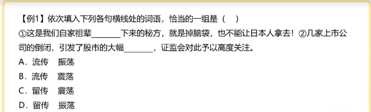

## 流露 表露

流露：强调自然，感情不自觉表现出来

表露：偏主动

列句：

1. **流露**出对祖国的爱
2. 表情在脸上**表露**出来

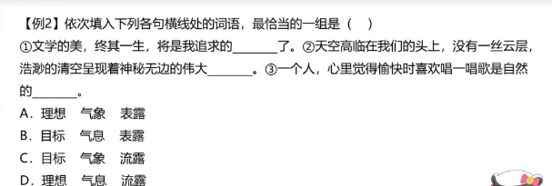

## 径自 径直

径自 ：自主主张

径直： 直接向某处前进，不绕道

列句：

1. 不顾大家劝阻，**径自**离去

## 传颂 传诵

传颂 ：多指传播名人民事

传诵：感情色彩积极，扩大说的范围

列句：

1. 他救了人，大家都在**传颂**他的事迹
2. 李白流下了很多**传诵**至今

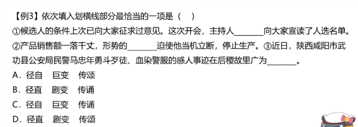

## 巨变 剧变

 巨大的或剧烈的变化。特指变化之大。巨是形容大，而剧是形容快。 

## 理想 目标

 理想是一种向往的境界,目标是给自己定的方向和座标,目标可以随时改变,但理想一般在人的心中占有崇高的地位,这两者有本质上的区别。理想到底还只能归根于内心的想法,或是梦想,你不一定要去实现的。 


## 克制 克服 

克制：抑制情感，主观方面

克服：用坚强的意志战胜不良因素、坏现象等，侧重客观方面

列句：

1. 他努力**克制**自己，不让自己眼泪掉下来。
2. 在海上开采石油，要**克服**很多困难

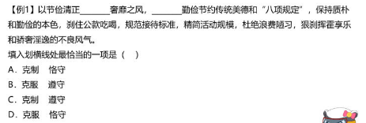

奢靡之风 坏的现象， 克服

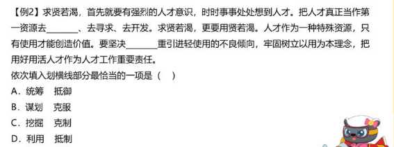

不良倾向 克服


## 驱除 祛除 湮灭

驱除：赶走 多用于具体的对象 

祛除： 除去疾病、恐惧、邪祟等 多用于抽象

 湮灭： 一种东西完全消灭

列句：

1. 国家强盛，驱除敌人
2. 祛除恐惧
3. 企图湮灭证据

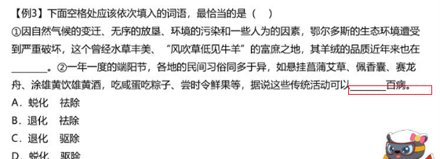

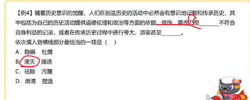


+ 勾勒 描绘

  ```
  勾勒:抽象
  描绘:具体
  ```

+ 揶揄 调侃 

  ```
  调侃 程度比揶揄轻
  ```

  

+ 
