# Table of Contents

* [成语辨析](#成语辨析)
  * [耸人听闻、骇人听闻、危言耸听](#耸人听闻骇人听闻危言耸听)
  * [驾轻就熟 耳熟能详](#驾轻就熟-耳熟能详)
  * [深思熟虑 深谋远虑](#深思熟虑-深谋远虑)
  * [无可厚非 无可非议](#无可厚非-无可非议)
  * [一以贯之 一如既往 始终如一](#一以贯之-一如既往-始终如一)
  * [孤芳自赏 曲高和寡 顾影自怜](#孤芳自赏-曲高和寡-顾影自怜)
  * [脍炙人口 喜闻乐见](#脍炙人口-喜闻乐见)
  * [群雄逐鹿 百花齐放](#群雄逐鹿-百花齐放)
  * [异曲同工 殊途同归](#异曲同工-殊途同归)
  * [目光如豆 目光如矩 目无全牛](#目光如豆-目光如矩-目无全牛)
  * [相形见绌 捉襟见肘](#相形见绌-捉襟见肘)
  * [按图索骥 披沙拣金 去伪存真](#按图索骥-披沙拣金-去伪存真)
  * [更新迭代 革故鼎新 改选更张 日新月异](#更新迭代-革故鼎新-改选更张-日新月异)
  * [哗众取宠 喧宾夺主 鸠占鹊巢](#哗众取宠-喧宾夺主-鸠占鹊巢)
  * [越俎代庖 李代桃僵](#越俎代庖-李代桃僵)
  * [揠苗助长 快马加鞭](#揠苗助长-快马加鞭)
  * [脱颖而出 应运而生](#脱颖而出-应运而生)
  * [包罗万象 蔚为大观](#包罗万象-蔚为大观)
  * [相沿成俗 蔚然成风 靡然成风](#相沿成俗-蔚然成风-靡然成风)
  * [额手称庆 弹冠相庆](#额手称庆-弹冠相庆)
  * [击节赞叹 低头折节](#击节赞叹-低头折节)
  * [欣喜若狂 欢欣鼓舞 如痴如狂](#欣喜若狂-欢欣鼓舞-如痴如狂)
* [词语辨析](#词语辨析)
  * [流传 留传](#流传-留传)
  * [流露 表露](#流露-表露)
  * [径自 径直](#径自-径直)
  * [传颂 传诵](#传颂-传诵)
  * [巨变 剧变](#巨变-剧变)
  * [理想 目标](#理想-目标)
  * [克制 克服](#克制-克服)
  * [驱除 祛除 湮灭](#驱除-祛除-湮灭)
  * [扬言 佯言](#扬言-佯言)
  * [原型 原形](#原型-原形)
  * [沉积 沉淀](#沉积-沉淀)
  * [推脱 推托](#推脱-推托)
  * [浸染 浸润 感染](#浸染-浸润-感染)
  * [追忆 追述](#追忆-追述)
  * [蔓延 漫延](#蔓延-漫延)
  * [部署 布置 配置](#部署-布置-配置)
  * [寂静 沉寂 寂寞](#寂静-沉寂-寂寞)
  * [沉静 安定](#沉静-安定)
  * [推诿 推托 推脱](#推诿-推托-推脱)
  * [陈规 常规](#陈规-常规)
  * [品味 品位](#品味-品位)
  * [质疑 置疑](#质疑-置疑)
  * [自居 标榜](#自居-标榜)
  * [领悟 感触 感悟](#领悟-感触-感悟)
  * [渗透  透露](#渗透--透露)
  * [追随 追捧](#追随-追捧)
  * [依附  附和](#依附--附和)
  * [附庸 随从](#附庸-随从)
  * [庸俗 俗套](#庸俗-俗套)
  * [勾勒 描绘](#勾勒-描绘)


# 成语辨析

## 耸人听闻、骇人听闻、危言耸听


骇人听闻：重点是**客观事实**

**耸人听闻**：故意夸大、贬义


列题：


## 驾轻就熟 耳熟能详

驾轻就熟：比喻对某事有经验，很熟悉，做起来容易

耳熟能详：听的多了，可以复述出来


## 深思熟虑 深谋远虑


例题：


## 无可厚非 无可非议


列题：


## 一以贯之 一如既往 始终如一


始终如一：一直没变过

一如既往：和之前一样，注意体会这里的时态问题，和始终如一不太一样


例题


## 孤芳自赏 曲高和寡 顾影自怜

孤芳自赏 ：自命清高、偏重于自我欣赏，含贬义

曲高和寡：言论作品不通俗

 顾影自怜：偏重于自我怜惜

简单说就是：过于自信、过于自卑、不通俗


列句：

1. 一味孤芳自赏的人
2. 通俗读物不应该曲高和寡
3. 鼓励她要勇敢面对生活，而不是顾影自怜

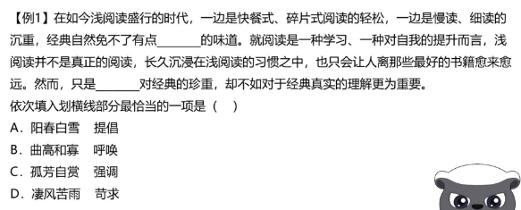

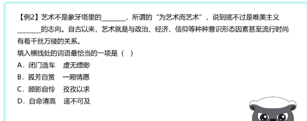


## 脍炙人口 喜闻乐见
+  脍炙人口：人人赞美的事务和传诵的诗文

+ 喜闻乐见：喜欢听 乐意看

喜闻乐见主体是**人**  脍炙人口是**事物**

列句：

1. 唐诗三百首 每首都脍炙人口
2. 相声是**人们喜闻乐见**的一种艺术表现形式

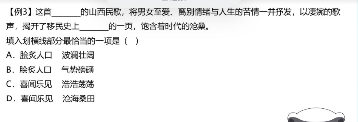

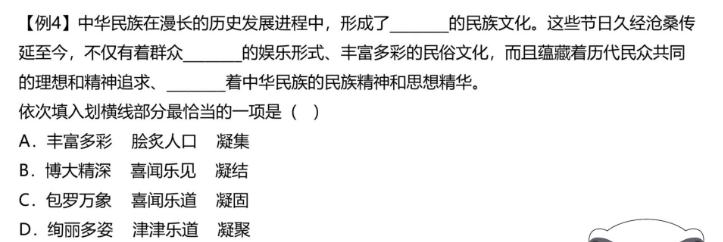


## 群雄逐鹿 百花齐放

+ 群雄逐鹿：**体现竞争关系**

+  百花齐放： 比喻不同形式和风格的各种艺术作品自由发展**不体现竞争关系**

列句：

1. 在群雄逐鹿的家电市场
2. 美术展览上有许多新作品，百花齐放。

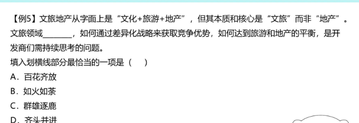


## 异曲同工 殊途同归

+ 异曲同工：做法不同，效果一样【强调结果是好的】

+ 殊途同归： 采取不同方法得到相同的效果【不强调结果】

例句

1.这道题有几种解法，但殊途同归，选项只有一个是正确的。

2.这两幅画虽然表现手法不同，但都能引起读者的共鸣，有异曲同工之妙。

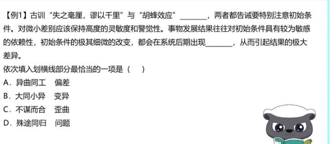

强调结果，选择A

---

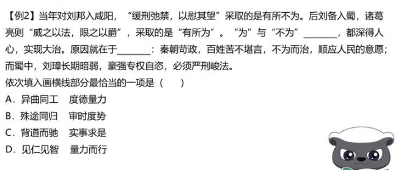

AB都符合，但是结合语境【审时度势】更符合语境

-----

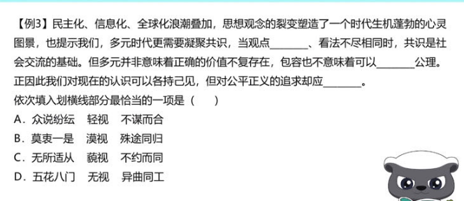

第一个空排除C 第二个空暂定B，第三个空B 答案选B


## 目光如豆 目光如矩 目无全牛

+ 目光如豆: 目光短浅
+ 目光如矩 : 见识远大
+ 目无全牛: 技术得心应手

例句

1. 一个人眼光不能目光如豆
2. 这位政治家目光如炬
3. 技术达到目无全牛的境界

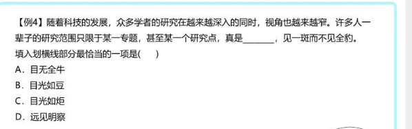

近义词直接B

## 相形见绌 捉襟见肘

+ 相形见绌：和同类事物比较显出不足 【注意有比较的意思】
+ 捉襟见肘：顾此失彼，穷于应付

例句

1. 在跳水冠军面前，小王相形见绌
2. 家里的经济捉襟见肘

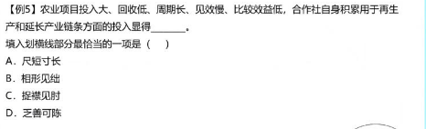

秒C就走

## 按图索骥 披沙拣金 去伪存真

+ 按图索骥：多指按线索，也指墨守成规
+ 披沙拣金：大量事物选取精华
+ 去伪存真：辨别假事物，保留下真正得东西

例句

1. 按照提供得线索，按图索骥找到了犯罪嫌疑人
2. 肥料上披沙拣金
3. 冒牌货太多，要去伪存真

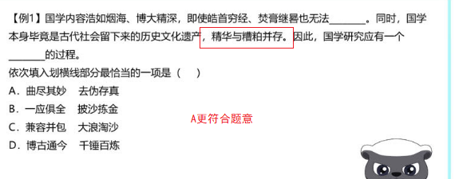

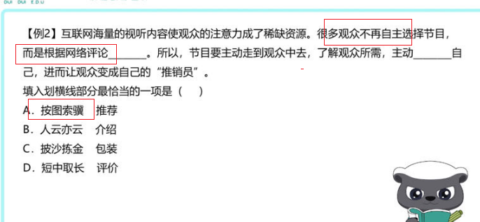

## 更新迭代 革故鼎新 改选更张 日新月异

+ 更新迭代 ：不断进步 更迭
+ 日新月异：每月都有变化。 指发展或进步迅速，不断出现新事物、新气象
+ 革故鼎新 ：改革 不具体
+ 改选更张：改革 具体

例句

1. 信息更新迭代
2. 对所学知识举一反三，敢于革故鼎新
3. 既然大家都有改弦更张得决心

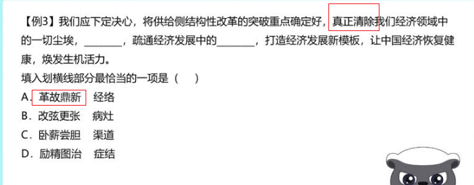

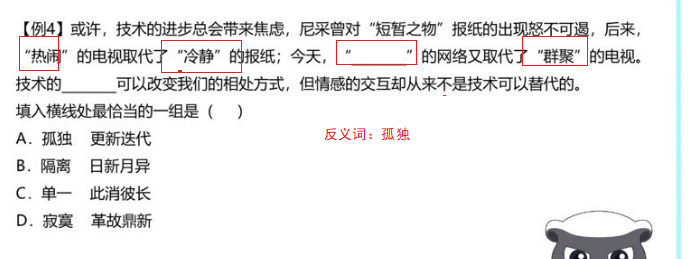


## 哗众取宠 喧宾夺主 鸠占鹊巢

+  哗众取宠：贬义 轻浮虚荣
+  喧宾夺主：贬义 外来的 次要的事物占据了主要事物
+  鸠占鹊巢：贬义 抢占别人得住屋或者占据别人得位置

例句

1.  哗众取宠人不受欢迎
2. 电影广告喧宾夺主
3. 最后他 鸠占鹊巢

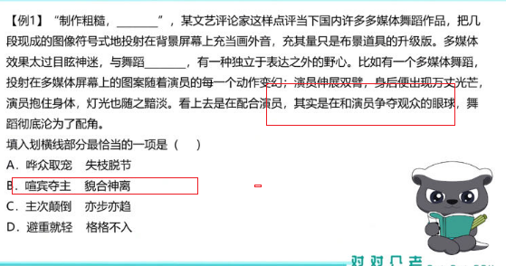

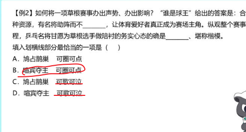


## 越俎代庖 李代桃僵

+ 越俎代庖：不是自己得事情，去管
+  李代桃僵：代替别人受过，过错 

例句

1.  招聘是小张得事情，不要越俎代庖
2. 发生了李代桃僵得事情

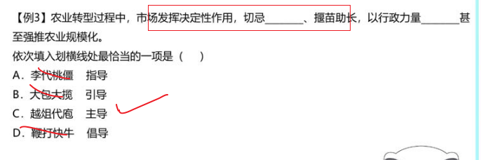

## 揠苗助长 快马加鞭

+ 揠苗助长 : 请求速度，反而不好

+ 快马加鞭：加快速度


## 脱颖而出 应运而生

+ 脱颖而出 ：本领全部显露出来;
+ 应运而生： 适应时代或社会需要而产生  【需要一个载体】

例句:表现出色的他轻松地在众多选手中**脱颖而出**。
        例句:环境越来越恶劣的今天,不少**呼吁环保的公益**广告**应运而生**

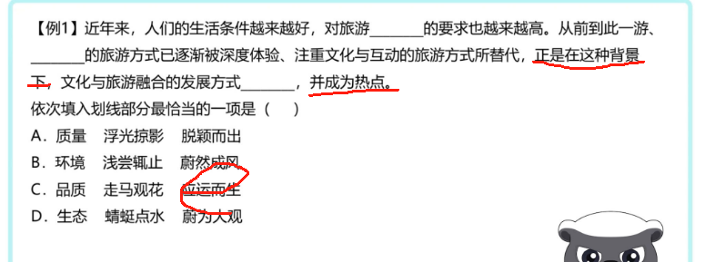


## 包罗万象 蔚为大观

+ 包罗万象:形容内容丰富，应有尽有:无所不有:

+ 蔚为大观:形容事物美好而繁多，给人一种盛大的印象，多指文物、景观等

  例句:互联网上的数据包罗万象，只要你能想到的，它都有。
  例句:雄伟的建筑矗立于黄浦江畔，蔚为大观。

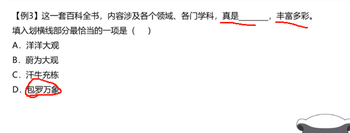

##  相沿成俗 蔚然成风 靡然成风

+ 相沿成俗:指因袭某种做法传下来，**多形成风俗习惯**;

+ 蔚然成风:指一件事情逐渐发展盛行，形成一种良好风气，**含褒义**;

+ 靡然成风:指群起效尤而成风气，**含贬义**。

  例句:腊八节腌制腊八蒜逐渐相沿成俗，流传到现在
  例句:在中国尊师重道早已蔚然成风。
  例句:因为教育观念的落后，在此地重男轻女的观念靡然成风

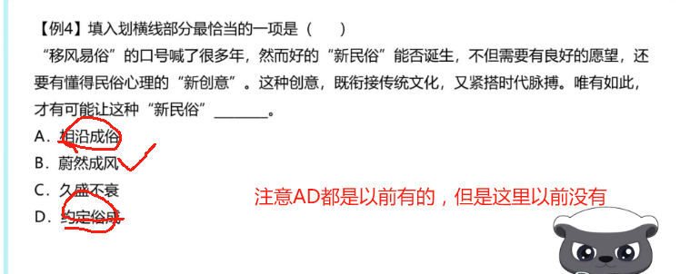

##  额手称庆 弹冠相庆

+ 额手称庆:形容高兴和喜悦。多指走出困境和不快的放 松心情，多指令人称快的事，多为褒义
+ 弹冠相庆:**形容坏人得意。含贬义。**

例句:虽说经历了许多变故，但总算没出差错，令人额手称庆

例句:他用不正当的手段坐上了公司的第一把交椅，他的同伙弹冠相庆

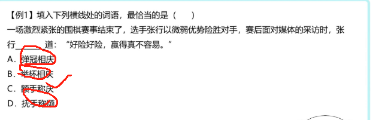


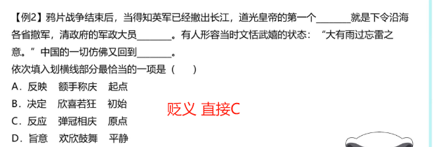


##  击节赞叹 低头折节

+ 击节赞叹:形容对别人作品的赞赏:
+ 低头折节:指丧失气节，屈服于他人。


例句:他的钢琴演奏如此优美，听的人无不击节赞叹
例句:梅花和别的花不一样，其它的花都是遇到一点困难就低头折节，不能勇敢的去战胜困难。


##  欣喜若狂 欢欣鼓舞 如痴如狂

+ 欣喜若狂:形容人狂喜的心情，高兴到了极点，**中性词**
+ 欢欣鼓舞:形容高兴而振奋，**含褒义;**
+ 如痴如狂:为某物所倾倒，能够体现出**十分向往执着**


例句:每当这个时候这个凄凉哀伤的女人就会欣喜若狂,光着脚丫去迎接邮差。
		例句:北京成功地举办了奥运会,全国人民都欢欣鼓舞无比高兴。
		例句:曾有那么一些时日,他如痴如狂地看一些青春文学小说。

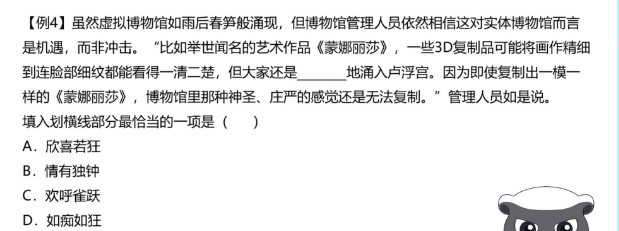


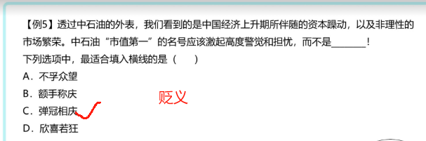


+ 走马观花vs浮光掠影vs蜻蜓点水vs浅尝辄止

  ```
  走马观花 侧重看的过程很粗
  浮光掠影 最后得到印象很肤浅
  蜻蜓点水 不深入 停留在表面
  浅尝辄止 研究学习知识领域不够深入
  ```

+ 方兴未艾 如日中天 声名鹊起 如火如荼 炙手可热

  ```java
  方兴未艾：新生事物蓬勃发展
  如日中天：发展到鼎盛时期
  声名鹊起：强调出名快、搭配顿时声名鹊起
  如火如荼：形容大规模活动，气氛比较热烈
  炙手可热：形容受欢迎
  ```

+ 一蹴而就 一劳永逸 一步登天 一挥而就 一气呵成 信手拈来 唾手可得

  ```java
  一蹴而就：蹴：踏;就：成功;踏一步就成功。比喻事情轻而易举，一下子就可以成功 侧重时间很短
  
  一劳永逸：逸：安逸;辛苦一次，把事情办好，以后就可以不再费力了。
  
  一步登天：一下子就达到很高境界
  
  一挥而就：形容写、画很流畅，快 
  
  一气呵成：搭配广，写、画、动作
  
  信手拈来：强调写作运用材料自如
  
  唾手可得：强调容易
  ```

+ 按部就班 循规蹈矩 墨守成规 固步自封 一成不变

  ```java
  按部就班：侧重按照原定计划或原有习惯有步骤或顺序地办事。中性
  循规蹈矩：侧重按规定的方式方法或旧例办事，不敢变通。    中性
  墨守成规：侧重不改变，不创新       贬义
  固步自封：侧重自大自满，不求进步    贬义
  一成不变：一经形成，不再改变。指守旧不变或固守成规
  ```

+ 泥沙俱下、鱼龙混杂、良莠不齐、参差不齐和鱼目混珠

  ```
  鱼目混珠:拿鱼眼睛冒充珍珠。比喻用假的冒充真的。
  
  参差不齐:原意是长短、高低、大小不一致，形容很不整齐或水平不一。
  
  良莠不齐:解释为指好的坏的混杂在一起。侧重于品质，不能用于形容水平、成绩等。
  
  泥沙俱下:意思是好人和坏人混杂在一起，成分复杂。 人和事物
  
  鱼龙混杂:一般只用于人，范围较小。即好人和坏人混杂在一起。 人
  ```

+ 脱胎换骨 另起炉灶 破釜沉舟 壮士断腕

  ```
  “破釜沉舟”比喻下决心，不顾一切干到底；
  “壮士断腕”比喻在紧要关头当机立断，为保存整体不惜牺牲局部，二者均可体现“敢于破除、舍弃”的意思
  “脱胎换骨”形容通过教育改造，根本改变一个人的立场和世界观。也比喻重新做人
  “另起炉灶”指另外重支炉灶。比喻放弃原来的，另外从头做起
  ```


+ 食古不化 照本宣科 生搬硬套 钻故纸堆

  ```
  “食古不化”：指学习古代知识不善于吸收、理解和运用，就好像吃了东西不能消化一样，“古”对应后文“中国传统建筑设计风格”，符合文意，
  “照本宣科”一般形容讲课、发言等死板地按照课文、讲稿，没有发挥，不生动
  “生搬硬套”形容不顾实际情况，机械地搬用别人的经验和方法，均不能体现出套用以前的、传统的意思，z
  ```

+ 花拳绣腿 叶公好龙 金玉其外 沽名钓誉

  ```
  “花拳绣腿”指只做些表面上好看实际上并无用处的工作，
  “叶公好龙”比喻自称爱好某种事物，实际上并不是真正爱好
  “金玉其外”常与“败絮其中”连用，比喻外表好看
  “沽名钓誉”指用某种不正当的手段捞取名誉
  ```

+ 错落有致  星罗棋布

  ```
  错落有致”形容事物的布局虽然参差不齐，但却极有情趣，使人看了有好感，与文意相符
  “星罗棋布”指数量很多、分布很广
  ```

+ 大行其道  风靡一时 蔚然成风 大张旗鼓

  ```
  “大行其道”指某种观点或某种事物盛行（多含贬义），
  “风靡一时”形容一个事物在一个时期非常盛行，文段并未强调快餐文化流行的时间段，
  “蔚然成风”形容一种事物逐渐发展、盛行，形成风气，多用于积极的语境中，与文段感情色彩不符，
  “大张旗鼓”形容进攻的声势和规模很大，也形容群众活动的声势和规模很大，
  ```

+ 层出不穷 VS 屡见不鲜

  ```
  层出不穷：表示接连不断的地出现，没有穷尽。侧重强调连续出现，数量很多。
  屡见不鲜：形容常常看见，并不新奇。侧重强调常见，不新奇、不新鲜。
  ```

+ **大相径庭 VS 背道而驰**

  ```
  大相径庭：指相差很远，大不相同。侧重强调相差很大，不同之处很多。
  背道而驰：表示彼此的方向完全相反或背离正确的目标，朝相反方向走。侧重指与正确的目标完全相反。
  ```

+ **历久弥新** **持之以恒**

  ```
  历久弥新：经历的时间长久而更加新鲜，更显价值。“历久弥新”侧重强调随着时间的推移而变新、更有价值。
  “持之以恒”表示长久地坚持做某事。“持之以恒”侧重强调长时间地坚持，不放弃。
  ```

+ 理所当然  无可厚非

  ```
   理所当然：从道理上说应当这样。“理所当然”侧重应当如此。
   无可厚非 ：不能过分责备。形容说话做事虽有缺点，但还有可取之处，应予谅解。“无可厚非”侧重强调有问题但可以接受。
  ```

+ 相辅相成vs相得益彰

  ```
  相辅相成：相互补充，相互促成。 “相辅相成”指两者形成互补，重在缺一不可。
  相得益彰：相互配合，使事物更加完美
  ```

  + 旗鼓相当vs毫不逊色

  ```
  旗鼓相当：比喻双方实力或者能力不相上下。
  毫不逊色：指丝毫不差
  ```

  + 独树一帜vs一枝独秀 vs 独领风骚 首屈一指

  ```
  独树一帜”比喻与众不同，自成一家，可表示独特的意思
  “独领风骚”形容超群出众，没有谁可与之相比，
  “一枝独秀”比喻技高一筹，优势明显，文段并未提及其优势
  “首屈一指”表示居第一位
  ```

+ **不言而喻**

  ```
  不言而喻：不用说就可以明白。形容道理很浅显。“不言而喻”侧重道理浅显，不用说就明白
  ```

+ **根深蒂固** **潜移默化**

  ```
  根深蒂固:比喻基础稳固，不容易动摇。
  
  “根深蒂固”多指存在时间很久，基础牢固。
  
  “根深蒂固”常搭配抽象的事物，比如观念。
  
  “根深蒂固”是中性词，可以搭配陈旧的观念。
  
  潜移默化：指人的思想或性格受其他方面的感染而不知不觉地起了变化。
  
  “潜移默化”强调影响是无形的，看不到的；
  
  “潜移默化”常搭配物或事，多用于性格、习惯、作风等方面；
  
  “潜移默化”是中性词。
  ```

+ **推陈出新**

  ```
  推陈出新：去掉旧事物的糟粕，取其精华，并使它向新的方向发展。“推陈出新”感情色彩较积极。“推陈出新”强调去糟粕，取精华，有去掉旧的，提出新的之意。
  ```

+ **南辕北辙**

  ```
  南辕北辙:原指本要往南边去却驾车向北，比喻行动和目的相反。“南辕北辙”侧重强调行动和目的相反（文段中一般会出现行动和目的）。
  ```

+ **望洋兴叹**

  ```
  原指在伟大事物面前感叹自己的渺小，现多指做事时因力量不够或缺乏条件而感到无可奈何。“望洋兴叹”侧重指因能力、条件不足而没有办法，表示客观方面做不到。
  ```

+ **纸上谈兵 **画饼充饥  言之无物 作壁上观

  ```
  “纸上谈兵”比喻空谈理论，不能解决实际问题
  “画饼充饥”比喻用空想来安慰自己，
  “言之无物”指文章或言论空空洞洞，没有实际内容
  作壁上观 置身事外，在一旁观望
  ```

+ **莫衷一是**

  ```
  意见有分歧，没有一致的看法。“莫衷一是”侧重强调观点、言论不一致。
  ```

+ **如出一辙**

  ```
  如出一辙:好像出自同一个车辙，形容事物非常相似。“如出一辙”强调相似，感情色彩为中性。
  ```

+ **曲高和寡**

  ```
  比喻言论或艺术作品不通俗，能理解或欣赏的人很少。
  
  “曲高和寡”侧重作品不通俗，能理解的人很少，常适用于略显消极的语境。
  ```

+ **耸人听闻**

  ```
  耸人听闻:使人听了非常震惊。“耸人听闻”一般用于故意夸大或捏造的事件造成的影响。
  骇人听闻：指使人听了感到非常吃惊、害怕，它是一个反映客观现象的词
  ```

+ 淋漓尽致 酣畅淋漓

   ```
   淋漓尽致：基本信息为形容文章或说话表达得非常充分、透彻，或非常痛快
   酣畅淋漓　：酣畅：畅快；淋漓：饱满畅快的样子。形容非常畅快。 常指文章绘画，文艺作品感情饱满，笔意流畅，情感得到充分抒发。
   ```

+ 不孚众望”与“不负众望”

  ```java
  不孚众望:不能使大家信服
  不负众望:不辜负大家的期望
  ```

+ ```java
  不刊之论，成语，作宾语，比喻不能改动或不可磨灭的言论，用来形容文章或言辞的精准得当，无懈可击
  不易之论：不可更改的言论。形容论断或意见非常正确
  ```

+ ```java
  “不以为然”意思是不认为是对的，表示 不同意 (多含轻视意)。 
  “不以为意”则指 不把它放在心上，表示不重视，不认真对待
  ```

+ 

   ```java
   举重若轻:处理繁难的事情很容易
   大行其道：
   ```

   


#  词语辨析

1. 


## 流传 留传

流传：时间上的由前往后，也可指空间

留传：**只能传下去**，而不能**传开**


列句：

1. 大禹治水的问题**流传**下来
2. 这是他爷爷**留传**下来的独家秘笈。


## 流露 表露

流露：强调自然，感情不自觉表现出来

表露：偏主动

列句：

1. **流露**出对祖国的爱
2. 表情在脸上**表露**出来


## 径自 径直

径自 ：自主主张

径直： 直接向某处前进，不绕道

列句：

1. 不顾大家劝阻，**径自**离去

## 传颂 传诵

传颂 ：多指传播名人民事

传诵：感情色彩积极，扩大说的范围

列句：

1. 他救了人，大家都在**传颂**他的事迹
2. 李白流下了很多**传诵**至今


## 巨变 剧变

 巨大的或剧烈的变化。特指变化之大。巨是形容大，而剧是形容快。 

## 理想 目标

 理想是一种向往的境界,目标是给自己定的方向和座标,目标可以随时改变,但理想一般在人的心中占有崇高的地位,这两者有本质上的区别。理想到底还只能归根于内心的想法,或是梦想,你不一定要去实现的。 


## 克制 克服 

克制：抑制情感，主观方面

克服：用坚强的意志战胜不良因素、坏现象等，侧重客观方面

列句：

1. 他努力**克制**自己，不让自己眼泪掉下来。
2. 在海上开采石油，要**克服**很多困难


奢靡之风 坏的现象， 克服


不良倾向 克服


## 驱除 祛除 湮灭

驱除：赶走 多用于具体的对象 

祛除： 除去疾病、恐惧、邪祟等 多用于抽象

 湮灭： 一种东西完全消灭

列句：

1. 国家强盛，驱除敌人
2. 祛除恐惧
3. 企图湮灭证据


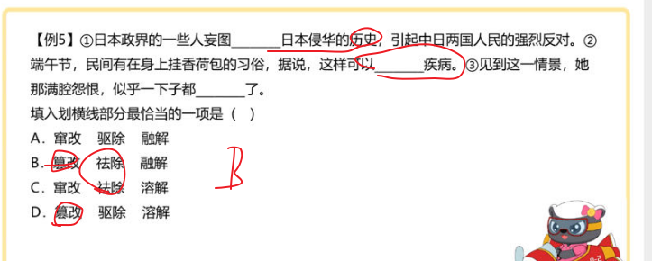


## 扬言 佯言

+ 扬言 : **有意**传出采取某种行动的话，多含威胁之意
+ 佯言: **说假话**


列句：

1. 他扬言一定要报复
2. 他佯言东边有金子，让大家都去挖


## 原型 原形

+ 原型 ： 事物的所指 
+ 原形： 事物的本身

列句：

1. 这篇故事以神话为原型
2. 琵琶精原形毕露

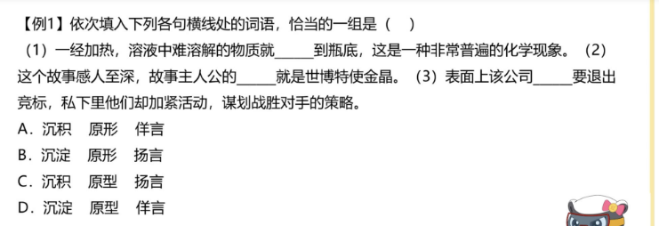


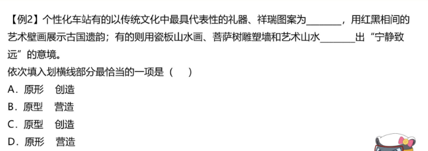


## 沉积 沉淀

沉积是一个积累的过程

沉淀： 指溶液中难溶解的固体物质从溶液中释出，二指从溶液中释出的难溶解的固体物质，三比喻凝聚，积累 


## 推脱 推托

+ 推脱:是推卸、推辞，它着重指摆脱、开脱责任、问题、事情等，使与己无关。
+ 推托: 借故拒绝 

## 浸染 浸润 感染

+ 浸染：逐渐感染
+ 浸润 ：除了浸染还有滋润和熏陶的意思
+ 感染：通过言语和行为引起别人相同的思想感情

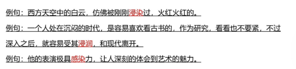

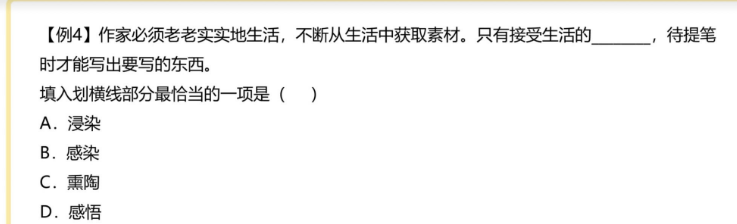

注意这里，不断表示是一个持续的过程，选A


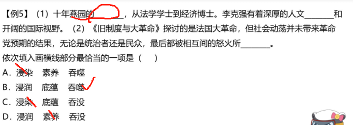


## 追忆 追述

+ 追忆： 主动的回忆，
+ 追述：追忆叙述，【强调说】

列句：

1. 陷入对往事的追忆
2. 老人在追诉自己的见闻

----

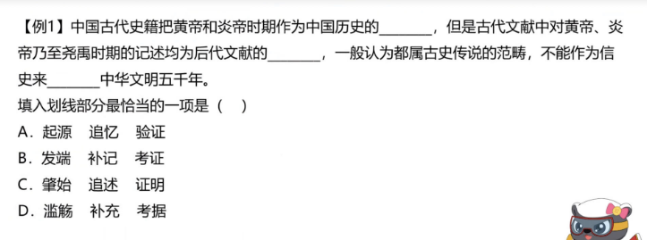


文献有说的意思，秒C

---


## 蔓延 漫延 

+  蔓延：多用于蔓草一类植物不断向周围延伸、扩展，比喻事物像蔓草一样向周围延伸、扩展。【侧重一个变化过程 还强调很难根除的东西，比如不良风气蔓延】
+ 漫延：多用于用于水势向四周扩散，由内向外的过程。 【中性】

列句：

1. 森林发生了火灾，蔓延的很快
2. 这片沙漠一直蔓延到天边。


## 部署 布置 配置

+ 部署：安排布置【一般指重大事件】
+ 布置： 安排具体的事情
+ 配置：缺少的补足

列句：

1. 党中央部署安排工作
2. 布置书房
3. 配置一台打印机

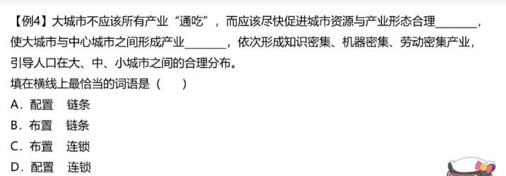


产业合理配置，产业链条 固定搭配，选A

----

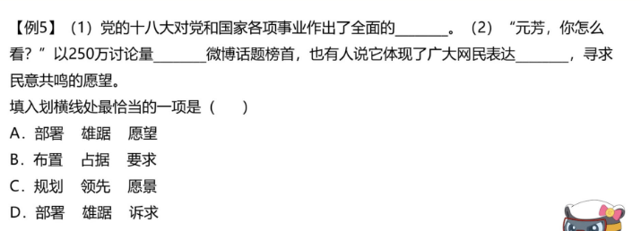

第一空肯定是部署

在看第三空，表达诉求

选D

---


## 寂静 沉寂 寂寞

+ 寂静：环境安静
+ 沉寂：十分安静，一般指音讯
+  寂寞：冷清孤单

列句：

1. 夜深了，热闹的广场十分寂静
2. 在外打工的哥哥音讯沉寂
3. 我今晚一个人在家真是寂寞

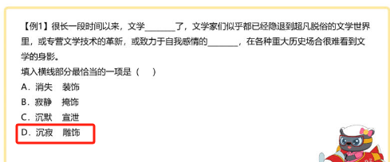


## 沉静 安定

+ 沉静：性格、心情神色安静平静
+ 安定： 侧重 生活形式平静正常

列句：

1. 他性格沉静，不爱说话
2. 社会风气好，生活安定


## 推诿 推托 推脱 


+ 推诿 ：推卸责任

+ 推托 ：借故不去

+ 推脱： 是推卸、推辞,它着重指摆脱、开脱责任、问题、事情等,使与己无关 

  

列句：

1. 不要把你的责任推诿给别人
2. 上台表演，他推托肚子疼，怎么都不去

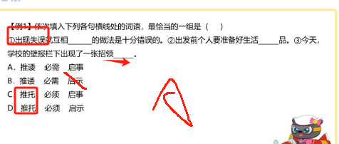


## 陈规 常规 

+ 陈规：不实用的旧规章 贬义
+ 常规 ：久已通行的规则 不行贬义

列句：

1. 我们应该打破陈规
2. 常规解题思路


## 品味 品位

+ 品味: 动词 对食物的欣赏
+ 品位:对一个人生活方式的修养


## 质疑 置疑

+ 质疑 ：提出疑问 怀疑 
+ 置疑： 多用于否定句

列句：

1. 即使是权威，我们也应该质疑。
2. 地球围着太阳转，这是毋庸置疑的

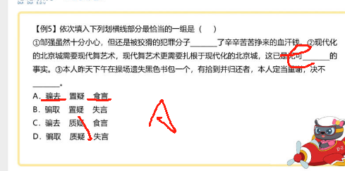


## 自居 标榜

 

+ 自居:自以为具有某种资格或身份;自己看待自己

+ 标榜:D吹嘘，夸耀;@提出某种好听的名义，加以宣扬

例句:他的文学知识空空如也,却偏要以文学家自居

例句:他这个人一向谦虚谨慎,从不自我标榜


##  领悟 感触 感悟

+ 领悟：侧重于明白道理;理解
+ 感触：指跟外界事物接触而引起的思想感情，侧重的是“感情”方面，**而没有体现看法和观点**
+ 感悟：侧重于有所感触而领悟，，感情上的变化,**某事有自己的感想、体会**。
  例句:他很快就领悟到其中的幽默，于是和大家一起欢笑起来。
  例句:看到这些义工默默奉献，特别发人深省，感触良多。
  例句:直到读了依米花的故事,我真正感悟到了生命的本质。

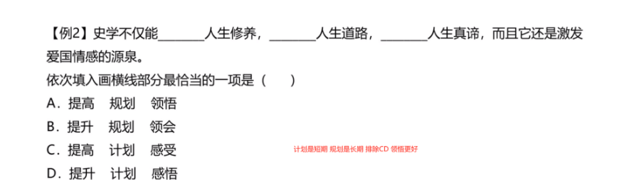


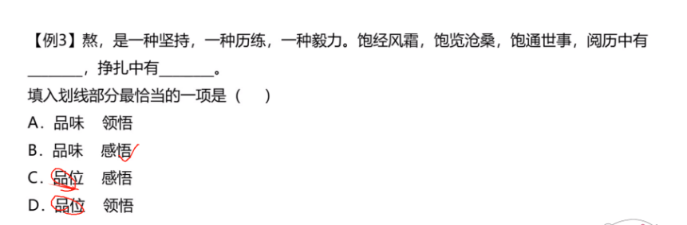

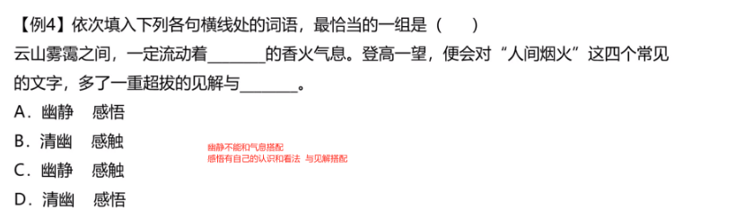


## 渗透  透露

+ 渗透:指某种事物或势力逐渐进入其他方面

+ 透露:指泄露或显露(信息、消息、意思等

  例句:桂花树偷偷地解开了一个个的小香囊香气渗透在空气中很香。
  例句:这个消息坚决不能透露出去。

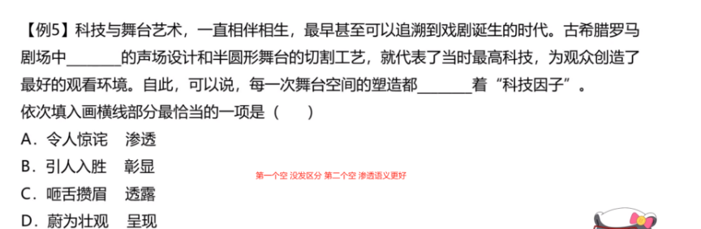


## 追随 追捧

+ 追随:跟随
+ 追捧:追逐捧场

例句:追随伟大人物的思想，是最富有趣味的一门科学。
        例句:在线收费阅读市场中，最受追捧的是玄幻、穿越类小说。

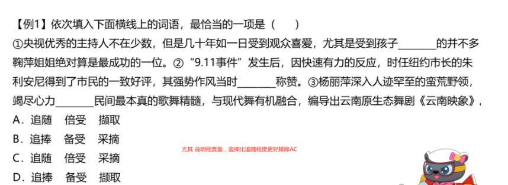


## 依附  附和

+ 依附:侧重从属或不独立

+ 附和:随着别人说或做，大多用于**贬义**

  例句:这些蔓藤依附着竹竿慢慢的向上爬。
  例句:随声附和上级的意见，正是老王一路升官的诀窍。

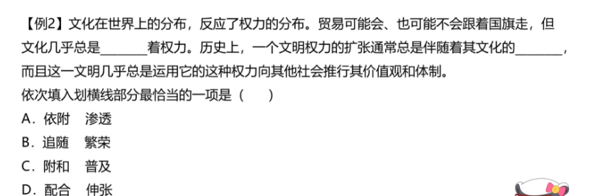


##  附庸 随从

+ 附庸:侧重依附于其他事物而存在的事物。**含贬义**

+ 随从:指跟随、陪同，**为中性词**

  

  例句:清王朝因此颜面扫地，许多附庸国自然也是树倒湖孙散。
  例句:哥哥这次以随从人员的身份出国考察。

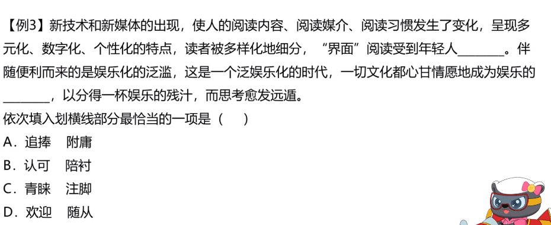


## 庸俗 俗套

+ 庸俗:平庸粗俗，**含贬义**
+ 俗套:**世俗的习惯和礼节**


例句:韩剧于篇一律,差不多的剧情,差不多的发展炒了于百遍,这就是庸俗

例句:新年快乐，这不是俗套的祝福，而是真诚的心愿。

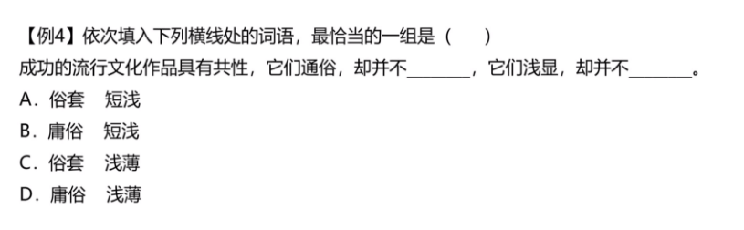


## 勾勒 描绘

+ 勾勒:抽象
+ 描绘:具体 


+ 揶揄 调侃 

  ```
  调侃 程度比揶揄轻
  ```

  

+ 
