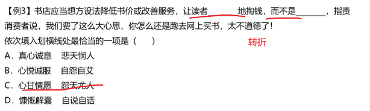
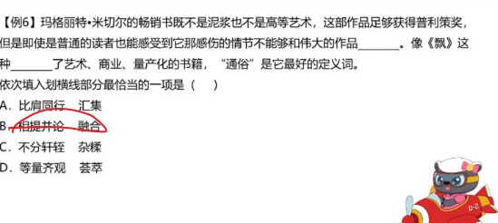

# Table of Contents

* [成语辨析](#成语辨析)
  * [耸人听闻、骇人听闻、危言耸听](#耸人听闻骇人听闻危言耸听)
  * [驾轻就熟 耳熟能详](#驾轻就熟-耳熟能详)
  * [深思熟虑 深谋远虑](#深思熟虑-深谋远虑)
  * [无可厚非 无可非议](#无可厚非-无可非议)
  * [一以贯之 一如既往 始终如一](#一以贯之-一如既往-始终如一)
  * [孤芳自赏 曲高和寡 顾影自怜](#孤芳自赏-曲高和寡-顾影自怜)
  * [脍炙人口 喜闻乐见](#脍炙人口-喜闻乐见)
  * [群雄逐鹿 百花齐放](#群雄逐鹿-百花齐放)
  * [异曲同工 殊途同归](#异曲同工-殊途同归)
  * [目光如豆 目光如矩 目无全牛](#目光如豆-目光如矩-目无全牛)
  * [相形见绌 捉襟见肘](#相形见绌-捉襟见肘)
  * [按图索骥 披沙拣金 去伪存真](#按图索骥-披沙拣金-去伪存真)
  * [更新迭代 革故鼎新 改选更张 日新月异](#更新迭代-革故鼎新-改选更张-日新月异)
  * [哗众取宠 喧宾夺主 鸠占鹊巢](#哗众取宠-喧宾夺主-鸠占鹊巢)
  * [越俎代庖 李代桃僵](#越俎代庖-李代桃僵)
  * [揠苗助长 快马加鞭](#揠苗助长-快马加鞭)
  * [脱颖而出 应运而生](#脱颖而出-应运而生)
  * [包罗万象 蔚为大观](#包罗万象-蔚为大观)
  * [相沿成俗 蔚然成风 靡然成风](#相沿成俗-蔚然成风-靡然成风)
  * [额手称庆 弹冠相庆](#额手称庆-弹冠相庆)
  * [击节赞叹 低头折节](#击节赞叹-低头折节)
  * [欣喜若狂 欢欣鼓舞 如痴如狂](#欣喜若狂-欢欣鼓舞-如痴如狂)
  * [茫然若失 浑然不觉 习焉不察](#茫然若失-浑然不觉-习焉不察)
  * [神乎其神 不可思议](#神乎其神-不可思议)
  * [情景交融 水乳交融](#情景交融-水乳交融)
  * [迂回曲折 跌宕起伏](#迂回曲折-跌宕起伏)
  * [愈演愈烈 变本加厉 落井下石](#愈演愈烈-变本加厉-落井下石)
  * [金瓯无缺 严丝合缝](#金瓯无缺-严丝合缝)
  * [土崩瓦解 分崩离析 一盘散沙](#土崩瓦解-分崩离析-一盘散沙)
  * [独辟蹊径 标新立异 异彩纷呈](#独辟蹊径-标新立异-异彩纷呈)
  * [一劳永逸 一蹴而就 睡手可得](#一劳永逸-一蹴而就-睡手可得)
  * [一哄而起 一唱百和 经久不衰](#一哄而起-一唱百和-经久不衰)
  * [缘木求鱼刻舟求剑抱薪救火](#缘木求鱼刻舟求剑抱薪救火)
  * [与虎谋皮 对牛弹琴](#与虎谋皮-对牛弹琴)
  * [画饼充饥 海市蜃楼](#画饼充饥-海市蜃楼)
  * [以偏概全 以点带面 断章取义](#以偏概全-以点带面-断章取义)
  * [珠联璧合 相辅相成 相得益彰 交相辉映](#珠联璧合-相辅相成-相得益彰-交相辉映)
  * [前功尽弃 功亏一篑 无功而返](#前功尽弃-功亏一篑-无功而返)
  * [迎刃而解 水到渠成 不攻自破](#迎刃而解-水到渠成-不攻自破)
  * [庸人自扰  杞人忧天](#庸人自扰--杞人忧天)
  * [自怨自艾 妄自菲薄](#自怨自艾-妄自菲薄)
  * [悲天悯人 怨天尤人 怨声载道](#悲天悯人-怨天尤人-怨声载道)
  * [流离失所 背井离乡](#流离失所-背井离乡)
  * [另辟蹊径 天马行空 标新立异](#另辟蹊径-天马行空-标新立异)
  * [如火如荼 方兴未艾](#如火如荼-方兴未艾)
  * [群雄逐鹿 齐头并进 并驾齐驱](#群雄逐鹿-齐头并进-并驾齐驱)
* [词语辨析](#词语辨析)
  * [流传 留传](#流传-留传)
  * [流露 表露](#流露-表露)
  * [径自 径直](#径自-径直)
  * [传颂 传诵](#传颂-传诵)
  * [巨变 剧变](#巨变-剧变)
  * [理想 目标](#理想-目标)
  * [克制 克服](#克制-克服)
  * [驱除 祛除 湮灭](#驱除-祛除-湮灭)
  * [扬言 佯言](#扬言-佯言)
  * [原型 原形](#原型-原形)
  * [沉积 沉淀](#沉积-沉淀)
  * [推脱 推托](#推脱-推托)
  * [浸染 浸润 感染](#浸染-浸润-感染)
  * [追忆 追述](#追忆-追述)
  * [蔓延 漫延](#蔓延-漫延)
  * [部署 布置 配置](#部署-布置-配置)
  * [寂静 沉寂 寂寞](#寂静-沉寂-寂寞)
  * [沉静 安定](#沉静-安定)
  * [推诿 推托 推脱](#推诿-推托-推脱)
  * [陈规 常规](#陈规-常规)
  * [品味 品位](#品味-品位)
  * [质疑 置疑](#质疑-置疑)
  * [自居 标榜](#自居-标榜)
  * [领悟 感触 感悟](#领悟-感触-感悟)
  * [渗透  透露](#渗透--透露)
  * [追随 追捧](#追随-追捧)
  * [依附  附和](#依附--附和)
  * [附庸 随从](#附庸-随从)
  * [庸俗 俗套](#庸俗-俗套)
  * [反映 反应](#反映-反应)
  * [答应 答复](#答应-答复)
  * [编辑 编发](#编辑-编发)
  * [建造 缔造](#建造-缔造)
  * [筑就 铸就](#筑就-铸就)
  * [哺育  培育 养育 孕育](#哺育--培育-养育-孕育)
  * [滋养 滋润](#滋养-滋润)
  * [违反 违犯](#违反-违犯)
  * [勾勒 描绘](#勾勒-描绘)
  * [权力 权利 权益 利益](#权力-权利-权益-利益)
  * [荟萃 融合](#荟萃-融合)
  * [包涵 涵盖](#包涵-涵盖)
  * [奢望 奢求 幻想](#奢望-奢求-幻想)
  * [时势 时事](#时势-时事)
  * [遏制 终止 中止](#遏制-终止-中止)
  * [停止 停滞](#停止-停滞)
  * [盈利 营利](#盈利-营利)
  * [资助 援助 援救](#资助-援助-援救)
  * [镌刻  雕刻 铭刻 铭记](#镌刻--雕刻-铭刻-铭记)
  * [驱除 祛除](#驱除-祛除)
  * [消失 消逝 消亡](#消失-消逝-消亡)
  * [秉承 秉持 继承](#秉承-秉持-继承)
  * [监测 监控 监视](#监测-监控-监视)
  * [感受 感觉](#感受-感觉)
  * [感触 感悟](#感触-感悟)
  * [厘清 理清 澄清](#厘清-理清-澄清)
  * [寄予寄于](#寄予寄于)
  * [结余 节余](#结余-节余)


# 成语辨析

## 耸人听闻、骇人听闻、危言耸听


骇人听闻：重点是**客观事实**

**耸人听闻**：故意夸大、贬义


列题：


## 驾轻就熟 耳熟能详

驾轻就熟：比喻对某事有经验，很熟悉，做起来容易

耳熟能详：听的多了，可以复述出来


## 深思熟虑 深谋远虑


例题：


## 无可厚非 无可非议


列题：


## 一以贯之 一如既往 始终如一


始终如一：一直没变过

一如既往：和之前一样，注意体会这里的时态问题，和始终如一不太一样


例题


## 孤芳自赏 曲高和寡 顾影自怜

孤芳自赏 ：自命清高、偏重于自我欣赏，含贬义

曲高和寡：言论作品不通俗

 顾影自怜：偏重于自我怜惜

简单说就是：过于自信、过于自卑、不通俗


列句：

1. 一味孤芳自赏的人
2. 通俗读物不应该曲高和寡
3. 鼓励她要勇敢面对生活，而不是顾影自怜


## 脍炙人口 喜闻乐见
+  脍炙人口：人人赞美的事务和传诵的诗文

+ 喜闻乐见：喜欢听 乐意看

喜闻乐见主体是**人**  脍炙人口是**事物**

列句：

1. 唐诗三百首 每首都脍炙人口
2. 相声是**人们喜闻乐见**的一种艺术表现形式


## 群雄逐鹿 百花齐放

+ 群雄逐鹿：**体现竞争关系**

+  百花齐放： 比喻不同形式和风格的各种艺术作品自由发展**不体现竞争关系**

列句：

1. 在群雄逐鹿的家电市场
2. 美术展览上有许多新作品，百花齐放。


## 异曲同工 殊途同归

+ 异曲同工：做法不同，效果一样【强调结果是好的】

+ 殊途同归： 采取不同方法得到相同的效果【不强调结果】

例句

1.这道题有几种解法，但殊途同归，选项只有一个是正确的。

2.这两幅画虽然表现手法不同，但都能引起读者的共鸣，有异曲同工之妙。


强调结果，选择A

---


AB都符合，但是结合语境【审时度势】更符合语境

-----


第一个空排除C 第二个空暂定B，第三个空B 答案选B


## 目光如豆 目光如矩 目无全牛

+ 目光如豆: 目光短浅
+ 目光如矩 : 见识远大
+ 目无全牛: 技术得心应手

例句

1. 一个人眼光不能目光如豆
2. 这位政治家目光如炬
3. 技术达到目无全牛的境界


近义词直接B

## 相形见绌 捉襟见肘

+ 相形见绌：和同类事物比较显出不足 【注意有比较的意思】
+ 捉襟见肘：顾此失彼，穷于应付

例句

1. 在跳水冠军面前，小王相形见绌
2. 家里的经济捉襟见肘


秒C就走

## 按图索骥 披沙拣金 去伪存真

+ 按图索骥：多指按线索，也指墨守成规
+ 披沙拣金：大量事物选取精华
+ 去伪存真：辨别假事物，保留下真正得东西

例句

1. 按照提供得线索，按图索骥找到了犯罪嫌疑人
2. 肥料上披沙拣金
3. 冒牌货太多，要去伪存真


## 更新迭代 革故鼎新 改选更张 日新月异

+ 更新迭代 ：不断进步 更迭
+ 日新月异：每月都有变化。 指发展或进步迅速，不断出现新事物、新气象
+ 革故鼎新 ：改革 不具体
+ 改选更张：改革 具体

例句

1. 信息更新迭代
2. 对所学知识举一反三，敢于革故鼎新
3. 既然大家都有改弦更张得决心


## 哗众取宠 喧宾夺主 鸠占鹊巢

+  哗众取宠：贬义 轻浮虚荣
+  喧宾夺主：贬义 外来的 次要的事物占据了主要事物
+  鸠占鹊巢：贬义 抢占别人得住屋或者占据别人得位置

例句

1.  哗众取宠人不受欢迎
2. 电影广告喧宾夺主
3. 最后他 鸠占鹊巢


## 越俎代庖 李代桃僵

+ 越俎代庖：不是自己得事情，去管
+  李代桃僵：代替别人受过，过错 

例句

1.  招聘是小张得事情，不要越俎代庖
2. 发生了李代桃僵得事情


## 揠苗助长 快马加鞭

+ 揠苗助长 : 请求速度，反而不好

+ 快马加鞭：加快速度


## 脱颖而出 应运而生

+ 脱颖而出 ：本领全部显露出来;
+ 应运而生： 适应时代或社会需要而产生  【需要一个载体】

例句:表现出色的他轻松地在众多选手中**脱颖而出**。
        例句:环境越来越恶劣的今天,不少**呼吁环保的公益**广告**应运而生**


## 包罗万象 蔚为大观

+ 包罗万象:形容内容丰富，应有尽有:无所不有:

+ 蔚为大观:形容事物美好而繁多，给人一种盛大的印象，多指文物、景观等

  例句:互联网上的数据包罗万象，只要你能想到的，它都有。
  例句:雄伟的建筑矗立于黄浦江畔，蔚为大观。


##  相沿成俗 蔚然成风 靡然成风

+ 相沿成俗:指因袭某种做法传下来，**多形成风俗习惯**;

+ 蔚然成风:指一件事情逐渐发展盛行，形成一种良好风气，**含褒义**;

+ 靡然成风:指群起效尤而成风气，**含贬义**。

  例句:腊八节腌制腊八蒜逐渐相沿成俗，流传到现在
  例句:在中国尊师重道早已蔚然成风。
  例句:因为教育观念的落后，在此地重男轻女的观念靡然成风


##  额手称庆 弹冠相庆

+ 额手称庆:形容高兴和喜悦。多指走出困境和不快的放 松心情，多指令人称快的事，多为褒义
+ 弹冠相庆:**形容坏人得意。含贬义。**

例句:虽说经历了许多变故，但总算没出差错，令人额手称庆

例句:他用不正当的手段坐上了公司的第一把交椅，他的同伙弹冠相庆


##  击节赞叹 低头折节

+ 击节赞叹:形容对别人作品的赞赏:
+ 低头折节:指丧失气节，屈服于他人。


例句:他的钢琴演奏如此优美，听的人无不击节赞叹
例句:梅花和别的花不一样，其它的花都是遇到一点困难就低头折节，不能勇敢的去战胜困难。


##  欣喜若狂 欢欣鼓舞 如痴如狂

+ 欣喜若狂:形容人狂喜的心情，高兴到了极点，**中性词**
+ 欢欣鼓舞:形容高兴而振奋，**含褒义;**
+ 如痴如狂:为某物所倾倒，能够体现出**十分向往执着**


例句:每当这个时候这个凄凉哀伤的女人就会欣喜若狂,光着脚丫去迎接邮差。
		例句:北京成功地举办了奥运会,全国人民都欢欣鼓舞无比高兴。
		例句:曾有那么一些时日,他如痴如狂地看一些青春文学小说。


## 茫然若失 浑然不觉 习焉不察

+ 茫然若失:神情迷茫，好像失去了什么东西似的，可以体现没有得到机会后的心情

+ 浑然不觉:毫无察觉，什么也不知道;

+ 习焉不察:经常接触某种事物，反而觉察不到其中存在的问题。


  例句:望着远去的列车，我茫然若失地站在月台上许久不曾缓过神来。
  例句:小明学习非常专注，对于周围发生的事浑然不觉。
  例句:他生活在那样的环境中，久而久之，习焉不察，对一些不良现象熟视无睹。


## 神乎其神 不可思议

+ 神乎其神:神秘奇妙到了极点，**感情倾向偏消极**，一般指过于夸大某物;

+ 不可思议:形容对事物或言论无法想象、很难理解。


  例句:事实远没有传说的那样神平其神。
  例句:为什么你就会觉得我拿到第一名是不可思议的事情呢。


##  情景交融 水乳交融

+ 情景交融:【文艺作品】中环境的描写、气氛的渲染跟人物思想感情的抒发结合得很紧密

+ 水乳交融:比喻感情很融洽或结合十分紧密。

  例句:唐诗宋词中那些情景交融的佳句，莫不令人感到诗中有画，韵味无穷。
  例句:一位成功的作家就是要在作品中和读者产生水乳交融的情感。


## 迂回曲折 跌宕起伏

+ 迂回曲折:形容弯弯曲曲，绕来绕去，常比喻事物发展的曲折性; 【比跌宕起伏更广】

+ 跌宕起伏:事物多变、不稳定。

  例句:长征之路千难万险，胜利之路迂回曲折。
  例句:这部电视剧情节跌宕起伏,扣人心弦。


##  愈演愈烈 变本加厉 落井下石


+ 愈演愈烈:【可用于陈述客观实际情况】，【变本加厉一般用于消极语境】;
  愈演愈烈偏多指一种情况、趋势，变本加厉多指人;

+ 落井下石指乘人为难加以陷害。

  

  例句:从今年春节后，二手房市场就出现房源多于客户的局面，一手房滞销也愈演愈烈。
  例句:他经常迟到，老师批评了他，他不但不改，反而变本加厉地旷课。
  例句:他遇到危险，你不帮助他，还诬陷他，这样落井下石你觉得做得对吗?


##  金瓯无缺 严丝合缝

+ 金瓯无缺:比喻国土完整;

+ 严丝合缝:指缝隙严密闭合。

  例句:清政府腐败无能,处处割地赔款,使金无缺的国土于孔百疮。
  例句:埃及胡夫金字塔修得非常好,墙壁严丝合缝就像是一整块石头。


##  土崩瓦解 分崩离析 一盘散沙

+ 土崩瓦解:指彻底垮台、崩溃;含有比喻色彩;

+ 分崩离析:形容国家或集团四分五裂，不可收拾

+ 一盘散沙:指人员分散，不能团结在一起。

  例句:许多的旧制度在一连串的改革后,正处于土崩瓦解中。
  例句:东欧的几个国家已经到了分崩离析的地步。
  例句:这里的群众还没组织起来,就像一盘散沙。

  


##  独辟蹊径 标新立异 异彩纷呈

+ 独辟蹊径:比喻独创一种新风格或者新方法;

+ 标新立异:指提出新奇的主张，表示与一般不同，也指为了显示自己，故意显出自己的与众不同或者用往常不同的表达方式来吸引人;

+ 异彩纷呈:突出的成就或表现。

  例句:我国民族音乐家刘天华独蹊径,改造乐器,创作新曲,订定指法,使二胡、琵琶等民族乐器大放异彩。

  例句:她把满头黑发染成了金色为的就是追求标新立异,特立独行。

  例句:各个历史时期的优秀民间艺术异彩纷呈，蔚为大观。


## 一劳永逸 一蹴而就 睡手可得

+ 一劳永逸：强调事情一次办好后面也就不费力了

+ 一蹴而就：则比喻事情很容易做;

+ 睡手可得：指一件事物非常容易得到。

  例句:这个世界上，没有一件事是一劳永逸的，任何成功都不能决定遥远的未来。
  例句:做学问不能一蹴而就，只有积少成多，才能厚积薄发。
  例句:对你有帮助的东西，并不都是唾手可得的。


##  一哄而起 一唱百和 经久不衰

+ 一哄而起:无组织无计划的盲目行动，**含贬义**;

+ 一唱百和:形容附和的人极多，**含褒义**;

+ 经久不衰:经历很长时间仍旧保持较高的旺盛状态。

  例句:饥渴难忍的军士得令后,一哄而起,纷纷越过战壕向河边,军队顿时大乱

  例句:此项提议对各方面都有利，所以能一唱百和，立刻获得许多人的支持。
  例句:年轻人的耐力经久不衰，能够适应长久的训练。

  


##   缘木求鱼刻舟求剑抱薪救火

+ 缘木求鱼:比喻方向或办法不对头，不可能达到目的;

+ 刻舟求剑:比喻不懂事物已发展变化而仍静止地看问题;

+ 抱薪救火:比喻方法不对，反而使祸害扩大。


  例句:想不用功而取得好成绩，就像缘木求鱼，那是不可能的。
  例句:我们应当记取刻舟求剑的教训，使我们的思想适应客观形势的变化。
  例句:上个月他因旷课，考试没有及格，你不帮他补课，还约他跳舞，这不是抱救火吗?


##  与虎谋皮 对牛弹琴

+ 与虎谋皮:比喻跟所谋求的对象有利害冲突,绝不能成功。后多指跟恶人商量,要他牺牲自己的利益,一定办不到;

+ 对牛弹琴:讥笑听话的人不懂对方说得是什么。用以讥笑说话的人不看对象。

  例句:他向来视钱如命,要他捐钱救济穷人,无异是与虎谋皮。
  例句:跟这人说了半天啥也听不懂，真是对牛弹琴。


##  画饼充饥 海市蜃楼

+ 画饼充饥:指以空想来安慰自己;
+ 海市屋楼:指虚幻不存在的东西。
  例句:你只知空谈理想而不去实践,不过是画饼充饥罢了。
  例句:这些空泛的名声，有如海市屋楼，并不实在。


##   以偏概全 以点带面 断章取义

+ 以偏概全:偏正式;作谓语、定语;含贬义，指看问题片面。;

+ 以点带面:作谓语、宾语，多指以小带多，感情色彩积极;

+ 断章取义:与引用别人的言论有关，因为只看其中的一段或一句，不顾整体，是错误的做法。

  断章取义的后果是以偏概全
  

  例句:看问题时以偏概全，那就跟盲人摸象一样，得不到正确的认识。
  例句:当领导必须坚持点面结合，善于以点带面。
  例句:断章取义，无限上纲，是一种恶劣的文风。


##  珠联璧合 相辅相成 相得益彰 交相辉映

+ 珠联璧合比喻美好的人或事物结合在一起，指十分完美;

+ 相辅相成指两件事物互相配合，互相辅助，缺一不可;

+ 相得益彰指两个人或两件事物互相配合，双方的能力和作用更能显示出来,

+ 交相辉映指各种光亮、色彩等互相映照。多用于形容美好的景象。


  例句:这对新人真是天造地设，珠联壁合，

  例句:学习和复习，是用以掌握知识和巩固知识的两个方面相辅相成，缺一不可。

  例句:由于它的内容太卓越了，朴拙的形式并不会造成不良影响，相反的，却使它们相得益彰

  例句:满城的彩灯与夜空的焰火交相辉映。


##  前功尽弃 功亏一篑 无功而返

+ 前功尽弃:以前经过努力得到的成绩完全白费，可做主语、谓语、宾语:

+ 功亏一篑:事情最后由于松劲或缺少条件而没有成功，含惜

+ 无功而返:没有任何成效而回来，可做谓语、宾语，多用于处事。

  例句:学习外语一定要坚持到底，如果半途而废，就会前功尽弃.

  例句:实验已进入最后阶段，但因她的疏忽，终于功亏一。
  例句:这样下去我们只能无功而返了。


##   迎刃而解 水到渠成 不攻自破

+ 迎刃而解比喻主要问题解决了，其他的问题就很容易解决;或比喻处理事情、解决问题很顺利;

+ 水到渠成则比喻等条件成熟了事情就会自然成功，强调要等条件成熟;

+ 不攻自破则是指因为自己内部的矛盾而自行瓦解。

  例句:只要大家抓住主要矛盾，那所有的问题都会迎刃而解了
  例句:上课认真听讲，下课及时复习，知识掌握起来就是水到渠成的事。
  例句:还没有进行攻打，敌方阵营因内讧就已经不攻自破


##  庸人自扰  杞人忧天

+ 庸人自扰:泛指本来没有问题而自己瞎着急或自找麻烦，含贬义;

+ 杞人忧天:总是去忧虑那些不切实际的事物，担忧害怕。

  例句:你要是信了这些谣言，那才是庸人自扰呢。
  例句:常常幻想宇宙如果有一天灭亡,这简直是杞人忧天。


## 自怨自艾 妄自菲薄


+ 自怨自艾:形容悔恨交加;

+ 妄自菲薄:形容自责、自卑心理，自轻自贱，指对自己的品德、能力等没有自信，不相信自己可以完成.

  例句:自从生意失败后，他每天就在家里自怨自艾，悔当初没能把握机会。例句:许多人一事无成,就是因为他们低估了自己的能力,妄自菲薄,以至于缩小了自己的成就


## 悲天悯人 怨天尤人 怨声载道


+ 悲天悯人:对混乱的时世感到悲伤;对困苦的人民表示怜悯;

+ 怨天尤人:形容遇到不称心的事情一味归咎客观、埋怨别人;

+ 怨声载道:形容极为不满。

  例句:圣人之所以为圣人,正因为他们有悲天悯人的胸怀。
  例句:要从失败中总结教训，不要怨天尤人。
  例句:人们对于乘车难的问题意见很大，真可谓怨声载道，




## 流离失所 背井离乡


+ 流离失所:侧重无处安身而流浪;

+ 背井离乡:强调离开家乡到外地。

  例句:灾变过后首要做的事是安顿灾民,不要让他们流离失所，例句:在旧中国,大多数华侨是由于生活所迫,背井离乡,出国谋生。


## 另辟蹊径 天马行空 标新立异


+ 另辟蹊径:指另外开辟一条路，比喻另创一种风格或方法;

+ 天马行空:比喻才思敏捷，豪放不羁，多用在评价写作、绘画和书法等方面，也可指人浮躁，不踏实;

+ 标新立异:提出新奇的主张，表示与众不同。形容故意与众不同以显示自己。

  例句:他根据学生的具体情况,另辟蹊径,创造出一套新的教学方法。
  例句:李白才气纵横,行文如天马行空,一气呵成。
  例包:这件时装在设计上标新立异,但观众的评价却毁誉参半。


##  如火如荼 方兴未艾


+ 如火如茶:事物发展到鼎盛状态，形容旺盛、热烈或激烈;

+ 方兴未艾:指事物正在发展，尚未达到止境或还没有停止，多形容新生事物正在蓬勃发展。

  例句:这个领域的研究依然如火如荼
  例句:改革大潮席卷全国，经济方面出现了方兴未艾的大好形势。


## 群雄逐鹿 齐头并进 并驾齐驱


+ 群雄逐鹿:形容各派势力争夺最高统治地位;

+ 齐头并进:指多方面同时前进，形容几件事情或几项工作同时进行;

+ 并驾齐驱:比喻彼此的力量或才能不分高下。

  例句:在这个群雄逐鹿的家轿市场。众泰汽车的出现可谓是一两点。
  例句:三个班按照分工,齐头并进,很快就把联欢会的准备工作做好了。
  例句:两列火车在平行的轨道上同速并驾齐驱。


+ 走马观花vs浮光掠影vs蜻蜓点水vs浅尝辄止

  ```
  走马观花 侧重看的过程很粗
  浮光掠影 最后得到印象很肤浅
  蜻蜓点水 不深入 停留在表面
  浅尝辄止 研究学习知识领域不够深入
  ```

+ 方兴未艾 如日中天 声名鹊起 如火如荼 炙手可热

  ```java
  方兴未艾：新生事物蓬勃发展
  如日中天：发展到鼎盛时期
  声名鹊起：强调出名快、搭配顿时声名鹊起
  如火如荼：形容大规模活动，气氛比较热烈
  炙手可热：形容受欢迎
  ```

+ 一蹴而就 一劳永逸 一步登天 一挥而就 一气呵成 信手拈来 唾手可得

  ```java
  一蹴而就：蹴：踏;就：成功;踏一步就成功。比喻事情轻而易举，一下子就可以成功 侧重时间很短
  
  一劳永逸：逸：安逸;辛苦一次，把事情办好，以后就可以不再费力了。
  
  一步登天：一下子就达到很高境界
  
  一挥而就：形容写、画很流畅，快 
  
  一气呵成：搭配广，写、画、动作
  
  信手拈来：强调写作运用材料自如
  
  唾手可得：强调容易
  ```

+ 按部就班 循规蹈矩 墨守成规 固步自封 一成不变

  ```java
  按部就班：侧重按照原定计划或原有习惯有步骤或顺序地办事。中性
  循规蹈矩：侧重按规定的方式方法或旧例办事，不敢变通。    中性
  墨守成规：侧重不改变，不创新       贬义
  固步自封：侧重自大自满，不求进步    贬义
  一成不变：一经形成，不再改变。指守旧不变或固守成规
  ```

+ 泥沙俱下、鱼龙混杂、良莠不齐、参差不齐和鱼目混珠

  ```
  鱼目混珠:拿鱼眼睛冒充珍珠。比喻用假的冒充真的。
  
  参差不齐:原意是长短、高低、大小不一致，形容很不整齐或水平不一。
  
  良莠不齐:解释为指好的坏的混杂在一起。侧重于品质，不能用于形容水平、成绩等。
  
  泥沙俱下:意思是好人和坏人混杂在一起，成分复杂。 人和事物
  
  鱼龙混杂:一般只用于人，范围较小。即好人和坏人混杂在一起。 人
  ```

+ 脱胎换骨 另起炉灶 破釜沉舟 壮士断腕

  ```
  “破釜沉舟”比喻下决心，不顾一切干到底；
  “壮士断腕”比喻在紧要关头当机立断，为保存整体不惜牺牲局部，二者均可体现“敢于破除、舍弃”的意思
  “脱胎换骨”形容通过教育改造，根本改变一个人的立场和世界观。也比喻重新做人
  “另起炉灶”指另外重支炉灶。比喻放弃原来的，另外从头做起
  ```


+ 食古不化 照本宣科 生搬硬套 钻故纸堆

  ```
  “食古不化”：指学习古代知识不善于吸收、理解和运用，就好像吃了东西不能消化一样，“古”对应后文“中国传统建筑设计风格”，符合文意，
  “照本宣科”一般形容讲课、发言等死板地按照课文、讲稿，没有发挥，不生动
  “生搬硬套”形容不顾实际情况，机械地搬用别人的经验和方法，均不能体现出套用以前的、传统的意思，z
  ```

+ 花拳绣腿 叶公好龙 金玉其外 沽名钓誉

  ```
  “花拳绣腿”指只做些表面上好看实际上并无用处的工作，
  “叶公好龙”比喻自称爱好某种事物，实际上并不是真正爱好
  “金玉其外”常与“败絮其中”连用，比喻外表好看
  “沽名钓誉”指用某种不正当的手段捞取名誉
  ```

+ 错落有致  星罗棋布

  ```
  错落有致”形容事物的布局虽然参差不齐，但却极有情趣，使人看了有好感，与文意相符
  “星罗棋布”指数量很多、分布很广
  ```

+ 大行其道  风靡一时 蔚然成风 大张旗鼓

  ```
  “大行其道”指某种观点或某种事物盛行（多含贬义），
  “风靡一时”形容一个事物在一个时期非常盛行，文段并未强调快餐文化流行的时间段，
  “蔚然成风”形容一种事物逐渐发展、盛行，形成风气，多用于积极的语境中，与文段感情色彩不符，
  “大张旗鼓”形容进攻的声势和规模很大，也形容群众活动的声势和规模很大，
  ```

+ 层出不穷 VS 屡见不鲜

  ```
  层出不穷：表示接连不断的地出现，没有穷尽。侧重强调连续出现，数量很多。
  屡见不鲜：形容常常看见，并不新奇。侧重强调常见，不新奇、不新鲜。
  ```

+ **大相径庭 VS 背道而驰**

  ```
  大相径庭：指相差很远，大不相同。侧重强调相差很大，不同之处很多。
  背道而驰：表示彼此的方向完全相反或背离正确的目标，朝相反方向走。侧重指与正确的目标完全相反。
  ```

+ **历久弥新** **持之以恒**

  ```
  历久弥新：经历的时间长久而更加新鲜，更显价值。“历久弥新”侧重强调随着时间的推移而变新、更有价值。
  “持之以恒”表示长久地坚持做某事。“持之以恒”侧重强调长时间地坚持，不放弃。
  ```

+ 理所当然  无可厚非

  ```
   理所当然：从道理上说应当这样。“理所当然”侧重应当如此。
   无可厚非 ：不能过分责备。形容说话做事虽有缺点，但还有可取之处，应予谅解。“无可厚非”侧重强调有问题但可以接受。
  ```

+ 相辅相成vs相得益彰

  ```
  相辅相成：相互补充，相互促成。 “相辅相成”指两者形成互补，重在缺一不可。
  相得益彰：相互配合，使事物更加完美
  ```

  + 旗鼓相当vs毫不逊色

  ```
  旗鼓相当：比喻双方实力或者能力不相上下。
  毫不逊色：指丝毫不差
  ```

  + 独树一帜vs一枝独秀 vs 独领风骚 首屈一指

  ```
  独树一帜”比喻与众不同，自成一家，可表示独特的意思
  “独领风骚”形容超群出众，没有谁可与之相比，
  “一枝独秀”比喻技高一筹，优势明显，文段并未提及其优势
  “首屈一指”表示居第一位
  ```

+ **不言而喻**

  ```
  不言而喻：不用说就可以明白。形容道理很浅显。“不言而喻”侧重道理浅显，不用说就明白
  ```

+ **根深蒂固** **潜移默化**

  ```
  根深蒂固:比喻基础稳固，不容易动摇。
  
  “根深蒂固”多指存在时间很久，基础牢固。
  
  “根深蒂固”常搭配抽象的事物，比如观念。
  
  “根深蒂固”是中性词，可以搭配陈旧的观念。
  
  潜移默化：指人的思想或性格受其他方面的感染而不知不觉地起了变化。
  
  “潜移默化”强调影响是无形的，看不到的；
  
  “潜移默化”常搭配物或事，多用于性格、习惯、作风等方面；
  
  “潜移默化”是中性词。
  ```

+ **推陈出新**

  ```
  推陈出新：去掉旧事物的糟粕，取其精华，并使它向新的方向发展。“推陈出新”感情色彩较积极。“推陈出新”强调去糟粕，取精华，有去掉旧的，提出新的之意。
  ```

+ **南辕北辙**

  ```
  南辕北辙:原指本要往南边去却驾车向北，比喻行动和目的相反。“南辕北辙”侧重强调行动和目的相反（文段中一般会出现行动和目的）。
  ```

+ **望洋兴叹**

  ```
  原指在伟大事物面前感叹自己的渺小，现多指做事时因力量不够或缺乏条件而感到无可奈何。“望洋兴叹”侧重指因能力、条件不足而没有办法，表示客观方面做不到。
  ```

+ **纸上谈兵 **画饼充饥  言之无物 作壁上观

  ```
  “纸上谈兵”比喻空谈理论，不能解决实际问题
  “画饼充饥”比喻用空想来安慰自己，
  “言之无物”指文章或言论空空洞洞，没有实际内容
  作壁上观 置身事外，在一旁观望
  ```

+ **莫衷一是**

  ```
  意见有分歧，没有一致的看法。“莫衷一是”侧重强调观点、言论不一致。
  ```

+ **如出一辙**

  ```
  如出一辙:好像出自同一个车辙，形容事物非常相似。“如出一辙”强调相似，感情色彩为中性。
  ```

+ **曲高和寡**

  ```
  比喻言论或艺术作品不通俗，能理解或欣赏的人很少。
  
  “曲高和寡”侧重作品不通俗，能理解的人很少，常适用于略显消极的语境。
  ```

+ **耸人听闻**

  ```
  耸人听闻:使人听了非常震惊。“耸人听闻”一般用于故意夸大或捏造的事件造成的影响。
  骇人听闻：指使人听了感到非常吃惊、害怕，它是一个反映客观现象的词
  ```

+ 淋漓尽致 酣畅淋漓

   ```
   淋漓尽致：基本信息为形容文章或说话表达得非常充分、透彻，或非常痛快
   酣畅淋漓　：酣畅：畅快；淋漓：饱满畅快的样子。形容非常畅快。 常指文章绘画，文艺作品感情饱满，笔意流畅，情感得到充分抒发。
   ```

+ 不孚众望”与“不负众望”

  ```java
  不孚众望:不能使大家信服
  不负众望:不辜负大家的期望
  ```

+ ```java
  不刊之论，成语，作宾语，比喻不能改动或不可磨灭的言论，用来形容文章或言辞的精准得当，无懈可击
  不易之论：不可更改的言论。形容论断或意见非常正确
  ```

+ ```java
  “不以为然”意思是不认为是对的，表示 不同意 (多含轻视意)。 
  “不以为意”则指 不把它放在心上，表示不重视，不认真对待
  ```

+ 

   ```java
   举重若轻:处理繁难的事情很容易
   大行其道：
   ```

   


#  词语辨析

1. 


## 流传 留传

流传：时间上的由前往后，也可指空间

留传：**只能传下去**，而不能**传开**


列句：

1. 大禹治水的问题**流传**下来
2. 这是他爷爷**留传**下来的独家秘笈。


## 流露 表露

流露：强调自然，感情不自觉表现出来

表露：偏主动

列句：

1. **流露**出对祖国的爱
2. 表情在脸上**表露**出来


## 径自 径直

径自 ：自主主张

径直： 直接向某处前进，不绕道

列句：

1. 不顾大家劝阻，**径自**离去

## 传颂 传诵

传颂 ：多指传播名人民事

传诵：感情色彩积极，扩大说的范围

列句：

1. 他救了人，大家都在**传颂**他的事迹
2. 李白流下了很多**传诵**至今


## 巨变 剧变

 巨大的或剧烈的变化。特指变化之大。巨是形容大，而剧是形容快。 

## 理想 目标

 理想是一种向往的境界,目标是给自己定的方向和座标,目标可以随时改变,但理想一般在人的心中占有崇高的地位,这两者有本质上的区别。理想到底还只能归根于内心的想法,或是梦想,你不一定要去实现的。 


## 克制 克服 

克制：抑制情感，主观方面

克服：用坚强的意志战胜不良因素、坏现象等，侧重客观方面

列句：

1. 他努力**克制**自己，不让自己眼泪掉下来。
2. 在海上开采石油，要**克服**很多困难


奢靡之风 坏的现象， 克服


不良倾向 克服


## 驱除 祛除 湮灭

驱除：赶走 多用于具体的对象 

祛除： 除去疾病、恐惧、邪祟等 多用于抽象

 湮灭： 一种东西完全消灭

列句：

1. 国家强盛，驱除敌人
2. 祛除恐惧
3. 企图湮灭证据


## 扬言 佯言

+ 扬言 : **有意**传出采取某种行动的话，多含威胁之意
+ 佯言: **说假话**


列句：

1. 他扬言一定要报复
2. 他佯言东边有金子，让大家都去挖


## 原型 原形

+ 原型 ： 事物的所指 
+ 原形： 事物的本身

列句：

1. 这篇故事以神话为原型
2. 琵琶精原形毕露


## 沉积 沉淀

沉积是一个积累的过程

沉淀： 指溶液中难溶解的固体物质从溶液中释出，二指从溶液中释出的难溶解的固体物质，三比喻凝聚，积累 


## 推脱 推托

+ 推脱:是推卸、推辞，它着重指摆脱、开脱责任、问题、事情等，使与己无关。
+ 推托: 借故拒绝 

## 浸染 浸润 感染

+ 浸染：逐渐感染
+ 浸润 ：除了浸染还有滋润和熏陶的意思
+ 感染：通过言语和行为引起别人相同的思想感情


注意这里，不断表示是一个持续的过程，选A


## 追忆 追述

+ 追忆： 主动的回忆，
+ 追述：追忆叙述，【强调说】

列句：

1. 陷入对往事的追忆
2. 老人在追诉自己的见闻

----


文献有说的意思，秒C

---


## 蔓延 漫延 

+  蔓延：多用于蔓草一类植物不断向周围延伸、扩展，比喻事物像蔓草一样向周围延伸、扩展。【侧重一个变化过程 还强调很难根除的东西，比如不良风气蔓延】
+ 漫延：多用于用于水势向四周扩散，由内向外的过程。 【中性】

列句：

1. 森林发生了火灾，蔓延的很快
2. 这片沙漠一直蔓延到天边。


## 部署 布置 配置

+ 部署：安排布置【一般指重大事件】
+ 布置： 安排具体的事情
+ 配置：缺少的补足

列句：

1. 党中央部署安排工作
2. 布置书房
3. 配置一台打印机


产业合理配置，产业链条 固定搭配，选A

----


第一空肯定是部署

在看第三空，表达诉求

选D

---


## 寂静 沉寂 寂寞

+ 寂静：环境安静
+ 沉寂：十分安静，一般指音讯
+  寂寞：冷清孤单

列句：

1. 夜深了，热闹的广场十分寂静
2. 在外打工的哥哥音讯沉寂
3. 我今晚一个人在家真是寂寞


## 沉静 安定

+ 沉静：性格、心情神色安静平静
+ 安定： 侧重 生活形式平静正常

列句：

1. 他性格沉静，不爱说话
2. 社会风气好，生活安定


## 推诿 推托 推脱 


+ 推诿 ：推卸责任

+ 推托 ：借故不去

+ 推脱： 是推卸、推辞,它着重指摆脱、开脱责任、问题、事情等,使与己无关 

  

列句：

1. 不要把你的责任推诿给别人
2. 上台表演，他推托肚子疼，怎么都不去


## 陈规 常规 

+ 陈规：不实用的旧规章 贬义
+ 常规 ：久已通行的规则 不行贬义

列句：

1. 我们应该打破陈规
2. 常规解题思路


## 品味 品位

+ 品味: 动词 对食物的欣赏
+ 品位:对一个人生活方式的修养


## 质疑 置疑

+ 质疑 ：提出疑问 怀疑 
+ 置疑： 多用于否定句

列句：

1. 即使是权威，我们也应该质疑。
2. 地球围着太阳转，这是毋庸置疑的


## 自居 标榜

 

+ 自居:自以为具有某种资格或身份;自己看待自己

+ 标榜:D吹嘘，夸耀;@提出某种好听的名义，加以宣扬

例句:他的文学知识空空如也,却偏要以文学家自居

例句:他这个人一向谦虚谨慎,从不自我标榜


##  领悟 感触 感悟

+ 领悟：侧重于明白道理;理解
+ 感触：指跟外界事物接触而引起的思想感情，侧重的是“感情”方面，**而没有体现看法和观点**
+ 感悟：侧重于有所感触而领悟，，感情上的变化,**某事有自己的感想、体会**。
  例句:他很快就领悟到其中的幽默，于是和大家一起欢笑起来。
  例句:看到这些义工默默奉献，特别发人深省，感触良多。
  例句:直到读了依米花的故事,我真正感悟到了生命的本质。


## 渗透  透露

+ 渗透:指某种事物或势力逐渐进入其他方面

+ 透露:指泄露或显露(信息、消息、意思等

  例句:桂花树偷偷地解开了一个个的小香囊香气渗透在空气中很香。
  例句:这个消息坚决不能透露出去。


## 追随 追捧

+ 追随:跟随
+ 追捧:追逐捧场

例句:追随伟大人物的思想，是最富有趣味的一门科学。
        例句:在线收费阅读市场中，最受追捧的是玄幻、穿越类小说。


## 依附  附和

+ 依附:侧重从属或不独立

+ 附和:随着别人说或做，大多用于**贬义**

  例句:这些蔓藤依附着竹竿慢慢的向上爬。
  例句:随声附和上级的意见，正是老王一路升官的诀窍。


##  附庸 随从

+ 附庸:侧重依附于其他事物而存在的事物。**含贬义**

+ 随从:指跟随、陪同，**为中性词**

  

  例句:清王朝因此颜面扫地，许多附庸国自然也是树倒湖孙散。
  例句:哥哥这次以随从人员的身份出国考察。


## 庸俗 俗套

+ 庸俗:平庸粗俗，**含贬义**
+ 俗套:**世俗的习惯和礼节**


例句:韩剧于篇一律,差不多的剧情,差不多的发展炒了于百遍,这就是庸俗

例句:新年快乐，这不是俗套的祝福，而是真诚的心愿。


##  反映 反应

+ 反映：指把情况、意见等告诉上级或有关部门，【也指把客观事物的实质表现出来】;

+ 反应：指有机体受体内或体外的刺激而引起的相应的活动，也指事情所引起的意见、态度或行动。

  例句:一定的文化是一定社会的政治和经济的反映。
  例句:听到这个消息后他反应很强烈。

## 答应 答复

+ 答应：指应允、同意，有回应、反映;
+ 答复：指对问题或要求给以回答。

例句:老板毫不迟疑地答应了她关于提高薪水的要求。
例句:你先回去我们研究一下明天答复你。


##  编辑 编发

+ 编辑:侧重对资料进行整理

+ 编发:包含编辑和发放两方面含义。

  例句:他们准备编辑学校用书。
  例句:编发文体用品信息资料，快速交流多方面的信息。


----


---


---

##  建造 缔造

+ 建造:建造一般指建筑、兴建

+ 缔造:大都用于比较大的事件

  例句:根据图纸上的信息，这支工程队很快就建造好了这个雕像。
  例句:奥巴马总统在白宫晚宴前发表进话说:“你们每一位的前人都是胆识过人的和平缔造者


##  筑就 铸就

筑就:主要是指建造房屋之类建筑，
铸就:指冶炼金属;塑造人的性格或脾气。
例句:青藏铁路是由无数名铁路战士不分昼夜、费尽心血筑就而成的例句:用汗水改写人生，让勤奋铸就辉煌。


## 哺育  培育 养育 孕育

+ 哺育侧重喂养;

+ 培育侧重培养;

+ 养育侧重抚养和教育;

+ 孕育指怀胎生育。

  例句:这位妈妈正在用乳汁哺育婴儿。
  例句:老师辛勤培育我们的恩情，我们永远无法忘怀。
  例句:父母的养育恩重如山，做儿女的一生也报答不完。
  例句:我国源远流长的历史，孕育了绚丽多彩的文化。


##  滋养 滋润

+ 滋养:提供养分、养料;

+ 滋润:浸润，不干燥。

  例句:生活需要一颗感恩的心来创造，一颗感恩的心需要生活来滋养。
  例句:春雨滋润着于涸的大地。


##  违反 违犯

+ 违反指不符合、不遵守，一般与“某种纪律的行为”、规章或规范相搭配。

+ 违犯指违背和触犯，“违犯”一般与“党纪”、“法律”相搭配。

  例句:违反交通规则的人都应该受到惩罚。
  例句:打人是违犯法律的行为。


## 勾勒 描绘

+ 勾勒:抽象
+ 描绘:具体 


##  权力 权利 权益 利益

+ 权力:指权位，势力，包括职责范围内的指挥或支配力量;

+ 权利:指法律赋予人实现其利益的一种力量，与义务相对应;

+ 权益:指受法律保护的权利和利益;

+ 利益:好处。

  例句:全国人民代表大会是我国最高权力机关。
  例句:二十年来，教育变成了人人的权利，变成了人人的义务。
  例句:干部不要侵犯农民的合法权益。
  例句:你帮我完成这件事，对你自己也有一定的利益


## 荟萃 融合

+ 荟萃:本指草木丛生的样子，后喻优秀的人物或精美的东西会集、聚集，名碑荟萃

+ 融合:几种不同的事物合为一体。

  例句:中国制酒源远流长，品种繁多，名酒荟萃，享誉中外。
  例句:这座园林融合了东方和西方建筑的诸多特点壮观典雅。




## 包涵 涵盖
+ 包涵:多指客套话，请人原谅; 多用于语气词
+ 涵盖:指包括，多搭配抽象。

例句:这首歌唱的不是很好，请你多多包涵

例句:十三篇评论文选,涵盖政治、社会、经济、文化四个方面。


## 奢望 奢求 幻想

+ 奢望:指过高的希望

+ 奢求:指过分的要求

+ 幻想:想象出的情景

  例句:与其奢望一夜暴富，不如脚踏实地，稳扎稳打。
  例句:我不敢奢求你的原谅，只求一个补救的机会。
  例句:这孩子总幻想中个彩票。


## 时势 时事
+ 时势:指某一时期的客观形势;

+ 时事:近期国内外发生的大事。

  例句:时势造就很多人雄才大略。
  例句:考试有很多考察时事政治，所以我们就要不断地学习近期所发生的国家大事。


## 遏制 终止 中止

+ 遏制:侧重于控制;迫使停止;

+ 终止:结束停止

+ 中止:中途停止。

  例句:由于不可遏制的贪欲，他最终身败名裂。
  例句:我们合伙关系既已终止，从此分道扬镳了。
  例句:由于“文革”的破坏，许多科研项目被迫中止。


## 停止 停滞

+ 停止:不再进行;不再实行;

+ 停滞:谓事物因受某种阻碍而处于原来状况下不能继续发展前进。

  例句:傍晚的时候，风停止了，下起雨来。
  例句:社会发展只有两条路，或者前进，或者倒退，停不前就是倒退。


##  盈利 营利

+ 盈利:指已经获得了利润，纯收益。

+ 营利:指谋取利润。

  例句:要合法经营，不能靠歪门邪道来获得盈利。
  例句:禁止利用、组织学生从事营利性活动。


## 资助 援助 援救

+ 资助:侧重财务帮助;

+ 援助:指支援、帮助，范围广,可指多方面帮助;

+ 援救:指搭救、挽救，指帮助别人使脱离痛苦或危险。

  例句:他是个十足的守财奴，在亲人需要资助时，他也一毛不拔。
  例句:四川雅安地震时，他为当地的灾民伸出了援助之手。
  例句:消防队员从烈火中奋力援救出两名儿童。


## 镌刻  雕刻 铭刻 铭记

+ 镌刻:一般指文章或诗词**郑重**地刻在**某种坚硬物质或石头或铜板上**;
+ 雕刻:在金属、木材、石头等上面刻出图形、纹饰等
+ 铭刻:在金石等器物上铸造或镌刻文字或图案。牢记于心，感念不忘
+ 铭记:指牢记在心。

【 总的来说，“镌刻”和“铭刻”都可以用来表示刻写或记住某事，但“铭刻”的含义更为广泛，并且可以用作形容词。而“铭记”则更侧重于将某事深深记在心中。 】

例句:山头随处可见小小的大理石碑，上面镌刻着对死难者的悼念。
        例句:爷爷用树根雕刻成的天鹅，外形十分逼真。
         例句:你的教诲我永远铭刻在心中。
         例句:雷锋精神值得我们永远铭记例句:甲骨文就是将文字铭刻到兽骨上从而得以保存。


## 驱除 祛除

+ 驱除指赶走、除掉，多用于具体的对象，常搭配具体的人或事物等，

+ 祛除指除去疾病、疑惧、邪祟等，**多用于抽象的对象**。例如:疾病、恐惧。


  例句:当人们生活富裕，粮食充足时，那就是驱除外来者的最佳时机。
  例句:在这些人眼里，萨满就是用来祛除恐惧和邪恶的。


## 消失 消逝 消亡

+  消失:指逐渐减少以至没有，搭配对象是**具体的事物**，
+ 消逝:指慢慢逝去，不再存在，侧重过程，搭配对象多为时间、时光和声音**等抽象事物**
+ 消亡:指消失，灭亡，强调灭亡。
  例句:片刻之间，他就消失在人群之中。
  例句:火车出站后，汽笛声便渐渐消逝于夜空中。
  例句:该组织指出，在目前的全球化时代，世界各地的许多非物质文化遗产正在面临消亡的危险。


## 秉承 秉持 继承
+ 秉承侧重“承”，可秉承命令或指示或理念，也可用于上级对下级，

+ 秉持指执持，持有具有，侧重人的精神思想

+ 继承指依法承受(死者遗产)或把前人的作风、文化、知识等接受过来，

  例句:通过这次和领导的谈话，让我感受到，一定要秉承“诚实守信”的理念来为大众服务。
  例句:我们公司一向秉持着客户就是上帝的思想为大家来进行服务，从而获得很多好评。
  例句:长子继承了大部分的遗产。


## 监测 监控 监视


+ 监测:监管并检测;作用在测量结果;

+ 监控:监测和控制，作用在控制;

+ 监视:指从旁严密注视、观察，搭配主体一般是人。

  例句:我们的卫星发射有科技人员精心的设计和严密的监测,所以是万无一失的。
  例句:我们公司非常严格,对任何流程的监控都近乎吹毛求疵。
  例句:侦察兵严密监视着敌人的动向。


## 感受 感觉


+ 感受指受到、感染或是体会、感想
+ 感觉是客观刺激作用于感觉器官所产生的对事物个别属性的反映，是自我感觉。
  例句:进了这个大家庭之后，他深深的感受到集体的温暖。
  例句:我们坐在新教室里,感觉既暖和,又舒适。


## 感触 感悟


+ 感触:与外界事物连接而引起思想感情;
+ 感悟:不但引起思想感情，亦有所领悟。
  例句:说到枫树,我是很有感触的。
  例句:直到读了依米花的故事,我真正感悟到了生命的本质。


## 厘清 理清 澄清


+ 厘清指梳理清楚，通常搭配“关系”“任务”等，厘清:’“原则'

+ 理清:一般用于有条理的事物，如“理清头绪““理清脉络““理清思路”等;

+ 澄清:侧重显示事实，消除混乱之处，常用于搭配“事实”“真相”等。

  例句:你们两个已经分开这么久了还纠缠不清，应该尽快厘清关系，例句:作文时先要理清自己的思路。
  例句:他说:“多亏了海瑞啊,帮我澄清了这件事的事实!”


## 寄予寄于


+ 寄予:指寄托，常见搭配为寄予希望或厚望
+ 寄于:指寄托在，后面可接地点、人物等。
  例句:他老来得子，对这个宝贝儿子寄予厚望。
  例句:这个棘手的任务寄于你们团队，可要好好发挥呀。


## 结余 节余


+ 结余:结算后的剩余;
+ 节余:因节省而余下。
  例句:我们家的生活费,妈妈总是计划开支,月月都有结余。
  例句:这个月收成不好，他精打细算，每月扣除伙食费还有点节余，


+ 揶揄 调侃 

  ```
  调侃 程度比揶揄轻
  ```

  

+ 
