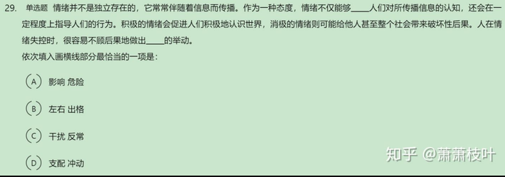

# Table of Contents

* [主旨概括题-重点](#主旨概括题-重点)
  * [提问方式](#提问方式)
  * [解题关键](#解题关键)
  * [主要题型](#主要题型)
    * [转折复句](#转折复句)
    * [因果复句](#因果复句)
    * [递进复句](#递进复句)
* [标题提炼题-选考题型](#标题提炼题-选考题型)
  * [提炼标题的关键](#提炼标题的关键)
  * [主要题型](#主要题型-1)
    * [议论文段](#议论文段)
    * [说明文段](#说明文段)
    * [记叙文段](#记叙文段)
    * [新闻文段](#新闻文段)
* [意图推断题-稍难](#意图推断题-稍难)
  * [提问方式](#提问方式-1)
  * [解题步骤](#解题步骤)
  * [例题分析](#例题分析)
* [细节理解题](#细节理解题)
  * [一、提问方式](#一提问方式)
  * [二、解题步骤](#二解题步骤)
  * [三、例题分析](#三例题分析)
* [语句排序](#语句排序)
  * [一、排序题的本质](#一排序题的本质)
  * [二、解题步骤](#二解题步骤-1)
  * [三、解题方法](#三解题方法)
    * [**（一）找显眼的提示词**——短小精悍、有逗号隔开、具有一定普适性的词](#一找显眼的提示词短小精悍有逗号隔开具有一定普适性的词)
    * [**（二）找内容简单、话题单一的短句**——原则是要保持语句话题的一致性](#二找内容简单话题单一的短句原则是要保持语句话题的一致性)
    * [**（三）重复词语**——若发现某两个或多个句子中有相同的词语重复出现，那么证明这几个句子在讨论同一话题，紧密度较高，为了保持主体话题的连贯一致，应排列在一起。](#三重复词语若发现某两个或多个句子中有相同的词语重复出现那么证明这几个句子在讨论同一话题紧密度较高为了保持主体话题的连贯一致应排列在一起)
    * [**（四）行文脉络＋结合选项观察**](#四行文脉络＋结合选项观察)
    * [**（五）关联词搭配**——如果几个句子中都有关联词出现，将搭配使用的关联词排列在一起，确保关联词使用正确且与句子逻辑关系相符。](#五关联词搭配如果几个句子中都有关联词出现将搭配使用的关联词排列在一起确保关联词使用正确且与句子逻辑关系相符)
    * [（六）选项优先——从选项入手，找到破题点。](#六选项优先从选项入手找到破题点)
* [语句衔接（填空）题](#语句衔接填空题)
  * [一、排序题的本质](#一排序题的本质-1)
  * [二、解题原则](#二解题原则)
  * [三、解题方法](#三解题方法-1)
    * [（一）空缺在段落开头](#一空缺在段落开头)
    * [（二）空缺在段落中间](#二空缺在段落中间)
    * [（三）空缺在段落末尾](#三空缺在段落末尾)
* [下文推断题](#下文推断题)
  * [一、提问方式](#一提问方式-1)
  * [二、解题步骤](#二解题步骤-2)
  * [三、例题解析](#三例题解析)
    * [（一）段尾引出另一个特定概念](#一段尾引出另一个特定概念)
    * [（二）段尾引出一种现象或事实](#二段尾引出一种现象或事实)
    * [（三）段尾得出一个结论](#三段尾得出一个结论)
* [逻辑填空](#逻辑填空)
  * [如何根据文段逻辑选出正确选项](#如何根据文段逻辑选出正确选项)
    * [逻辑提示](#逻辑提示)
    * [文段主旨-重点](#文段主旨-重点)
    * [用词搭配](#用词搭配)
    * [**词义侧重**](#词义侧重)
    * [**感情色彩**](#感情色彩)
    * [递进关系/程度轻重](#递进关系程度轻重)
  * [**有的词语或成语不认识该怎么办？**](#有的词语或成语不认识该怎么办)
* [做题思路](#做题思路)
* [词语学习](#词语学习)
* [参考资料](#参考资料)

公考中，言语理解能力的重要性，不仅仅只是体现在言语理解这一个模块上，它在判断推理中的逻辑推理、申论等大量文字题型中都有重要体现，可以说言语理解能力在公考中占比70%以上，所以学好言语理解，等于打好地基。

# 主旨概括题-重点

**在言语理解模块中，最重要的题型是主旨概括题，也叫中心理解题，占据了模块的50%以上，考察比例重，同时又是其它题型的源头**。所以学好主旨概括题是笔试的重中之重。

主旨概括题主要考察是归纳概括能力，下面我们来具体看看主旨概括要如何掌握。

## 提问方式

1.这段话主要讲述的是？（谈论、强调、说明、阐明、阐述、分析、介绍等）

2.这段文字的主旨、关键词、中心议题、旨在说明？

3.对这段文字概括（复述、归纳、总结）最准确的是？

## 解题关键

1.找题眼，即文段主题句。

2.对比选项进行转换(同义替换、精简压缩）。

3.通常为对策或核心观点。

4.优先忠于原文的选项。

解题技巧：**重点词汇（关键词、主题词、程度词、高频词汇）行文脉络（中心句、分述句）**

## 主要题型

### 转折复句

主要标志有：虽然……但是，尽管……可是，不过，然而，却，其实，事实上，实际上等。

解题重点在转折之后，转折前为委婉表达，并非强调其实际意义，属于会话策略，其目的主要在于引出之后的转折。

*【2019山东】有人说，阻碍中国城市化进程的根本问题是农村教育的不发达，文化知识水平偏低的农民即便进入城市，也只能从事最简单的体力劳动，而城市化程度越高，对劳动力素质的要求也越高，最终农民中的大部分人依然要从城市退出。可是,农村教育的落后恰恰是政府的过失绝不能以此延缓户籍改革和城市化进程。这段文字主旨在强调（ ）*

*A.农村教育的不发达阻碍了中国的城市化进程*

*B.城市化程度与其对劳动力素质的要求成正比*

*C.绝不能因农村教育落后而延缓城市化进程*

*D.农村教育的落后与政府的过失有直接关系*

**解析：**先找题眼，整段话读下来，题眼就在文中最后一句，“可是，农村教育的落后恰恰是政府的过失绝不能以此延缓户籍改革和城市化进程”找到题眼后，再来看选项：A B是典型的转折之前所说的话，转折之后才是重点，排除。D在批评政府。最后一句话说明即使政府有过失也得发展城市化，整篇文都在围绕城市化说的，然而D选项并没有城市化这一点，排除。符合题意的为 C。这里敲一下重点：批评政府的选项很少作为正确答案。公务员考试选拔国家人才怎么可能会说政府不好的问题呢？所以绝大多数的说政府不对的那都是错误答案。

### 因果复句

主要标志词：因为……所以，由于，因此，因而，可见，看来，导致，造成，使得，致使，总之，故而，言而总之，综上所述，概而言之，概而论之等等。

有一个细节要注意，正常语序下，原因为结论服务，结论之后是重点。

“之所以……是因为”通过倒装的形式来强调原因，符合汉语核心语义置后的原则。

*【例题】近年来，高空坠物事件屡有发生，受到社会广泛关注。不可否认，法律层面的规定, 避免了高空坠物发生后岀现索赔难的情形，确保了被侵权人的合法权益得到切实保护。然而, 侵权责任法律的规定，明显具有滞后性，也就是说只有发生侵害行为后，法律才会介入。那么，当侵权行为发生后，伤害或死亡悲剧已经发生，根本无法实现亡羊补牢的效果。因此,如何强化法律的前置性功能，让法律成为高空坠物的安全防护网，是解决问题的关键所在。下列说法与这段文字的主旨无关的是( )*

*A、强化立法源头设计，有效避免高空坠物*

*B、高空坠物侵权法律责任规定还不够完善*

*C、有关高空坠物的法律存在明显的滞后性*

*D、筑牢安全防护网，让法律成为“事前诸葛”*

**解析**：首先要认真读题，这是道选非题，文中有一个转折，一个“因此”，重点内容都是围绕高空坠物，ＡＢＣ三个选项都是与主旨有关，而且从重要程度排序ＣＢＡ，因此排除。Ｄ虽然是结论，提法也没有错，但没有围绕主旨，这段内容的主旨是高空坠物，所以选Ｄ符合题意。其实这道题不看内容看选项也可以选出来，三个都有高空坠物，显然Ｄ就是无关的那个。选C。

*【例题】从上世纪90年代初始，上海的幼儿园、中小学规定学生在校期间不准说上海话。在学习语言的最佳阶段，孩子们不能在交际中学会上海话，不能养成说上海话的习惯，自然不会关注说唱上海话的沪剧了。沪剧吸引不了观众，也就失去了从业人员的后继。业内人员趋于老化，而有才华的人才不愿进来受苦。好剧本难觅，好演员难觅，好编曲难觅......于是,以往一年中岀现十几个新戏、一台戏中岀现好几个新人的沪剧文化生态，再无踪影。对上面语段的主要意思概括最准确的是（　　）*

*Ａ、揭示了沪语不被重视的“后遗症”*

*Ｂ、分析了沪剧创演人才和观众消减的原因*

*Ｃ、表达了沪剧舞台后继无人的感慨*

*D、回顾了沪剧文化生态每况愈下的历史*

**解析**：“于是”在句中有两种含义，一种表示结论，相当于因此；还有一种表示顺承，表示时空的顺序。在本题中，“于是”表示结论，是对上面内容的总结，揭示原因，掌握了“于是”两种含义，Ｂ选项很快就能选出来。Ａ只说了一部分，Ｃ确实有感慨，但不是最佳答案；注意Ｃ选项，只是发表感慨。情绪的答案一般都不会是选项，想想国家公务员考试是那么重要的考试，只是为了表达情绪太小题大做了，不符合考试的目的。选B。

### 递进复句

主要标志词：不但……而且；不但……而且……甚至。

关联词语：不但＝不仅＝不单＝不独＝不只＝不光；而且＝并＝并且＝也＝还；甚至＝更＝特别＝尤其＝重要的是＝关键的是＝核心的是。

递进复句重点在递进之后；一级递进“不但……而且”句式，重点在“而且”部分；多重递进“不但……而且……甚至”，重点则在“甚至”部分。

*【例题】榜样的力量是无穷的，精神的力量是伟大的。50年来，在雷锋精神的感召下，涌现了一大批雷锋式的先进人物，“当代雷锋''郭明义就是其中的杰岀代表。今天，无论是遍布全 国的上百支郭明义爱心分队，还是郭明义微博上的680万“粉丝”，或是郭明义先进事迹报告 会上泪流满面的听众，无不表明随着时代进步和社会发展，雷锋精神不但没有过时，而且越来越焕发岀引领时代风尚的独特力量，越来越成为人们热切的心灵呼唤、强烈的道德自觉。雷锋式先进人物的岀现说明了（ ）。*

*Ａ、榜样的力量是无穷的，精神的力量是伟大的*

*Ｂ、随着时代的进步和社会的发展，雷锋精神没有过时*

*Ｃ、新的时代，雷锋精神依然是引领时代风尚的独特力量*

*Ｄ、任何时代，人们都需要热切的心灵呼唤和强烈的道德自觉*

**解析**：找到“而且”后，题眼就出来了——“引领时代风尚的独特力量、道德自觉”，答案很容易找出来就是Ｃ。Ｂ是“而且”之前的内容，不是重点，排除；Ａ、Ｄ项内容没有围绕主旨答题，不符合主旨要求，文中的主旨讲的是雷锋精神。选C。

*【例题】汽车产业是一个长期性产业，作为产业革命带来的核心产品，它形成了相当长的产 业链，不仅产业自身的发展会对经济增长具有一定的扩展或成倍的乘数效应，而且会带动金属、电器设备、橡胶等一系列相关产业的发展，极大地解决了就业问题，提升了社会福利， 这反过来又会促进汽车工业的进一步发展。这段文字主要说明的是（ ）。*

*Ａ、汽车产业与其他相关产业的关系*

*Ｂ、汽车产业与社会就业问题的关系*

*Ｃ、汽车产业与产业革命进程的关系*

*Ｄ、汽车产业与经济社会发展的关系*

**解析**：把文中的关键句划出来后，重点在“而且……反过来”部分。题眼为“解决了就业问题，提升了社会福利，促进汽车工业的进一步发展”。Ａ、Ｂ选项只涉及了一部分，不全面，排除；Ｃ选项是不在重点范围内，直接排除；所以答案是Ｄ，内容概括最全面，包括了而且部分全部内容。

怎么样？难是不难，但是阅读量满满对不对？

# 标题提炼题-选考题型

标题提炼题是言语中的选考题型，当我们看到“最适合做这段文字标题的是”这样的提问方式时，就能辨别出该题为标题提炼题。标题提炼题是言语理解与表达中的一类小题型，它是中心理解题的变形。

做这类题的时候，并不是感觉某一个选项长得很像标题，就选择哪一个选项，而是在考虑某些因素的时候，需要有一定的先后顺序。

这类题型在读完文段的基础上，首先应考虑给出的选项中哪一个最契合文段中心，因为只有契合文段中心才能作为一个文段的标题，这是前提条件。其次再考虑是否有吸引读者的作用，以及短小精悍、简洁明了。

## 提炼标题的关键

1.契合文段中心思想。

2.有一定吸引力。

3.短小精悍、简洁明了。

## 主要题型

### 议论文段

 添加标题时要能体现出文段中作者的观点、倾向等。

*【2021国考】早在战争年代，毛泽东同志就强调，各级指挥员必须首先是军事技术专家。20多年前，钱学森同志在展望21世纪时大声疾呼：未来在挑战，军人比任何时候都需要科学，我们要有紧迫感。然而，由于受传统的“重道轻器”等思想的影响，部分指挥员“智谋”有余、“技谋”不足。我们应该清醒认识到，科技是问鼎世界一流军队的“强大引擎”，技术决定战术是制胜铁律，各级指挥员不重视“技谋”就无法有效形成实战能力。惟有那些科技知识的博学者、科学技术的领跑者，才能在未来战场上运筹帷幄、决胜千里。最适合做这段文字标题的是：*

*A.“重道轻器”可休矣*

*B.现代战场“技谋”不可弱*

*C.英雄当以“谋”为先*

*D.指挥员的“制胜密码”*

**解析：**本题为标题填入题。文段首先阐述了战争年代，毛泽东同志强调军事技术专家的重要性，随后论述了钱学森同志对于军人需要科学的紧迫感的呼吁，紧接着通过转折关联词“然而”强调了一个问题：即部分指挥员“智谋”有余、“技谋”不足。随后通过反面论证，论述了“技谋”的重要性，尾句进一步强调，有科技知识、科学技术，才能在未来战场决胜千里。故文段重点强调，在战场中，要重视“技谋”，对应B项。A项，“重道轻器”非文段论述重点，文段重点强调的是“技谋”，排除;C项，“谋”为先，表述不明确，文段强调的“谋”即“技谋”，排除;D项，“指挥员”出现在反面论证和开头背景引入部分，非文段论述重点，且“制胜密码”，表述不明确，排除。选B。

*【例题】人生就像选择，而放弃正是一门选择的艺术，是人生的必修课。没有果断的放弃，就没有辉煌的选择。与其苦苦挣扎，拼得头破血流，不如潇洒地挥手，勇敢地选择放弃。只有学会放弃，才能使自己更宽容，更睿智。放弃不一定是六月飞雪，也不是优柔寡断，更不是偃旗息鼓，而是一种拾级而上的从容淡定。当必须放弃时，就果断地放弃吧。放得下，才能走得远!有所放弃，才能有所追求。什么也不愿放弃的人，反而会失去最珍贵的东西。下列最适合作为本段文字标题的是:*

*A.人生就是选择*

*B.有所放弃，才能有所追求*

*C.放弃需要勇气*

*D.放弃不代表优柔寡断*

**解析：**文段围绕“放弃”展开，首先表明放弃是人生的必修课，接着从正反两方面论述了放弃的意义，最后进一步强调“放得下，才能走得远!有所放弃，才能有所追求”。A项“人生就是选择”，回到原文中，可以看到这句话其实重点在后面，即“而”之后——“放弃是选择的艺术”，因此A选项未提到“放弃”，排除。C、D 项为文段部分内容，均不如B项概括准确。选B。

### 说明文段

 添加标题时要能体现出文段说明对象的特征、属性等。

*【2021福建】在半个世纪前撞上地球的巨大陨石内，科学家们发现了距今70亿年的星尘。这是地球上已知存在的最古老物质。这种古老的尘埃由比我们的太阳更古老的颗粒组成，通过垂死的恒星进入宇宙。这种尘埃最终借着1969年坠落于澳大利亚的默奇森陨石来到地球。这也是研究人员第一次在地球上的岩石中发现太阳前颗粒。在这项新的研究中，研究人员分析了来自默奇森陨石的颗粒。他们把颗粒碾碎后加入酸性物质，以溶解矿物和硅酸盐，从而仅留下太阳前颗粒。最适合做这段文字标题的是：*

*A.太阳前颗粒的价值*

*B.默奇森陨石的由来*

*C.地球上最古老的物质*

*D.陨石的科学研究价值*

**解析：**文段首先指出在巨大陨石内发现了地球上已知存在的最古老物质，即星尘，接着通过指代词“这种尘埃”指代地球上已知存在的最古老物质星尘，指出其借助陨石来到地球，这也是研究人员第一次在地球上的岩石中发现太阳前颗粒，后文对这一研究进行详细论述，故文段重点围绕地球上最古老的物质来论述，对应C项。A项“价值”、D项“科学研究价值”文段均未论述，无中生有，排除;B项，“默奇森陨石”非重点，文段重在强调借助默奇森陨石来到地球的最古老物质，排除。选C。

*【例题】中微子是一种基本粒子，在宏观的宇宙起源及演化中扮演着极为重要的角色。由于没有质量并且不带电荷，和其他物质的相互作用极其微弱，这使得中微子的运动轨迹不会发生改变。那些来自遥远宇宙、来自黑洞边缘或者来自宇宙线发源地的中微子，可以告诉人类那些“源”在哪里，甚至可以让我们一探黑洞的究竟。最适合做本段文字标题的是*

*A.令人惊喜的存在*

*B.特立独行的中微子*

*C.中微子：宇宙的使者*

*D.触不可及：“隐形”的中微子*

**解析：**整个文段说明性文段，所围绕的话题是中微子。首句强调了中微子在宇宙的重要作用。接着解释了中微子运动轨迹不变的原因。最后强调来自宇宙的中微子可以告诉人类“源”在哪里。文段重点在最后一句话，即强调中微子能帮助我们探索“源”。A脱离中微子这个话题，排除;B和C对比，C更能体现中微子作用，即追溯源头，且“使者”一词运用拟人化手法更加吸引眼球，D中“隐形”文段中没有相应内容，故答案选C。

### 记叙文段 

添加标题时需要注意两点，当记叙的事件没有体现出作者的感悟和启发时，需要准确突出文段内容;如果有，标题则需要体现出故事背后的感悟和启发。

*【例题】法国一个偏僻的小镇，据传有一个特别灵验的水泉，常会出现神迹，可以医治各种疾病。有一天，一个拄着拐杖，少了一条腿的退伍军人，一跛一跛地走过镇上的马路，旁边的镇民带着同情的口吻说：“可怜的家伙，难道他要向上帝祈求再有一条腿吗?”这一句话被退伍的军人听到了，他转过身对他们说：“我不是要向上帝祈求有一条新的腿，而是要祈求上帝帮助我，叫我没有一条腿后，也知道如何过日子。”最适合作这段文字标题的是：*

*A.军人的选择*

*B.接纳失去，直面未来*

*C.人生的得与失*

*D.成功者善于放弃*

**解析：**材料讲述了一个故事。主要是通过退伍军人的话是文段重点传达出“我们要勇敢接受现实，并且勇敢面对未来。”A项，表述不具体，没有体现内容;D项，与文意不符，没有说退伍军人是成功者。C项虽然比B项精炼，但是B项更能突出文段的主旨，文段并不是强调退伍军人的得到与失去，B项中“接纳失去”指军人失去了一只腿不是向上帝祈求。“直面未来”指“没有一条腿后，也知道如何过日子”。选B。

### 新闻文段 

添加标题时要能体现出新闻要素(4W：时间when、地点where、人物who、事件what)。

*【例题】拥有120年历史的道琼斯通讯社宣布，聘请新华在线在中国独家代理其信息产品。这意味着，今后国内新闻媒体和政府机构同步使用道琼斯中文语言财经消息、评论成为可能。据悉，道琼斯通讯社以其独立、领先的财经新闻闻名于世，每24小时发布8000多则市场消息。此次，新华在线专门推出“引擎计划”，为道琼斯服务中国本土开路。它还入乡随俗，接受国内个别用户的财经信息服务要求。最适合做上面一段新闻标题的是：*

*A.道琼斯通讯社大力拓展中国市场*

*B.道琼斯通讯社以其独立、快捷的信息赢得了中国的市场*

*C.道琼斯通讯社以其独特的服务和本土化的战略满足用户的信息需求*

*D.新华在线为道琼斯代理信息发布*

**解析：**根据设问我们知道这是一道典型的标题填入题，重点把握文段的首句：“拥有120年历史的道琼斯通讯社宣布，聘请新华在线在中国独家代理其信息产品”。首句当中的新闻重点在于道琼斯宣布的内容，即新华在线为道琼斯在中国的独家代理，对应D选项。A选项、B选项、C选项都没有提及首句当中的重要主体“新华在线”，只涉及了“道琼斯”，表述片面，均排除。选D。

# 意图推断题-稍难

关于言语理解中的片段阅读板块，前面已经讲了主旨概括题和标题提炼题，可以说题目本身难度不大。

今天要来讲讲难度稍微大一点的意图推断题型。如果让你去猜测女孩的心思，你说难吗，哈哈哈

判断意图能力是指，通过对文段的分析从而判断出作者的写作意图。

先要概括出语段的主旨句，在此基础上，再推断出作者的言下之意、弦外之音，也就是作者想说没说的那半句话。

在近几年的行测考试中，考查判断意图能力的题目时常出现，它既是得分点，又是拉分点。常让同学们“损兵折将”。

我们来具体看看怎么应对吧。

## 提问方式

1.通过这段话，作者想表达的是?

2.这个故事/寓言告诉我们?

3.这段文字意在强调/表明/说明/阐明?

4.作者的意图是?

## 解题步骤

原则上合理引申，但切忌为了引申而引申，关键还是理清材料、明确主旨抓重点

1.抓关键词审题目：意在说明/想要表达/旨在/这个故事告诉我们/作者的意图是等。

2.扫读过滤找关系：速读，略读次要信息，理清逻辑关系。

3.定位材料配选项。

定位材料：通过关联词分析法、结构分析法等找主旨句或找材料的主题词。

对比选项：①如果找到主旨句，且选项中有对主旨句的合理引申，优先选择合理引申；

②如找到主旨句，但没有合理引申选项，则选择主旨句的同义替换或对于主旨的直接概括项；

③选项中有引申，但是引申的不对或者引申过度，选择主旨句的同义替换或对于主旨的直接概括项；

④**若无主旨句，使用排除法，选项是否无中生有？是否偷换概念？是否包含主题词？**

## 例题分析

*【2018年国考-47】隐身战机目前主要依靠外形设计和材料表面涂层，来降低其可探测性，实现雷达隐身。但是，受现有技术和材料水平以及战机制造难度、机动性能、造价与后续费用、维护保障方便性等诸多限制，隐身战机不得不在上述几方面做出一定平衡，因此一般不可能实现全方位和全电磁波段的所谓全隐身，特别是它在执行特殊任务，携带或挂载暴露在机体外的非隐形配置时，隐身能力要下降很多。*

*这段文字意在（ ）*

*A．介绍制造隐身战机的困境*

*B．分析隐身战机的设计缺陷*

*C．探讨隐身战机的技术难点*

*D．阐述隐身战机的隐身原理*

**解析：**文段指出隐形战机受设计限制影响，不可能实现全隐身，隐身能力受限。故文段意在说明隐形战机在设计中存在的不足和缺陷，对应 B 项。A 项，“制造隐形战机的困境”属于偷换概念，文段强调的是在实现隐形战机全隐身方面遇到的困境，并非“制造”阶段的困境，排除。C 项，“技术难点”属于诸多受制条件中的一个方面，过于片面，排除。D 项，“隐身原理”对应文段第一句话，非重点，排除。选B。

*【2019年国考-48】“脱贫”不仅是政策语汇，也是文化社会学的范畴。近年来，农村调研、乡村报道不断反映出一个规律——物质的贫困与文化的落后是一体两面，精神的安放与脱贫的实现需要同步达成。因此在评价扶贫工作成绩时，除了要用人均纯收入、可支配收入等数字标准，要看住房安全、基本医疗这些生存保障，还应该多拿“人文的尺子”量一量，其结果才更为精准。很多经验表明，某一地区的发展机会未必取决于该地方的自然禀赋，但一定与其人群的价值取向和生存理念息息相关。唯有开启民智，培养起“精气神”，才能让脱贫成果更持久稳固。*

*这段文字意在强调（ ）*

*A．当下贫困地区的地方文化建设任务艰巨*

*B．乡村文化建设应该以可持续发展为原则*

*C．扶贫的最终目标是实现生活方式的变革*

*D．精神脱贫应该成为评价脱贫工作的指标*

**解析：**文段开篇引出“脱贫”的话题，指出“精神的安放与脱贫的实现需要同步达成”。接着用“因此”总结，评价扶贫工作成绩应该多拿“人文的尺子”量一量，也就是评价扶贫工作应该多从“精神”层面考虑。后文用“很多经验”进行进一步论证，地区的发展与当地人群的价值理念相关。尾句通过唯有培养“精气神”才能让脱贫成果持久稳固的表述，再次强调“精神”对于脱贫的重要性。故整个文段强调的是精神脱贫对于评价脱贫工作很重要，对应D项，当选。A项，“任务艰巨”无中生有，且未明确提及核心话题“精神脱贫”，排除。B项，“可持续发展”无中生有，且未明确提及核心话题“精神脱贫”，排除。C项，“生活方式的变革”无中生有，且未明确提及核心话题“精神脱贫”，排除。选D。

*【2020年国考-36】民之所好好之，民之所恶恶之。环境就是民生，青山就是美丽，蓝天也是幸福。发展经济是为了民生，保护生态环境同样也是为了民生。既要创造更多的物质财富和精神财富以满足人民日益增长的美好生活需要，也要提供更多优质生态产品以满足人民日益增长的优美生态环境需要。要坚持生态惠民、生态利民、生态为民，重点解决损害群众健康的突出环境问题，加快改善生态环境质量，提供更多优质生态产品，努力实现社会公平正义，不断满足人民日益增长的优美生态环境需要。*

*这段文字意在：*

*A.阐释人与自然和谐共生的基本观念*

*B.呼吁人民群众参与到生态文明建设之中*

*C.强调良好的生态环境是民生之福祉*

*D.揭示绿水青山就是金山银山的发展理念*

**解析**：文段开篇指出民生之所好就是良好的生态，无论是发展经济还是保护生态环境均是为了民生的需求，随后通过“既要……也要”进行解释说明。后文通过“要”给出对策，并通过程度词“重点解决”引出文段重点，强调要以“民”为中心发展生态，只有具备良好的生态环境，才能满足各个方面的民生需求，即强调“生态环境”对于“民生”的重要性，对应C项，“民生福祉”即对“不断满足人民日益增长的优美生态环境需要”的同义替换，当选。A项，“基本观念”文段并未提及，无中生有，且未提到“民生”这一核心话题，排除；B项，“呼吁人民参与到文明建设中”文段并未提及，文段的重点在于良好的生态环境对于民生的重要性，并非给“人民”提出对策与做法，与文意不符，排除；D项，未提及文段主题词“民生”，排除。选C。

------

意图推断题为什么容易错呢?其实就是大家在分析的过程中总是容易加入自己的过多联想，就导致出现了偏差。

**在这里，大家一定要注意，我们要找的一定是作者的主旨，而不是我们的主旨。在文段分析过程中，切忌加入过多主观，包括选项也是如此。**

# 细节理解题

## 一、提问方式

1.文段有所/没有涉及的是......

2.以下说法与原文相符/不符的是......

3.对这段文字理解正确/有误的是......

4.下列说法正确/不正确的是......

## 二、解题步骤

解题原则：以选项为导向，结合排除法，一一验证。　

**第一步，信息预判：**确定题干或选项的重要信息。一般以下几个信息比较重要：

①数据信息：确定性词语与模糊性词语；
②时态信息：过去时、现在时、将来时；
③程度信息：可能性词语、必然性词语；
④逻辑关系信息。

**第二步，选项定位：**排除常见错误选项。

常见错误有：

**无中生有**——选项中出现的说法，而文段完全没有涉及、提到，对于这类选项，千万不能“脑补”，细节判断题考的就是选项与文段之间的对应，所以一定要看准文段，无中生有的选项直接排除。

**改变逻辑关系**——比如题干中讲的是因果关系，然后选项中替换为转折关系、递进关系等。

**偷换概念**——把原文当中的概念直接替换。如原文论述“A”，选项替换为“B”，两个概念发生了偷换；或者把文段中的两组概念进行交叉，混乱地搭配起来。

## 三、例题分析

*【2020年国考-46】“风筝不断线”是吴冠中上世纪80年代前后提出的艺术理念，在中国当代美术史上产生了重要的影响。看上去，这是关于“形式美”与“抽象美”之间内在联系的一种阐述，实则它强调的是：艺术创作再怎么创新，再怎么放飞自我，都不能远离现实生活。在吴冠中看来，抽象绘画就像放风筝，风筝是作品，是“从生活中来的素材和感受，被作者用减法、除法或别的法”抽象成的某一种艺术形式，而观众是天空。要让风筝飞上天空，艺术家手中“须有一线联系着作品与生活中的源头”。只有“风筝不断线”，艺术才有根基，才能保持与观众的交流。*

*下列观点符合“风筝不断线”理念的是：*

*A.艺术来源于生活而高于生活*

*B.艺术的第一目的是再现现实*

*C.艺术创作应当以生活为基础*

*D.艺术离开民众就失去了土壤*

**解析：**文段开篇引出“风筝不断线”这一理念，说明其看上去是关于“形式美”与“抽象美”之间内在联系的一种阐述，紧接着通过“实则”着重强调“风筝不断线”的理念，即“艺术创作再怎么创新，再怎么放飞自我，都不能远离现实生活”，指出艺术创作应以生活为基础。后文再次以吴冠中的观点为例，进一步说明想要保持与观众的交流，需“风筝不断线”，即艺术家手中须有一线联系着作品与生活中的源头。故“风筝不断线”即指艺术创作应以生活为基础，对应C项。A项，“风筝不断线”所指的理念并非强调“高于生活”，而是以生活为基础，选项与文意不符，排除；B项，文段未提及“艺术的第一目的”，选项无中生有，排除；D项，“艺术离开民众就失去了土壤”，文段强调的是以生活为基础，而非“民众”，选项与文意不符，排除。选C。

*【2019国考副省级46题】全球过度使用或滥用抗生素，导致耐药微生物正在成为传统抗生素产业的死敌。寻求这一困境的破解之道，是全球抗生素科学家的研发重点，也将决定未来医药产业发展的重点和方向。信息菌素作为一种新型抗生素，具有全新的杀菌机制，通过在细菌的细胞膜上形成一个致死性离子通道，让细菌内容物泄漏、能量耗竭，从而杀死细菌。凡是具有脂质双分子生物膜的微生物都逃避不了这种杀伤。信息菌素具有安全、杀菌效果强、不易产生耐药性等优点，杀菌效率是目前常规抗生素的数百倍甚至数万倍。*

*根据这段文字，下列说法正确的是：*

*A. 信息菌素与常规抗生素的杀菌机制类似*

*B. 传统抗生素难以穿透脂质双分子生物膜*

*C. 信息菌素对特定微生物有致命的杀伤力*

*D. 过度使用信息菌素会产生耐药性的问题*

**解析：**第一步，阅读文段，将选项与原文一一对应。第二步，辨析选项。A项对应文段第三句“信息菌素作为一种新型抗生素，具有全新的杀菌机制”，A项“类似”表述错误，排除A项。B项和D项文中未提及，属于无中生有，排除B项和D项。根据文段第四句“凡是具有脂质双分子生物膜的微生物都逃避不了这种杀伤”及文段第五句“杀菌效率是目前常规抗生素的数百倍甚至数万倍”可知，C项表述正确。选C。

*【2018国考地市级59题】绿叶蔬菜中的硝酸盐被人体摄入后，一部分不吸收而被大肠细菌利用，最终排出体外；另一部分被吸收，在几个小时当中逐渐缓慢转变成微量的亚硝酸盐。亚硝酸盐的存在时间只有几分钟，然后转变成一氧化氮，发挥扩张血管的作用。换句话说，如果需要亚硝酸盐扩张血管的作用，完全用不着吃剩菜；而且一次性大量摄入亚硝酸盐是有害的，摄入硝酸盐之后，在体内缓慢转变成亚硝酸盐，才能发挥有益作用。*　

*这段文字反驳了哪种观点（ ）*

*A．人体无法避免摄入亚硝酸盐*

*B．亚硝酸盐对人体有害*

*C．过量食用绿叶蔬菜也有风险*

*D．吃剩菜可以扩张血管*　

**解析：**根据文段“如果需要亚硝酸盐扩张血管的作用,完全用不着吃剩菜”可知,不需要通过吃剩菜的方式使血管扩张,因此反驳了D项“吃剩莱可以扩张血管”的观点,当选。A项,由文段“另一部分被吸收,在几个小时当中逐渐缓慢转变成微量的亚硝酸盐”可知,人体摄入的是绿叶蔬莱中的硝酸盐,一部分硝酸盐被吸收会转变为亚硝酸盐,该项表述有误,排除。B项,属于偷换概念,由文段可知,“一次性大量摄入亚硝酸盐是有害的”,排除。C项,属于无中生有,文段并没有进行相关内容的阐述,故不能反驳,排除。选D。

*【2018江苏行测24题】激光技术是20世纪60年代初发展起来的一门高新技术。激光的发射能力强，能量高度集中，比普通光源亮度高亿万倍，比太阳表面的亮度高几百亿倍。若将中等强度的激光束汇聚，可以在焦点产生几千到几万度的高温。另外，激光的单色性很好。我们知道，光的不同颜色是由光的不同波长决定的，而激光的波长基本一致，谱线宽度很窄，颜色很纯。由于这个特性，激光在通信技术中应用很广。*　

*以下说法不符合文意的是( )*

*A.激光技术已有半个多世纪的历史*

*B.激光波长基本一致且单色性好*

*C.激光技术有广阔的科技应用前景*

*D.激光技术有可能颠覆传统光学理论*　　

**解析**：A项,由“激光技术是20世纪60年代初发展起来的一门高新技术”可知,激光技术已有半个多世纪的历史,该项表述正确,排除。B项,由“激光的单色性很好”“而激光的波长基本一致”可知,该项表述正确,排除。C项,由“激光在通信技术中应用很广”可知,激光技术有广阔的科技应用前景,该项表述正确,排除。D项,“激光技术有可能颠覆传统光学理论”在文段中没有体现,属于无中生有,当选。选D。

*【例题】从现代考古发现来看，中国至少在夏商周的“三代”时期就有城市了，但和现代功能较为接近的城市，到春秋战国时期才出现，如齐国的首都临淄，据《战国策·齐策》记载，当时有7万户，仅以一户3口的标准来算，总人口也达到了21万。城市大了，人口多了，治安、卫生、交通等一系列问题也就多了。在这种情况下，古代城管应运而生。古代城管除负责环卫、拆违章建筑、禁止占道经营外，还得“防火缉盗”。有的还有管理市场物价，维持公平交易和社会治安的义务，是真正的“综合执法”，权力也比现代城管大。*

*下列说法与原文意思相符的是（ ）。*

*A.中国古代城市最早出现在夏商周的“三代”时期*

*B.春秋战国时期齐国的首都临淄是中国历史上首座设置城管的城市*

*C.规模较小的城市即使没有专门的城管人员来管理，也不会出现治安、卫生、交通等问题*

*D.古代城管的职能综合了现代城管、市场监管、公安等机关的部分职能*

**解析：**这道题目要求找出与原文意思相符的，也就是正确的选项。A项，文段中说“中国至少在夏商周就有城市了”，选项说的是“最早出现在夏商周”，表述不一致，排除。B项，文段中说“齐国的首都临淄，是和现代功能较为接近的城市”，不等于“最早设置城管的城市”，表述无中生有，排除。C项，文段中说“城市大了，一系列问题多了，所以城管应运而生”，而不能够说“城市规模小，这些问题就一定没有”。而且这个选项过于绝对，绝对的选项90%是错的。D项，文段中说“古代城市的城管有多种职能”，所以认为“综合了现代城管、市场监管、公安等职能”的表述正确。本题的答案选D。

*【例题】相较于社会生活的复杂度，灵长类动物的饮食或能更好地预测其脑容量。这项发表《自然—生态与演化》的研究是同类分析中迄今为止规模最大的，并对目前有关人类和一些灵长类动物为什么演化出了比大多数动物更大的脑部的假说提出质疑。在考虑到每个物种的演化亲缘关系及体型后，作者发现，吃水果的灵长类动物的脑组织比吃植物叶子的灵长类动物多左右，虽然作者的分析未能说明为什么吃水果会带来更大的大脑，但他们认为这可能是由认知需求(与记忆水果位置、手工提取果肉有关)和热量奖励(摄入热量丰富的水果，而非热量贫乏的植物叶子)联合驱动。*

*与这段文字意思相符的是：*

*A.饮食或许与灵长类动物脑容量有必然的联系*

*B.很多灵长类动物为什么演化出了大多数动物更大的脑部的假说没有价值*

*C.吃水果的灵长类动物的脑组织比吃植物叶子的灵长类动物多的原因已明了*

*D.社会生活的复杂度不能预测灵长类动物脑容量*

**解析：**这道题选择的答案是A项。大家可以注意一下A项中的“或许”二字，这就是一种从弱型表达，根据文段的第一句即可得出。我们再来看一下D项，“社会生活的复杂度不能预测灵长类动物脑容量”，文段只是说“相较于社会生活的复杂度，灵长类动物的饮食或能更好地预测其脑容量”，并没有说社会生活的复杂度不能预测，这就是绝对化的表达，直接排除。

所以，当材料中出现“或许”、“也许”、“可能”等字眼的时候，作为正确答案的机会比较大一些，而出现“一定”、“必然”、“只有....才”等过于绝对化的选项时，一般都是错误的选项。

------

关于这些细节理解题常出现的陷阱，大家一定要了然于胸，对于你快速排除选项大有用处。

关于片段阅读的四种主要题型（主旨概括、标题提炼、意图推断、细节理解）我们就讲完啦，相信大家连起来看，会有不同的收获。

# 语句排序

## 一、排序题的本质

1.时间顺序：即按照事理发展过程的先后来介绍某一事物的说明顺序。

2.空间顺序：即按照事物空间存在的方式，或从外到内，或从上到下，或从整体到局部来加以介绍。

3.逻辑顺序：即按照事物、事理的内在逻辑关系，或由个别到一般，或由具体到抽象，或由主要到次要，或由现象到本质，或由原因到结果,递进,或概括到具体,或特点到用途,或由整体到局部一一介绍说明。

## 二、解题步骤

1.看选项、定首尾——找“茬”排除

2.灵活选择做题技巧

3.验证答案

> + 下定义的语句在前
> + 先引出观点在前
> + 话意相近的是在一起的

## 三、解题方法

### **（一）找显眼的提示词**——短小精悍、有逗号隔开、具有一定普适性的词

*【2017国考-42】①未开采的煤炭只是一种能源储备，只有开采出来，价值才能得到发挥*

*②充分挖掘并应用大数据这座巨大而未知的宝藏，将成为企业转型升级的关键*

*③有人把大数据比喻为蕴藏能量的煤矿*

*④数据作为一种资源，在“沉睡”的时候是很难创造价值的，需要进行数据挖掘*

*⑤大数据是一种在获取、存储、管理、分析方面规模大大超出传统数据库软件工具能力范围的数据集合*

*⑥与此类似，大数据并不在“大”，而在于“用”*

*将以上6个句子重新排列，语序正确的是：*

*A.③①②⑤④⑥*

*B.⑤③④⑥①②*

*C.③⑤②①④⑥*

*D.⑤④③①⑥②*

**解析**：第⑥句“与此类似”，很明显的提示词。“此”指的是什么？“大数据不在大而在于用”又到底与什么类似呢？看选项第⑥句前面后面的句子可能是①、②或④。这三句里，和第⑥句所讲的“用”衔接得最紧密的只有①了。所以①⑥肯定是在一起的，看看选项，只有D项是这么排序的，按照D项的顺序验证一下，很通顺，选D。

### **（二）找内容简单、话题单一的短句**——原则是要保持语句话题的一致性

*【2017年国考-43】①让世代居住在古城的居民全搬到城外，破坏了历史街区的真实与完整，不利于古城文化遗产和原生态文化的保护与传承*

*②人口流动是一个长期自然发展的过程*

*③既要保护古城历史文化遗存、历史街区等物质载体，也要传承风土人情、生活习俗等文化生态，实现传统文化生活和古城文明的延续*

*④仅就商业运营来说，这种模式在一些地方也并不成功*

*⑤如果把古城内的物质文化遗产比作人的“肌肉和骨架”，那么非物质文化遗产就是人体里流淌的“血液”，两者密不可分*

*⑥现在有种现象，政府或公司把古城里的街区甚至整体城区买下来，把原来居民安置到城外，然后引来商户进城经营*

*将以上6个句子重新排列，语序正确的是：*

*A.①④②⑥③⑤*

*B.②⑤⑥③④①*

*C.⑤③⑥②①④*

*D.⑥①②④⑤③*

**解析**：放眼望去②句最特殊，冷不丁的来一个“人口流动”。回到题干找“人口”，①和⑥都是在说把居民迁到城外，涉及到了“人口流动”的话题。剩下的其他三句都绝对与“人口流动”无关，因此①②⑥应该是在一起的，看选项，排除A、B两项。再看它们之间的顺序，根据C、D两项可知，⑥在①、②之前，只要判断出①、②的先后顺序即可确定答案。假如是①②的顺序，“人口流动是一个长期自然发展的过程”后面该接什么呢？按照D项的顺序“⑥①②④”，④中提到“这种模式”，话题明显与②不搭边，连在一起逻辑上也说不过去，因此排除D项。选C。

*【2017省考】①大脑能够极其敏锐地探测到环境中的威胁*

*②它们会激活我们大脑中的恐惧回路，有时候我们会反击，有时候则逃跑*

*③大脑还擅长鉴别哪些乍看之下的威胁或者惊吓的刺激其实是无害的，或者是可以被解决的*

*④新的研究发现了一种神经回路，它使大脑具有“删除”不良记忆的能力，这项发现可能为焦虑症找到新的治疗方法*

*⑤但如果该系统失灵，一些不愉快的联想就会萦绕不去，这种机能失常被认为是创伤后应激障碍以及其他焦虑症的根源*

*⑥嘈杂的声音、有毒的气味、正在靠近的捕食者，这些因素都会对我们的感觉神经元发出电刺激*

*将以上6个句子重新排列，语序正确的是：*

*A. ①⑥②③⑤④*

*B. ①③⑥②⑤④*

*C. ④②①③⑥⑤*

*D. ④②⑥①③⑤*

**解析：**看选项，首句可能为①或者④，尾句可能为④或者⑤，好像都不能直接排除，特殊的词语似乎也没有。①句就只讲了大脑能探测威胁，内容很简单，就以这个句子为突破口，根据话题的一致性，我们去找这些“环境中的威胁”的相关内容，⑥“嘈杂的声音，有毒的气味，正在靠近的捕食者”是对①中“威胁”的详细解释，①⑥连接，排除B选项。我们可能还会注意到③也提到了“威胁”，但是按照我们已有的阅读能力和写作能力，一般下文应该承接的应该是说明“环境中的威胁”具体是什么，③是在讲对威胁无害或者能被解决，想对比⑥句，逻辑又跳了一层。代入验证，选A。

*【2013国考-50】①据此，洪堡提出了青藏高原“热岛效应”理论*

*②这不符合常理*

*③早在18世纪末，德国科学家洪堡就发现，赤道附近的高山雪线，比中纬度的青藏高原许多高山的雪线低200米左右*

*④故其热量较同纬度、同海拔高度的其他地区高得多，甚至比赤道附近的同海拔地区也要高得多*

*⑤对流层大气的主要直接热源是地面，青藏高原由于下垫面大面积提升，相当于把“火炉”升高了*

*⑥由于赤道地区热量较高，高山雪线通常应该从赤道向两极递降，到极地附近降至海平面*

*将以上6个句子重新排列，语序正确的是()*

*A.③②⑥①⑤④*

*B.③①⑤④②⑥*

*C.⑥②③①⑤④*

*D.⑥②③⑤①*

**解析：**这道题正确的办法是去找关键词句，暗示词，或者简短句。很明显②就是超短句，而且有指代词“这”，还是“不符合常理”，这就很好突破了。有点地理常识的小伙伴都知道，纬度相对较高的山的雪线应该更低，因为温度更低的话雪就下得更低一点，所以赤道的雪线应该是最高的，但是③却说赤道的雪线更低，这显然是不符合常理的，③应该和②紧紧相连，且在②之前，选A。

### **（三）重复词语**——若发现某两个或多个句子中有相同的词语重复出现，那么证明这几个句子在讨论同一话题，紧密度较高，为了保持主体话题的连贯一致，应排列在一起。

*【2015年国考-53】①因此，生态红线不能触碰，否则就会受到大自然的惩罚，影响人类社会的持续发展*

*②生态红线是指生态系统在发展演进中生态平衡被打破，导致生态系统衰退甚至崩溃的临界状态*

*③在生态红线面前，任何破坏生态环境的行为都必须停止*

*④生态红线是保证生态安全的底线，具有约束性和强制性*

*⑤生态作为生物在一定的自然环境下生存和发展的状态，是一个不断发展演进的系统*

*⑥生态红线一旦被突破，以后即使投入大量的人力、财力、物力，生态平衡也往往难以恢复原状*

*将以上6个句子重新排列，语序正确的是（ ）*

*A．②④⑤⑥①③*

*B．②③④⑥⑤①*

*C．⑤②①④③⑥*

*D．⑤②④③⑥①*

**解析：**②③④⑥都是讲生态红线，肯定是连在一起，排除AC。看首尾②⑤，无法直接排除。我们发现②在讲生态红线，而⑤却说的是生态，这俩显然是不同的概念，而且逻辑顺序一定是先讲生态，再讲生态红线，因此⑤在②前，毫无疑问直接干掉AB项。这里有一个小技巧值得要说一下，如果你已经明确的绑定了一组词的话，可以通过比较选项的区别来找突破口，这比再去找关键词句更有效率。③⑥绑在一起了，①④却隔得远远的，重点看①④，①里有个“因此”，说明是总结性的语句；而④是在讲生态红线的所具有的特性，显然更适合做尾句，选D。

### **（四）行文脉络＋结合选项观察**

根据行文脉络排序，一般是按照“提出问题——分析问题——解决问题”、“提出观点——论证观点——重申观点”、“正向援引——提出观点——反面论证”等行文思路排序。

*【2014年国考-51】①学者们进一步推测，基克拉底群岛上可能已经出现了早期的国家*

*②由于地理位置有利，基克拉底群岛一度控制着爱琴海贸易的海上霸权*

*③遗址发掘发现，当时已经出现了冶炼和制作青铜器的作坊*

*④从大量墓葬群的分布情况分析，该文明已经出现了比较成熟的早期城市居住区*

*⑤活跃的商贸活动区为该地区居民带来巨大财富，进而为该文明发展提供了必要的物质基础*

*⑥考古发掘和古物研究证实，基克拉底文明是爱琴海上最古老的文明*

*将以上6个句子重新排列，语序正确的是：*

*A.②⑥③④①⑤*

*B.⑥②⑤③④①*

*C.②⑤⑥③①④*

*D.⑥④②③⑤①*

**解析**：看选项，首句要么是②，要么是⑥。⑥引出基克拉底文明，而②则是在阐述基克拉底文明所在的具体地理位置——基克拉底群岛，所以显然⑥比②更适合做首句，排除AC。BD尾句一致。发现B选项是⑥②连接，D选项是⑥④连接，具体看题目材料，②句的话题是基克拉底群岛和爱琴海，④句的话题是墓葬群和早期城市居住区，从话题衔接的行文角度来说，②句跟⑥句更衔接。选B。

### **（五）关联词搭配**——如果几个句子中都有关联词出现，将搭配使用的关联词排列在一起，确保关联词使用正确且与句子逻辑关系相符。

*【2016国考-52】①当地球撞进尘埃带时，从地球上看，是短时间内无数尘埃以极高的速度划破大气层下落*

*②因此，流星雨实际上是彗星留下的无数尘埃形成的*

*③进入大气层的尘埃被大气加热，发出明亮的光*

*④彗星释放出的尘埃，并非顷刻扩散到宇宙空间，消失得无影无踪，而是留在彗星的轨道上继续公转*

*⑤这样看上去就有许多流星，也就是流星雨*

*⑥这样形成的“尘埃带”，有些和地球的公转轨道交叉*

*将以上6个句子重新排列，语序正确的是：*

*A.④②⑥③⑤①*

*B.①④③⑥⑤②*

*C.④⑥①③⑤②*

*D.①③⑤②④⑥*

**解析：**首尾句不明显，再大致看一眼题目各句子。①里说地球撞进“尘埃带”，⑥讲尘埃带是前面如何如何形成的，很明显是先要形成了尘埃带，地球才能再撞进去吧，而且⑥里的“尘埃带”一次被打了引号、①里面的尘埃带一次没有打引号，语文知识告诉我们尘埃带一次是在⑥里第一次出现，也就是⑥毫无疑问是在①之前，大胆排除BD吧。到这一步，主要把握到的就是时间顺序，利用时间顺序排出。下一步，再看短小精悍的暗示词（下文会讲），②里的“因此”、⑤里的“也就是”，显然②句的总结是在⑤的后面，选C。

### （六）选项优先——从选项入手，找到破题点。

*【例题】①据此，洪堡提出了青藏高原"热岛效应"理论*

*②这不符合常理*

*③早在18世纪末，德国科学家洪堡就发现，赤道附近的高山雪线，比中纬度的青藏高原许多高山的雪线低200米左右*

*④故其热量较同纬度、同海拔高度的其他地区高得多，甚至比赤道附近的同海拔地区也要高得多*

*⑤对流层大气的主要直接热源是地面，青藏高原由于下垫面大面积提升，相当于把"火炉"升高了*

*⑥由于赤道地区热量较高，高山雪线通常应从赤道向两极递降，到极地附近降至海平面*

*将以上6个句子重新排列，语序正确的是( )。*

*A.③②⑥①⑤④*

*B.③①⑤④②⑥*

*C.⑥②③①⑤④*

*D.⑥②③⑤④①*

**解析：**先看四个选项。选项中提供的第一个句子是③或者⑥，因此，只要先关注这两个句子即可，其他句子可以暂时放一放。回到材料中可以发现⑥这个句子并不适合作为首句，第③句更加适合，因此可以排除C、D两个选项。到此，只通过首句就已经将两个选项排除，剩下只要验证A、B两个选项即可。利用选项优先法可以节约不少的解题时间，并且通过首句的判断，就可以排除一半的选项，为最终选出正确答案提供了有力的帮助。

------

**注意事项：**不适合做首句的情况

1.含有指代词、人称代词的句子不做首句。比如：这，那，其，他，她，它等。如果出现就会造成指代不明，故排除。

2.成对出现的关联词语，后者不会作为逻辑起点。既然是成对出现的关联词语，那么一对关联词后者是不会出现在首句的，因为在它之前，肯定还有另外一句话。比如：虽然...但是...，不但...而且...，因为...所以...等。

3.含有总结性词语的句子，不适合做首句；含有总结性意义的句子可以作为首句。含有总结性词语的句子，比如：“综上所述”“由此可见”“由此可知”“总之”等，这样的句子是起到总结全文，所以一般放在文章末尾，起到收尾作用。含有总结性意义的句子起到统领全文的作用，可以作为首句，比如：总-分-总结构，总-分结构。

4.具体分析，详细描述的句子一般不做首句。这些句子往往是来佐证作者观点的，多为例子等，所以不适合做开头。

------

在做该类题时，只要静下心来认真的阅读，根据上下句的内容和关联词的衔接去选择，然后再通读一遍全文，是比较容易选出正确答案的。希望我的解读可以给正在排序题里挣扎的小伙伴一些实用的帮助，不要丢掉这一块的分数啊！

# 语句衔接（填空）题

## 一、排序题的本质

语句填空题的任务是将句子补全，将文段变完整。那么就要注意句子整体的话题应保持一致，文段中的论述对象与选项中的陈述对象要一致，不要填进去句子之后反而让整个文段变成了“牛头对马嘴”。不论空缺出现在哪个位置，一定要理解全文，话题切勿跑偏，无中生有。

## 二、解题原则

1.话题一致性，即所填语句要和文段的核心话题保持一致。

2.思路一致性，即要保持与前后文的写作脉络相一致。

## 三、解题方法

### （一）空缺在段落开头

空缺处所填句子，应起到代表文段主旨或“启下”的作用。一般要根据文段大意，结合下一句话的意思，结合关键词来帮助选择。

*【2018年上海-12】____________，画家以手中笔墨，抒发胸中逸气，作品倾注着作者的思想和精神。中国画是通过形象、意象、兴象而达到移情言志的目的。绝似物象的绘画、绝不似物象的绘画都不是真正的艺术，唯有有感而发的“似与不似之间”的意象、兴象作品才为上乘之作。如果偏离了以情感为基础的意象、兴象理念的表述，中国画就失去了生命。中国画需要自我心灵与山水灵性的结合，才能赋予其抒情诗般的意境。*

*填入横线处最恰当的一句是（ ）*

*A.中国画重视意象*

*B.意象是绘画的生命*

*C.中国画不单纯描写自然*

*D.中国画注重一己情感的表达*

**解析：**横线在文段开头，应起到代表文段主旨或“启下”的作用。通读文段，发现“中国画”是关键词，排除B。对比ACD，再次通读文段，发现“...移情言志...”、“...以情感为基础...”、“...抒情诗般的...”，都提到了情感，“情感”也是关键词，所以选D。（只是凭借关键词就选出了唯一答案，此题比较简单。）

*【2019年四川-38】_____________。正如游戏要求团队协作，真正让一款游戏成为广受追捧且健康向上的产品，也需要协同的力量。如果开发团队只考虑市场效益，对游戏内容和形式放任自流，纵使在短时间内能取得佳绩，也会因过度消费用户而败下阵来。如果政府部门只在一些节点上把一把、管一管，纵使出台了一些政策文件，也不过是形式大于效力。如果家长对孩子不管不问或一封到底，纵使气急败坏也无济于事，与其关上游戏的门还不如打开疏导陪伴的窗。*

*填入文中画横线部分最恰当的一句是：*

*A.国产游戏行业的有序发展需要多方的共同努力*

*B.游戏监管不该只堵不疏而应树立“大监管”理念*

*C.各方力量紧密合作才能让游戏成为生活的有益补充*

*D.游戏监管需制作方、政府部门、家长三方形成合力*

**解析：**横线在文段开头，应起到代表文段主旨或“启下”的作用。通读文段，发现“游戏”是关键词，文段大意是“各方协作”，排除B。A选项的主语是“国产游戏行业”，文段中并没有具体指“国产游戏行业”，无中生有，排除A。对比C和D，C的侧重点是“生活的有益补充”，D的侧重点是“游戏监管”，回看横线处的下一句话“真正让一款游戏成为广受追捧且健康向上的产品，也需要协同的力量”，这句话承接了横线处的句子，大意是“协同才能让游戏成为健康向上的产品”，没有提到“游戏监管”，而后文从开发团队、政府部门、家长的角度谈对策也不是针对监管来谈的，所以排除D。选C。

*【2020福建】数字经济的重要意义不仅体现在对总量的贡献上，更重要的是 _________________。一方面表现为数字技术赋能传统产业，另一方面表现为数字技术催生新产业。数字技术赋能传统产业，通常也被称为产业数字化，即利用数字技术对传统行业的业务进行升级，进而提升生产数量和效率。从生产流程角度看，数字技术可以通过对企业生产过程中产生的数据进行分析，将程序性业务交给计算机处理，从而降低了操作失误率。同时，企业通过数据分析，能够对业务流程进行全面而系统的监督，及时发现经营过程中的异常和隐患，大大降低风险。*

*填入划横线部分最恰当的一项是：*

*A.及时降低企业经营过程中的损耗与风险*

*B.将数字化的知识和信息转化为生产要素*

*C.对产业结构优化升级所起到的推动作用*

*D.不断发掘与推动产业经济的新增长点*

**解析：**横线出现在文段开头，需结合后文内容进行分析。后文先说明数字经济的重要意义体现为两方面，即数字技术赋能传统产业和数字技术催生新产业。接着对数字技术赋能传统产业展开介绍，指出其本质是通过数字技术对传统产业结构进行的优质升级，随后分别通过生产流程及业务流程两方面继续围绕数字技术赋能传统产业展开详细说明。横线后文重在强调数字技术能够为传统产业结构的调整带来积极作用，故横线处所填内容应体现出数字技术对产业结构变化起到了重要的助推作用，对应C项。

A项“降低……损耗与风险”对应后文详细展开论述的一部分，表述片面且非重点，排除；B项“将……转化为生产要素”文段没有体现，无中生有，排除；D项“……产业经济的新增长点”仅对应文段“另一方面表现为数字技术催生新产业”，表述片面，排除。选C。

### （二）空缺在段落中间

空缺处所填句子，应起到承上启下的作用，也可能只有“承上”或只有“启下”。重点抓住前后两句话的关键词。

*【2018国考-59】当我们仔细观察当今世界上的主流火箭时，就会发现它们用的发动机、燃料箱等都是上世纪的产物。比如要在2018年首飞的太空发射系统用的是改进过的航天飞机的火箭发动机，燃料箱用的是改进过的航天飞机的外挂燃料箱，两侧的固体燃料推进器用的也是改进过的航天飞机的固体燃料推进器。_________________火箭是非常复杂的东西，设计并制造火箭需要考虑的因素太多，就连火箭制造商们也只能去选择一些经受过时间考验的产物，从而确保产品的可靠性。*

*填入画横线部分最恰当的一句是：*

*A.这是因为新技术的推广需要一定的时间*

*B.这并不意味着火箭技术没有任何新的进展*

*C.事实上，制造火箭的材料并不都是前沿科技产物*

*D.也就是说，在火箭这个领域内并不是最新的就是好的*

**解析：**横线在文段中间，可能发挥承上或启下的作用。通读文段，发现横线处前面的句子是例子，对应“主流火箭发动机和燃料箱使用上世纪产物”，横线后面的句子阐述的是“火箭制造为了确保产品可靠性而选择经受过时间考验的产物（老产品）”。看A选项，横线前后并不涉及“新技术”，排除A。看B选项，如果填B，那么后文内容应该是一些火箭技术的新进展，排除B。看C选项，“事实上......”，那么前文讲的内容应该和“事实上”后面的内容相反，也就是“制造火箭的材料基本都是前沿科技产物”，与实际上前文的内容不符，可以排除C。最后我们再来看看D，“也就是说，......”意味着“在火箭这个领域内并不是最新的就是好的”这句话和横线前的内容意思相同，符合文段实际，横线处的后文也是对“在火箭这个领域内并不是最新的就是好的”这句话的解释，所以D选项兼具了承上和启下的作用，当选。选D。

*【2019国考-52】中星16号是我国首颗成功发射的高通量通信卫星。在这颗通信卫星上，首次使用了Ka频段宽带通信技术。卫星容量其实就像公路一样，原来通信卫星的C频段以及Ku频段最多只能容纳两辆车同时前进，所能运载的货物（也就是信息数据）是有限的。但是Ka频段的卫星容量则要大很多，它可以同时行驶10辆或者更多的汽车。这项技术的突破，_________________，特别是在地面通信网络无法覆盖的地区，以及飞机、高铁、轮船等交通工具上，都可以实现宽带通信。*

*填入画横线部分最恰当的一句是：*

*A.意味着未来通过通信卫星可以随时随地实现宽带上网*

*B.预示着我国自主研发技术已打破国外垄断通信的局面*

*C.在真正意义上实现了自主通信卫星宽带的广泛应用*

*D.填补了我国通信卫星在多频段通信技术领域的空白*

**解析：**横线处于一个长句当中，而且后文有“特别是在......”这样的字眼，所以它和长句的后半部分意思高度相关，“启下”作用明显。后文主要讲的是“不同的地区和场所都可以实现宽带通信”，B项无关，排除。D项无关，排除。对比A和C，C项“广泛应用”更多指的是应用领域，而A项的“随时随地”和“不同的地区和场所都可以实现宽带通信”更贴切。选A。

*【2021安徽】提到一座城市，人们往往会想到具有代表性的文化地标：600岁的紫禁城见证着北京城的过往，拓荒牛雕塑标记着深圳的开拓进取……城市文化地标______________，成为一个城市的精神和文化象征，与人们产生紧密的情感连接、文化认同。文化地标是一个地方的文化名片，在传播城市形象方面有巨大的流量效应。近年来，文化旅游市场持续升温，各类文化地标成为热门参观地、网红打卡地。*

*填入划横线部分最恰当的一句是：*

*A.大都强调人文景观与自然环境和谐共生，以形神兼备的呈现方式*

*B.或深植于历史文化，或投射着时代风貌，以鲜明独特的符号形象*

*C.不是凭借炫目奇特的视觉效果，或各类时髦文化元素的简单堆砌*

*D.承载着无法替代的人文价值，满足着公众的审美旨趣和美好期待*

**解析：**横线出现在文段中间，需考虑与前后文的衔接。横线前文引出城市文化地标的话题，点出城市文化地标具有代表性，见证着一个地方的过去，标记着一个地方的风格，横线后指出城市文化地标是一个能让人们产生城市内情感连接、文化认同的精神、文化象征，是一个地方的名片，并举例说明当下很多城市文化地标成为名片的例子。因此横线处要承接前后文，表达城市文化地标代表了一个城市的过去及风格，且城市文化地标是一个具有城市地方特色的名片的语义，对应B项。A项，“自然环境”无中生有，排除；C项，“视觉效果”“各类时髦文化元素”无中生有，排除；D项，“满足着公众的审美旨趣和美好期待”无中生有，且没有指出城市文化地标“是一个地方的文化名片”的独特象征地位，无法和后文衔接，排除。选B。

### （三）空缺在段落末尾

空缺处所填句子，大概率是代表文段主旨或“承上”的作用。一般要根据文段大意，结合前一句话的意思，然后根据关键词来帮助选择。

*【2019国考-47】人口向城市迁移并不一定会推动经济增长和生产率的提高。如果人口流入城市，却没有优质的就业作为依托，就会导致城市的贫民窟化。只有经济结构根据经济发展阶段进行转换，经济才会增长，并创造良好的就业机会，收入才会随之增加，人口才会向城市迁移。所以，________ 。*

*填入画线部分最恰当的一句是：*

*A.人口向城市迁移是经济发展的必然趋势*

*B.人口迁移率是衡量经济发展水平的重要指标*

*C.只有调整经济结构，才能增加城市中的就业机会*

*D.城镇化其实是经济发展的结果，而非前提*

**解析：**横线在文段末尾，大概率是代表文段主旨或“承上”的作用。查看前文，重点在于倒数第二句“只有经济结构根据经济发展阶段进行转换......人口才会向城市迁移”，“人口向城市迁移”是“经济结构根据经济发展阶段进行转换”的结果。对应D项，“人口向城市迁移”就是“城镇化”的意思。看A，“必然趋势”不符合文意，排除A。看B，文段并没有提到“人口迁移率”的问题，排除B。看C，文段关注的不是就业机会数量的问题，而是就业机会质量的问题，“增加就业机会”不符合文意，排除C。选D。

*【2018国考-55】进行骨髓移植的前提条件是有配型成功的捐赠者。双胞胎配型成功几率最高，兄弟姐妹也有可能。但在中国，20世纪70年代到现在，大多数都是独生子女，有兄弟姐妹且能配型成功的概率也非常低。另外，父母和子女之间骨髓配型成功的概率非常低，几乎为零。因此，绝大多数患者都必须依赖不认识的志愿者配型。非亲缘关系骨髓配型成功的几率只有几十万至几百万分之一，_______ 。*

*填入画横线部分最恰当的一句是：*

*A.即使这样，骨髓移植仍是大多数血液疾病患者的唯一希望*

*B.如果冒着风险使用不完美的配型，成功率自然会大为降低*

*C.骨髓库里志愿者样本的多少，直接决定着病人找到合适配型的几率*

*D.志愿者捐献固然很重要，国家相关政策的落实和执行也是当务之急*

**解析：**横线在文段末尾，大概率是代表文段主旨或“承上”的作用。通读文段，倒数第二句话，"因此，绝大多数患者都必须依赖不认识的志愿者配型"为关键句，“志愿者”是关键词。A项不包含“志愿者”，排除A。B项，不包含“志愿者”，排除B。C和D都讲到了“志愿者”，但D项的关注点在于“国家相关政策”，前文并没有涉及“国家政策”，所以排除D项。C项提到了“志愿者样本”和“合适配型”，既和“志愿者”关键词对应，也和前文提到的“配型成功”相对应，选C。

*【2021山东】早期人们对质量的认识并不清晰，质量管理专家给出的质量定义也不统一，比较有代表性的定义是“质量是产品符合规定要求的程度”，这是从生产角度来定义的质量，即强调产品要达到规定要求或标准。20世纪60年代美国质量管理专家提出，质量是产品的适应性，强调产品要适合用户的使用需要，任何产品如果不能满足顾客需要，不管它多么符合产品标准，也不是好的质量，这是人们首次从用户的角度认识和定义质量。_________________，这是质量观的一次重大转变。*

*填入画横线部分最恰当的一项是：*

*A.从满足生产需求转变到供给需求*

*B.从对产品的保量要求转变到保质要求*

*C.从强调产品转变到强调服务*

*D.从关注生产方转变到关注需求方*

**解析：**横线位于文段结尾，是对前文的总结。前文首先指出早期人们对质量认识不清晰，专家是从生产角度定义质量，强调产品要达到规定要求或标准。接着指出20世纪60年代美国专家提出产品要适合用户的需求，即从用户角度认识和定义质量。由此可知，横线前主要强调人们对质量的定义从生产方的角度转向用户需求的角度，即“从关注生产方转变到关注需求方”，对应D项。A项，偷换概念，“供给需求”是产品的供给方的需求，而文段说的是“从用户的角度认识和定义质量”，是关注用户的需求，排除；B项，“保量要求”无中生有，排除；C项，文段说的是“适合用户的使用需要”“从用户的角度认识和定义质量”，即关注需求方，选项中的“服务”只是用户需求中的一个方面，范围缩小，排除。选D。

------

怎么样，不难吧？在阅读材料的过程中，考生要有意识地寻找核心话题，尤其要关注空缺处前后语句的话题对象，分析作者的布局谋篇，捋顺行文思路。

“段首句”往往起到总领全文或引出话题的作用，那么当首句设空时，我们就要考虑选项语句能否起到相应作用，同理，在段中、段尾设空时，选项内容要起到承上启下或总结全文的作用。

# 下文推断题

下文推断题要求考生在阅读给定文段的基础之上，推测接下来谈论的话题和语句信息，**这类题目的解题关键就在于把握整个文段论述内容的基础之上进行预测。**

主要取决于考生对作者观点的正确领会，同时注意话题的一致性与连贯性。由于这种题型题目难度不高，只要一出现，掌握好了方法技巧，基本为秒杀题型，考试中考察题目数量在1-2道题左右。

## 一、提问方式

作为文章引言，该文章最有可能谈的是？

接下来最可能讲的是？

这段文字之后作者最可能阐述/说明的是？

接下来最可能讲的/讲述的是？

根据这段文字，接下来会说明？

## 二、解题步骤

我们首先要根据提问方式判断题型。接下来，判断话题的落脚点，通常为尾句，即文段尾句谈论了什么话题，那么接下来就继续谈论什么话题即可。

随着近年来题目的难度升级，也有少部分题目的陷阱设置较多一些，当文段尾句谈论的话题比较多难以判断落脚点时，就需要同学们运用关联系或行文脉络找重点的方法，判断出文段尾句重点想要强调的话题。

正确选项一定要注意新话题与旧话题相结合，感情倾向保持一致。

最后，选择与尾部主要意思或论述话题一致的选项。

## 三、例题解析

### （一）段尾引出另一个特定概念

若段尾引出另一个特定概念，后文一般应与此概念有关。如果遇到多个选项或所有选项都包含概念的，可首先考虑“此概念是什么”的选项。因为从逻辑上来讲，在没有特定语境的情况下，一般是先解释概念，然后再展开论述。

*【2014深圳】传统的直接连接存储方式完全以服务器为中心，通过线缆直接连接到计算机处理器，并寄生在服务器或客户端上。随着应用系统的扩大和数据量的增长，随着用户对数据服务的要求不断提高，存储方式由传统直连式存储走向分离式存储。*

*由此可推知下文将要论述的是（ ）。*

*A.“分离式存储”的弊端*

*B.“直连式存储” 的弊端*

*C.“分离式存储”将满足用户的需求*

*D.“分离式存储”的含义和形式*

**解析：**文段尾句首次提到“分离式存储“这一概念，根据话题一致的原则，下文内容应与此相关，首先排除B项。依据一般逻辑，提出概念后，应先就其“是什么”展开论述，故选D项。

*【2019国考副省级-38】潜水员在执行水下任务的过程中，普遍采用信号绳作为主要通信工具，即通过对信号绳的拉、抖组成系列信号来实现对陆上的简易通信。这种通信方式便捷、直接，但是其弊端也是显而易见的：信号绳仅能实现有限信息量的表达，且信号传输过程极易受复杂海水环境影响而中断或失效，带来安全隐患。2015年，就曾有潜水员的信号绳被缠住而险些发生事故。可以说，潜水员在执行水下任务时，是真正的命悬一“线”。针对信号绳的诸多弊病，结合智能穿戴设备在民用领域的快速发展，面向军事潜水领城的智能穿戴产品逐新成为科技工作者的研发热点之一。*

*这段文字接下来最可能讲的是：*

*A. 军事潜水领域智能穿戴设备的关键技术*

*B. 信号绳在军事领域传递信息中的缺陷*

*C. 日常生活中智能穿戴设备的发展现状*

*D. 人工智能技术引入穿戴设备的前景预期*

**解析：**第一步，阅读文段，重点分析尾句。尾句针对上文潜水的弊端以及安全隐患等问题提出了对策，指出“针对信号绳的诸多弊病，结合......逐渐成为科技工作者的研发热点之一”可知，尾句重点强调的是智能穿戴设备对军事潜水领域的重要性。第二步，分析选项。A项提到了军事潜水以及智能穿戴，和尾句话题一致。B项信号绳的缺陷在上文已经论述，排除。C项是智能穿戴设备在日常生活中的发展现状，而尾句强调的是对军事潜水领域的作用，偏离尾句话题，排除。D项“前景预期”过于笼统，且没有提到军事潜水领域，排除。因此，选A。

若从尾句引出的新概念来解题，则可以秒杀答案，选A。

### （二）段尾引出一种现象或事实

下文多围绕这个现象或事实展开：或者继续描述这个现象或事实，或者解释“为什么”会产生这个现象或事实。优先考虑介绍这个现象或事实具体表现的选项，其次考虑解释该现象或事实产生原因的选项。

*【2014河北】临近年底，部分二三线城市楼市调控也走到了一个微妙时点。业内人士认为，目前来看，一些二三线城市在限购政策落实方面“疲态”渐显，或试图放松限购令，或期待限购令自动到期作废。截至2013年底，多个限购令将到期的城市未就限购令走向表态。*

*根据上述文字推断，作者接下来最有可能讲述的内容是（ ）。*

*A.限购令对楼市的影响*

*B.对中国楼市现状的分析*

*C.二三线城市对限购令的态度*

*D.限购令到期后城市楼市走向*

**解析：**文段尾句提出一个事实：截至2013年底，多个限购令将到期的城市未就限购令走向表态。那么接下来作者最有可能介绍的是“多个限购令将到期的城市未就限购令走向表态”的具体表现，C项与此相符。

*【2017国考地市级-41】在文字还不普及的时代，民间故事承担了培养人生观、道德观、伦理观的职能，听故事是人们学习传统文化、自然知识、人生哲学等的重要渠道。然而，飞速发展的现代科技正在深刻改变着人们的生活方式，也极大地影响着人们的接受习惯和审美趣味。当下的年轻人对传统文化的感知和了解，更多的是通过影视作品、网络小说、电子游戏等途径，年轻人对传统民间故事中的一些经典形象越来越陌生，不少专家学者表示，打捞“失落”的民间故事刻不容缓。*

*接下来最可能讲的是（ ）*

*A.让民间故事为现代人接受的途径*

*B.民间故事与传统文化之间的关系*

*C.年轻一代对民间故事的了解状况*

*D.现代科技对民间故事传播的冲击*

**解析**：文段尾句提出对策,指出对民间故事进行打捞刻不容缓。按照正常逻辑可知,下文应阐述如何让民间故事为现代人所接受的具体措施,对应A项。B项“民间故事与传统文化之间的关系”并非尾句谈论的重点,排除。C项“年轻一代对民间故事的了解状况”和D项“现代科技对民间故事传播的冲击”为前文已经提过的内容,均排除。因此选A。

*【2018海南】 我们常说，“字如其人”，就是说通过一个人写的字，可以看出他的人品、性格。这是有一定道理的。不久前，美国总统特朗普如心电图一般的签名曾引发全球热议。美国笔迹专家赛费尔称，从特朗普的签名可以看出，他喜欢“非黑即白”地看待事情，不太喜欢妥协。这番话并非毫无科学依据。有研究显示，笔迹就像一面镜子，基于字间距、签名方式等线索，能揭示出5000多种不同的人格特征，还能预示一些疾病征兆。*

*接下来最可能讲述的是：*

*A. 笔迹与性格的关系*

*B. 笔迹与人品的关系*

*C. 笔迹与疾病的关系*

*D. 笔迹与职业的关系*

**解析**：快速浏览文段，重点分析尾句，判别文段话题落脚点。文段先通过援引观点提出笔迹能够体现一个人的人品，性格。随后通过美国总统特朗普的笔迹体现性格的例子进行论证。最后通过“有研究显示”引出新的话题，即笔迹除能揭示多种不同人格特征之外，还能预示一些疾病征兆。文段话题落在“笔迹能够预示一些疾病征兆”。接下来应围绕“疾病征兆”这一话题进行论述。通过对比选项，发现C项符合语境。A项“性格”和B项“人品”在文段首句已有论述，下文不会再论述。D项为无中生有，且与文段尾句话题不一致，都可以轻松地排除。因此，选C。

### （三）段尾得出一个结论

这个结论可能是作者对某事的评价、观点，也可能是作者的一个倡导，呼吁大家做什么。若所给文段未阐述结论得出的理由，则下文很可能就其原因进行分析；若文段中已就原因进行了分析，则下文一般围绕“怎么做”展开。

*【2015国考】在美国的电影院线，无论是重磅大片，还是低成本制作，票价都是相同的。这看上去并不符合“需求大小决定价格高低”的经济学理论。有研究人员指出，任何一家影院同期上映的所有电影票价均相同，这一现象形成于上世纪70年代。不仅电影业如此，体育赛事和演出也都遵循这一规律。虽然在某些时候和某些地区，机动定价能够使电影公司和影院获得更高的收益，但对于影院来说，保持不同电影的票价相同仍然利大于弊。*

*这段文字接下来最有可能讲述的是（ ）。*

*A.不同电影票价相同对影院更有利的原因*

*B.美国电影行业确定票价的主要参考因素*

*C.电影制作成本和观众需求与影片定价的关系*

*D.体育赛事和演出等其他行业票价的形成规律*

**解析：**根据“话题一致”的原则，重点关注尾句。尾句下了一个结论，说的是“虽然在某些时候和某些地区，机动定价能够使电影公司和影院获得更高的收益，但对于影院来说，保持不同电影的票价相同仍然利大于弊”。基于通常逻辑，下文应对尾句论断的原因进行阐释，即不同电影票价相同对影院更有利的原因。故选A项。

*【2018国考地市级-36】食品行业是关系人民群众切身需求与经济社会和谐稳定的民生行业。但目前来看，我国食品供给体系总体呈现出中低端产品过剩、中高端和个性化产品供给严重不足的问题，消费者对国外产品的依赖程度越来越高。特别在当前速度换挡、结构调整、动力转换的经济新常态下，深入推进食品行业供给侧改革，是实现食品行业健康、长远发展的必然选择。食品标准既是国家食品安全治理体系中的重要组成部分，又是引导食品生产质量的主要风向标，因此，深化食品行业供给侧结构性改革的关键在于构建一套先进的食品行业标准。*

*这段文字接下来最可能讲的是（ ）*

*A．目前国内食品行业存在的主要问题*

*B．国外构建食品行业标准的经验教训*

*C．构建食品行业标准要重点关注的问题*

*D．深化食品行业供给侧改革的具体措施*

**解析：**重点关注文段尾句。尾句通过“因此”得出结论,即强调深化食品供给侧结构性改革的关键是“构建一套先进的食品行业标准”,根据话题一致的原则,下文应围绕“构建食品行业标准”展开论述,对应C项。A、D两项的关键词均为“食品行业”,与尾句的关键词“食品行业标准”不符,排除。B项“国外构建食品行业标准”缩小了范围,表述片面,排除。因此选C。

------

通过讲解和练习我们会发现，只要我们学以致用，下文推断题并不难做。干扰选项一般都是上文已经论述过的内容或者完全与文段无关的内容。但是，同学们也不能掉以轻心，只看最后一句话就草草选择答案，还是会出现一些有陷阱的题目，一定要综合全文，判断出文段的话题落脚点再进行选择。希望大家在考试时碰到类似的题目，可以轻松拿到分数。

关于语句表达的三大题型我们就讲完了，大家掌握了吗。

# 逻辑填空

参考资料：https://www.zhihu.com/people/xiao-xiao-zhi-xie/answers

## 如何根据文段逻辑选出正确选项

**直接上解题思路：**

**以逻辑提示和文段主旨为线索，确定空格处的用词搭配/词义侧重/感情色彩/程度轻重，运用[排除法](https://www.zhihu.com/search?q=排除法&search_source=Entity&hybrid_search_source=Entity&hybrid_search_extra={"sourceType"%3A"answer"%2C"sourceId"%3A1468903158})，选出正确的选项。**

***注：**做题经验表明，逻辑填空使用[直选法](https://www.zhihu.com/search?q=直选法&search_source=Entity&hybrid_search_source=Entity&hybrid_search_extra={"sourceType"%3A"answer"%2C"sourceId"%3A1036481584})很容易出错，而使用排除法一步步得出最终答案，正确率往往很高。*

### 逻辑提示

逻辑提示指的是文段中具有提示作用的词/句，**一般在空格的前后就能找到对应该空格的提示。大部分逻辑填空题通过找逻辑提示就能选出正确选项。**

例 1：（2018 国考 21 题）

这个空格后面跟着「否则会使人反应迟钝」「长时间大强度运动会使......」，这两处就是逻辑提示，说明空格处应该填的是「长时间大强度运动」的反义。

「因人而异」和「循序渐进」和文段关系不大，排除。剩下的「[张弛有道](https://www.zhihu.com/search?q=张弛有道&search_source=Entity&hybrid_search_source=Entity&hybrid_search_extra={"sourceType"%3A"answer"%2C"sourceId"%3A2734667478})」和「[适可而止](https://www.zhihu.com/search?q=适可而止&search_source=Entity&hybrid_search_source=Entity&hybrid_search_extra={"sourceType"%3A"answer"%2C"sourceId"%3A1036481584})」中，「张弛有道」的对立面是过张或过弛，而「长时间大强度运动」仅指「过张」一方面，两面对一面，排除。而适可而止的对立面是不停止，和「长时间大强度运动」相符，故选 C。

### 文段主旨-重点

前文说到，大部分题目通过找逻辑提示就能解决，但有些难题还要求我们借助文段主旨来确定选项。而这种题就是高手与小白拉开分数差距的地方。

例 3：（2018 国考 29 题）

这道题在某笔 app 题库里的正确率只有 28%。

开始分析。

这道题的第一个空，通过[动词](https://www.zhihu.com/search?q=动词&search_source=Entity&hybrid_search_source=Entity&hybrid_search_extra={"sourceType"%3A"answer"%2C"sourceId"%3A2697642614})的程度和感情色彩，可以轻易排除 C 干扰和 D 支配（如果你现在排除不了也没关系，这里的重点不是第一空。先往下阅读，后文会有程度轻重和感情色彩的知识点，看完再回来做[第一空](https://www.zhihu.com/search?q=第一空&search_source=Entity&hybrid_search_source=Entity&hybrid_search_extra={"sourceType"%3A"answer"%2C"sourceId"%3A1036481584})就好了。）

那么剩下第二空，就会在「危险」和「出格」之间纠结，这时，有的同学看到前面的「[情绪失控](https://www.zhihu.com/search?q=情绪失控&search_source=Entity&hybrid_search_source=Entity&hybrid_search_extra={"sourceType"%3A"answer"%2C"sourceId"%3A2748777734})」，再看到前面「[破坏性后果](https://www.zhihu.com/search?q=破坏性后果&search_source=Entity&hybrid_search_source=Entity&hybrid_search_extra={"sourceType"%3A"answer"%2C"sourceId"%3A2675263606})」，可能会果断选了 A。然后就错了。

这道题难就难在对文段主旨的把握，其实通读文段，你就会发现文段主旨是中性色彩的，不褒不贬。

所以第二个空格的地方，也应当填一个中性词，所以选「出格」而非「危险」。

例 4：（2018 国考 36 题）

这道题的正确率只有 36%。

第一个空，「陌生感逐渐 ____」对应了前面的「颇为熟悉」，「颇为熟悉」指很熟悉，而 A 项的「淡化」程度过轻，排除。第二个空，C 项艺术性与文意无关，排除。

那么就只剩下 B 和 D 了，「一帆风顺」和「尽善尽美」填进第三个空都很顺口，这道题选错的同学往往就是选了「尽善尽美」。那么，为什么不能选「[尽善尽美](https://www.zhihu.com/search?q=尽善尽美&search_source=Entity&hybrid_search_source=Entity&hybrid_search_extra={"sourceType"%3A"answer"%2C"sourceId"%3A1036481584})」呢？

仔细比较，「并非一帆风顺」指的是客观上存在困难，「并非尽善尽美「指的是主观上自己没做好，存在缺陷。

回看文段主旨，讲的是「西方观众对[功夫片](https://www.zhihu.com/search?q=功夫片&search_source=Entity&hybrid_search_source=Entity&hybrid_search_extra={"sourceType"%3A"answer"%2C"sourceId"%3A1036481584})熟悉」这种外部的客观因素影响了作品的传播，显然，根据文段主旨，第三空应选「一帆风顺」。

**综上，我们可以看到，逻辑提示和文段主旨都是选出正确选项的重要线索，要做好逻辑填空题，就要找准这两条线索。**那么，线索找到后一般会给我们哪几方面的选词引导呢，请往下看，目标篇！

### 用词搭配

在我们日常的语言中，有许多固定的[词语](https://www.zhihu.com/search?q=词语&search_source=Entity&hybrid_search_source=Entity&hybrid_search_extra={"sourceType"%3A"answer"%2C"sourceId"%3A2675263606})搭配习惯。从用词搭配入手，就是通过前后的提示词（动词、[名词](https://www.zhihu.com/search?q=名词&search_source=Entity&hybrid_search_source=Entity&hybrid_search_extra={"sourceType"%3A"answer"%2C"sourceId"%3A2748777734})、形容词等）来排除明显搭配不当、不符合用词习惯的选项。比如下面这道题。

例 5：（2018 国考 37 题）

首先看第一个空，此处表达经济不好的状况，四个选项均可搭配。再看第二个空，「放缓」指速度放慢，与「刺激」无法搭配，排除 B。「刺激」「减退」，也没有这种表达习惯，搭配不当，排除 D 项。

最后一个空，「资金约束日益 ____」，在「紧张」和「严重」中选一个，初看好像是选「紧张」更顺口，因为在生活中经常能听到「资金紧张」这个短语嘛。但细读就会发现，前面是「资金约束」，而非「资金」，所以真正参与搭配的是「约束」，这里应该是「严重」更为合适。

### **词义侧重**

从空格处的词义侧重入手，就是指**词语的词义强调点是否符合逻辑提示。**直接看例题~

例 6：（2018 国考 27 题）

第一个空，「暗藏」、「隐藏」、「埋藏」、「潜藏」感觉都可以，直接看第二个空。

第二个空的逻辑提示是后面的「成为...领军力量」，强调的是领先的状态，可以迅速排除 A 和 C。剩下「捷足先登」和「独占鳌头」都有领先的意思，但是仔细分辨会发现，「独占鳌头」的词义侧重于独自占领首位、获得第一，但「领军力量」只是强调领先，根据文意，任何国家拥有[射电望远镜](https://www.zhihu.com/search?q=射电望远镜&search_source=Entity&hybrid_search_source=Entity&hybrid_search_extra={"sourceType"%3A"answer"%2C"sourceId"%3A2828304437})都能成为领军力量，领军力量指的是很多的领先者，而非仅有一个第一名。所以应当选「[捷足先登](https://www.zhihu.com/search?q=捷足先登&search_source=Entity&hybrid_search_source=Entity&hybrid_search_extra={"sourceType"%3A"answer"%2C"sourceId"%3A1036481584})」，侧重于领先。

### **感情色彩**

从空格处的感情色彩入手，很容易理解，就是通过逻辑提示和文段主旨得出空格处应该填褒义、贬义还是中性词。前文的例 3（2018 国考 29 题）已经体现了这一点。

第一个空，根据后文的「指导」是[中性词](https://www.zhihu.com/search?q=中性词&search_source=Entity&hybrid_search_source=Entity&hybrid_search_extra={"sourceType"%3A"answer"%2C"sourceId"%3A1036481584})，得出第一个空也应该是中性词，所以排除了「干扰」。

第二个空，根据文段主旨，选择中性词「出格」，因为前文已经详细解释了，这里就不再赘述。

### 递进关系/程度轻重

空格处的程度轻重取决于句子前后是[递进](https://www.zhihu.com/search?q=递进&search_source=Entity&hybrid_search_source=Entity&hybrid_search_extra={"sourceType"%3A"answer"%2C"sourceId"%3A2817189084})关系还是并列关系，一般都有提示词告诉你是什么关系。例子仍旧是 2018 国考 29 题：

第一个空的前后，是关联词组「不仅......还会.....」，也就说明空格处的词的程度要比「指导」弱，所以「支配」比「指导」程度还重，肯定不能选，排除 D 选项。

**以上，就是关于如何根据文段逻辑选出正确选项的详细讲解，那么接下来，还有另外两个问题也很重要，可以说是做好逻辑填空的基本功。**

## **有的词语或成语不认识该怎么办？**

办法很简单，就是背诵。但背诵也讲究方法，有好的方法，就能事半功倍。

# 做题思路

+ 言语理解

1. 想找出文章的高频词语
2. 注意转折词
3. 无中生有不要选
4. 偷换概念不要选
5. 然后进行排除-得到正确答案

+ 对策题目

  ​	故文段意在强调农村青少年网络游戏成瘾带来的危害，优选对策类表述的选项，但选项中并无针对性对策，因此优选问题表述

# 词语学习

+ “影响”指对人或事物所起的作用，没有表达遇到危机之意，不符合文意，排除；D项，“挑战”体现可能面对的危机，符合文意，保留。
+ 休戚与共”意为忧喜、福祸彼此共同承担，形容关系密切，利害相同，侧重于关系密切，
+ “指导”表示指示教导、指点引导，通常应用在具体事物中，如“指导学生写作业、指导员工工作”等，“指引”表示指示，引导，题干中强调的是“一带一路”的引领，而非具体工作，“指引”更适合，
+ 重塑”侧重在原有基础上进行塑造改动，
+ “忽略”意为“没有注意到、疏忽”，“忽视”意为“不注意、不重视”，二者的差别在于“忽略”侧重于无心的疏忽、遗漏了；“忽视”侧重于主观的不重
+ C项“催生”有因为某些原因，被迫形成当前状态的意思，D项“产生”指由已有事物中生出新的事物
+ A项“有利于”是指：对某人或某一事物有利处，B项“有益于”是指：有利益、有好处之意，均侧重于有好处，不符合文段语境，排除；D项“有效于”是指：能实现预期目的，侧重于有效果，不符合文段语境，排除；C项“有助于”是指：有所帮助之意，符合文段语境，保留。
+ 理性就是一个人对某一件事能够做出理智的分析和判断，客观分析；而感性则是一个人对待某一件事习惯于从心所想出发，有主观色彩。
+ ‘是’可以表示隐喻 ，"在"不能表示

# 参考资料

+ 一些公开课
+ 郭熙
+ https://mp.weixin.qq.com/mp/appmsgalbum?__biz=Mzk0ODM5Mzg1OQ==&action=getalbum&album_id=2531480878339047427&scene=173&from_msgid=2247483850&from_itemidx=2&count=3&nolastread=1#wechat_redirect
