# Table of Contents

* [基础知识](#基础知识)
  * [最小公倍数](#最小公倍数)
* [溶质不变浓度问题](#溶质不变浓度问题)
  * [给溶质 套公式](#给溶质-套公式)
  * [未给溶质 设一个](#未给溶质-设一个)
* [十字相乘](#十字相乘)
  * [原理](#原理)
  * [二、适用题型](#二适用题型)
  * [三、真题演示](#三真题演示)
    * [（一）溶液混合问题](#一溶液混合问题)
    * [（二）分组平均数混合](#二分组平均数混合)
    * [（三）利润率混合](#三利润率混合)
    * [（四）比例混合](#四比例混合)
    * [（五）增长率混合](#五增长率混合)
* [周期循环](#周期循环)
  * [**求某年某月某日是周几问题**](#求某年某月某日是周几问题)
  * [**每隔3天就是每4天**](#每隔3天就是每4天)
  * [周期问题求最值](#周期问题求最值)
  * [一个月有几个工作日](#一个月有几个工作日)
* [牛吃草问题/消长问题](#牛吃草问题消长问题)
* [容斥问题](#容斥问题)
  * [基本概念](#基本概念)
  * [核心公式](#核心公式)
  * [例题](#例题)
* [最值](#最值)
  * [最值-最不利极限提概述](#最值-最不利极限提概述)
    * [列题](#列题)
  * [**最值-和定最值问题**-重点](#最值-和定最值问题-重点)
    * [列题](#列题-1)
  * [最值-函数最值](#最值-函数最值)
    * [列题](#列题-2)
  * [最值-三端最值](#最值-三端最值)
* [排列组合 -必考](#排列组合--必考)
  * [基本定义](#基本定义)
  * [解题思路](#解题思路)
  * [相邻-捆绑法](#相邻-捆绑法)
  * [不相邻-插空法](#不相邻-插空法)
  * [定序问题](#定序问题)
  * [全错位排序](#全错位排序)
  * [环形排序](#环形排序)
  * [平均分堆问题](#平均分堆问题)
  * [相同元素分配问题](#相同元素分配问题)
* [概率](#概率)
  * [几何概型-了解](#几何概型-了解)
  * [列题](#列题-3)
* [参考资料](#参考资料)

# 基础知识

## 最小公倍数

4、5、6最小公倍数  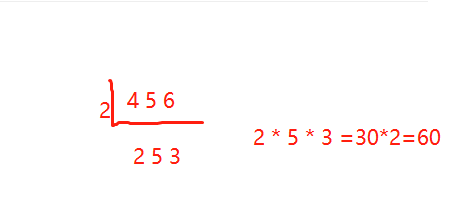

# 溶质不变浓度问题

## 给溶质 套公式

 无论溶液蒸发、稀释还是混合，溶质的质量都不改变。**抓住“溶质不变”解题。**当题干中没有出现具体的量时，可以赋值。别忘了解盐水问题还有“十字相乘”这把利器！ 

> 核心公式：浓度=溶质/溶液
>
> 
>
>   溶液=溶质+溶剂  **记住多加一个溶质 ，溶液的量也会发生变化**
>
> 

 例1.某盐溶液100克，加入20克水稀释，浓度变为50%，然后加入80克浓度为25%的盐溶液，求此时混合后的盐溶液浓度。 

120的一半是60     （60+20）/（100+20+80）=40%

例2 【2014国考 第62题】烧杯中装了100克浓度为10%的盐水。每次向该烧杯中加入**不超过**14克浓度为50%的盐水。问最少加多少次之后，烧杯中的盐水浓度能达到25%？(假设烧杯中盐水不会溢出)（ ） 

设最大为x 

(10+7x)/(100+14x)=1/4

40+28x=100+14x

​		10x=60  x=5

例3   (2013浙江)瓶中装有浓度为20%的酒精溶液1000克,现在又分别倒入200克和400克的A、B两种酒精溶液,瓶里的溶液浓度变为15%,已知A种酒精溶液的浓度是B种酒精溶液浓度的2倍。那么A种酒精溶液的浓度是多少?

A. 5%  B. 6% C. 8% D.  10%

$$
((1000  \times 0.2 )+200 X+200X ) \div 1000+200+400 =0.15
$$

> **本质还是根据公式去套** **对于这种题目 问什么就设什么为x**

## 未给溶质 设一个

例4.一个容器内有一定量盐水，第一次加入适量水后，容器内盐水浓度为3%，第二次加入同样多水后，容器内盐水浓度为2%，则第三次加入同样多水后盐水浓度是多少？

 分析：1.题干中未出现具体的质量值，可以赋值，赋值赋一个好算的

​      2.赋值溶质质量为6g，根据盐水浓度为3%可求得第一次加水后溶液的质量

​      3.根据溶质质量为6g和盐水浓度为2%，可求得第二次加水后溶液的质量

​      4.求出每次加水的质量

​      5.求解

# 十字相乘

## 原理 

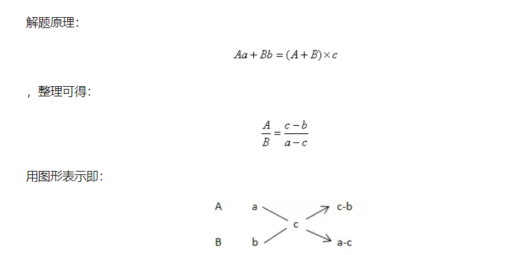

> 看到人数一般就是 十字相乘

例子: 某单位共有职工72人，年底考核平均分数为85分。根据考核分数，90分以上的职工评为优秀职工，已知优秀职工的平均分数为92分，其他职工的平均分数是80分，问优秀职工的人数是多少

一看就是混合类问题：根据题目列公式 

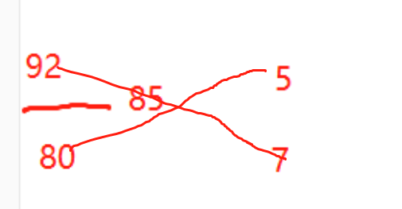

  12x=72 x=6  5x=30

 例: 某高校艺术学院分音乐系和美术系两个系，已知学校男生人数占总人数的30%，且音乐系男女生之比为1：3，美术系男女生人数之比为2：3，问音乐系和美术系的总人数之比为多少？ 

 分析：求总人数之比，则令总人数为公式里的C，列式：男生所占比例=男生人数/总人数 

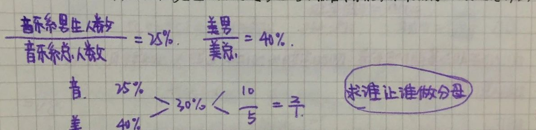

换个思路问： 求美术系和音乐系女生之比？

分析：求女生 那就是女生做分母    2/3  /   1/3     混合 3/7   = 2/5

## 二、适用题型

凡是满足Aa+Bb=（A+B)r=Ar+Br这一表达式的，均可使用十字交叉法。常见的有以下五个题型：

1.**溶液混合问题**——十字交叉得到的比例为混合前溶液的质量比

2.**分组平均数混合**——十字交叉得到的比例为两组数据的数量之比

3.**比例混合**——十字交叉得到的比例为两组数据的整体量之比

4.**利润率混合**——十字交叉得到的比例为混合前对应商品的销量之比

5.**增长率混合**——十字交叉得到的比例为两个年份的基期量之比

## 三、真题演示

### （一）溶液混合问题

*（16联考-8）甲、乙两个相同的杯子分别装满了浓度为20%和30%的两种溶液，将甲杯中倒出一半溶液，用乙杯中的溶液将甲杯加满混合，然后再将已经加满的甲杯中的溶液全部倒入一杯清水中且未溢出，溶液浓度变为20%。若该溶液密度与水完全相同，问原甲杯中溶液的质量是这杯清水质量的多少倍？*

*A.1 B.2 C.3 D.4*

**解析：**水可看作0%溶液。第一次甲乙混合后浓度为25%的溶液，与浓度为0%的水，混合后变为20%：

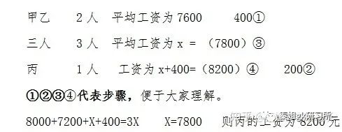

得到20%：5%=4:1。选D

*（16京-2）将1千克浓度为X的酒精，与2千克浓度为20%的酒精混合后，浓度变为0.6X。则X的值为？*

*A.50% B.48% C.45% D.40%*

**解析：**

得到0.6X-0.2X=20% X=50%。选A

*（19沪B-66）有一瓶浓度为15%的盐水500克，每次加入34克浓度为60%的盐水，则至少加（ ）次该盐水，使这瓶盐水的浓度超过30%。*

*A.6 B.7 C.8 D.9*

**解析：**若混合后浓度刚好为30%

十字交叉可得两种盐水的溶液之比=（60%-30%）：（30%-15%）=2:1。由此比例可得500克：X=2:1，因此X=250，因每次加入34克盐水，则250÷34≈7.4，可得至少加8次，选C

### （二）分组平均数混合

**公式：数量1×平均数1+数量2×平均数2=总数×总平均数**

*（17联A-19）甲乙两队举行智力抢答比赛，两队平均得分为92分，其中甲队平均得分为88分，乙队平均得分为94分，则甲乙两队人数之和可能是:*

*A.20 B.21 C.23 D.25*

**解析：**十字交叉

可得甲乙两队人数比=（94-92）：（92-88）=2：4=1：2，

那么甲：乙=1:2，则甲乙总人数为3的倍数，选B。

注意两个量的数量之比，分别对应对方的比例与整体比例之差。结合此题式子好好理解，可以省去写十字交叉的时间，熟练后可以直接心算。

*（18浙A-52）甲、乙和丙是同一公司的同事，甲工资为8000元/月，乙工资为7200元/月，丙工资比3人工资的平均值高400元/月。问丙的工资为多少元/月？*

*A、7800 B、8000 C、8200 D、8400*

**解析：**十字交叉——三人=甲乙+丙，设三人平均工资为X

8000+7200+X+400=3X 则X=7800 则丙的工资为8200元。选C

*（19省部-71、地市-67）某单位有2个处室，甲处室有12人，乙处室有20人。现在将甲处室最年轻的4人调入乙处室，则乙处室的平均年龄增加了1岁，甲处室的平均年龄增加了3岁。问在调动之前，两个处室的平均年龄相差多少岁？*

*A、8 B、12 C、14 D、15*

**解析：**设甲处室原平均年龄为a，乙处室原平均年龄为b，

故a-6=b+6 即a=b+12 则选B

### （三）利润率混合

十字交叉得到的比例为混合前对应商品的销量（销售数量）之比

*（17联A-14）商场以每件80元的价格购进了某品牌衬衫500件，并以每件120元的价格销售了400件，要达到盈利45%的预期目标，剩下的衬衫最多可以降价：*

*A.15元 B.16元 C.18元 D.20元*

**解析：**预期总利润=80×500×45%=18000元，前400件的利润=（120-80）×400=16000元，后100件的利润至少为18000-16000=2000元、每件利润20元，降价120-100=20元，选D

*（19苏A-51）某银行为一家小微企业提供了年利率分别为6％、7％的甲、乙两种贷款，期限均为一年。若两种货款的合计数额为400万元，企业需付利息总额为25万元，则乙种贷款的数额是：*

*A.100万元 B.120万元 C.130万元 D.150万元*

**解析：**十字交叉 甲：乙=（7%-6.25%）:（6.25%-6%）=3：1 则乙=400×1/4=100 选A

### （四）比例混合

*（16联考-17）某高校艺术学院分音乐系和美术系两个系别，已知学院男生人数占总人数的30%，且音乐系男女生人数之比为1：3，美术系男女生人数之比为2：3。问音乐系和美术系的总人数之比为多少？*

*A.5:2 B.5:1 C.3:1 D.2:1*

**解析：**凡含比例两部分混合均可用十字交叉法。注意比例要一致：

很简单，10%：5%=2:1，选D。

*（19苏B-65）某景区门票夏季打7折、冬季打3折，对8岁及以下儿童免门票，车20元/人次，游乐设施10元/人次。小朱去年夏季和冬季都带4岁的儿子去该景区1次，每次都陪孩子坐车1次、让孩子玩游乐设施1次。若他们两人夏季在该景区的游玩费用比冬季多50％，则该景区门票的全价是：*

*A.100元 B.90元 C.80元 D.60元*

**解析：**设门票全价为a，则0.3a×7/3+50×1=（0.3a+50）×3/2

十字交叉，得0.3a：50=(1/2):(5/6)=3:5 故a=100 则A

3/2-1=1/2 7/3-3/2=5/6

*（18B-5）小张家养了一只大狗和一只小狗。现在，小狗的体重只有大狗的一半。如果两只狗的体重各增加5千克，那么小狗的体重将达到大狗的60%。据此可知，若两只狗的体重各增加10千克，小狗、大狗的体重比将会是：*

*A.1:2 B.2:3 C.3:4 D.4:5*

**解析：**大狗前量×（小狗/大狗）+大狗增量×（小狗增量/大狗增量）=大狗现量×（小狗现量/大狗现量）

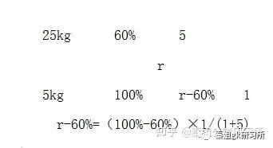

另外

得到r-60%=（100%-60%）×1/(1+5) 选B

### （五）增长率混合

十字交叉得到的比例为两个年份的基期量之比

*（19浙A-12）小张去年底获得一笔总额不超过5万的奖金，她将其中的60%用来储蓄，剩下的用来购买理财产品，一年后这笔奖金增值了5%。已知储蓄的奖金增值了3.3%，问购买理财产品的奖金增值了多少？*

*A、5.35% B、6.45% C、7.55% D、8.65%*

**解析：**

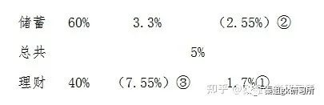

选C

*（19浙A-73）某企业四个分公司今年的销售额之和是去年的1.2倍。其中，甲分公司的销售额增长了50%，乙分公司的销售额与去年相同，丙和丁分公司的销售额均增长了25%。已知去年甲、丙、丁三个分公司的销售额之比为2：3：5，则乙分公司今年的销售额占4个分公司总量的：*

*A.1/3 B.2/7 C.4/13 D.5/18*

**解析：**设甲、丙、丁去年分别为8、12、20，则今年分别为12、15、25。（40+a）×1.2=a+52 a=20 20/72=5/18。选D

*（15鲁-53）某市制定了峰谷分时电价方案，峰时电价为原电价的110%，谷时电价为原电价的八折，小静家六月用电400度，其中峰时用电210度，谷时用电190度，实行峰谷分时电价调整方案后小静家用电成本为调整前的多少？*

*A、95.75% B、87.25% C、90.5% D、85.5%*

**解析：**更靠近量大的，选A

# 周期循环

周期循环是指事物的某一特征按照一定规律反复出现，从第一次开始到结束为一个周期

+ 自己总结周期或者循环，然后推测某一位置的情况
+ 和星期相关的周期问题，难点在于根据已知的‘’某日是星期x ‘去确定 另外一个日期是星期几

##   **求某年某月某日是周几问题** 

> 平年365 闰年366（2月29）

例1：2012年3月份的最后一天是星期六，则2013年3月的最后一天是星期几？

平年：365=52周+1 

闰年：366=52周+2

但是考试会这么考试吗？肯定不会啊。我们看下面的例子

2020.1.16 是周四，那么2020.4.20是？

>  解题步骤：（1）先粗算 （2）后修正 （3）加日期差
>
> 粗算即按每个月都是30天计算，修正的时候再进行大月小月的加减

2020.1.16 -2020.4.16 是30*3

1月份31    +1 

2月份29   -1 

3月份 31 + 1

=30*3+1+4=95/7=13....4  周4+4=周一

来在随便出一题，2023.4.20是周三 问2023.5.25是周几?

##  **每隔3天就是每4天** 

+ [2016年江苏省第67题]小明、小红、小桃三人定期到某棋馆学围棋,小明每隔3天去一次,小红每隔4天去一次,小桃每隔5天去一次。若2016年2月10日,三人恰好在棋馆相遇,则下次三人在棋馆相遇的日期是( )。 

 小明每4天去一次，小红每5天去一次，小桃每6天去一次，下次同时去应该是经过4、5、6的最小公倍数的天数以后。4、5、6的最小公倍数为60。那么接下来我们就可以将选项代入，求出来经过的天数刚好为60天则为正确选项。比如代入B选项，经过的天数=月份差×30+修正+日期差=(4-2)×30-1+1+(11-10)=61天，代入B选项多了一天，则需要往前推一天，即2016年4月10号。因此，选择D选项。 

## 周期问题求最值

> 余数问题决定大小

+ 列子： 某新建小区计划在小区主干道两侧种植银杏树和梧桐树绿化环境，一侧每隔3棵银杏树种一棵梧桐树，另一侧每隔4棵梧桐树种1棵银杏树，最终两侧各种植了35棵树，问最多栽种了多少棵银杏树？（ ） 

## 一个月有几个工作日

+ 【2013国考69题】根据国务院办公厅部分节假日安排的通知，某年8月份有22个工作日。

  当年的8月1日可能是周几？

  (A)周一或周三

  (B)周三或周日

  (C)周一或周四

  (D)周四或周日

  31- 7*4=3 天  剩下的3天肯定有2天工作日 选d

+ 小王在每周的周一和周三值夜班，某月他共值夜班10次，则下月他第一次值夜班可能是几号？    （       ）

  A.2

  B.3

  C.4

  D.5

  

  答案：D

  析：四周值班八次，多出的两次至少需要三天，所以最后三天分别为周一、周二、周三，则下个月的1号为周四，下个月的第一个周一为5号，选D

# 牛吃草问题/消长问题

**牛吃草问题又称为消长问题或牛顿问题**，草在不断生长且生长速度固定不变，牛在不断吃草且每头牛每天吃的草量相同，供不同数量的牛吃，需要用不同的时间，给出牛的数量，求时间。带大家把牛吃草问题转化为相遇或追及模型来考虑。

>  一片草地上有牛在吃草，牛一边吃草一边长，
>
>  花生老师设定的是总有一部分牛在**吃草原上的原有草，称之为干活牛**；
>
>  一部分牛一直在**吃新长出来的草，称之为白给牛**。（白吃牛+干活牛=牛的总数） 
>
>  核心公式：
>
>  1. **每日草的生长量=白吃牛的数量=（牛的数量 * 吃草时间1－牛的数量 * 吃草时间2）/时间差**  
>  2. **原有草- 干活牛*时间** 
>  3. **时间= 原有草/干活牛** 

我们来看一个例子：

某河段中的沉积河沙可供80人连续开采6个月或60人连续开采10个月。如果要保证该河段河沙不被开采枯竭，问最多可供多少人进行连续不间断的开采?(假定该河段河沙沉积的速度相对稳定) 

​	解析：白吃牛的数量=（牛的数量 * 吃草时间1－牛的数量 * 吃草时间2）/时间差  

60 * 10-80 * 6= 320/4=30

也可以列方程

设原有河沙量为y，每月沉积河沙量为x，根据80人连续开采6个月，可得y=(80-x)×6，根据60人连续开采10个月，可得y=(60-x)×10，解得x=30，y=300。

若要不被开采枯竭，每月开采量=每月沉积量，故最多可供30人进行连续不间断的开采。

我们来扩展下这个题目： 问原来这个河沙有多少堆积？

> **原有草- 干活牛*时间** 
>
> （80-30）*6=300  或者 （60-30） *  10=300

我们来扩展下这个题目： 100个人需要挖多久？ 记住 永远是有白吃牛的！！

> **时间= 原有草/干活牛** 
>
> 300/（100-30）30/7=45天

# 容斥问题

## 基本概念

容斥问题即包含与排斥问题，它是一种计数问题。在计数时，几个计数部分有重复包含时，为了不重复计数，应从他们的和中排除重复部分，采用这种计数方法的题型称为容斥问题。

举个例子。幼儿园的小朋友准备六一儿童节的表演节目。参加合唱的有20个，参加舞蹈的有12个，参加朗诵的有25个，既参加合唱又参加舞蹈的有6个，既参加舞蹈又参加朗诵的有9个，既参加合唱又参加朗诵的有14个，三个节目都参加的有3个，三个节目都不参加的有2个，请问这个班级总共有多少个小朋友？

这就是在一堆集合之间，它们有相互交融的地方，又有相互排斥的地方，就几个集合之间又有重复的，又有相互独立的部分，这一类叫做容斥类问题。

## 核心公式

全部人数 -不符合人数=各部分人数和 减去重复部分

> 核心思想：人只能被计算一次

+ 2集合
  + 二集合公式A+B-只满足两个条件的个数
+ 3集合问题
  + 三集合公式A+B+C-只满足两个条件的个数-2三个条件都满足的个数 

+ 注意
  + 既喜欢A又喜欢B 和 既喜欢B又喜欢C   和 既喜欢C又喜欢A 其实是任一集合交接的地方
  + 只喜欢2个集合及以上的人数是对 集合重复部门的总人数   注意这一点区别

## 例题

1.  有70名学生参加数学、语文考试,数学考试得60分以上的有56人,语文考试得60分以上的有62人,都不及格的有4人,则两门考试都得60分以上的有多少人?( ) 

   

   直接套公式：70-4=56+62 -X  ->x=12

   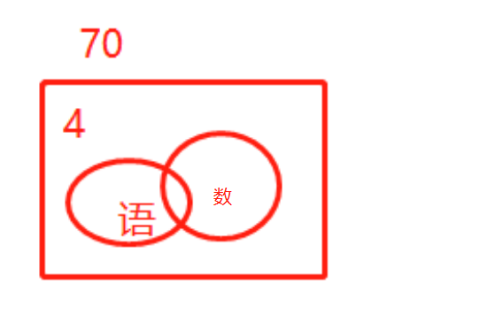

2.   工厂组织工人参加技能培训，参加车工培训的有17人，参加钳工培训的有16人，参加铸工培训的有14人，参加两项及以上培训的人占参加培训总人数的2/3，三项培训都参加的有2人，问总共有多少人参加了培训？ 

​        设总人数为3x

​     3x=17+16+14-（2x-2）-2*2  ->3x=27  

​    这里为什么是 2*2 因为在三个集合里面都被加上了，所以减去的数量要  *  2

>  三集合公式A+B+C-只满足两个条件的个数-2三个条件都满足的个数 
3. 针对100名旅游爱好者进行调查发现，28人喜欢泰山，30人喜欢华山，42人喜欢[黄山](http://huangshan.huatu.com/)，8人既喜欢黄山又喜欢华山，10人既喜欢泰山又喜欢黄山，5人既喜欢华山又喜欢黄山，3人喜欢这三个景点，则不喜欢这三个景点中任何一个的有( )人。

​     注意既喜欢和只喜欢的区别

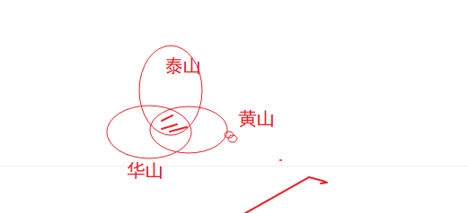

  28+30+42-10-5-3+3 
因为2个都喜欢的全部都减去了，所以最后要加3个公共的

4. （联考江西2018-77）某高校做有关碎片化学习的问卷调查，问卷回收率为90%，在调查对象中有180人会利用网络课程进行学习，200人利用书本进行学习，100人利用移动设备进行碎片化学习，同时使用三种方式学习的有50人，同时使用两种学习方式的有20人，不存在三种学习都不用的人。那么这次共发放了多少份问卷？

   分析：	注意题目问的是共发放了多少份问卷

   180+200+100-20-50*2=360
   360/0.9=400

# 最值

## 最值-最不利极限提概述

原理： 抽屉原理

常见问法：至少有多少小球才能保证每盒子中有5个

解题思路：当前抽屉列出最不利情况+1

常见错误：忘记小抽屉

>  小抽屉+正常抽屉*  不利情况  +1

### 列题

1. 【2012国考66题】有300名求职者参加高端人才专场招聘会，其中软件设计类、市场营销类、财务管理类和人力资源类分别有100、80、70、50人。至少有多少人找到工作，才能保证一定有70名找到工作的人专业相同?
   （A）71
   （B）119
   （C）258
   （D）277

   **「保证一定有70名找到工作的人专业相同」意味着在这之前，所有专业都有69人找到工作了（不足69人则占满位置即可），此时再加1人即可。**

   50+69*3+1 尾数法 c

2. 在2011年世界产权组织公布的公司全球专利申请排名中，中国中兴公司提交了2826项专利申请，日本松下公司申请了2463项，中国华为公司申请了1831项，分别排名前3位，从这三个公司申请的专利中至少拿出多少项专利，才能保证拿出的专利一定有2110项是同一公司申请的专利？

   1831+2109*3=

3. 某单位五个处室分别有职工5、8、18、21和22人，现有一项工作要从该单位随机抽调若干人，问至少要抽调多少人，才能保证抽调的人中一定有两个处室的人数和超过15人？（ ）
   A、34B、35C、36D、37

   **注意这里问的是2个抽屉！！**

   15/2=7....

   5+8+3*7+1=15

## **最值-和定最值问题**-重点

和定最值，顾名思义在和为定值的情况下求某一元素的极限情况

​	这种题目要本着要想其中一个数尽可能大/小，则其余的数尽可能的小/大，并且有个固定的解题方法，分为三步，

	+ 第一步排序定位，
	+ 第二步反向构造数列，
	+ 第三步加和求解
+ 注意
  + 解方程解出来的结果如果不是整数应该如何取舍，此时的取舍并非四舍五入**，而是问至多则向下取整，问至少则向上取整**
  + 看题目要求的数量是是否有 **各不相同**

### 列题

1. 5名学生参加某学科竞赛，共得91分，已知每人得分**各不相同**，且最高是21分，则最低分至少是：

   分析:

    1. 题目问最低，反过来其他人就是最高
    2. 每人得分各不相同
    3. 5名学生 91 分
    4. 且最高是21分
s
   设当前最低分x

   21+20+19+18+x=91 ->x=13

2. 现有21本故事书要分给5个人阅读，如果每个人得到的**数量均不相同**，那么得到故事书**数量最多**的人**至少**可以得到（ ）本。

   x+(x-1)+(x-2)+(x-3)+(x-4)=21

   ​		5x=31 x=6.2

   **至少 x>=6.2 那就是7**

3. 一学生在期末考试中6门课成绩的平均分为92.5分，且6门课的成绩是**互不相同**的整数，最高分是99分，最低分是76分，则按分数从高到低居第三的那门课至少得分为( )。

   ​			99+98+x+x-1+x-2+76=92.5*6 ->x=95

4. 某连锁企业在10个城市共有100家专卖店，每个**城市的专卖店数量都不同**。如果专卖店数量排名第5多的城市有12家专卖店，那么专卖店数量排名最后的城市，**最多**有几家专卖店?

   最多有几家，那么其他城市就最少，有因为给了中间这个城市12

   12+13+14+15+16+x+x-1+x-2+x-3+x-4=100

   x-> 4

5. 某贸易公司有三个销售部门，全年分别销售某种重型机械38台、49台和35台，问该公司当年销售该重型机械数量最多的月份，至少卖出了多少台？

   注意 题目没有谁 **不相同！！！**

   12x=38+49+35

   12x=122

   至少 x>=10... 那就是11

6. （2015陕西）植树节到来之际，120人参加义务植树活动，共分成**人数不等**且每组不少于10人的6个小组，每人只能参加一个小组，则参加人数第二多的组最多有多少人：

   ​	问人数第二多 那么反过来其他组的就要足够少，又因为每组不少于10人

   10+11+12+13+x+x+1=-120

   x=36.5   最多 x<=36.5  x=36

## 最值-函数最值

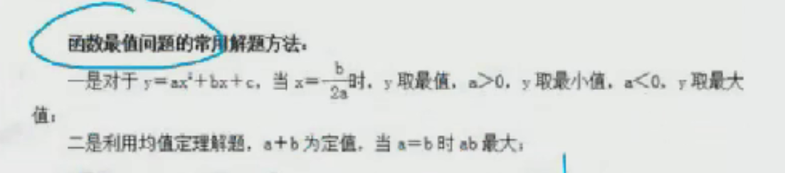

### 列题

1. 某苗木公司准备出售一批苗木，如果每株以4元出售，可卖出20万株，若苗木单价每提高0.4元，就会少卖10000株，问在最佳定价的情况下，该公司最大收入是多少万元？

   收入=单价*数量

   设最大收入y 单价提高x  

   y=（4*0.4x） *  ( 20-x)

   + 第一种 y=80+4x-0.4x的平方   x=4/0.8=5
   + 第二种 x1=-10  x2=20    (x1+x2)/2=5

2. 某报刊以每本2元价格发行,可发行10万份,若该报刊单价提高0.2元,发行量减少5000份,则该报刊可能的最大销售收入为多少万元?

   y=(2+0.2x)(10000-5000x)    ->(-10+20)/2=5

   ​		代入的 3*7.5=22.5

3. 某汽车租赁公司有200辆同型号的汽车，每辆车的日租金为100元时可全部租出;当每辆车的日租金增加5元时，未租出的汽车就会多4辆，租出的车每天需要维护费20元。每辆车的日租金为多少时，租赁公司的日收益最大?

   ​	设日租金增加5x元，那么未租出的汽车多4x辆，日收益为y，根据题意可得：

   ​		y=(100+5x-20)* (200-4x)

   ​	   x=17 

   100+17*5=185

4. 

## 最值-三端最值

常用思路： 要想2端的某一端最多/最少，**2端都应尽量多/少**

1. 一个班级组织跑步比赛，共设100米、200米、400米三个项目。班级有50人，报名参加100米比赛的有27人，参加200米比赛的有25人，参加400米比赛的有21人。如果每人最多只能报名参加2项比赛，那么该班最多有多少人未报名参赛?

   

   第一步，判断本题为容斥问题，需要结合最值思维解题。第二步，班级总数为50人，**要想使未报名的最多，反向构造报名的人数最少**。**报名人次一定，则需要每人报名次数最多。由题意每人都可以最多报名2项**，那么报名人数最少为(27+25+21)÷2=36.5，最少36.5，取整为37人。第三步，未报名人数为50-37=13人。因此，选择 C 选项。

2. 有10元、20元、50元面值的钞票共10张，总额为250元。问10元的钞票最多有多少张?

   ​	3*50+10x+20y=250

   ​	x+y=7

3. 有甲、乙、丙三种盐水，浓度分别为5%、8%、9%，质量分别为60克、60克、47克，若用这三种盐水配置浓度为7%的盐水100克，则甲种盐水最多可用：

   A . 49克
   B . 39克
   C . 35克
   D . 50克

   分析： 要想甲最多 丙应该也要最多

   先用甲 丙构造浓度为7%

   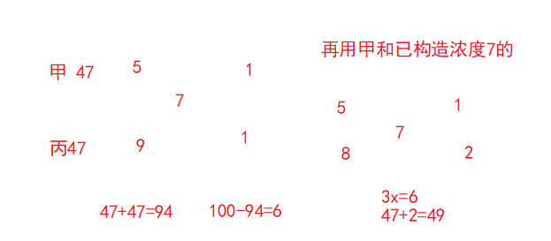

# 排列组合 -必考

## 基本定义

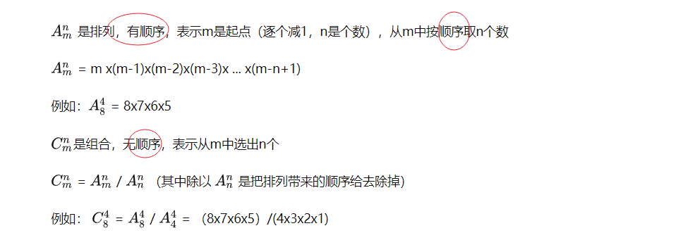

+  加法原理-分类计算

完成一件事情有n类方法，第一类有 m1 种方法，第二类有 m2 种方法，……，第n类有 mn 种方法，那么完成这件事总共有 m1+m2 +……+ mn 种方法。

+ 乘法原理-分布计算

完成一件事请需要n步，第一步有 m1 种方法，第二步有 m2 种方法，……，第n步有 mn 种方法，那么完成这件事总共有 m1∗m2 *……* mn 种方法

## 解题思路

有序为排列，无序为组合

分类用加法、分步用乘法、

从特殊入手 ，全部减不符（至少 否定）

> 至少
>
> 有3行测 5申论，奖励同学三本书，同学至少选择一本申论的情况有多少种？
>
> 正面思维：x>=1 那么x可能为1 2  3    
>
> ​			x=1 C(5,1)*C(3,2)  
>
> ​             x=2 C(5,2)*C(3,1)
>
> ​              x=3 C(5,3)
>
> 反向思维：x>=1 反过来就是一本申论都不选，用总的C(8,2)-C(3,3)
>
> 一般情况情况比较多都是用反向思维进行减法，但是问题的关键要找到这个反向思维的情况，这个我们后面具体练习

我们看下例题

1. 小凯家住在A区，但在B区上学，每天上学必须经过河上的一座桥。小凯从他家到这座桥有若干不同的路可走，而从这座桥到学校可走的路要比从他家到这座桥的路多3条，这样他从家出发经过这座桥到学校共有40种沿不同路线的走法。则小凯从家到这座桥有（）条不同的路。

   

2. 某单位要从8名职员中选派4人去总公司参加培训，其中甲和乙两人不能同时参加。问有多少种选派方法

   

   甲和乙两人不能同时参加的反向是什么？**甲和乙两人同时参加**

   总人数下C(8,4)-C(6,2)=70-15

3. 某宾馆有6个空房间，3间在一楼，3间在二楼。现有4名客人要入住，每人都住单间，都优先选择一楼房间。问宾馆共有多少种安排？（）

   正常思路是不是先选房间，在安排人住进去

   一楼：选三个房间给4个人住 C (4，3) * A(3,3)

   二楼：随便选一个房间 C(3,1)

4. 、某次专业技能大赛有来自A科室的4名职工和来自B科室的2名职工参加，结果有3人获奖且每人的成绩均不相同。如果获奖者中最多只有1人来自B科室，那么获奖者的名单和名次顺序有多少种不同的可能性？

     正常思路是不是先选人在排序 

    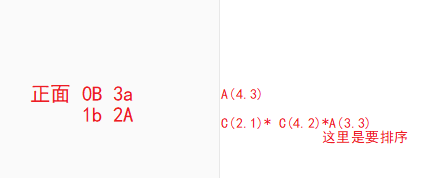

   反面思路：

   ​	最多只有1人来自B科室 那么反过来  就是2B 1A

   【C(6.3)-C(4.1)】A(3.3)

   先选人  在排序

   

## 相邻-捆绑法

   把相邻的元素合并为一个元素，在与其他进行排列，同时合并元素也要进行排列

   注意：总元素改变、内部排序

   

1. 7人站成一排，其中甲乙相邻且丙丁相邻，共有多少种排法

      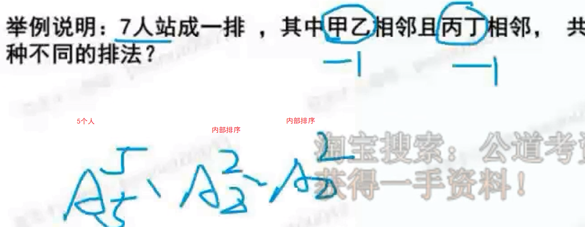

   2.  为加强机关文化建设，某机关在系统内举办演讲比赛，3个部门分别派出3、2、4名选手参加比赛，要求每个部门的参赛选手比赛顺序必须相连，问不同参赛顺序的种数在以下哪个区间之内?

       部门必须相连，这不就是捆绑吗

       我们先排部门 3A3 

       在排部门内部  3A3 * 3A3   * 4A4 

       6×6×2×24=72×24

3. 某市举办经济建设成就展，计划在六月上旬组织5个单位参观，其中一个单位由于人数较多，需要连续参观2天，其他4个单位只需参观1天。若每天最多只能安排一个单位参观，则参观的时间安排共有多少种：

   注意单位连续捆绑   9A5=9*8*7*6*5*4*3*2*1

## 不相邻-插空法

**先将没有位置要求的元素排列好，在将指定的不相邻的元素插入已排好元素的间隙或2端位置**

1. 若有ABCDE 5个人进行排队、要求A和B必须不站在一起，则有多少

​      先把CDE进行排列，A(3.3)  会产生4个空隙，在4个空隙里面选2个A(4,2)

2. 某人射击8枪，命中4枪，4枪命中恰好有3枪连在一起的情况有多少。

   我们先排没有命中的4枪，有 5个空隙，4枪命中恰好有3枪连在一起 看作2个个体

   A(5.2)

3. 某道路旁有10盏路灯，为节约用电，准备关掉其中3盏。已知两端的路灯不能关，并且关掉的灯不能相邻，则有（）种不同的关灯方法。

   这种就是插空法

   先排列7个亮灯 共有8个空隙，但是题目要求并能在2端，所以只有6个空

   也就是在6个空中选2个，有没有顺序呢？没有 所以就是 6C2

4. 某市至旱季水源不足，自来水公司计划在下周七天内选择两天停止供水，若要求停水的两天不相连，则自来水公司共有（）种停水方案。

   首先确定停水的是有位置要求的，那么先把不停水的进行排列

   共有5天，会产生6个间隙，那么在6天中插入

   6C2=15

## 定序问题

先全排列，在**除掉**定序元素的全排列

注意：到底是顺序还是不相邻

1. 7人排队，其中甲乙丙3人顺序一定，一共有多少种不同的排法

   ​	A(7.7)/A(3.3)=7*6*5*4

2. 某工程队有6项工程需要先后单独完成，其中工程乙必须在工程甲完成后才能进行，工程丙必须在工程乙完成后才能进行，又工程丁必须在工程丙完成后立即进行，那么安排这6项工程的不同排法种数是

   顺序是不 A B CD  注意CD是绑在一起的

   所以答案是A(5,5)/A(3,3)

3. 一张节目表上原有3个节目，如果保持这3个节目的相对顺序不变，再添进去2个新节目，有多少种安排方法：

   ​	直接套公式 5a5/3a3=20

## 全错位排序

全错位排序只用记住 1 2 3 4 5 6 各有 0 1 2 9 44 265

1. 5个瓶子都贴了标签，其中恰好贴错三个

​    先从5个瓶子种选择3个，5c3*（3对应的是2）=5 * 4 * 2

2. 四位厨师各做了一道拿手菜，现在要求每个人去品尝一道菜，不能是自己的

   4对应的是9  直接选9即可

## 环形排序

n个不同的元素做成环形排列，共有 n-1种排法

1. 8人围桌而坐，共有多少种坐法。

   ​	8-1=7

## 平均分堆问题

1. 把A B C D E F 6本不同的书分成三堆，有几种不同的分法？

   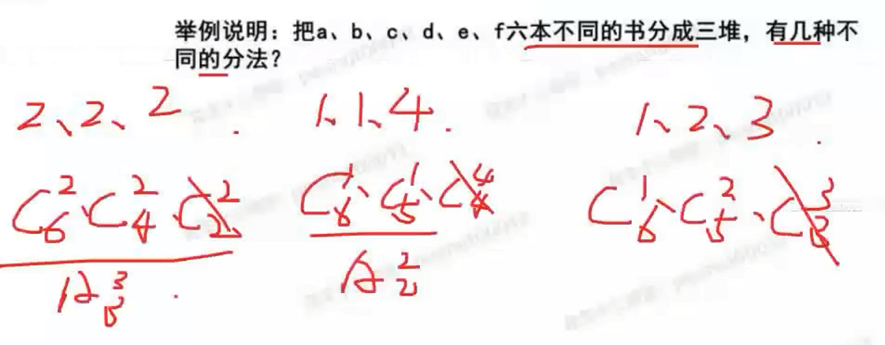

   为什么前面2个要除呢 因为认为给排序了，所以要分别除 3  2 

   最后一个为什么不除 因为

## 相同元素分配问题

利用插板法，解决相关元素分配问题

9个苹果分给3个人，那就是要分成3堆，一字排开，中间插入**2个板**，苹果就被分隔成3堆。

每个人至少分得1个，**所以板不能放在苹果之外，只能在苹果与苹果之间。**

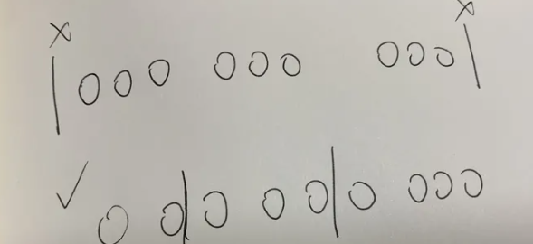

**就是从9个苹果形成的8个空，挑2个插入板，苹果就被分成3堆。**

答案是C82=28种。

注意：插板法的使用必须满足两个条件

**1.元素相同**

在这题里面，用的是苹果。物品，如果不加解释说明，我们一般认为是相同的，比如分计算机、分书本等。但是笔记本、台式机或者语文书、数学书，就不能视为同一种物品。

**2.每堆至少一个**

也就是不存在分给的对象得到0个这种情况，至少得分到1个。

满足这两个条件，我们可以采用插板法。

参考知乎链接：https://www.zhihu.com/question/422265718

1. 9个相同的球，装三个盒子，每个盒子至少一个有多少种装法？

   是不是很简单，8C2

   题目改为每个盒子至少装2个有多少装法呢？

   先给每个盒子一个球，还剩下6个求，5C2

# 概率

概率公式：符合要求/全部

其实就是排列组合的延申

## 几何概型-了解

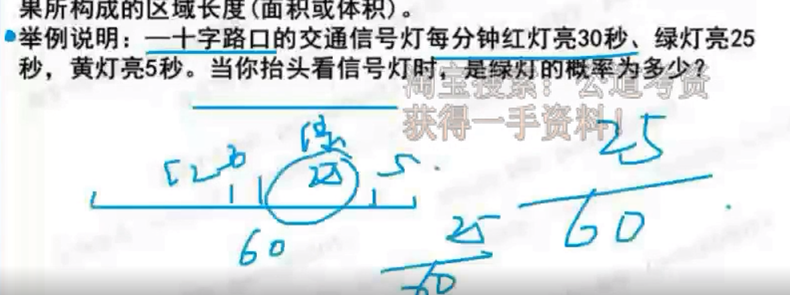

## 列题

1.  从分别写有数字1，2，3，4，5的5张卡片中任取两张，把第一张卡片上的数字作为十位数，第二张卡片上的数字作为个位数，组成一个两位数。则组成的数是偶数的概率是：

   ​	首先分析 取卡片有没有顺序？有。什么是偶数？能被2整除的。

      那就直接套公式了 

   1. 要组成偶数，则个位数字必须为偶数。先从2个偶数中选1个作为个位 2C1

   2. 再从剩下的4个数中任取1个作为十位 4C1

   3. 故满足条件的情况数有2×4=8（种），总的情况数为 5A2

2. 某房间共有6扇门，甲、乙、丙三人分别从任一扇门进去，再从剩下的5扇门中的任一扇出来，问甲未经过1号门，且乙未经过2号门，且丙未经过3号门进出的概率为多少？

   甲没有经过1号门的概率为 5*4/6*5=2/3 

   2/3 *  2/3 * 2/3=8/27

3. 小王开车上班需经过4个交通路口，假设经过每个路口遇到红灯的概率分别为0.1、0.2、0.25、0.4，则他上班经过4个路口至少有一处遇到绿灯的概率是∶

   逆向思维，**至少有一处**遇到绿灯的概率＝1－全是红灯的概率，即所求概率为1－0.1×0.2×0.25×0.4＝0.998。

   　　因此，选择D选项。

4. 

# 参考资料

+ https://mp.weixin.qq.com/mp/appmsgalbum?__biz=Mzk0ODM5Mzg1OQ==&action=getalbum&album_id=2526910158070071297&scene=173&from_msgid=2247483662&from_itemidx=1&count=3&nolastread=1#wechat_redirect
+ 花生十三

