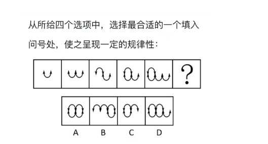
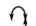
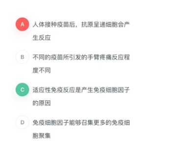
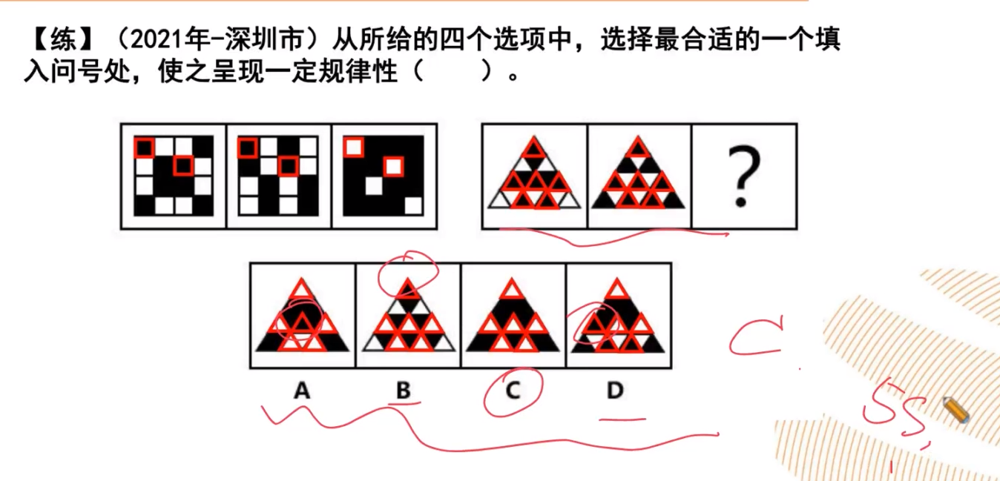
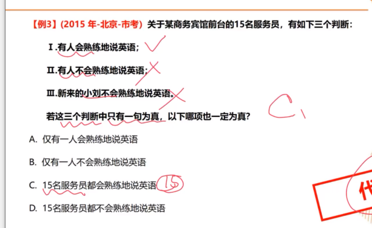
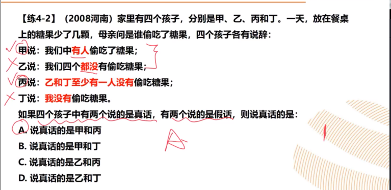

# Table of Contents

* [图形推理](#图形推理)
* [类比推理](#类比推理)
  * [常见题型](#常见题型)
  * [解题思路](#解题思路)
  * [语义关系](#语义关系)
  * [语法关系](#语法关系)
  * [逻辑关系](#逻辑关系)
  * [类比推理的解题方法](#类比推理的解题方法)
  * [例题](#例题)
  * [注意](#注意)
* [定义判断](#定义判断)
  * [列题](#列题)
* [逻辑判断](#逻辑判断)
  * [翻译推理](#翻译推理)
    * [什么是真言命题和假言命题](#什么是真言命题和假言命题)
    * [理解充分必要条件](#理解充分必要条件)
    * [**4个基本单句翻译**](#4个基本单句翻译)
    * [复句推理](#复句推理)
    * [假言命题](#假言命题)
    * [**选言与假言命题互换**](#选言与假言命题互换)
    * [推理规则（复句）-重点](#推理规则复句-重点)
    * [确定信息](#确定信息)
    * [**二难推理**](#二难推理)
  * [真假推理](#真假推理)
* [单定义-其他句式](#单定义-其他句式)
* [数量规律](#数量规律)
* [搭桥](#搭桥)
* [最大信息](#最大信息)
* [削弱](#削弱)
* [图形](#图形)
  * [位置](#位置)
  * [叠加](#叠加)
  * [对称](#对称)
* [拆解法](#拆解法)
  * [2个有的找名句，反着说，人称变所有](#2个有的找名句反着说人称变所有)
  * [2真2假2个人，找矛盾，2为真](#2真2假2个人找矛盾2为真)
* [参考资料](#参考资料)


判断推理题型

+ 判断

  肯定或否定某事物的存在，或指明它是否具有某种属性的思维过程。

+ 推理

  从一个或几个已有的判断得出另一个新判断的形式


# 图形推理


# 类比推理

## 常见题型

1.两词型：A:B

2.三词型：A:B:C

3.填空型：A对于（　）相当于（　）对于B


## 解题思路

+ 两词型和三词型题目需要**先判断题干**中词语的关系，**再确定选项**中的词语关系，最后套入逻辑关系。

+ 填空型题目**将选项代入题干**，判断前后词语间关系是否一致。

+ 在类比推理中，常考的关系包含：**语义关系、语法关系和逻辑关系**。


## 语义关系

+ 近反义

  + 近义关系：【国泰民安：河清海晏】【顿悟：醍醐灌顶】

  + 反义关系：【声色俱厉：和颜悦色】

  + 二级辨析：褒义、贬义、中性

    > **褒义词：是词性带有赞许，肯定感情的词 贬义词：是词义带有贬斥、否定、憎恨、轻蔑感情色彩的词。 中性词**：中性词是针对词语的感情色彩而言的，不仅仅是形容词，动词、名词都可以，它专指褒义、贬义词语之外不能体现特殊情感倾向的词，即中性感情色彩的词语。

+ 比喻、象征：【优雅：天鹅】


## 语法关系

> 一般来说，主语是指一个句子所陈述的对象，比如做了某事的人，比如具有某种性质的东西。而对于这个主语进行陈述的部分，我们称之为“谓语”，为了分析简便，有人会把谓语中的中心动词，也就是谓语部分中起决定作用的动词称为谓语，或者谓语动词，把谓语动词所支配的部分称为宾语。如“我打了他”中的“他”就是“打”的宾语。
>
> 定语，是指一个句子或者短语中对名词进行修饰的部分，比如红色的苹果，红色就是定语，而“的”字是定语的标记，有时可以省略。
>
> 状语，一般是指一个句子或者短语中对动词进行修饰的部分，位于动词之前，比如狠狠地打，狠狠就是状语，而“地”字是状语的标记，在少数情况下可以省略。
>
> 补语，一般是指一个句子或者短语中对于动词进行补充说明的部分，描述动作的结果、程度，位于动词之后，比如开得快，快就是补语，“得”是补语标记，一般不省略。

+ 主谓关系

+ 动宾关系

+ 主宾关系

+ 偏正结构

  > [偏正结构](https://zhidao.baidu.com/search?word=偏正结构&fr=iknow_pc_qb_highlight)是由修饰语和[中心语](https://zhidao.baidu.com/search?word=中心语&fr=iknow_pc_qb_highlight)组成，结构成分之间有修饰与被修饰关系的短语；动词、名词、形容词与它们前面起修饰作用的成份组成的短语。名词前的修饰成份是定语；定语（状语）和中心语的关系是偏和正的关系；[偏正短语](https://zhidao.baidu.com/search?word=偏正短语&fr=iknow_pc_qb_highlight)包括定中短语与状中短语。


## 逻辑关系

可用花圆圈表示的一类关系，包括

+ 全同

  所有的A是B，并且所有的B是A

+ 并列

  + 矛盾（非此及彼）
  + 反对关系（存在小三）

+ 包含

  + 种属 ： A是B
  + 组成 ：A是B的一部分

+ 交叉关系：从不同角度描述同一类事 有人就是报案人也是嫌疑人

+ 对应关系

  + 功能：[净水器：除杂质]
  + 时间顺序：[下单：付款：送货]


   


## 类比推理的解题方法

一个很有意思的类比推理题目的解题方法：**剥洋葱法**，将类比推理词语之间的逻辑关系分层级，类似于洋葱的多层皮。在做题时，一层一层套入逻辑关系，无法确定答案时，再套入下一层的逻辑关系。

其中，洋葱的最外层为题干前后词语之间的逻辑关系，中层为一组词语中，某个元素内部的逻辑关系，个别情况下会考查词语的总体性质、感情色彩等。

另外，近义词和反义词的考查虽然只有一层逻辑，类似于言语理解，属于较难的题目。


## 例题
我们来看看例题

1. 分母︰除数 --全同

   ```
   A．内角︰外角　　B．加减法︰乘除法　　C．横坐标︰纵坐标　　D．百分比︰百分率
   
   分析：分母︰除数 二者是全同关系 
   A 不是 B 不是 C 不是 D是 
   ```

2. 番茄之于（）相当于（）之于蹴鞠 --并列

   ```
   A.美洲；中国  
   
   B.白菜；篮球  并列关系
   
   C.植物；人类
   
   D.炒饭；健身
   ```

3. 有形损耗：无形损耗 --并列-矛盾

   ```
   分析题目是什么关系？有形和无形之外，是不是没有第三者了？ 那就是 并列-矛盾
   A.中国哲学：西方哲学   还有其他哲学
   B.蒸馏酒：葡萄酒      蒸馏酒是需要通过蒸馏工艺的酒，葡萄酒是以葡萄为原材料制作的酒，二者是从不同方面区分酒的，有的蒸馏酒是葡萄酒，有的葡萄酒是蒸馏酒，二者为交叉关系
   C.急性中毒：慢性中毒   二者都是中毒的一种，并且除了急性中毒就是慢性中毒，二者为矛盾关系
   D.有色金属：稀有金属   有色 无色 稀有 不稀有？ 有色金属可分为重金属、轻金属、贵金属及稀有金属，所以稀有金属是有色金属的一种，二者为种属关系
   ```

4. 儿童读物∶启蒙读物--包含

   ```
   启蒙读物是教育儿童的读物，属于儿童读物，为种属关系。
   
   A、连续变量∶离散变量   并列？
    B、刑事诉讼∶民事诉讼  并列？
    C、生产资料∶生活资料  
    D、一类疫苗∶麻疹疫苗   直接选
   ```

5.  有理数∶无理数∶实数--包含

   ```
   　题干词语间逻辑关系：有理数是有限小数及无限循环小数，无理数是无限不循环小数，实数分为有理数和无理数，因此前两者之间是矛盾关系，前两者和第三者之间是包容关系。 这种题目好恶心
   A.洋房∶楼房∶房屋
   B.阴刻∶阳刻∶雕刻
   C.西汉∶东汉∶汉朝   直接选
   D.西欧∶东欧∶欧洲
   ```


## 注意

1. 题目种出现 烟花：爆竹 那么选项中也必须是2个事物


# 定义判断 

**定义判断**主要考查考生运用给定标准定义进行判断的能力。. 每道题，先给出一个概念，然后再对该概念进行定义，要求应试者根据给出的定义，从备选项中选出一个最符合或最不符合该定义的典型事件或行为


解题思路：

+ 看清题目是属于还是不属于
+ 看题干
  + 识别关键词
    + 主体
    + 方式
    + 目的
    + 结果
    + 条件
  + 找关键句
+ 看选项
  + 无中生有
  + 矛盾
  + 等等


> 我个人的心得就是：根据题目关键词去比对选项种的关键词
>
> 对比则优

## 列题

1. 我们来看看如何找关键词

   先看看题目

   

   关键信息：（1）“在距离相当遥远的位置上”是地点的条件，（2）“用各种传感器探知地面物体辐射（或反射）的电磁波信息，查明地质的或地学的各种情况。”这叫做功能，（3）“地面的、地质的、地学的”说明是地球范围内。

   把这些搞明白，就能提取出三个关键词：**远距离、探知情况、地球上。**

   选项A距离不远、选项B距离不远、选项C不在地球、选项D没错。

2. 下面再来看一道难度较高一点的题目：

   
   我们依旧来找关键信息：（1）“年龄相近的人”说明年龄又要求；（2）“生活、工作、社会地位等方面存在差距，担心受到轻视排挤而产生的心理压力”说明结果。

提取出来的关键词就是：同辈、有心理压力。

选项A没问题，选项B有年龄差，不是同辈，选项C年龄是否相近不太清楚，同一个公司有年轻的有老的，选项D没有比较。

3. 

   


# 逻辑判断

**逻辑判断**一共10道题左右，具体包括6道论证题，2道归纳推理、1道翻译推理题、1道真假推理。 

逻辑判断题可归为两类——**形式推理题**和**论证推理题**。

+ 形式推理题是指严格按照演绎推理规则进行推导的逻辑题。这类题只有一个能够必然推出的答案。依据标志词（“所有”“有的”“如果”“只有”等）的有无，又可分为**规则推演型**和**分析型**两种。

+ 论证推理题是指不完全按照演绎推理规则推导的言语理解型逻辑题。这类题不是必然性推理，因此符合题意的选项往往不止一项，这就需要考生根据各选项的表述，选出最符合题目要求的一项。根据题目要求（“据此可以推出”“最能支持的一项”“最能削弱的一项”“最能解释的一项”等）的区别，又可分为**前提预设型、结论推出型、加强支持型、削弱反驳型、解释说明型**和**评价型**六种。


## 翻译推理

+ 题目特征

  题干和选项中存在明显的逻辑关联词

  提问方式为：可以推出/不能推出

+ 解题思维

  先翻译，后推理


### 什么是真言命题和假言命题

全称[直言命题](https://www.zhihu.com/search?q=直言命题&search_source=Entity&hybrid_search_source=Entity&hybrid_search_extra={"sourceType"%3A"answer"%2C"sourceId"%3A"2251465197"})是对某类对象的全部作出性质上的断定，而假言命题是对一个命题的成立条件是另一个命题的成立前提的判断。

全称直言命题的形式结构是

所有S都是P，或所有S都不是P

例子。

所有苹果都是水果。所有智能手机都是[电子产品](https://www.zhihu.com/search?q=电子产品&search_source=Entity&hybrid_search_source=Entity&hybrid_search_extra={"sourceType"%3A"answer"%2C"sourceId"%3A"2251465197"})。所有人都是需要劳动的。所有卡车都是交通工具。

假言命题的形式结构是

如果p，那么q，或是，只有p，才q。

前者叫[充分条件假言命题](https://www.zhihu.com/search?q=充分条件假言命题&search_source=Entity&hybrid_search_source=Entity&hybrid_search_extra={"sourceType"%3A"answer"%2C"sourceId"%3A"2251465197"})，后者叫必要条件假言命题。


### 理解充分必要条件

在我们学习翻译推理之前，首先要搞清楚一个关系，不然没法做题，那就是什么是充分条件，什么是必要条件，下面给几个例子，让我们加深下印象。

1. 大楼->地基     有大楼肯定有地基，但是有地基是不是不一定有大楼，那么地基就是大楼的必要条件，大楼是地基的充分条件
2. 小孩->父母     有小孩肯定有父母，但是有父母不一定有小孩。那么父母是小孩的必要条件，小孩是父母的充分条件。

> 一般都是写成数据公式a->b 


###  **4个基本单句翻译** 

| 原句         | 翻译       |
| ------------ | ---------- |
| 所有的S是P   | S->P       |
| 所有的S不是P | S->非P     |
| 有的S是P     | 有的S->P   |
| 有的S不是P   | 有的S->非P |

| 原命题             | 否命题     |
| ------------------ | ---------- |
| （并非）所有的S是P | 有的S不是P |
| （并非）所有S不是P | 有的S是P   |
| （并非）有的S是P   | 所有S不是P |
| （并非）有的S不是P | 所有S是P   |

> 注意： 见到并非就先翻译成有的   后面跟否定 如： 【并非所有S不是P 的否命题 有的S是P】
>
> 并非其实就是求得 当前真言的否命题


做一个例题：

 一些投资者是乘船游玩的热心人。所有的商人都支持沿海工业的发展。所有热心乘船游玩的人都反对沿海工业的发展。据此可知()。
A．有一些投资者是商人
B．商人对乘船游玩不热心
C．一些商人热心乘船游玩
D．一些投资者支持沿海工业的发展 

+  **单句的规范化** 

| 原句         | 翻译      |
| ------------ | --------- |
| 所有S都是P   | S->P      |
| 没有S不是P   | S->P      |
| 所有S都不是P | S->非P    |
| 没有S是P     | S->非P    |
| 不是P都不是S | 非P-> 非S |
| 不是P都是S   | 非P->S    |


+ 推理规则

| 原命题       | 等价命题                | 理解                               |
| ------------ | ----------------------- | ---------------------------------- |
| 所有S都是P   | 有的P是S <br />有的S是P | S是P的子集                         |
| 所有S都不是P | 所有P都不是S            | sp 没有交集                        |
| 有些S是P     | 有些P是S                | S和P有交集  所以 有些S是P 有些P是S |


+ 单句推理的常见错误

  

 有的S是P 推不出 有的S不是P 【可以用集合的概念去理解】

我们做下例题


1. 某知名跨国公司的总部员工中，所有懂英语的都不精通印尼语，有些懂英语的不精通西班牙语，有些懂韩语的精通印尼语，所有懂韩语的都精通西班牙语，有些懂韩语的精通英语。
   如果以上陈述为真，以下除哪项外也一定为真：

   ```
   懂英语=a
   精通印尼语=b
   精通西班牙语=c
   懂韩语=d
   精通西班牙语=c
   
   根据题中的关系，我们可以推断出 
       1.a-> -b
   有的 2.a-> -c
   有的 3.d-> b
       4.d->c
   有的 5.d->a
   
    A、有些懂韩语的员工不精通印尼语   选项翻译：有的d-> -b  根据 5 1 可以推出  d-> -b 
    B、有些懂印尼语的不精通西班牙语   选项翻译：有的b-> -c  推断不出来
    C、有些懂韩语的职工不精通英语    选项翻译：有的d-> -a  根据 3   d-> b  再根据 1的逆否 b->a 得到  d-> -a
    D、有些懂英语的不精通韩语    选项翻译：有的a> -d    根据 2 a-> -c   再根据 4逆否 -c->-d   得到 a> -d 
   
   
   
   ```

2. 有许多美丽的人并不善良，但没有一个善良的人是不美丽的。
   以下不能从上述论断中推出的是

   A、没有一个不美丽的人是善良的

    B、有些美丽的人是善良的

    C、有些善良的人不是美丽的

    D、有些不善良的人是美丽的

   ```
   我们先来翻译下题目：许多美丽的人并不善良，所有善良的人是美丽的
   注意题目是不能！
   
   美丽=a 善良=b 
   1.有的a-> -b
   2.b->a
   我们来看看选项
   A:-a -> -b  根据2 逆否推出
   B:有的a->b   根据 等价推出 有的a->b
   C:有的b->-a   根据2 只能推出  有的b->a  不能推出有的b->-a   当选
   D:有的-b->a   根据1 等价推出
   
   
   ```

   

3. 某公司30岁以下的年轻员工中有一部分报名参加了公司在周末举办的外语培训班。该公司的部门经理一致同意在本周末开展野外拓展训练。所有报名参加外语培训班的员工都反对在本周末开展拓展训练。
   由此可以推出：

    A、所有部门经理年龄都在30岁以上

    B、该公司部门经理中有人报名参加了周末的外语培训班

    C、报名参加周末外语培训班的员工都是30岁以下的年轻人

    D、有些30岁以下的年轻员工不是部门经理

   ```
   1.有的30岁以下->外语
   2.经理->拓展
   3.外语->非拓展
   
   1->3->2 有的30岁以下不是经理
   ```


### 复句推理

+    **联言命题——且 **  

下列选项中，与“李宁和刘翔是运动员”的判断类型相同的一项是( )。 　　

A.魏来和石青是夫妻

B.孟非和王芳是主持人

C.刘晓庆和邓婕是同乡

D.孟春和李雪是同事

```
正确答案：B

解析

李宁、刘翔是运动员，是表示两事物共同存在的判断，是复言命题。与此判断相同的是孟非和王芳是主持人，这句话拆成孟非是主持人，王芳是主持人依然成立，也属于复言命题，符合题意，故选B。
```


+    **选言命题——或**

| P或Q     | 相容选言                  | 不相容选言                                                   |            |
| -------- | ------------------------- | ------------------------------------------------------------ | ---------- |
| 联结词   | 或者 **至少有一个是真的** | 要么，要么 **有且只有一个是真的**                            |            |
| 包含情况 | P Q P且Q                  | P  Q                                                         |            |
| 蕴含推理 | 非P->Q 非Q->P             | 非P->Q 非Q->P Q -> 非P P->非Q                                | 我们会发现 |
| 否命题   | -(p且Q)                   | 1.  p且q<br />2.非p且非q<br />我们可以用数学的思维来理解 ，原有命题是x=1那么否命题就是x<1 且x>1 |            |


+ 摩根定律

  | 中文                           | 公式                                                         | 例子                                                         |
  | ------------------------------ | ------------------------------------------------------------ | ------------------------------------------------------------ |
  |          |                                                              |                                                              |
| 摩根定律                       | 非(P **且** Q) = (非 P) **或** (非 Q)<br />非(P **或** Q) = (非 P) **且** (非 Q) | 我并非想去东京和巴黎            －（东京且巴黎）=－东京或-巴黎）<br />我并非想吃肯德基或金拱门      －（肯德基或金拱门）=－肯德基且-金拱门 |
  


我们来看下例题

```
甲专家针对我国国内的煤炭市场结构已经供大于求的局面。提出：“要么限产以保价，要么降价。”乙说：“我不同意”。
如果乙坚持自己的意见，哪个可以断定乙在逻辑上必须同意。（ ）
A．限产来保价但不降价
B．如果既不限产来保价也不降价不行的话，就必须既降产又降价
C．既降产又降价
D．降价但不降产来保价

答案：D

某司机驾驶违章，民警说：“对你要么扣照，要么罚款。”司机说：“我不同意。”按照司机的说法，以下哪项是他必须同意的?（） 单项选择题 
A、扣照，但不罚款 
B、罚款，但不扣照
C、如果不能做到既不扣照又不罚款，那么就既扣照，又罚款 
D、承认错误，下次不再违章 

我们来翻译下题目  （要么扣照 要么罚款）司机说不做，其实就是求否命题，扣照且罚款 或者  非扣照且非罚款
答案：C

```


### 假言命题

| P或Q     | 充分条件               | 必要条件                         | 充要条件         |
| -------- | ---------------------- | -------------------------------- | ---------------- |
| 联结词   | 如果P那么Q    只要P就Q | 只有P才Q    **除非**P**否则不**Q | 当且仅当         |
| 推理方向 | 前推后 P->Q            | 后推前 Q->P                      | 等价于 P->Q Q->P |


| 中文                           | 公式                                                         | 例子                                                         |
| ------------------------------ | ------------------------------------------------------------ | ------------------------------------------------------------ |
| 逆否等价                       | a→b=-b→-a                                                    | 小孩->父母  反过来，没有小孩肯定没有父母                     |

```
老王对老李说：“除非你在今天之内按照合同要求支付货款，否则我们法庭上见。” 以下哪项判断的含义与上述判断不同?
A、只有老李今天按照合同的要求支付货款，老王才不会将他告上法庭
B、如果老李今天按照合同的要求支付货款，那么老王不会将他告上法庭
C、如果老李今天不按照合同的要求支付货款，那么老王就会将他告上法庭
D、如果老王没有将老李告上法庭，那么老李在今天按照合同的要求支付货款

这里分享一个小技巧：除非 否则不 是后推前，但是题目中出现的是否则而不是否则不，我们可以加2个不
除非你在今天之内按照合同要求支付货款，否则【不】我们法庭上【不】见
翻译：法庭上【不】见->按照合同要求支付货款

A选项：翻译为：不告上法庭→支付货款，符合题干推理规则，排除。
B选项：翻译为：支付货款→不告上法庭，支付货款是对题干推理规则的肯后，肯后推不出肯前，与题干推理规则不同，所以选B。
C选项：翻译为：不支付货款→告上法庭，是题干推理规则的逆否命题，排除。
D选项：翻译为：不告上法庭→支付货款，符合题干推理规则，排除。


```


###  **选言与假言命题互换** 

为什么要提这个点？因为有些题目会出现这样的问法

 P->Q 等价于 非P或Q

	> 前面学了选言，什么情况下会推出 P->Q 是不是 -p->q

```
2009年法国航空公司一架客机失事。如果法国及其他多国没有采取积极的搜救行动，就不会尽早发现失事飞机的残骸。如果失事飞机设计公司提供技术支持并且派专家参与失事原因分析，那么关于失事事件的调查报告就会更客观。 以上陈述如果为真，以下哪项不可能为假？（ ）
A . 或者法国及其他多国采取积极的搜救行动，或者不会尽早发现失事飞机的残骸
B . 除非失事飞机设计公司提供技术支持，否则就不会尽早发现失事飞机的残骸
C . 如果法国及其他多国采取积极的搜救行动，就会尽早发现失事飞机的残骸
D . 如果失事飞机设计公司提供技术支持，那么关于失事事件的调查报告就会更客观

第一步：分析题干
题干推理规则为：
①不积极搜救→不会尽早发现残骸
②技术支持且分析原因→报告客观
第二步：分析选项
A选项：①的逆否命题为：尽早发现残骸→积极搜救；根据a→b等价于非a或b，可以得到或者积极搜救，或者不会尽早发现残骸，该项不可能为假，所以选A。
B选项：发现残骸→技术支持，题干没有相关推理关系，所以B错。
C选项：积极搜救→发现残骸，为①的否前，否前无法得到必然结论，所以C错。
D选项：技术支持→报告客观，②的前件是“且”，因此技术支持不构成②的肯前，也就无法得到肯后的结论，所以D错。
故本题选A。


2.总经理：建议小李和小孙都提拔
董事长：我有不同意见
以下哪项符合董事长的意思？
A、小李和小孙都不提拔
B、提拔小李，不提拔小孙
C、除非不提拔小李，否则不提拔小孙
D、要么不提拔小李，要么不提拔小孙

翻译：-小李或小孙 那就是会有三种意思   提拔小李 提拔小孙  都不提拔

A：只符合一个
B:只符合一个
C:小孙-> -小李  换成选言命题就是 -小孙或小李  符合题目 选C
D:只符合一个

```


###  推理规则（复句）-重点
+ 肯前必肯后，否后必否前 -> 其实就是逆否公式
+  否前肯后，无必然结论 

```
如果某人是杀人犯，那么案发时他在现场。据此，我们可以推出：
A.张三案发时在现场，所以张三是杀人犯
B.李四不是杀人犯，所以李四案发时不在现场
C.王五案发时不在现场，所以王五不是杀人犯
D.许六不在案发现场，但许六是杀人犯

翻译题目：某人是杀人犯-> 案发时他在现场
C是题目逆否命题

俗话说，“舍不得孩子套不住狼”。下列各项中，对此句理解不正确的是( )。
A、想套得住狼，就要舍得孩子
B、只要舍得孩子，就能套得住狼
C、舍得孩子，也许能套得住狼
D、只有舍得孩子，才能套得住狼

翻译题目：狼->孩子
A:狼->孩子
B：孩子->狼
C：肯后，无必然结论 
D:狼->孩子

```


### 确定信息

就是从题目中找出正确的信息，然后顺藤摸瓜进行推理，一般来说联言都是正确的信息

​	

```
 一天晚上,某商店被盗.公安机关通过侦查,得出如下判断：（1）盗窃者或是甲,或是乙；（2）如果甲是盗窃者,那么作案时间就在零点之前；（3）零点时该商店的灯光灭了,而此时甲已经回家；(4)如果乙的供述不属实,那么作案时间就在零点之前；（5）只有零点时该商店的灯光未灭,乙的供述才属实.由此可以推出本案的盗窃者是（ ）
A、甲 B、乙 C、甲或者乙 D、甲和乙 

这个题能够从题干给出的5个限制条件来判断。
题干中条件3和5有矛盾，从这里入手推导，5是一个必要条件的假言命题，否定前件能够得出否定的后件，因为3说零点时商店灯灭了，所以能够得出乙供述的不属实。
这样从4能够得出，作案时间在零点之前，那么此结论和条件2矛盾，条件2是充分条件的假言命题，否定了后件就能够推出否定的前件即甲不是盗窃者，这样既然1说了盗窃者是甲或乙，二者必居其一，那么只有乙是盗窃者了。所以得出正确答案B。


某经销商为感谢消费者，同时进一步宣传其产品，组织部分消费者进行郊游活动。此次活动为参与者准备了H、I、J、K、L、M六种可供选择的礼物。但是，礼物的选择必须满足如下条件： （1）只有选择礼物I和J，才能选礼物H （2）如果选择了礼物L，就不能再选礼物J，也不能再选礼物K （3）只有选择礼物L，才可选礼物M。 已知赵先生选择了礼物H，请问以下哪项有可能是赵先生选择的其它礼物（ ）
A . I和M
B . I和L
C . J和L
D . J和K

第一步：分析题干
题干推理规则为：
①H→I且J
②L→非J且非K
③M→L
第二步：分析选项
由①及赵先生选择了H，可知，一定会选择I和J。
由②的逆否命题为：J或K→非L，可知：一定没选择L。排除B、C。
由③的逆否命题为：非L→非M，可知：因没选择L，所以一定也没选择M。所以选D。
故本题选D。


甲、乙、丙、丁四人商量周末出游。甲说乙去我就去，乙说：丙去我就不去;丙说：不管丁去不去我都去;丁说：甲乙俩人至少去一个我就去。
以下哪项推论可能是正确的?
A.乙、丙两个人去了
B.甲一个人去了
C.甲、丙、丁三个人去了
D.四个人都去了

第一步：分析题干
题干推理规则为：
①乙→甲
②丙→乙不去
③丙
④甲或乙→丁
第二步：分析选项
A选项：假设乙、丙两人去了，则由①可知，甲也去，所以A错。
B选项：假设甲去了，由④，丁一定会去，所以B错。
C选项：符合推理规则，所以选C。
D选项：由②，丙去则乙不会去，四个人都去说法错误，所以D错。
故本题选C。


```


###  **二难推理**
非P->P P正确 

找矛盾推理，谁在后面谁是对的

如果贯彻绝对公平，那么必然导致按劳分配；若按劳分配，将出现贫富不均；只有贫富均等，才能贯彻绝对公平。所以，
A．必须实行按劳分配
B．必须实行按需分配
C．必须贯彻绝对公平
D．不能贯彻绝对公平


绝对公平->按劳分配->贫富不均->不能绝对公平 得到d是正确答案


## 真假推理


+ 真假推理

+ 组合排列

+ 原因解释

+ 日常结论

+ 加强/削弱

  


# 单定义-其他句式

1. 价值工程是指通过对设施、产品、服务或流程等进行功能和全寿命成本分析，谋求创新改进方案，以提高项目或产品价值为目的的方法。价值工程的公式为：价值=功能/成本。
   根据上述定义，下列做法能够达到价值工程要求的有：
   ①某建筑防水施工项目使用一种新型防水卷材，在成本、防水效果不变的情况下，既降低了施工难度，又具备了耐高温功能
   ②某洗发水生产企业在产品物流环节加强管理，使企业的经营成本有所下降
   ③某日用塑料制品生产企业改进了生产工艺，虽然塑料制品的抗压能力有所下降，但成本大幅度降低
   ④某款手机游戏将原来的固定场景改进为玩家可根据个性化需求自行设计，虽然游戏开发成本略有提高，但游戏的可玩性大幅增加

   A 1 B 2 C 3 D 4

   > 找出核心论点  价值=功能/成本
   >
   > 1. 在成本、防水效果不变的情况下，既降低了施工难度，又具备了耐高温功能
   > 2. 使企业的经营成本有所下降
   > 3. 虽然塑料制品的抗压能力有所下降，但成本大幅度降低  
   > 4. 虽然游戏开发成本略有提高，但游戏的可玩性大幅增加  同 3 
   >
   > 遇到这种题型，先找论点，然后根据选项进行排除


# 数量规律



+ 解法一：将 U 整体做一个元素,会发现一个等于2个U,那么图片数量就是 1 2 3 4 5 ？=6
+ 解法二：数箭头 2 3 4 5 6 


**在图形中整体规律由于部分规律**


# 搭桥

手臂疼痛是接种所有疫苗都会产生的副作用。实际上，手臂疼痛是人体对体内注入异物的正常反应。这种反应与抗原呈递细胞有关，这些细胞通常存在于人体肌肉、皮肤和其他组织中。当它们检测到外来入侵者时，就会引发连锁反应，最终产生抗体并针对特定病原体提供长期保护，这一过程被称为适应性免疫反应。因此，当在手臂上接种疫苗时，免疫细胞因子刺激神经是导致手臂疼的原因。
上述论证的成立须补充以下哪项作为前提？



先找出论点和论据

论点：手臂疼痛是接种所有疫苗都会产生的副作用 -》 因此，当在手臂上接种疫苗时，免疫细胞因子刺激神经是导致手臂疼的原因。

论据： 实际上，手臂疼痛是人体对体内注入异物的正常反应。这种反应与抗原呈递细胞有关，这些细胞通常存在于人体肌肉、皮肤和其他组织中。当它们检测到外来入侵者时，就会引发连锁反应，最终产生抗体并针对特定病原体提供长期保护，这一过程被称为适应性免疫反应。


本题论点说的是在手臂上接种疫苗时“免疫细胞因子”刺激神经是导致“手臂疼”的原因，论据说的是“手臂疼痛”与“适应性免疫反应”有关，**二者话题不一致**，且提问方式为“前提”，加强优先考虑搭桥，即在“免疫细胞因子”与“适应性免疫反应”之间建立联系。


# 最大信息

**优先使用条件：题干信息确定，且确定信息法无法高效解题**

1.五人——J、K、L、M和O聚在一起玩一种叫“三人玩”的游戏。游戏的每一圈只能三个人玩。下列是所有的规则，它将影响到每圈游戏参加者的顺序和玩的圈数：①没有人可以连续玩三圈；②没有人可以连续两圈不玩；③每个人都必须玩三圈。

如果J、L和M玩第一圈，而K、M和O玩第二圈，下列哪一位一定玩第四圈？

A.J

B.K

C.L

D.M

【答案】D

【解析】第一步，确定题型。

题干有信息匹配特征，确定为分析推理。

第二步，分析条件，进行推理。

如果J、L和M玩第一圈，而K、M和O玩第二圈，根据条件可知M为最大信息，推理起点可从最大信息M入手。

由条件①没有人可以连续玩三圈，可知：M已经连续玩了两圈，则第三圈M一定不玩；

由条件②没有人可以连续两圈不玩，可知：M第三圈不玩，则M第四圈必须玩。

因此，选择D选项。


https://www.jczhijia.com/art/788.html


# 削弱


x没有效果

如果削弱这个结论？

没有x就更严重

x有效果 

如何削弱

没有x，更有效果 


# 图形


## 位置 

1.元素相同考位置
2.位置要找步与向

## 叠加
1.黑白相是考叠加
2.公式不一不需记
3.不一致就不是黑白叠加 


升级版本



比较相同颜色叠加的颜色是否一致 ，如上图 可以快速做题


## 对称
1.黑白多规整考对称


先看部分，看整体


# 拆解法

## 2个有的找名句，反着说，人称变所有




##  2真2假2个人，找矛盾，2为真





# 参考资料
+ https://mp.weixin.qq.com/mp/appmsgalbum?__biz=Mzk0ODM5Mzg1OQ==&action=getalbum&album_id=2528452963439460355&scene=173&from_msgid=2247483827&from_itemidx=4&count=3&nolastread=1#wechat_redirect
+ 花生十三
