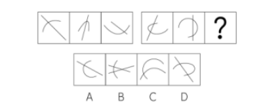
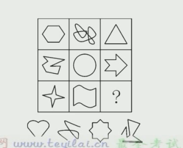
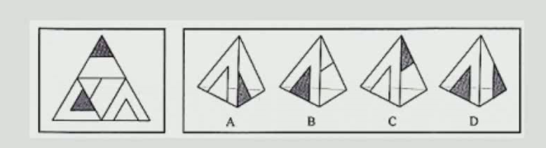

# Table of Contents

* [图形推理](#图形推理)
  * [分类](#分类)
  * [做题技巧](#做题技巧)
  * [规律](#规律)
    * [数量规律](#数量规律)
      * [点](#点)
      * [线](#线)
      * [角](#角)
      * [面](#面)
      * [素](#素)
      * [形](#形)
      * [数列规律](#数列规律)
      * [计算规律](#计算规律)
    * [位置规律](#位置规律)
      * [平移](#平移)
      * [旋转](#旋转)
      * [翻转](#翻转)
    * [样式规律](#样式规律)
      * [内在属性](#内在属性)
      * [外在形状](#外在形状)
  * [重构](#重构)
    * [折纸盒](#折纸盒)
      * [面](#面-1)
      * [线](#线-1)
    * [剖面图](#剖面图)
  * [其他](#其他)
  * [快速识别笔画数](#快速识别笔画数)
* [类比推理](#类比推理)
  * [常见题型](#常见题型)
  * [解题思路](#解题思路)
  * [语义关系](#语义关系)
  * [语法关系](#语法关系)
  * [逻辑关系](#逻辑关系)
  * [类比推理的解题方法](#类比推理的解题方法)
  * [例题](#例题)
  * [如何辨别动宾关系](#如何辨别动宾关系)
  * [如何辨别偏正短语](#如何辨别偏正短语)
  * [注意](#注意)
* [定义判断](#定义判断)
  * [列题](#列题)
* [逻辑判断](#逻辑判断)
  * [翻译推理](#翻译推理)
    * [什么是真言命题和假言命题](#什么是真言命题和假言命题)
    * [理解充分必要条件](#理解充分必要条件)
    * [**4个基本单句翻译**](#4个基本单句翻译)
    * [复句推理](#复句推理)
    * [假言命题](#假言命题)
    * [**选言与假言命题互换**](#选言与假言命题互换)
    * [推理规则（复句）-重点](#推理规则复句-重点)
    * [确定信息](#确定信息)
    * [**二难推理**](#二难推理)
  * [真假推理](#真假推理)
    * [矛盾关系](#矛盾关系)
    * [反对关系](#反对关系)
    * [包容关系](#包容关系)
    * [一真一假](#一真一假)
      * [利用矛盾关系](#利用矛盾关系)
      * [利用反对关系](#利用反对关系)
      * [利用包容关系](#利用包容关系)
      * [利用唯一性](#利用唯一性)
      * [穷举假设验证](#穷举假设验证)
    * [多真多假](#多真多假)
      * [全同](#全同)
  * [半真半假](#半真半假)
    * [2句以上](#2句以上)
    * [三句以上](#三句以上)
  * [真假人](#真假人)
  * [分析推理/组合排列](#分析推理组合排列)
    * [排除法](#排除法)
    * [最大信息法](#最大信息法)
  * [日常推理](#日常推理)
  * [加强/削弱](#加强削弱)
    * [**什么是加强？什么是削弱？**](#什么是加强什么是削弱)
    * [解题思路](#解题思路-1)
    * [**常规论证**](#常规论证)
      * [**直接肯定论点**](#直接肯定论点)
      * [**增加论据**](#增加论据)
      * [**搭桥**](#搭桥)
      * [**点明前提**](#点明前提)
      * [**直接否定论点**](#直接否定论点)
      * [**拆桥**](#拆桥)
      * [**否定前提**](#否定前提)
      * [**增加反向论据**](#增加反向论据)
    * [**因果类论证**](#因果类论证)
      * [**因果类加强**](#因果类加强)
      * [**因果类削弱**](#因果类削弱)
    * [**推测类论证**](#推测类论证)
    * [**对比实验类论证**](#对比实验类论证)
    * [总结](#总结)
    * [论证中的选项陷阱](#论证中的选项陷阱)
  * [题目技巧](#题目技巧)
    * [对一半的画圈法](#对一半的画圈法)
    * [混合假言片段法](#混合假言片段法)
* [参考资料](#参考资料)


判断推理题型

+ 判断

  肯定或否定某事物的存在，或指明它是否具有某种属性的思维过程。

+ 推理

  从一个或几个已有的判断得出另一个新判断的形式


# 图形推理

参考资料

+ 蔡金龙
+ https://zhuanlan.zhihu.com/p/104325047
+ https://zhuanlan.zhihu.com/p/270035707


## 分类


规律主要的是解构信息，也就是找出所谓的规律，找出规律就简单了，这个是需要熟知套路，和大量刷题


## 做题技巧

1. 元素组成相似，优先考虑样式规律
   1. 内在属性：对称 曲直 凹凸 封闭
   2. 外在形状：样式遍历、加减同异
2. 元素组成相同，优先考虑位置规律
   1. 注意图形重叠
3. 元素组成不同，且无明显属性规律，考虑数量规律
   1. 看共性 图形都有什么相同的地方？
   2. 框外有直线，优先数【线】
   3. 九宫格优先横着看
   4. 有曲直，大概考曲直交点
   5. 汉字三板斧： 笔画、封闭、结构、
   6. 封闭区间多 优先封闭空间

  

## 规律

任何一个图形，都能从**数量、位置、与样式**三个维度描述出来，因此，图形的规律也无外乎这三类。

这句话怎么理解呢？一个圆在一个正方形的左上角，是不是三种都占了？


### 数量规律

数量数什么？**点线角面素形**。


#### 点


1.  

    【解析】本题考查端点数。

    第一组图形，端点数都为6；第二组图形，端点数也都是6，因此选B！

2. 

   【解析】多次出现线条与线条的相交，考查交点数。

   第一组交点数：3、4、5；第二组交点数：4、3、？

   ？处可能是2，但没有符合的选项。

   细化考点，可能考交点的分类：此时拐点不算交点。

   此时第一组交点数：3、3、3；第二组：3、3、（3）

   选B！

3. 

   ​    【解析】出现多条线条与线条相交，考查交点。

   第一组，交点：1、1、1；第二组，交点：2、2、？

   问号处应为2个交点，观察选项B、D都有2个交点；

   细化考点：曲直交点，且是一条曲线与一条直线的交点，选D！

4. 

   【解析】本题考查线形交点。

   图象由正方形和直线组成，直线和正方形的交点依次为1、2、3、4、（5）；秒D！

5. 

   【解析】

   本题考查框内点数量。

   从左到右依次为0、1、2、3、4、（5）；秒C！

####  线

 ```mermaid
  
  graph LR
  
 A[线] -->B(线段)

  B -->C(样式)
  C --> C1(直线)
  C1 --> C11(长度)
  C1 --> C12(方向)
  C --> C2(曲线) 
  
B --> D(位置)
  D --> D1(线框)
  D1 --> D11(框内)
  D1 --> D12(框上)
  D1 --> D13(框外)
  D --> D2(相交)--> D21(交线)

  A --> E(笔画)
  E --> E1(语文意义上的笔画)
  E --> E2(数学意义的的笔画)
 ```

>  一笔画秒杀法：
>
>  https://zhuanlan.zhihu.com/p/391372252
>
>  **抹除闭环法：**任何一个只有一个部分的图形去掉任意个封闭线条，笔画数不变。
>
>  **原理：从闭环上任一点开始，绕闭环画一圈仍回到原点。**
>
>  建议：还是使用奇点数来计算一笔画，抹除闭环法容易产生误差,注意端点也算是奇点


1. 

   【解析】又有汉字又有图形，考查笔画数。

   从左到右，笔画数依次为11、9、7、5、（3）；应选B！

2.  

   本题考查曲线数。
   曲线数从左到右依次为：1、2、3、4、（5）；秒C！

3. 

   本题考查直线线段数，且框内和框分开数。

   框内，从左到右依次为：5、4、3、3、4、？

   框上，从左到右依次为：6、5、4、4、5、？

   框上-框内=1；因此选A！


#### 角


 ```mermaid
  
  graph LR
  
 A[角] -->C(角度)


  C --> C1(圆周角)
  C1 --> C11(优角)
  C1 --> C12(平角)
  C --> C2(钝角/锐角/直角) 
  
 A --> D(位置)
  D --> D1(内角 就是框内的)
  D --> D2(外角)

 ```


1. 

图中锐角个数分别为2、3、4、5、6（7），故D。

2. 


#### 面

面：联通的区域


 ```mermaid
  
  graph LR
  
 A[面] -->C(样式)


  C --> C1(直线面)
  C --> C2(曲线面)
  C --> C3(直线+曲线=所有)
  C --> C4(相同面)
  
 A --> D(面积)
  D --> D1(面积大小)--> D11(面积相等)
  D --> D2(最值)
  D2 --> D21(最小值)
  D2 --> D22(最大值)

 ```

> 1. 直线组成的面是直线面
> 2. 曲线组成的面是曲线面


1. 

   

【解析】此题考查直线面。

从左到右依次为：1、2、3、4、5、（6）；秒B！

2. 

   【解析】此题考查相同面。

   从左到右依次为：2、3、4、5、6、（7）；秒B

3. 

【解析】此题考查最大面。

面数都为5,排除D；只有一个最大面，排除B;最大面只有一个且与图形与外轮廓相同，排除A（比例不等）；选C！


#### 素

**元素种类数、包含元素数量**


 ```mermaid
  
  graph LR
  
 A[素] -->C(种类)
 A --> D(个数)
  A --> E(部分)


 ```

> 1. 如何判断汉字的组成部分 看是否写在一起有交点 比如【走】 1 忠 5 勺 2


1. 

   题干每幅图中都有四种不同元素，并且竖线在每个格子里都出现。A、B、C均有相同元素出现，故正确答案选D。（或者说相邻两图仅有一种元素不同）

2. 
   相同部分数递增，则A
3. 
   前5幅图中，三角型的个数分别为3、4、5、6、7，（注意有些三角形是两个图形连起来形成的），所以下幅图中应有8个三角形，符合条件的只有A项。
4. 
   1五角=3圆，依次为4,5,6,7,8，（9）(按圆的数目来换算)，则C


2. 

   【解析】此题考查素的个数。

   从左到右依次为：1黑、2白、3黑、4白、（5黑）；排除D！
   且该部分（标记处）每次逆时针移动一格；选B！

3. 

   【解析】此题考查素的种类数。

   每个图形中都有四种元素，排除CD；

   每个图形中都有五角星，排除B；秒A！

4. 

   【解析】此题考查部份数；

   ①④⑤有四部分；②③⑥有七部分。


#### 形

**形，顾名思义就是图形，这里指一些特殊的图形，如平行线、角、三角形、笔画等**


 ```mermaid
  
  graph LR
  
 A[形] -->C(特征)
 C --> C1(三边形)
 C1 --> C11(直角)
  C1 --> C12(等腰三角)
 
  C -->C2(四边形)
    C2 -->C21(矩形)
        C2 -->C22(梯形)
  C--> C3(扇形)


 ```


> 1. 形比较容易考重叠  比如重叠三角形 等等


1. 
【解析】此题考查三角形的数量。

从左到右，三角形的个数依次为1、2、2、4、3、？，并不成规律；

考虑重叠数三角形，则第三个图形有3个三角形，第五个图形有5个三角形；因此？处应该有6个三角形；

只有选项B有6个三角形；排除ACD；选B！

2. 

 从左到右 23 4 23 4 23？

答案选 A

3. 


#### 数列规律

+ 基本规律
  + 常数：222
  + 等差：2 3 4
  + 等比： 1 3 9 
+ 特殊规律
  + 递推： 1 3  4 7 11
  + 对称： 1 2 3 2 1
  + 乱序： 1 2 5 4 6 ？ 3
  + 周期： 
  + 同余数列：  4 7 10 13 除3余1


1. 

 8 4 2 2 1 ？ 递推 选A

2. 


#### 计算规律


 ```mermaid
  
  graph LR
  
 A[计算规律] -->C(图形间计算)
 C --> C1(A+B=C)
 C --> C2(A+B+C=常数)
 C2 --> C21(横着)
 C2 --> C22(竖着)
 C2 --> C23(米字形也叫对角线)
 C2 --> C24(S型)
  
 A -->B(图形内)
 B -->B1(分组重点)
 B1 -->B11(运算 加减乘除)
 B1 -->B12(换算 一个元素置换其他元素)
 


 ```


1. 

   ```
   解析】此题考查素的数量和运算关系。
   
   每行的黑五角星：第一列+第二列=第三列；
   
   每行的白五角星：第一列-第二列=第三列；
   
   因此？处黑五角星=2+3=5；白五角星=1-1=0；
   
   秒A！
   ```

   

2. 

```
【解析】此题考查面数量和图形间运算规律。

2 3 1=6

0 3 3 =6

1 3 ？=6

每一行面数之和为6；秒B。
```


3. 

   ```
    【参考解析】这道题目我们观察发现题干中的图形，发现图形较凌乱且以封闭为主，优先考虑数面的个数，分别为： 
   
   2 6  4
   
   4 7 3 
   
   4 6 ？
   
    ，观察数字每行数字，6-2=4；7-4=3；6-4=2，因此选择2个面的选项，选B 
   ```

   

4. 

  

```
【参考解析】这道题目我们观察发现题干中的图形，发现图形较凌乱且以封闭为主，优先考虑数面的个数，分别为： 

2 3 4 

1 2 3

3 5 ？

 ，观察每列数字2+1=3；3+2=5；4+3=7，因此选择7个面的选项，选C。
```


5. 

   ```
   【参考解析】这道题目我们观察发现题干中的图形，发现图形较凌乱且出头点明显，优先考虑数出头点个数，分别为：
   5 7 17 
   3 9 15
   1 11 ?
   ，观察数字呈S型；因此选择13个出头点的选项，选A。
   ```

   

6. 

```
【参考解析】这道题目我们观察发现题干中的图形都有三角形，优先考虑数三角形的个数，分别为：
4 5 7
3 9 6
2 4 ？ 
，米字观察相加都等于中间的9，因此选择5个三角形的选项，选C。

其实也可以这么看 米字相加都等于18 也是选C
```

7. 

```
有封闭图形，先考虑面
分别是 9 4  4 4  9 5看起来没什么规律
在考虑交点，看图没有框外，有框上和框内交点，分别计算
1. 5 5 =0 
2. 6 6 =0
3. 5 1 = 4
4. 5 1 =4
5. 8 4 = 4
6. 4 4 = 0
```

8. 对于元素换算的，一般看图形之间是否有字集的情况。如果没有图形一般就是递增的数列，如果有要么是递增、要么是递减

   


```java
观察图形我们发现第一幅图和第三图 元素抵消后，第一还有2个向下的三角形，推测数量递减，那么第二个图形加一个向下的三角形就等于第一个图形。即
    2上+2下=1上+6下
    1上=4下
代入进去，规律为 10 9 8 7 ？ 选A
```

9. 

```
第一步，观察特征。

组成元素不同，优先考虑数量类或属性类。每个图形均由圆和三角形两种元素组成，考虑元素的个数和种类。

第二步，九宫格，横向规律较为常见，优先考虑。

数元素的种类和个数无明显数量规律，元素运算无规律，考虑元素的换算规律。

第一行无子集
第二行有子集  1 3 相互抵消后还有2个三角 即：3圆+3三角=2圆+5三角-》1圆=2三角 代入得

12 11 10
9  8  7
6 5  4  选C
```


### 位置规律


 ```mermaid
  
  graph LR
  
 A[位置规律] -->C(平面空间内)
 C -->D(单个元素)
 D--> D1(平衡位置)
 C --> E(多个元素)
 
E --> E21(形形)
E21 --> E211(相离)

E211 --> N(外离)
N --> N1(2个元素 上下左右)
N --> N2(多个元素 横向纵向左携右斜相邻)
E21 --> W(内含)

E21 -->E212(相切)
E21 --> E13(相交)

E -->E22(线线)
E --> E23(线形)

  
 A -->B(动态)
 B -->B1(平移)
  B1 -->B11(分割空间)
    B11 -->B111(十字架 米字格)
        B11 -->B112(九宫格 十六宫格)
  B1 -->B12(路径)
  B12 -->B121(O形 双O 4O)
    B12 -->B122(S 斜S)
      B12 -->B123(G形)
  
  
  B1 -->B13(平移)
  
  
  
 B -->B2(旋转和翻转)
B2 -->B3(技巧)
B3 -->B31(旋转)
B31 -->B311(箭头法)
B31 -->B312(圆周)

B3 -->B32(翻转)
B32 -->B321(对称法)
B2 -->B4(区分) --> B41(时针法)

 


 ```

> 动态位置
>
> 1. 标数字 

--------------------------------------------------------------

#### 平移

1. 

   

   ```
   可以看到第三列没有动
   第二列每次向左移动一格、
   第一列每次向下
   答案选D
   ```

   2. 

      


3. 

```
一般优先横着看，我们会发现
第一列小球  先向右移动一个格子，在向右移动2个格子，撞到边框返回中间的位置，在向左移动3个格子，来到最右边  直接秒选A
第二列小球 
第三列小球 
```


4. 

   ```
   会发现每个图形都有一个横线和竖线。
   竖线顺时针
   横线逆时针 秒选C
   ```

   

5. 


```
红色的顺时针3 
绿色的逆时针3
秒选D
```


6. 


```
可以看到 先 逆3 顺 1 逆3 ？ 找顺1的 直接选D
```


7. 


```
我们会发现圆圈逆时针
线端点是是中间的4个格子里面顺时针走动 直接选D
```

8. 

```
我们会发现三个球 4个行 说明不是正常的直来直去
```


9. 


```
这题就有点恶心了，考场上不知道很难看出来
上面2行 顺时针
下面2行 逆时针  选A
```

10. 

这种更恶心 不过都是16宫格才能玩的起

-----------------------------------------------------------------

以下是旋转和翻转例题

#### 旋转

> 1. 对称轴旋转
> 2. 阴影旋转

1. 

   ```
   我们会发现对称轴是逆时针45度旋转 选B
   ```

2. 

3. 

```
我们会发现对称轴是顺时针45度方向走
```


4. 第三题可能引申出考阴影位置【阴影方向的旋转】


5. 


#### 翻转

1. 找出不相同的图案 

   我们可以使用【时针法】来进行判断，


注意标点一定要顺序一样，然后按照顺序定位时针。

> 如果一个图形时针方向改变，一定是发生了翻转！！


2. 

```
直接按照 园 五角星 方 会发现 题目都是顺时针

直接选B acd都是逆时针

```


### 样式规律

 ```mermaid
  
  graph LR
  
 A[样式] -->C(内在属性)
 
 C[样式] -->H(封闭:开放:半封闭)
 C[样式] -->J(曲直:曲线:直线)
 C[样式] -->K(对称性)
  K -->k1(轴对称)
  K -->k12(旋转对称) -->k121(中心对称)
 C[样式] -->L(凹凸)
  
 
 
 
 A --> D(外在形状)
 
 D --> V(遍历)
 D --> B(运算)
 
 B --> B1(加)
 B --> B2(减)
 B --> B3(同)
 B --> B4(异)


 ```

#### 内在属性

封闭性、曲直性、对称性、凹凸


> **中心对称**图形：如果一个图形绕着一个点旋转180°后的图形能够与原来的图形重合，那么这个图形叫做中心 对称图形，这个点就是它的对称中心。 旋转对称图形：把一个平面图形绕着平面上一个定点旋转α（弧度）后，与初始图形重合，这种图形叫做旋转对称图形，这个定点叫做旋转对称中心，旋转的角度叫做旋转角。 （ 0°< α<360°）。
>
> 所有的旋转对称都是中心对称
>
> 三角形是旋转对称
>
> 五角星是旋转对称
>
> 奇数角、形 都不是中心对称


1. 

```
1 4 6 轴对称
```

--------------------------------------------------------------


1. 


```
直线 曲+直 曲  选B


```


--------------------------------------------


1. 


```
都是封闭图形 选C
```


--------------------------------------------


什么是凹凸性？如果一个图形上任意两点的连线都穿过该图形，那么这个图形就是凸图形；如果一个图形上存在两个点的连线没有穿过该 图形，那么这个图形就是凹图形。

> 也可以这么说，如果内角大于180 一定是凹图形


凹凸都是凹图形


#### 外在形状

1.元素重复出现，考虑遍历；2.线条重复出现，考虑加减异同；3.轮廓相同、不同颜色的黑白块出现，考虑黑白运算。


1.  **样式遍历**

   **特征：元素重复出现**

   **解题思路：找到全集，缺啥补啥**
   
   我们来看下列题
   
   1. 
   
     竖着找全集，缺x和圆圈 选C
   
   2. 
   
      三行三列4个元素
   
      选D
   
   3. 
   
      横着发现各种元素的种类都有2种，所以？ 只能是 正方形和三角
   
      竖着看三种 所以选A

------------------------------


2. **特征：.线条重复出现**

   **秒杀技巧：根据选项，挑1~2根有最多不相同选项的线验证**

     1. 
        2. 

3. 
4. 
5. 

```
这题比较有意思 是去同 在翻转

样式运算结合位置运算
```

6. 

```
先旋转 在叠加
```


------------------------------------


3. **特征：轮廓相同、不同颜色的黑白块出现**
   **方法：先找运算规律，再根据选项，挑1~2个有最多不相同选项的颜色验证。**

> 也可以自定义运算


1. 

```
有+空=空
空+有=空
有+有=有
空+空=有

选A
```


2. 

```
上>下>左>右  操 考试哪有时间发现


```


## 重构

大致分为三个题型

+ 折纸盒 必考
+ 剖视图
+ 三视图

### 折纸盒

1. 平面图形都是相对折叠变成立体图
2. 寻找平面图形和立体图之间的对应关系


+ **学习铺垫**

平面展开图的三种情况

1.  


 4个A点都可能是一个点

2. 


​	通过旋转2个a点是一样

3. 

不会有旋转得到A点


> 平面图形只会旋转，如果是翻转肯定是不对的(时针法)！！！！！！！！！！！！！


+ **如何寻找对应关系**


1. 面的对应
   1. 特殊面 -最容易
   2. 相对面-不可能相邻
2. 线的对应：描线法
3. 点的对应：描点法 -最好用也最通用

--------------------------------

#### 面


什么是特殊面？


什么是相对面？不可能相邻


如何判断相对面呢


**Z的2端就是相对面** 

A D 排除

C反过来 黑的也相邻了，只能选B


直接选B 阴影和横线 是相对面不可能同时出现


#### 线

再看一道经典的题目，可以用面 线 点同时做出


```
AC 为什么不对？ 五角星和方块相对 不符合题目要求
BD如何判断呢
第一个方法：时针法
立体：圆圈->五角星->方块 是逆时针的 D是顺时针的，说明发生了翻转，平面图形只能旋转，排除

一个面：特殊面
二个面:相对面
三个面：时针法

```

**这题用描线如何解决呢**？

我们看这三个图形里面只有五角星的四边是可以区分出来的【**优先找能区分的图形**】

会看到立体图形中五角星的上边是方块，左边是圆(有可能旋转)，但是上边肯定是方块 直接选B


再来看一题


```
这题如果用描线很快就做出来了
A:
B:A上面是O   排除
C:T的上面是三角  排除
D:A下面是H  排除
```

如何描点呢？

我们看下D 找到一个公共点


但是实际上平面图形2个点是不重合的


我们在看下B


根本不可能是H的点


------------------------------


```
首先排除D 相对面不可能同时出现 
在排除A 因为平面最下面是逆时针 A是顺时针
再看看C 半黑的左边是空白，上面是全黑 排除
```


------------------------------------------------

四面体如何做呢？.

四面体只能**描线**




BCD线都不重合 直接选A


### 剖面图


个别图形的自由组合


肯定不可能是A 不管你怎么切

主要看不同图形可以切成什么样的图形

A：因为一个圆和正方形是一起的，不可能一刀切开的


## 其他

## 快速识别笔画数

砍掉封闭空间，其他元素不动


# 类比推理

## 常见题型

1.两词型：A:B

2.三词型：A:B:C

3.填空型：A对于（　）相当于（　）对于B


## 解题思路

+ 两词型和三词型题目需要**先判断题干**中词语的关系，**再确定选项**中的词语关系，最后套入逻辑关系。

+ 填空型题目**将选项代入题干**，判断前后词语间关系是否一致。

+ 在类比推理中，常考的关系包含：**语义关系、语法关系和逻辑关系**。


## 语义关系

+ 近反义

  + 近义关系：【国泰民安：河清海晏】【顿悟：醍醐灌顶】

  + 反义关系：【声色俱厉：和颜悦色】

  + 二级辨析：褒义、贬义、中性

    > **褒义词：是词性带有赞许，肯定感情的词 贬义词：是词义带有贬斥、否定、憎恨、轻蔑感情色彩的词。 中性词**：中性词是针对词语的感情色彩而言的，不仅仅是形容词，动词、名词都可以，它专指褒义、贬义词语之外不能体现特殊情感倾向的词，即中性感情色彩的词语。

+ 比喻、象征：【优雅：天鹅】


## 语法关系

> 一般来说，主语是指一个句子所陈述的对象，比如做了某事的人，比如具有某种性质的东西。而对于这个主语进行陈述的部分，我们称之为“谓语”，为了分析简便，有人会把谓语中的中心动词，也就是谓语部分中起决定作用的动词称为谓语，或者谓语动词，把谓语动词所支配的部分称为宾语。如“我打了他”中的“他”就是“打”的宾语。
>
> 定语，是指一个句子或者短语中对名词进行修饰的部分，比如红色的苹果，红色就是定语，而“的”字是定语的标记，有时可以省略。
>
> 状语，一般是指一个句子或者短语中对动词进行修饰的部分，位于动词之前，比如狠狠地打，狠狠就是状语，而“地”字是状语的标记，在少数情况下可以省略。
>
> 补语，一般是指一个句子或者短语中对于动词进行补充说明的部分，描述动作的结果、程度，位于动词之后，比如开得快，快就是补语，“得”是补语标记，一般不省略。

+ 主谓关系

+ 动宾关系

+ 主宾关系

+ 偏正结构

  > [偏正结构](https://zhidao.baidu.com/search?word=偏正结构&fr=iknow_pc_qb_highlight)是由修饰语和[中心语](https://zhidao.baidu.com/search?word=中心语&fr=iknow_pc_qb_highlight)组成，结构成分之间有修饰与被修饰关系的短语；动词、名词、形容词与它们前面起修饰作用的成份组成的短语。名词前的修饰成份是定语；定语（状语）和中心语的关系是偏和正的关系；[偏正短语](https://zhidao.baidu.com/search?word=偏正短语&fr=iknow_pc_qb_highlight)包括定中短语与状中短语。


## 逻辑关系


可用花圆圈表示的一类关系，包括

+ 全同

  所有的A是B，并且所有的B是A

+ 并列

  + 矛盾（非此及彼）
  + 反对关系（存在小三）

+ 包含

  + 种属 ： A是B
  + 组成 ：A是B的一部分

+ 交叉关系：从不同角度描述同一类事 有人就是报案人也是嫌疑人

+ 对应关系

  + 功能：[净水器：除杂质]
  + 时间顺序：[下单：付款：送货]


   


## 类比推理的解题方法

一个很有意思的类比推理题目的解题方法：**剥洋葱法**，将类比推理词语之间的逻辑关系分层级，类似于洋葱的多层皮。在做题时，一层一层套入逻辑关系，无法确定答案时，再套入下一层的逻辑关系。

其中，洋葱的最外层为题干前后词语之间的逻辑关系，中层为一组词语中，某个元素内部的逻辑关系，个别情况下会考查词语的总体性质、感情色彩等。

另外，近义词和反义词的考查虽然只有一层逻辑，类似于言语理解，属于较难的题目。


## 例题
我们来看看例题

1. 分母︰除数 --全同

   ```
   A．内角︰外角　　B．加减法︰乘除法　　C．横坐标︰纵坐标　　D．百分比︰百分率
   
   分析：分母︰除数 二者是全同关系 
   A 不是 B 不是 C 不是 D是 
   ```

2. 番茄之于（）相当于（）之于蹴鞠 --并列

   ```
   A.美洲；中国  
   
   B.白菜；篮球  并列关系
   
   C.植物；人类
   
   D.炒饭；健身
   ```

3. 有形损耗：无形损耗 --并列-矛盾

   ```
   分析题目是什么关系？有形和无形之外，是不是没有第三者了？ 那就是 并列-矛盾
   A.中国哲学：西方哲学   还有其他哲学
   B.蒸馏酒：葡萄酒      蒸馏酒是需要通过蒸馏工艺的酒，葡萄酒是以葡萄为原材料制作的酒，二者是从不同方面区分酒的，有的蒸馏酒是葡萄酒，有的葡萄酒是蒸馏酒，二者为交叉关系
   C.急性中毒：慢性中毒   二者都是中毒的一种，并且除了急性中毒就是慢性中毒，二者为矛盾关系
   D.有色金属：稀有金属   有色 无色 稀有 不稀有？ 有色金属可分为重金属、轻金属、贵金属及稀有金属，所以稀有金属是有色金属的一种，二者为种属关系
   ```

4. 儿童读物∶启蒙读物--包含

   ```
   启蒙读物是教育儿童的读物，属于儿童读物，为种属关系。
   
   A、连续变量∶离散变量   并列？
    B、刑事诉讼∶民事诉讼  并列？
    C、生产资料∶生活资料  
    D、一类疫苗∶麻疹疫苗   直接选
   ```

5.  有理数∶无理数∶实数--包含

   ```
   　题干词语间逻辑关系：有理数是有限小数及无限循环小数，无理数是无限不循环小数，实数分为有理数和无理数，因此前两者之间是矛盾关系，前两者和第三者之间是包容关系。 这种题目好恶心
   A.洋房∶楼房∶房屋
   B.阴刻∶阳刻∶雕刻
   C.西汉∶东汉∶汉朝   直接选
   D.西欧∶东欧∶欧洲
   ```

6. 与“驾车：雾灯：大雾”这组词逻辑关系最为相近的一项是（  ）。

   
   　　A、探险：山洞：罗盘


   　　B、露营：晴天：帐篷


   　　C、勘探：地图：野外


   　　D、泳衣：救生圈：漂流

   ```
   第一步：判断题干词语间逻辑关系。
   
   在大雾中驾车需要打开雾灯，雾灯为大雾中驾车使用的工具，三者为行为、工具和环境的对应关系。
   
   第二步：判断选项词语间逻辑关系。
   
   A项：在山洞中探险需要使用罗盘，罗盘为山洞中探险使用的工具，三者为行为、工具和环境的对应关系，但词语顺序不一致，与题干逻辑关系不一致，排除；
   
   B项：晴天露营需要使用帐篷，帐篷为晴天露营使用的工具，三者为行为、工具和环境的对应关系，但词语顺序不一致，与题干逻辑关系不一致，排除；
   
   C项：在野外中勘探需要使用地图，地图为野外中勘探使用的工具，三者为行为、工具和环境对应关系，与题干逻辑关系一致，当选；
   
   D项：泳衣和救生圈均为漂流需要使用的工具，三者为行为和工具对应对应关系，与题干逻辑关系不一致，排除。
   
   故正确答案为C。
   ```

   

## 如何辨别动宾关系

 **做句法功能题目时，可以优先判断动词和名词或者常用作动词、名词的词，之后判断这一动作是否可由该名词主动发出，如若可以，则为主谓关系;反之，则为动宾。**

比如鲜花：绽放，可以明确“鲜花”作为名词，“绽放”作为动词，“绽放”这一动作可由“鲜花”主动发出，故二者为主谓关系，即鲜花绽放。下面通过题目进一步感知： 

1. 【例1】攻击：发动

   A.注释：文档

   B.前进：勇敢

   C.披荆：斩棘

   D.工作：开展

   ```
   分析可知：“发动”作为动词出现，“攻击”可作为名词，“攻击”作为名词时不可能自身发出“发动”这一行为，故二者为动宾关系，即发动攻击。逐一判断选项
   
   A项，参照所述做法，“注释和文档”是一组动宾结构的短语，但是顺序错了，排除A项;
   
   B项，“勇敢和前进”是一组偏正结构的短语，与题干不一致，排除B项;
   
   C项，“披荆和斩棘”是一组并列结构的短语，与题干不一致，排除C项;
   
   D项，“开展和工作”是一组动宾结构的短语，与题干保持一致。
   
   故正确答案为D。
   ```

   

2. 【例2】湖水：荡漾

   A.春雨：连绵

   B.蝴蝶：花丛

   C.水草：小溪

   D.闪耀：群星

   ```
   分析确定题干逻辑关系：湖水是名词，荡漾是动词，湖水与荡漾形成主谓关系。逐一分析选项：
   
   A项：春雨是名词，连绵是动词，春雨与连绵形成主谓关系，与题干逻辑关系一致，保留;
   
   B项：蝴蝶与花丛都是名词，为并列关系，排除;
   
   C项：水草与小溪都是名词，为并列关系，排除;
   
   D项：闪耀是动词，群星是名词，群星与闪耀形成主谓关系，但前后关系反了，排除。
   
   故正确答案为A。
   ```


## 如何辨别偏正短语

 其次是“偏正关系”，在公考判断中，**偏正关系的结构为：修饰语+中心语**，例如：美丽：女孩，中心语是“女孩”，什么样的女孩，美丽的女孩，“美丽”就是对于“女孩”这个中心语的修饰和限制，“美丽”和“女孩”之间就是偏正关系，再比如：“轻松的工作”、“富强的祖国”、快捷的地铁等等，都是偏正结构。接下来我们通过一个题目来看一下动宾和偏正在类比推理里面的考法。 

1. **例：战争：发动**

   **A.编辑：文档**

   **B.前进：勇敢**

   **C.披荆：斩棘**

   **D.活动：开展**

   ```
   首先第一步，辨别题干词语间关系，“战争”和“发动”之间，“发动”是动词，“战争”是名词做宾语，所以题干词语间关系为动宾关系。第二步，分析对比排除选项：
   
   A项，“编辑”为动词，文档为“名词”做宾语，所以A项词语间关系为“动宾关系”，和题干一致，但是由于位置反了，所以排除；
   
   B项，“前进”是动词，勇敢是形容词，怎么前进？勇敢的前进，所以此项中是“前进”作为中心语，“勇敢”对于前进的修饰限制，所以词语间关系为偏正关系，排除；
   
   C项，“披荆”和“斩棘”都是动宾结构的词语，词语间关系应该为并列关系，和题干关系不一致，排除；
   
   D项，“活动”名词做宾语，“开展”是动词，所以词语间关系为动宾关系，且位置和题干一致，当选。
   
   注意：除了词语间关系一致以外，在类比推理题中，还得看每个词语所在的位置也得一致。关系一致，当选。
   ```

   

## 注意

1. 题目种出现 烟花：爆竹 那么选项中也必须是2个事物
2. 鲸鱼不是鱼 是哺乳动物
3. 名字比较特殊的，一般是来考命名 如：洗脸盆 招待所
4. 一些常识
   1. 说学逗唱是相声的基本功
   2. 唱念做打是京剧


# 定义判断 

**定义判断**主要考查考生运用给定标准定义进行判断的能力。. 每道题，先给出一个概念，然后再对该概念进行定义，要求应试者根据给出的定义，从备选项中选出一个最符合或最不符合该定义的典型事件或行为


解题思路：

+ 看清题目是属于还是不属于
+ 看题干
  + 识别关键词
    + 主体
    + 方式
    + 目的
    + 结果
    + 条件
  + 找关键句
+ 看选项
  + 无中生有
  + 矛盾
  + 等等


> 我个人的心得就是：根据题目关键词去比对选项种的关键词
>
> 对比则优

## 列题

1. 我们来看看如何找关键词

   先看看题目

   

   关键信息：（1）“在距离相当遥远的位置上”是地点的条件，（2）“用各种传感器探知地面物体辐射（或反射）的电磁波信息，查明地质的或地学的各种情况。”这叫做功能，（3）“地面的、地质的、地学的”说明是地球范围内。

   把这些搞明白，就能提取出三个关键词：**远距离、探知情况、地球上。**

   选项A距离不远、选项B距离不远、选项C不在地球、选项D没错。

2. 下面再来看一道难度较高一点的题目：

   
   我们依旧来找关键信息：（1）“年龄相近的人”说明年龄又要求；（2）“生活、工作、社会地位等方面存在差距，担心受到轻视排挤而产生的心理压力”说明结果。

提取出来的关键词就是：同辈、有心理压力。

选项A没问题，选项B有年龄差，不是同辈，选项C年龄是否相近不太清楚，同一个公司有年轻的有老的，选项D没有比较。

3. 

   


# 逻辑判断

**逻辑判断**一共10道题左右，具体包括6道论证题，2道归纳推理、1道翻译推理题、1道真假推理。 

逻辑判断题可归为两类——**形式推理题**和**论证推理题**。

+ 形式推理题是指严格按照演绎推理规则进行推导的逻辑题。这类题只有一个能够必然推出的答案。依据标志词（“所有”“有的”“如果”“只有”等）的有无，又可分为**规则推演型**和**分析型**两种。

+ 论证推理题是指不完全按照演绎推理规则推导的言语理解型逻辑题。这类题不是必然性推理，因此符合题意的选项往往不止一项，这就需要考生根据各选项的表述，选出最符合题目要求的一项。根据题目要求（“据此可以推出”“最能支持的一项”“最能削弱的一项”“最能解释的一项”等）的区别，又可分为**前提预设型、结论推出型、加强支持型、削弱反驳型、解释说明型**和**评价型**六种。


## 翻译推理

+ 题目特征

  题干和选项中存在明显的逻辑关联词

  提问方式为：可以推出/不能推出

+ 解题思维

  先翻译，后推理


### 什么是真言命题和假言命题

全称[直言命题](https://www.zhihu.com/search?q=直言命题&search_source=Entity&hybrid_search_source=Entity&hybrid_search_extra={"sourceType"%3A"answer"%2C"sourceId"%3A"2251465197"})是对某类对象的全部作出性质上的断定，而假言命题是对一个命题的成立条件是另一个命题的成立前提的判断。

全称直言命题的形式结构是

所有S都是P，或所有S都不是P

例子。

所有苹果都是水果。所有智能手机都是[电子产品](https://www.zhihu.com/search?q=电子产品&search_source=Entity&hybrid_search_source=Entity&hybrid_search_extra={"sourceType"%3A"answer"%2C"sourceId"%3A"2251465197"})。所有人都是需要劳动的。所有卡车都是交通工具。

假言命题的形式结构是

如果p，那么q，或是，只有p，才q。

前者叫[充分条件假言命题](https://www.zhihu.com/search?q=充分条件假言命题&search_source=Entity&hybrid_search_source=Entity&hybrid_search_extra={"sourceType"%3A"answer"%2C"sourceId"%3A"2251465197"})，后者叫必要条件假言命题。


### 理解充分必要条件

在我们学习翻译推理之前，首先要搞清楚一个关系，不然没法做题，那就是什么是充分条件，什么是必要条件，下面给几个例子，让我们加深下印象。

1. 大楼->地基     有大楼肯定有地基，但是有地基是不是不一定有大楼，那么地基就是大楼的必要条件，大楼是地基的充分条件
2. 小孩->父母     有小孩肯定有父母，但是有父母不一定有小孩。那么父母是小孩的必要条件，小孩是父母的充分条件。

> 一般都是写成数据公式a->b 


###  **4个基本单句翻译** 

| 原句         | 翻译       |
| ------------ | ---------- |
| 所有的S是P   | S->P       |
| 所有的S不是P | S->非P     |
| 有的S是P     | 有的S->P   |
| 有的S不是P   | 有的S->非P |

| 原命题             | 否命题     |
| ------------------ | ---------- |
| （并非）所有的S是P | 有的S不是P |
| （并非）所有S不是P | 有的S是P   |
| （并非）有的S是P   | 所有S不是P |
| （并非）有的S不是P | 所有S是P   |

> 注意： 见到并非就先翻译成有的   后面跟否定 如： 【并非所有S不是P 的否命题 有的S是P】
>
> 并非其实就是求得 当前真言的否命题


做一个例题：

 一些投资者是乘船游玩的热心人。所有的商人都支持沿海工业的发展。所有热心乘船游玩的人都反对沿海工业的发展。据此可知()。
A．有一些投资者是商人
B．商人对乘船游玩不热心
C．一些商人热心乘船游玩
D．一些投资者支持沿海工业的发展 

+  **单句的规范化** 

| 原句         | 翻译      |
| ------------ | --------- |
| 所有S都是P   | S->P      |
| 没有S不是P   | S->P      |
| 所有S都不是P | S->非P    |
| 没有S是P     | S->非P    |
| 不是P都不是S | 非P-> 非S |
| 不是P都是S   | 非P->S    |


+ 推理规则

| 原命题       | 等价命题                | 理解                               |
| ------------ | ----------------------- | ---------------------------------- |
| 所有S都是P   | 有的P是S <br />有的S是P | S是P的子集                         |
| 所有S都不是P | 所有P都不是S            | sp 没有交集                        |
| 有些S是P     | 有些P是S                | S和P有交集  所以 有些S是P 有些P是S |


+ 单句推理的常见错误

  

 有的S是P 推不出 有的S不是P 【可以用集合的概念去理解】

我们做下例题


1. 某知名跨国公司的总部员工中，所有懂英语的都不精通印尼语，有些懂英语的不精通西班牙语，有些懂韩语的精通印尼语，所有懂韩语的都精通西班牙语，有些懂韩语的精通英语。
   如果以上陈述为真，以下除哪项外也一定为真：

   ```
   懂英语=a
   精通印尼语=b
   精通西班牙语=c
   懂韩语=d
   精通西班牙语=c
   
   根据题中的关系，我们可以推断出 
       1.a-> -b
   有的 2.a-> -c
   有的 3.d-> b
       4.d->c
   有的 5.d->a
   
    A、有些懂韩语的员工不精通印尼语   选项翻译：有的d-> -b  根据 5 1 可以推出  d-> -b 
    B、有些懂印尼语的不精通西班牙语   选项翻译：有的b-> -c  推断不出来
    C、有些懂韩语的职工不精通英语    选项翻译：有的d-> -a  根据 3   d-> b  再根据 1的逆否 b->a 得到  d-> -a
    D、有些懂英语的不精通韩语    选项翻译：有的a> -d    根据 2 a-> -c   再根据 4逆否 -c->-d   得到 a> -d 
   
   
   
   ```

2. 有许多美丽的人并不善良，但没有一个善良的人是不美丽的。
   以下不能从上述论断中推出的是

   A、没有一个不美丽的人是善良的

    B、有些美丽的人是善良的

    C、有些善良的人不是美丽的

    D、有些不善良的人是美丽的

   ```
   我们先来翻译下题目：许多美丽的人并不善良，所有善良的人是美丽的
   注意题目是不能！
   
   美丽=a 善良=b 
   1.有的a-> -b
   2.b->a
   我们来看看选项
   A:-a -> -b  根据2 逆否推出
   B:有的a->b   根据 等价推出 有的a->b
   C:有的b->-a   根据2 只能推出  有的b->a  不能推出有的b->-a   当选
   D:有的-b->a   根据1 等价推出
   
   
   ```

   

3. 某公司30岁以下的年轻员工中有一部分报名参加了公司在周末举办的外语培训班。该公司的部门经理一致同意在本周末开展野外拓展训练。所有报名参加外语培训班的员工都反对在本周末开展拓展训练。
   由此可以推出：

    A、所有部门经理年龄都在30岁以上

    B、该公司部门经理中有人报名参加了周末的外语培训班

    C、报名参加周末外语培训班的员工都是30岁以下的年轻人

    D、有些30岁以下的年轻员工不是部门经理

   ```
   1.有的30岁以下->外语
   2.经理->拓展
   3.外语->非拓展
   
   1->3->2 有的30岁以下不是经理
   ```


### 复句推理

+    **联言命题——且 **  

下列选项中，与“李宁和刘翔是运动员”的判断类型相同的一项是( )。 　　

A.魏来和石青是夫妻

B.孟非和王芳是主持人

C.刘晓庆和邓婕是同乡

D.孟春和李雪是同事

```
正确答案：B

解析

李宁、刘翔是运动员，是表示两事物共同存在的判断，是复言命题。与此判断相同的是孟非和王芳是主持人，这句话拆成孟非是主持人，王芳是主持人依然成立，也属于复言命题，符合题意，故选B。
```


+    **选言命题——或**

| P或Q     | 相容选言                  | 不相容选言                                                   |            |
| -------- | ------------------------- | ------------------------------------------------------------ | ---------- |
| 联结词   | 或者 **至少有一个是真的** | 要么，要么 **有且只有一个是真的**                            |            |
| 包含情况 | P Q P且Q                  | P  Q                                                         |            |
| 蕴含推理 | 非P->Q 非Q->P             | 非P->Q 非Q->P Q -> 非P P->非Q                                | 我们会发现 |
| 否命题   | -(p且Q)                   | 1.  p且q<br />2.非p且非q<br />我们可以用数学的思维来理解 ，原有命题是x=1那么否命题就是x<1 且x>1 |            |


+ 摩根定律

  | 中文                           | 公式                                                         | 例子                                                         |
  | ------------------------------ | ------------------------------------------------------------ | ------------------------------------------------------------ |
| 摩根定律                       | 非(P **且** Q) = (非 P) **或** (非 Q)<br />非(P **或** Q) = (非 P) **且** (非 Q) | 我并非想去东京和巴黎            －（东京且巴黎）=－东京或-巴黎）<br />我并非想吃肯德基或金拱门      －（肯德基或金拱门）=－肯德基且-金拱门 |
  


我们来看下例题

```
甲专家针对我国国内的煤炭市场结构已经供大于求的局面。提出：“要么限产以保价，要么降价。”乙说：“我不同意”。
如果乙坚持自己的意见，哪个可以断定乙在逻辑上必须同意。（ ）
A．限产来保价但不降价
B．如果既不限产来保价也不降价不行的话，就必须既降产又降价
C．既降产又降价
D．降价但不降产来保价

答案：D

某司机驾驶违章，民警说：“对你要么扣照，要么罚款。”司机说：“我不同意。”按照司机的说法，以下哪项是他必须同意的?（） 单项选择题 
A、扣照，但不罚款 
B、罚款，但不扣照
C、如果不能做到既不扣照又不罚款，那么就既扣照，又罚款 
D、承认错误，下次不再违章 

我们来翻译下题目  （要么扣照 要么罚款）司机说不做，其实就是求否命题，扣照且罚款 或者  非扣照且非罚款
答案：C

```


### 假言命题

| P或Q     | 充分条件               | 必要条件                                           | 充要条件         |
| -------- | ---------------------- | -------------------------------------------------- | ---------------- |
| 联结词   | 如果P那么Q    只要P就Q | 只有P才Q    **除非**P**否则不**Q<br />才也是后推前 | 当且仅当         |
| 推理方向 | 前推后 P->Q            | 后推前 Q->P                                        | 等价于 P->Q Q->P |


| 中文                           | 公式                                                         | 例子                                                         |
| ------------------------------ | ------------------------------------------------------------ | ------------------------------------------------------------ |
| 逆否等价                       | a→b=-b→-a                                                    | 小孩->父母  反过来，没有小孩肯定没有父母                     |

```
老王对老李说：“除非你在今天之内按照合同要求支付货款，否则我们法庭上见。” 以下哪项判断的含义与上述判断不同?
A、只有老李今天按照合同的要求支付货款，老王才不会将他告上法庭
B、如果老李今天按照合同的要求支付货款，那么老王不会将他告上法庭
C、如果老李今天不按照合同的要求支付货款，那么老王就会将他告上法庭
D、如果老王没有将老李告上法庭，那么老李在今天按照合同的要求支付货款

这里分享一个小技巧：除非 否则不 是后推前，但是题目中出现的是否则而不是否则不，我们可以加2个不
除非你在今天之内按照合同要求支付货款，否则【不】我们法庭上【不】见
翻译：法庭上【不】见->按照合同要求支付货款

A选项：翻译为：不告上法庭→支付货款，符合题干推理规则，排除。
B选项：翻译为：支付货款→不告上法庭，支付货款是对题干推理规则的肯后，肯后推不出肯前，与题干推理规则不同，所以选B。
C选项：翻译为：不支付货款→告上法庭，是题干推理规则的逆否命题，排除。
D选项：翻译为：不告上法庭→支付货款，符合题干推理规则，排除。


```


###  **选言与假言命题互换** 

为什么要提这个点？因为有些题目会出现这样的问法

 P->Q 等价于 非P或Q

	> 前面学了选言，什么情况下会推出 P->Q 是不是 -p->q

```
2009年法国航空公司一架客机失事。如果法国及其他多国没有采取积极的搜救行动，就不会尽早发现失事飞机的残骸。如果失事飞机设计公司提供技术支持并且派专家参与失事原因分析，那么关于失事事件的调查报告就会更客观。 以上陈述如果为真，以下哪项不可能为假？（ ）
A . 或者法国及其他多国采取积极的搜救行动，或者不会尽早发现失事飞机的残骸
B . 除非失事飞机设计公司提供技术支持，否则就不会尽早发现失事飞机的残骸
C . 如果法国及其他多国采取积极的搜救行动，就会尽早发现失事飞机的残骸
D . 如果失事飞机设计公司提供技术支持，那么关于失事事件的调查报告就会更客观

第一步：分析题干
题干推理规则为：
①不积极搜救→不会尽早发现残骸
②技术支持且分析原因→报告客观
第二步：分析选项
A选项：①的逆否命题为：尽早发现残骸→积极搜救；根据a→b等价于非a或b，可以得到或者积极搜救，或者不会尽早发现残骸，该项不可能为假，所以选A。
B选项：发现残骸→技术支持，题干没有相关推理关系，所以B错。
C选项：积极搜救→发现残骸，为①的否前，否前无法得到必然结论，所以C错。
D选项：技术支持→报告客观，②的前件是“且”，因此技术支持不构成②的肯前，也就无法得到肯后的结论，所以D错。
故本题选A。


2.总经理：建议小李和小孙都提拔
董事长：我有不同意见
以下哪项符合董事长的意思？
A、小李和小孙都不提拔
B、提拔小李，不提拔小孙
C、除非不提拔小李，否则不提拔小孙
D、要么不提拔小李，要么不提拔小孙

翻译：-小李或小孙 那就是会有三种意思   提拔小李 提拔小孙  都不提拔

A：只符合一个
B:只符合一个
C:小孙-> -小李  换成选言命题就是 -小孙或小李  符合题目 选C
D:只符合一个

```


###  推理规则（复句）-重点
+ 肯前必肯后，否后必否前 -> 其实就是逆否公式
+  否前肯后，无必然结论 

```
如果某人是杀人犯，那么案发时他在现场。据此，我们可以推出：
A.张三案发时在现场，所以张三是杀人犯
B.李四不是杀人犯，所以李四案发时不在现场
C.王五案发时不在现场，所以王五不是杀人犯
D.许六不在案发现场，但许六是杀人犯

翻译题目：某人是杀人犯-> 案发时他在现场
C是题目逆否命题

俗话说，“舍不得孩子套不住狼”。下列各项中，对此句理解不正确的是( )。
A、想套得住狼，就要舍得孩子
B、只要舍得孩子，就能套得住狼
C、舍得孩子，也许能套得住狼
D、只有舍得孩子，才能套得住狼

翻译题目：狼->孩子
A:狼->孩子
B：孩子->狼
C：肯后，无必然结论 
D:狼->孩子

```


### 确定信息

就是从题目中找出正确的信息，然后顺藤摸瓜进行推理，一般来说联言都是正确的信息

​	

```
 一天晚上,某商店被盗.公安机关通过侦查,得出如下判断：（1）盗窃者或是甲,或是乙；（2）如果甲是盗窃者,那么作案时间就在零点之前；（3）零点时该商店的灯光灭了,而此时甲已经回家；(4)如果乙的供述不属实,那么作案时间就在零点之前；（5）只有零点时该商店的灯光未灭,乙的供述才属实.由此可以推出本案的盗窃者是（ ）
A、甲 B、乙 C、甲或者乙 D、甲和乙 

这个题能够从题干给出的5个限制条件来判断。
题干中条件3和5有矛盾，从这里入手推导，5是一个必要条件的假言命题，否定前件能够得出否定的后件，因为3说零点时商店灯灭了，所以能够得出乙供述的不属实。
这样从4能够得出，作案时间在零点之前，那么此结论和条件2矛盾，条件2是充分条件的假言命题，否定了后件就能够推出否定的前件即甲不是盗窃者，这样既然1说了盗窃者是甲或乙，二者必居其一，那么只有乙是盗窃者了。所以得出正确答案B。


某经销商为感谢消费者，同时进一步宣传其产品，组织部分消费者进行郊游活动。此次活动为参与者准备了H、I、J、K、L、M六种可供选择的礼物。但是，礼物的选择必须满足如下条件： （1）只有选择礼物I和J，才能选礼物H （2）如果选择了礼物L，就不能再选礼物J，也不能再选礼物K （3）只有选择礼物L，才可选礼物M。 已知赵先生选择了礼物H，请问以下哪项有可能是赵先生选择的其它礼物（ ）
A . I和M
B . I和L
C . J和L
D . J和K

第一步：分析题干
题干推理规则为：
①H→I且J
②L→非J且非K
③M→L
第二步：分析选项
由①及赵先生选择了H，可知，一定会选择I和J。
由②的逆否命题为：J或K→非L，可知：一定没选择L。排除B、C。
由③的逆否命题为：非L→非M，可知：因没选择L，所以一定也没选择M。所以选D。
故本题选D。


甲、乙、丙、丁四人商量周末出游。甲说乙去我就去，乙说：丙去我就不去;丙说：不管丁去不去我都去;丁说：甲乙俩人至少去一个我就去。
以下哪项推论可能是正确的?
A.乙、丙两个人去了
B.甲一个人去了
C.甲、丙、丁三个人去了
D.四个人都去了

第一步：分析题干
题干推理规则为：
①乙→甲
②丙→乙不去
③丙
④甲或乙→丁
第二步：分析选项
A选项：假设乙、丙两人去了，则由①可知，甲也去，所以A错。
B选项：假设甲去了，由④，丁一定会去，所以B错。
C选项：符合推理规则，所以选C。
D选项：由②，丙去则乙不会去，四个人都去说法错误，所以D错。
故本题选C。


```


###  **二难推理**
非P->P P正确 

找矛盾推理，谁在后面谁是对的

如果贯彻绝对公平，那么必然导致按劳分配；若按劳分配，将出现贫富不均；只有贫富均等，才能贯彻绝对公平。所以，
A．必须实行按劳分配
B．必须实行按需分配
C．必须贯彻绝对公平
D．不能贯彻绝对公平


绝对公平->按劳分配->贫富不均->不能绝对公平 得到d是正确答案


## 真假推理

### 矛盾关系

**矛盾关系（对象一致才有矛盾）：必然包含一真一假**

| 序号 | 命题         | 矛盾命题     |
| ---- | ------------ | ------------ |
| 1    | **A**        | **-A**       |
| 2    | **A且B**     | -A 或 -B     |
| 2    | **A或B**     | -A 且 -B     |
| 3    | **A→B**      | **A且非B**   |
| 4    | **有的是**   | **所有不是** |
| 5    | **有的不是** | **所有是**   |


### 反对关系

| 命题                                             | 推导                                                         |      |
| ------------------------------------------------ | ------------------------------------------------------------ | ---- |
| **有的是与有的不是，两者必有一真，可能同时为真** | 有的A是B的矛盾命题是：所有A都不是B。<br/><br/>有的A不是B的矛盾命题是：所有A都是B<br/><br/>两个命题的矛盾命题不可同时真，也就是必有一假<br/><br/>反过来两个命题就必有一真了 |      |
| **所有是与所有非，两者必有一假，可能同时为假**   |                                                              |      |
| 由a→b，-b两者必有一真，可能同时为真              | 由a→b，等价于非a或b 否命题是 a且-b<br />-b的否命题 是 b <br/><br/>两个命题的矛盾命题不可同时真，也就是必有一假 .反过来两个命题就必有一真了 |      |
| 由a→b，a两者必有一真，可能同时为真               | 由a→b，等价于非a或b 否命题是 a且-b<br />a的否命题 是 -a <br/><br/>两个命题的矛盾命题不可同时真，也就是必有一假 .反过来两个命题就必有一真了 |      |


### 包容关系

| 命题                     |      |      |
| ------------------------ | ---- | ---- |
| A→A或B，前真后也真的关系 |      |      |
|                          |      |      |
| 一真前假 和 一假后真     |      |      |


### 一真一假

#### 利用矛盾关系


1. 三位办案人员在办理一刑事案件。
   甲说：“犯罪嫌疑人向东逃跑了。”
   乙说：“犯罪嫌疑人没有向东逃跑。”
   丙说：“犯罪嫌疑人没有向南逃跑。”
   已知两个人的断定与事实不符，由此可以推出：

    A、犯罪嫌疑人向南逃跑了

    B、犯罪嫌疑人没有向东逃跑

    C、甲的断定与事实相符

    D、丙的断定与事实相符

   ```
   题干推理规则为：
   ①甲：向东
   ②乙：非向东
   ③丙：非向南
   第二步：分析选项
   ①②为矛盾关系，必有一真一假。两个人的断定与事实不符，所以题干只有一真。
   因此③一定为假，即犯罪嫌疑人一定向南跑，所以选A。
   ```

2. 某省游泳队进行了为期一个月的高原集训，集训最后一日所有队员进行了一次队内测试，几位教练预测了一下队员的成绩：
   张教练说：这次集训时间短，没人会达标。
   孙教练说：有队员会达标。
   王教练说：省运会冠军或国家队队员可达标。
   测试结束后，只有一位教练的预测是正确的。
   由此可以推出：

    A、没有人达标

    B、全队都达标了

    C、省运会冠军达标

    D、国家队队员未达标

   ```
   ①张教练说：所有人都不达标；
   ②孙教练说：有些队员会达标；
   ③王教练说：省运会冠军可达标或国家队队员可达标。
   三句话只有一句是正确的
   
   ①和②矛盾，必然一真一假；绕开矛盾（只有一人预测正确，即只有一真，存在于①和②中），所以③为假
   即省运会冠军不达标且国家队运动员不达标，可以推出D项（A且B为真，可以得出B真）；并且可以得出BC为假。因为题干中没有说明高原集训的人员组成（除了省运会冠军和国家队以外是否有其他人），所以A项的真假不能确定。
   ```

   

#### 利用反对关系

1. 关于某商务宾馆前台的15名服务员，有如下三个判断：
   Ⅰ.有人会熟练地说英语；
   Ⅱ.有人不会熟练地说英语；
   Ⅲ.新来的小刘不会熟练地说英语。
   若这三个判断中只有一句为真，以下哪项也一定为真：

    A、15名服务员都会熟练地说英语 

   B、15名服务员都不会熟练地说英语

    C、仅有一人会熟练地说英语

    D、仅有一人不会熟练地说英语

   ```
   ①有人会熟练说英语
   ②有人不会熟练说英语
   ③小刘不会熟练说英语
   第二步：分析选项
   ①②为下反对关系，必有一真。
   题干说明三句话只有一真，那么③为假，所以小刘会熟练说英语，因此①为真，②为假，即所有人都会熟练说英语，所以选A。
   ```

2. 赵、钱、孙三人对甲、乙、丙、丁四人的比赛名次进行推测：
   赵：“如果乙是第二名，则甲是第一名。”
   钱：“如果丙是第三名，则甲是第一名。”
   孙：“甲不是第一名。”
   比赛结果表明，三人推测中一真两假。据此，下列哪项判断不可能为真： 

    A、甲是第一名

    B、乙是第二名

    C、丙是第三名

    D、丁是第一名

   ```
   ①乙第二→甲第一
   ②丙第三→甲第一
   ③甲不是第一
   
   1. 由a→b，等价于非a或b
   3.是 -b 
   a->b和-b之间 必有一真 
   所以13必有一真，23比有一真，那就是3是真
   
   3-> 甲不是第一名
   1的矛盾命题：乙→甲  非乙或甲 即  乙是第二 且-甲不是第一
   2同理
   ```

   

#### 利用包容关系

1. 关于某商务宾馆前台的15名服务员，有如下三个判断：
   Ⅰ.有人会熟练地说英语；
   Ⅱ.有人不会熟练地说英语；
   Ⅲ.新来的小刘不会熟练地说英语。
   若这三个判断中只有一句为真，以下哪项也一定为真：

 A、15名服务员都会熟练地说英语 

B、15名服务员都不会熟练地说英语

 C、仅有一人会熟练地说英语

 D、仅有一人不会熟练地说英语

```
新来的小刘不会熟练地说英语->有人不会熟练地说英语
2者是包含关系，那么就是同真同假，这三个判断中只有一句为真，所以只可能是第一句是真，其他都是假


```


+ 组合排列

+ 原因解释

+ 日常结论

+ 加强/削弱

  

#### 利用唯一性


1. A、B、C、D、E、F、G七个人在争论今天是星期几。

   A：后天是星期三。

   B：不对，今天是星期三。

   C：你们都错了，明天是星期三。

   D：胡说！今天既不是星期一、也不是星期二、更不是星期三。

   E：我确信昨天是星期四。

   F：不对！你弄颠倒了，明天是星期四。

   G：不管怎样，昨天不是星期六。

   他们之中只有一个人讲对，是哪一个？今天到底是星期几？


【解析】有时候使用穷举法，反而是最简单的。星期几的问题很多的时候都会使用这种方法。

七人统一说法，全部变成“今天是。。。”的句型。 
A:今天是星期一. 
B:今天是星期三. 
C:今天是星期二. 
D:今天是星期四或星期五,或星期六,或星期日. 
E:今天是星期五. 
F:今天是星期三. 
G:今天是星期一,或星期二,或星期三,或星期四,或星期五,或星期六. 
只被提到一次的日子是星期日，其他日子都至少被提到两次，也就是至少有两个人讲对。
所以：今天是星期日，D说的对。

2.  小丽买了一双漂亮的鞋子，她的同学都没有见过这双鞋了，于是大家就猜，小红说：“你买的鞋不会是红色的。”小彩说：“你买的鞋子不是黄的就是黑的。”小玲说：“你买的鞋子一定是黑色的。”这三个人的看法至少有一种是正确的，至少有一种是错误的。请问，小丽的鞋子到底是什么颜色的（鞋子颜色只能是黑色、红色、黄色之一）？ 

```
题设涉及三个命题：

鞋子的颜色是黄色或黑色
鞋子的颜色是黄色或黑色
鞋子的颜色是黑色
这三个命题至少有一个是正确的，至少有一个是错误的。

如都是

```


#### 穷举假设验证

1.  在一次猜迷晚会上，甲乙丙，三人分别猜中一二三条迷语，甲说我猜中两条，乙说我猜中的最多，丙说我猜中的不是偶数，已知他们三人有一人说慌，你知道他是谁吗？ 

 乙说谎。因为甲如果说谎，则乙猜中3条，丙猜中1条，甲就是两条，前后矛盾，所以甲没有说谎。如果乙说谎，则甲猜中两条，乙不是3条，丙猜中的为奇数，那就是3条，则乙为1条。如果丙说谎，则甲两条，乙三条，丙是一条，前后矛盾。所以乙说谎。 


### 多真多假

1. 某仓库失窃，四个保管员因涉嫌被传讯，四人的口供如下：
   甲：我们四个人都没有作案
   乙：我们中有人作案
   丙：乙和丁至少有一个人没有作案
   丁：我没有作案
   如果四个人中有两人说的是真话，有两个人说的是假话，则以下哪项判断成立：

    A、说真话的是甲和丙

    B、说真话的是甲和丁

    C、说真话的是乙和丁

    D、说真话的是乙和丙

   ```
   ①甲：四个都没作案
   ②乙：四人中有人作案
   ③丙：或者乙没作案，或者丁没作案
   ④丁：丁没作案
   
   ①和②互相矛盾，必有一真一假，题干说是两真两假，所以③和④也是一真一假。
   ③和④属包含关系，一真一假只可能为③真。那么④就是假。推出②是真
   ```

2.  古代有一个皇帝，命令姓赵、钱、孙、李、周、吴、郑、王的八员大将陪同他外出
   打猎。经过一番追逐，有一员大将的一支箭射中了一只鹿，是哪一员大将射中的，开始
   谁也不清楚。这时候，皇帝叫大家先不要去看箭上刻写的姓氏，而要大家先猜猜究竟是
   谁射中的。 八员大将众说纷纭。
   赵:"或者是王将军射中的，或者是吴将军射中的。

   " 钱:"如果这支箭正好射中鹿的头上，那么鹿是我射中的。
   " 孙:"我可以断定是郑将军射中的。
   " 李:"即使这支箭正好射中鹿的头上，也不可能是钱将军射中的。
   " 周:"赵将军猜错了。
   "吴:"不会是我射申的，也不是王将军射中的。
   " 郑:"不是孙将军射中的。
   " 王:"赵将军没有猜错。"

   猜完之后，皇帝命令赵将军把鹿身上的箭拨出来验看，证实八员大将中有三人猜对了。 鹿是谁射死的?
   又问:假如有五个人猜对，那么鹿又是谁射死的? 

   ```
   如果是三人猜对这个题目看着负责，其实只要找好对应关系即可
   赵 吴 为矛盾
   钱 李 为矛盾
   周 万 为矛盾
   孙和 郑都是假的 
   " 孙:"我可以断定是郑将军射中的。 
   " 郑:"不是孙将军射中的。那肯定就是孙射中的
   
   五个人猜对 那就是在上面基础上，剩下的2都是真的，那就是郑将军射中的
   
   ```


####  全同 

本质上就是多说了一句废话

1. 有一件未留姓名的好人好事在某社区传开，甲乙丙丁四人有如下对话：
   甲说：这件事肯定是乙、丙、丁中的一位做的。
   乙说：我没有做这件事，好人好事是丙做的。
   丙说：此事是甲和乙中的一位做的。
   丁说：乙说的是事实。
   经调查，证实这四人中有两人说的符合实际。由此推出：

    A、是甲做的好事

    B、是乙做的好事

    C、是丙做的好事

    D、是丁做的好事

   ```
   只有两人符合实际，乙和丁是同样的意思，即同真或同假。
   假设乙、丁为真，那么做好事的是丙，此时甲也为真，与题干矛盾，假设不成立，所以乙、丁说假话。
   根据乙说假话可知做好事的是乙。
   故本题选B。
   ```

1. 某仓库失窃，四个保管员因涉嫌被传讯，四人的口供如下：
   甲：我们四个人都没有作案
   乙：我们中有人作案
   丙：乙和丁至少有一个人没有作案
   丁：我没有作案
   如果四个人中有两人说的是真话，有两个人说的是假话，则以下哪项判断成立：

    A、说真话的是甲和丙

    B、说真话的是甲和丁

    C、说真话的是乙和丁

    D、说真话的是乙和丙

   

```
①甲：四个都没作案
②乙：四人中有人作案
③丙：或者乙没作案，或者丁没作案
④丁：丁没作案

①和②互相矛盾，必有一真一假，题干说是两真两假，所以③和④也是一真一假。

③和④之间的关系是包容关系，不可能同时为真，只能④为假，③为真 推出 乙说的也是真的  选D
```


## 半真半假

就是说的话中，一半是真，一半是假 

+ 2句的半真半假，找唯一
+ 3句的半真半假，做对比
+ 谁没提到，最后可能选


### 2句以上

1. 幼儿园马老师和三个小朋友情情、可可和安安一起玩“猜一猜，我最棒”游戏，马老师对小朋友们说：“我把手中的红球、黄球和蓝球分别放在这个柜子的三个抽屉里，请你们猜一猜每只抽屉里放的是什么颜色的球？猜对了奖励小红花！”然后，她请小朋友们闭上眼睛，把三只球分别放在三个抽屉里，小朋友猜的情况如下：
   情情说：“红球在最上层的抽屉，黄球在中间抽屉。”
   可可说：“红球在中间抽屉，蓝球在最上层的抽屉。”
   安安说：“红球在最底层的抽屉，黄球在最上层的抽屉。”
   老师告诉她们，**每人都只猜对了一半**。
   请问：红球、黄球和蓝球各在哪一层抽屉里：

    A、红球在中间抽屉，黄球在最上层的抽屉，蓝球在最底层的抽屉

    B、红球在中间抽屉，黄球在最底层的抽屉，蓝球在最上层的抽屉

    C、红球在最上层的抽屉，黄球在最底层的抽屉，蓝球在中间抽屉

    D、红球在最底层的抽屉，黄球在中间抽屉，蓝球在最上层的抽屉

   ```
   题干信息不确定，考虑代入法。
   A选项：代入题干，情情两句话都错，不符合题干，排除。
   B选项：代入题干，情情两句话都错，不符合题干，排除。
   C选项：代入题干，可可两句话都错，不符合题干，排除。
   D选项：代入后，每人都只猜对了一半，符合题干，所以选D。
   故本题选D。
   
   还有一种方法，看那种信息，只说了一次，红球在底层 蓝球在上层。如何推导的？
   看题目，三个人说了6句话，每个人的前三句都是红球，那么必有一真2假，剩下三句话就是2真一假，
   黄球在中间抽屉/蓝球在最上层的抽屉/黄球在最上层的抽屉 ->只能是蓝球在最上层的抽屉 是对的
   ```
   
2.  **小张、小李、小王去参加奥林匹克竞赛。奥林匹克竞赛有数学、物理和化学三种，每人只参加一种。大张、大李、老王做了以下猜测。**
   **大张：小张参加了数学竞赛，小李参加了物理竞赛。**
   **大李：小王没参加物理竞赛，小李参加了数学竞赛。**
   **老王：小张没参加数学竞赛，小李参加了化学竞赛。**
   **如果他们的猜测都对了一半，则以下哪项为真**
   **A．小张、小李、小王分别参加数学、物理和化学竞赛。**
   **B．小张、小李、小王分别参加物理、数学和化学竞赛。**
   **C．小张、小李、小王分别参加数学、化学和物理竞赛。**
   **D．小张、小李、小王分别参加化学、数学和物理竞赛。**
   **E．小张、小李、小王分别参加化学、物理和数学竞赛。** 

分析：我们注意三个人的后半句，都涉及到了小李，那么后面三句话就是一真2假，前面三句就是2真一假，可以得到


排除：BCD

我们在看AE有一个共同的答案，小李参加了物理，那么小张就没参加数学，直接选E

这里为什么不能用第一题的唯一信息法呢？因为题目出现了 【没】

--------------------------------------------------------------------------------------------------------------------------------------------

我们用上面总结的规律来进行做题

1.  某次数学竞赛，A、B、C、D、E这五位同学取得了前五名，老师要求他们猜一下名次结果；
   A猜：B是第三，C是第五；
   B猜：D是第二，E是第四；
   C猜：A是第一，E是第二；
   D猜：C是第一，B是第四；
   E猜：D是第二，A是第三．
   老师说他们每个人都只猜对了一半，请你判断他们各自的名次． 

   分析：我们会发现题目中第五名是唯一的。用这个来推导出来。


### 三句以上

1. 四张卡片上分别写着努、力、学、习四个字（一张卡片上写一个字），取出其中三张覆盖在桌面上.甲、乙、丙分别猜每张卡片上是什么字，具体如下表：

|      | 第一张 | 第二张 | 第三张 |
| ---- | ------ | ------ | ------ |
| 甲   | 力     | 努     | 习     |
| 乙   | 力     | 学     | 习     |
| 丙   | 学     | 努     | 力     |

结果每一张上至少有一人猜中，所猜三次中，有一人一次也没猜中，有两人分别猜中了两次和三次.第一张：____，第二张：____，第三张：____.


分析： 有两人分别猜中了两次和三次 说明就是甲乙了


2. 甲、乙、丙、丁在谈论他们及他们的同学何伟的居住地.

   甲说:“我和乙都住在北京,丙住在天津.〞

   乙说:“我和丁都住在上海,丙住在天津.〞

   丙说:“我和甲都不住在北京,何伟住在南京.〞

   丁说:“甲和乙都住在北京,我住在广州.〞

   假定他们每个人都说了两句真话,一句假话.问:不在场的何伟住在哪儿?

```
丙住在天津 能不能是假的?题目说的是两句真话,一句假话 
如果是假的，我和乙都住在北京 和乙说:“我和丁都住在上海 是互相矛盾的，故 丙住在天津是真的

后面就是常规推导了
```


## 真假人

一般有三种人：疯子、无赖、老实人

1. 某岛上的男性公民分为骑士和无赖，骑士只讲真话，无赖只讲假话，骑士又分为贫穷和富有的两部分。有一个姑娘，只喜欢贫穷的骑士，一男公民只讲一句话，使得姑娘确信他是一个贫穷的骑士。另外，姑娘问任何一个男性公民一个问题，根据回答就能确定他是平穷的骑士，1.以下哪项可能是该男性公民所讲的话（）a。我不是无赖 b我是贫穷的骑士 c我不是富有的骑士。 d我很穷但我不说假话

   ```
   骑士只讲真话，无赖只讲假话
   无赖说【我不是无赖】没问题。因为他在说假话
   
   ```

   

   这里的表示说的是真话和假话

   **找到说谎话的人**

2. 某岛上男性公民分为骑士和无赖。**骑士只讲真话，无赖只讲假话**。甲和乙是该岛上的土著居民，关于他俩，甲说了这句话: "或者我是无赖，或者乙是骑士。"根据上述条件，可以推出的是:
   A.甲和乙都是骑士
   B.甲和乙都是无赖
   C.甲是骑士，乙是无赖
   D.甲是无赖，乙是骑士

   ```
   或者我是无赖 这句话不可能是无赖说的，因为无赖这么说，就是真的。违背了【骑士只讲真话，无赖只讲假话】
   所以甲必然是骑士->乙都是骑士
   ```

3. 

有时候会出现一会真，一会假。穷举所有可能


## 分析推理/组合排列

 ### 排除法

1.  某旅行社为三位旅客预订了机票，这三位旅客分别是英国人约翰，美国人托马斯和法国人布朗。他们三人一个去英国，一个去美国，一个去瑞士，已知约翰不打算去美国，托马斯不打算去瑞士。布朗既不去美国也不去瑞士。由此可知：

    A、托马斯去英国，布朗去法国，约翰去美国

    B、托马斯去美国，布朗去瑞士，约翰去英国

    C、托马斯去美国，布朗去英国，约翰去瑞士

    D、托马斯去英国，布朗去美国，约翰去法国

   ```
   约翰不打算去美国 排除A
   已知约翰不打算去美国，托马斯不打算去瑞士 排除B
   布朗既不去美国也不去瑞士  排除D 
   
   ```

2. 最近上映了一部很受欢迎的电影，小刘购买了4张座位连在一起的电影票，邀请小马、小杨、小廖一同去观看。四人各自随机拿了一张电影票，此时他们分别猜了一下座位情况：
   小刘说：“我好像是坐在小马旁边。”
   小马说：“我的左手边不是小刘就是小杨。”
   小杨说：“我肯定是坐在小廖旁边。”
   小廖说：“小刘应该是坐在我的左手边。”
   假如他们四人都猜错了，那么他们面向银幕从左到右的正确座位可能是： 

   A、小廖、小马、小杨、小刘

    B、小刘、小杨、小廖、小马

    C、小马、小廖、小杨、小刘

    D、小杨、小刘、小廖、小马

   ```
   四人都猜错了
   小刘不坐在小马旁边 排除不了
   小马说：“我的左手边不是小刘就是小杨。” 反话排除不了
   小杨说：“我肯定是坐在小廖旁边。” 排除BC
   根据小廖说假话，可知刘不在廖的左边，排除D选项。
   
   ```

   

3. 甲、乙、丙、丁是四位天资极高的艺术家，他们分别是舞蹈家、画家、歌唱家和作家，尚不能确定其中每个人所从事的专业领域。已知：
   （1）有一天晚上，甲和丙出席了歌唱家的首次演出。
   （2）画家曾为乙和作家两个人画过肖像。
   （3）作家正准备写一本甲的传记，他所写的丁传记是畅销书。
   （4）甲从来没有见过丙。
   下面哪一选项正确地描述了每个人的身份：

    A、甲是歌唱家，乙是作家，丙是画家，丁舞蹈家

    B、甲是舞蹈家，乙是歌唱家，丙是作家，丁是画家

    C、甲是画家，乙是作家，丙是歌唱家，丁是作家

    D、甲是作家，乙是画家，丙是舞蹈家，丁是歌唱家

```
根据（1）可知，甲、丙都不是歌唱家，排除A、C选项。
根据（2）可知，乙不是画家，排除D选项。
故本题选B。
```

5. 五对夫妻结伴自驾游。从出发点到目的地，正好有三个服务区，将他们的行程分为四段路，他们在每个服务区都休息了一会儿，有的夫妻也刚好可以换人驾车走下一段路。车队行进过程中，每对夫妻均在自家车中，一人驾车，一人休息。小孙因头晚喝了不少酒，所以今天一直未敢碰方向盘，只是与驾车的妻子说着闲话。已知：
   第一段路驾车的是：张、王、李、赵、周
   第二段路驾车的是：吴、王、张、赵、郑
   第三段路驾车的是：李、钱、张、刘、吴
   第四段路驾车的是：郑、张、王、钱、周
   根据以上信息，可以推出这五对夫妻分别是：

    A、李吴、周郑、赵钱、孙张、刘王 

   B、刘赵、钱王、孙李、郑张、周吴

    C、孙张、李郑、吴周、刘王、赵钱

    D、孙张、周郑、李吴、刘赵、王钱

   ```
   小孙因头晚喝了不少酒，所以今天一直未敢碰方向盘，只是与驾车的妻子说着闲话 所以他妻子肯定一直开车
   我们看题目出现最多的是张，也就是孙张 排除ab
   由第四段路可知，周郑可以同时驾车，所以周郑不是夫妻，所以D错。
   
   ```

   


### 最大信息法

什么是最大信息？就是题目种出现次数最多的


5*1  4 * 2 3 * 3

1. 赵科长和钱科长的能力比孙处长强，李处长的能力不如孙处长，而孙处长的能力又不如周处长。请问哪位能力最差?

   最大信息是不是孙

   李< 孙<赵?钱 ？周？

   就是李处长了

2. 在某高速公路的一段，一字相逢地搭列着五个小镇，已知：(1)落霞镇既不要临着古井镇，也不临着荷花镇；(2)浣溪镇既不临着紫微镇，也不临着荷花镇；(3)紫微镇既不要临着古井镇；也不要临着荷花镇；(4)落霞镇没有水塔；(5)有木塔的是排在第一和第四的小镇。由此可见，排在第二的小镇是( )。

   最大信息：是不是荷花

   由(1)、(2)、(3)可知，落霞镇、浣溪镇、紫微镇都不临着荷花镇，所以临着荷花镇的只有古井镇；

   再由(2)、(3)可知，浣溪镇、古井镇、荷花镇都不临着紫微镇，所以临着紫微镇的只有落霞镇。故可知荷花镇和紫徽镇一个排在第一，一个排在第五，古井镇和落霞镇一个排在第二，一个排在第四。又由(4)、(5)可知，落霞镇不排在第四，则紫微镇不排往第五，而只能排在第一，可知小镇的排列顺序依次为：紫微镇、落霞镇、浣溪镇、古井镇、荷花镇，所以A是正确答案。

3. 小红、小兰、小明都是体育爱好者。夏天，她们分别参加了A城的羽毛球、B城的游泳和C城的划船三项体育比赛，并都得了冠军。已知，小红没有到C城划船，小明没参加B城的游泳比赛，划船冠军不是小明。据此，我们可以知道（）。

   A . 小红是游泳冠军B . 小兰是游泳冠军C . 小兰没去C城划船D . 小明不是羽毛球冠军

   最大信息：划船   3 * 2 

   小红没有到C城划船，，划船冠军不是小明，那么小兰就是划船

   小明没参加B城的游泳比赛，小兰就是划船 小明就是羽毛球

4. A、B、C、D四个女生住在同一个宿舍，她们当中有一个人在洗水果，一个人在画画，一个人在上网，一个人在复习功课。其中：
   （1）A不在洗水果，也不在复习功课；
   （2）B不在上网，也不在洗水果；
   （3）如果A不在上网，那么D不在洗水果；
   （4）C不在复习功课，也不在洗水果；
   （5）D不在复习功课，也不在上网。
   下列说法正确的是：

    A、B在复习功课，C在画画

   B、C在洗水果，D在复习功课

    C、A在上网，B在画画

    D、A在复习功课，D在画画

   ```
   最大信息： 洗水果 
   根据（1）可知不是A，根据（2）可知不是B，根据（4）可知不是C，那么洗水果的是D，排除B、D选项。
   最大信息：复习功课
   再看“不在复习功课”。根据（1）可知不是A，根据（4）可知不是C，根据（5）可知不是D，那么复习功课的是B  排除C选项。
   ```

   

未完待续。。。。。


## 日常推理

题型：给出一段话，可以推出什么？

1. 一本仅用十几万字写出中国上下五千年文明史的普及读物《中国读本》，继在我国创下累计发行1000余万册的骄人成绩后， 又开始走出中国走向世界。

   根据这段文字，可以推出的是：

   A．历史[图书](http://ha.huatu.com/zt/book/)应该走普及化、大众化道路

   B．越来越多的外国人对中国历史感兴趣

   C．《中国读本》可能授权国外出版商出版

   D．越是大众的、越是民族的，越容易走向世界

   ```
   言语主要强调的是信息
   逻辑主要强强的是形式/规则
   
   主语:中国读本  主体不能变。不能扩大，如果扩大加 有的
   谓语动词加可能一般都对
   宾语可以扩大 但不能不相干
   不要引入新的主体
   
   全面》部分
   可能》必然
   
   
   ```

   

## 加强/削弱

   参考链接：https://zhuanlan.zhihu.com/p/398359965?utm_id=0

   

   ### **什么是加强？什么是削弱？**

   **加强削弱实际上就是看观点为真的概率是增大了还是减小了**，一个选项使得观点为真的概率增大，这个选项就是个加强项，反之，则是削弱项。能证明观点为真，就是100%的加强，能证明观点为假，就是100%的削弱。

   **特别注意：不能证明，依然可以加强！增加概率为 0 **


### 解题思路

   加强削弱题目解题分为三步走：

   （1）找论点 论点通常跟在“表明”“发现”“声称”“结论”等后面

   （2）筛选项 熟悉常见的加强削弱的方式

   （3）比强弱 了解如何比较常见加强削弱方式的强弱

   比如说一个加强题目，我们找到论点之后，先看看选项，把那些明显是削弱项的排除，然后把无关项排除，这时候可能还剩下两个都能加强，再比较二者强弱即可


### **常规论证**

+ **论证的基本结构**

  

  一个完整的论证过程应该包含论点、论据、论证过程和前提，比如我们从“小明扶老奶奶过马路”得出“小明是个好人”，这个论证就包含了很多隐含的前提，比如“小明扶老奶奶过马路”这件事是真实存在的，比如“小明是个人”，这分别是论据和论点的前提，这是整个论证的前提。那么，既然论证可以分为这四个部分，我们就可以分别从这四个方面进行加强或者削弱，这样就对应了如下加强削弱的方式：


#### **直接肯定论点**

（2018陕西97）2018年全国高校毕业生将达820万，再创历史新高。眼下为了“抢”人才，不少城市纷纷出台引才新政。媒体进行的一项调查显示：在回答“你希望就业的城市”这一问题时，六成受访者选择二线城市，三成受访者选择一线城市，仅一成选择三四线城市。这主要基于生活成本、就业机会与发展空间的综合考量。80.53%的受访者认为房价等生活成本是主要考虑因素。换个更直白的说法，就是一线城市居之不易，于是大学生就业“首选二线城市”。

下列各项如果为真，最能支持上述观点的是：

A.一线城市经济活力强，具有更多的发展机会

B.综合考虑生活成本与发展机会，二线城市更受毕业生青睐

C.就目前情况来看，三四线城市经济活力不足，发展机会有限

D.高房价令毕业生对一线城市望而生畏

【解析】直接加强原有论点，在现实生活中是没有说服力的，只不过把话再说一遍而已，但是注意，在考试中人家问的是“以下哪项如果为真”，对观点的重复为真，那么观点必然为真，所以直接加强论点是种非常强的加强方式。这道题目，答案选B，因为B是对观点的重复，B为真，上述观点必然为真。

#### **增加论据**


当一个人处于压力下的时候，他更可能得病。下列说法最能支持上述结论的是（ ）

A.研究显示，医院或诊所是一个有压力的环境

B.许多企业反映职员在感到工作压力增大时，缺勤明显减少

C.在放假期间，大学医院的就诊人数显著增加

D.在考试期间，大学医院的就诊人数显著增加

【解析】这道题题干只有论点，这时候给它一个论据作为支撑，就是很强的加强，很明显，选项里面能加强上述观点的只有D。

#### **搭桥**

据某知名房产中介机构统计，2010年9月份第二周全国十大城市的商品房成交量总体呈上涨趋势，并且与8月份第二周相比上周幅度更明显。如果没有其他因素抑制，按照这种趋势发展，9月份或将创新政以来成交量最高水平，虽然现在还不能明确楼市完全回暖，但未来楼价调控的压力还是很大的。下列最有可能是上述论证前提假设的是：

A.炒房者将大量资金投入楼市

B.国家对楼价的调控手段不足

C.消费者对房子的购买热情没有减退

D.楼市成交量的增长会带动楼价的上涨

【解析】在做论证题目的时候，我们经常会碰到这样一种题目——结论得出的很突兀，好像论据和论点之间缺点什么，一般这种情况直接考虑搭桥，即在论点和论据之间建立联系。这道题先是提到了成交量创最高水平，于是得出结论说楼价调控压力很大，这就很突兀，所以我们需要一个选项能在成交量和楼价之间建立联系的选项，所以答案选D。有了D这个选项之后，结论的得出，就是自然而然的事情了。这就是所谓的搭桥。搭桥是加强类题目中最为常见的一种加强方式，也是非常强的一种加强方式，见了直接选，基本是没什么问题的（具体我们后面会有更加细致的分析）。

#### **点明前提**

所谓前提，就是结论成立必不可少的条件。如果题目让我们找前提，我们可以利用否定代入法，即看缺了哪个条件，结论就不成立，那么这个条件就是必不可少的前提。

举个例子：

观点：小明能考上公务员

以下哪项是上述观点的前提？

A.小明智力不存在明显缺陷。

B.小明智力超群。

这里A是前提，而B是不，因为小明智力不超群，依然能考上公务员，但是小明存在明显的智力缺陷，就考不上公务员了。

【例】某公司为度过暂时的经济危机决定减少业务员的数量。公司董事会计划首先解雇效率较低的业务员，而不是简单按照业务员业务量多少决定解雇哪些业务员。

以下哪项是公司董事会做出这个决定的前提？（ ）

A.业务员的报酬是根据业务量的多少决定的

B.最具有业务经验的业务员是最好的业务员

C.一个业务员的效率不会与另一个业务员的相同

D.董事会有能比较准确地判定业务员效率的方法

【解析】凡是碰到让我们找“前提”的论证题目，都可以使用“否定代入法”，也就是看看缺了这个条件还行不行。公司既然想按照效率决定解雇谁不解雇谁，必须能够比较准确地判断业务员效率的方法才行，如果没有这个方法，不能准确地判定业务员的效率，那么就无法施行题干中提到的危机解决办法。所以D是董事会作出这个决定必不可少的前提。C不是必要前提，因为两个业务员效率相同，都高就都留任，都低都解雇，只要别所有的业务员效率都一样就行。

【例】（2020年广东）对于城市街头小摊贩占道经营影响交通的问题，有学者认为应当在不影响城市交通的特定区域设置面向小摊贩的集中营业区，这样就能够缓解小摊贩随意占道经营产生的交通堵塞问题。

要使上述论证成立，必须补充的前提是（ ）。

A.集中营业区不会向入驻的小摊贩收取管理费用

B.集中营业区不会产生噪音、环境污染等其它城市问题

C.设置集中营业区后占道经营的小摊贩会前往该处摆设摊位

D.集中营业区的交通位置便利，小摊贩能够在该处获得更高利润

【解析】C。C是必不可少的条件。


#### **直接否定论点**

2021年1212北京

某研究调查了数千名被试的睡眠情况与健康状况，结果发现，从中年至老年（50岁至70岁间）一直处于较短睡眠模式（即每晚睡眠时长少于6小时）的人，失智风险会增加30%。研究者呼吁，中老年人适当增加睡眠时长，可以预防失智的发生。

以下陈述如果为真，哪项最能质疑研究者的观点？

A.老年人每日睡眠时间过长不仅会有疲劳感，还会记忆力降低，精力不集中

B.随着年龄的增加，身体的细胞也慢慢衰老，这就导致睡眠时间开始变短

C.心血管代谢问题和精神疾患等都是失智的重要风险因素

D.失智是一种因脑部疾病所导致的渐进性认知功能退化，跟睡眠时长无关

【解析】D是直接否定论点，当选。


#### **拆桥**

“东胡林人”遗址是新石器时代早期的人类文化遗址，在遗址中发现的人骨化石经鉴定属两个成年男性个体和一个少年女性个体。在少女遗骸的颈部位置有用小螺壳串制的项链，腕部佩戴有牛肋骨制成的骨镯。这说明在新石器时代早期，人类的审美意识己开始萌动。以下哪项如果为真，最能削弱上述判断？（ ）

A.新石器时代的饰品通常是石器。

B.出土的项链和骨镯都十分粗糙。

C.项链和骨镯的作用主要是表示社会地位。

D.两个成年男性遗骸的颈部有更大的项链。

【解析】C表示项链和骨镯是表示社会地位的，和审美之间未必存在什么联系，所以直接削弱了论点和论据之间的联系，属于典型拆桥。拆桥这种削弱方式不能说弱，但它不是最强的（和直接否定论点、否定前提比弱了些），因为拆桥只能说明论据不能证明论点，但是论点是对是错，还是不一定的。比如“扶老奶奶过马路和是不是好人之间没有必然联系”，但是“小明是个好人”依然可能成立。

#### **否定前提**

在一次考古发掘中，考古人员在一座唐代古墓中发现多片先秦时期的夔文陶片。对此，专家解释说，由于雨水冲刷等原因，这些先秦时期的陶片后来被冲至唐代的墓穴中。

以下哪项如果为真，最能质疑上述专家的观点？（ ）

A.在这座唐代古墓中还发现多件西汉时期的文物。

B.这座唐代古墓保存完好，没有漏水、毁塌迹象。

C.并非只有先秦时期才使用夔文，唐代文人以书写夔文为能事。

D.唐代的墓葬风俗是将墓主生前喜爱的物品随同墓主一同下葬。

【解析】专家的观点想成立，必不可少的前提是这个墓得漏了才行，B说这个墓没漏，从根本上否定了专家的观点，是典型的否定前提。否定前提是种很强的削弱，见了直接选，肯定没问题。有同学问，否定前提和直接否定论点同时出现怎么选？既然都是最强，它们注定不会同时出现！


#### **增加反向论据**


社会成员的幸福感是可以运用现代手段精确量化的。衡量一项社会改革措施是否成功，要看社会成员的幸福感总量是否增加。S市最近推出的福利改革明显增加了公务员的幸福感总量，因此，这项改革措施是成功的。

以下哪项如果为真，最能削弱上述论证?

A. 上述改革措施并没有增加s市所有公务员的幸福感。

B．S市公务员只占全市社会成员很小的比例。

C. 上述改革措施在增加公务员幸福感总量的同时，减少了S市民营企业人员的幸福感总量。

D. 上述改革措施在增加公务员幸福感总量的同时，减少了S市全体社会成员的幸福感总量。

【解析】判断改革成功与否的关键是看社会成员的幸福感总量，D指出了全体社会成员的幸福感总量减少了，增加了一个强力的反向论据，所以最能削弱上述论证。

以上便是常规论证的相关知识，我们下面分析几种特殊的论证方式。


### **因果类论证**

什么是因果类论证呢？这指的是观点中含有明确的因果关系，比如“谁导致谁”“谁是谁的原因”“谁造成谁”等。


#### **因果类加强**

小明对女神说：因为想你才寂寞。

女神说：你可拉倒吧，我才不信。

小明说：真的，（）？

以下哪项为真，填入（）内能加强小明的观点？

A.不想你的时候，从来不寂寞。

B.除了想你，什么都不会让我感到寂寞。

AB均能对小明的观点进行加强，选项A这种方式我们称之为没A没B，因为如果AB之间有因果关系的话，AB往往会一块出现一块消失，比如努力了，成绩会提高，不努力，成绩就下降，这就是典型的没A没B。选项B这种方式我们称之为排除他因，一件事情的发生，有多种可能原因，我把其他原因都排除了，剩下的唯一的这个，肯定是事物的原因。这两种加强方式，是因果类加强题目最常见的加强方式。

【例】具有大型天窗的百货商场的经验表明，商场内射入的阳光可增加销售额。该百货商场的大天窗可使商场的一半地方都有阳光射入，这样可以降低人工照明需要，商场的另一半地方只有人工照明。从该商场两年前开张开始，天窗一边的各部门的销售量要远高于其他各部门的销售量。

下列哪项如果正确，最能支持上面论述？（ ）

A.除了天窗，商场两部分的建筑之间还有一些明显的差别。

B.在某些阴天里，商场中天窗下面的部分需要更多的人工灯光来照明。

C.在商场夜间开放的时间里，位于商场中天窗下面部分的各部门的销售额不比其他部门高。

D.位于商场天窗下面部分的各部门，在该商场的其他一些连锁店中也是销售额最高的部门。

【解析】答案选C。晚上没有阳光了，虽然还有灯光，但是销售额并不高，说明确实是阳光增加了销售额。有阳光有销售额的增加，没阳光没销售额的增加，典型的没A没B。

【例】某国连续四年的统计表明，在夏令时改变的时间里比其他时间的车祸高4％。这些统计结果说明时间的改变严重影响了某国司机的注意力。得到这一结论的前提条件是（ ）

A.该国的司机和其他国家的司机有相同的驾驶习惯

B.被观察到的事故率的增加几乎都是归因于小事故数量的增加

C.关于交通事故发生率的研究，至少需要五年的观察

D.没有其他的诸如学校假期和节假日导致车祸增加的因素

【解析】夏令时改变的时间里比其他时间的车祸高4％，有可能是因为夏令时的改变造成的，也有可能是其他因素。D选项指出没有其他因素，属于排除他因的加强方式。有的同学会选A，但是A只有在和其他国家作比较的时候才有用，但是本题题干并没有涉及到和其他国家的比较。


#### **因果类削弱**

小明对女神说：因为想你才寂寞。

女神说：你可拉倒吧，（）。

以下哪项为真，填入（）内能削弱小明的观点？

A.你是因为寂寞才想我吧

B.你那里断网了吧

AB均能削弱小明的观点，A这种方式我们叫做因果倒置，B这种方式叫做另有他因（或者叫引入他因），这两种削弱方式是因果类题目常见的削弱方式。因果倒置本质上是否定论点，是很强的削弱方式，在考试中见了直接选没问题，但是另有他因只是引入了一种新的可能，并不是一种很强的削弱方式。比如某人成绩好，我说因为他聪明，你说可是他也勤奋啊 ，你对我的观点有一定的削弱，但是不能完全否认我的观点，因为聪明和勤奋都可以是成绩好的原因。

某组研究人员报告说：与心跳速度每分钟低于58次的人相比，心跳速度每分钟超过78次者心脏病发作或者发生其他心血管问题的几率高出39%，死于这类病的风险高出77%，其整体死亡率高出65%。研究人员指出，长期心跳过快导致了心血管疾病。以下哪项如果为真，最能够对该研究人员的观点提出质疑？

A. 各种心血管疾病影响身体的血液循环机能，导致心跳过快。

B. 在老年人中，长期心跳过快的不到19%

C. 在老年人中，长期心跳过快的超过39%

D. 野外奔跑的兔子心跳很快，但是很少发现他们患心血管疾病。

【解析】题干认为“长期心跳过快导致了心血管疾病”，A指出“各种心血管疾病影响身体的血液循环机能，导致心跳过快”，是典型的因果倒置。


H国赤道雨林的面积每年以惊人的比例减少，引起了全球的关注。但是，卫星照片的数据显示，去年H国雨林面积的缩小比例明显低于往年。去年，H国政府支出数百万美元用以制止滥砍滥伐和防止森林火灾。H国政府宣称，上述卫星照片的数据说明，本国政府保护赤道雨林的努力取得了显著成效。

以下哪项如果为真，最能削弱H国政府的上述结论？

A.去年H国用以保护赤道雨林的财政投入明显低于往年。

B.与H国毗邻的G国的赤道雨林的面积并未缩小。

C.去年H国的旱季出现了异乎寻常的大面积持续降雨。

D.H国用于雨林保护的费用只占年度财政支出的很小比例。

【解析】旱季出现了异乎寻常的大面积持续降雨对于雨林影响很大，所以C中引入的这个原因很重要，属于典型的另有他因。AD中费用比往年低、占的比例小都不能说明本国政府的努力没有取得显著成效，B中另外一个国家面积未缩小，可能有它本国独特的原因。


【例】（2020年浙江）研究发现，人们在社交媒体上花费的时间越长，越容易感到孤独。研究人员招募了1787名19岁至32岁的成年人，让他们完成一份问卷。调查发现，在社交媒体上每天花费时间超过120分钟的人感受到的孤独，大约是那些每天费时少于30分钟的人的两倍。研究人员解释说，这可能是因为人们在社交媒体上花的时间越多，现实世界中与人交流的时间就越少，因此越容易感到孤独。

以下哪项如果为真，最能削弱上述研究结论？

A.越容易感到孤独的人越喜欢用社交媒体

B.越喜欢用社交媒体的人，对生活的满意度越低

C.人们越来越喜欢通过社交媒体来了解其他人的生活

D.人们喜欢在社交媒体上发布积极经历，容易使接收此类信息的人心态失衡

【解析】A。典型的因果倒置。


### **推测类论证**

推测类论证，主要分为两种：

个体推个体：比如我看到一条狗围着操场跑一圈，热得直喘气，由此我推测人围着操场跑一圈，也会热得直喘气。用一个事物推测另一个事物，需要满足的条件是这二者是高度相似的。如果想对这种推测进行削弱，只需要指出二者不相似即可。**这样便对应加强方式AB相似和削弱方式AB不相似。**

局部推整体：比如我想了解我们班的整体学习情况，我可能会抽取五个同学，然后问他们一些问题，如果他们答得不错，我便得出结论：咱们班整体学习效果不错，如果他们答得不怎么好，我便得出结论：咱们班整体学习效果不怎么好。这便是局部推测整体，少数推测多数。这种论证结论想可靠，需要满足样本典型。**这样便对应加强方式样本典型和削弱方式样本不典型。**

交管局要求司机通过某特定路段时，在白天也要像晚上一样使用大灯，结果发现这条路上的年事故发生率比从前降低了15%。他们得出结论说，在全市范围内都推行该项规定会同样地降低事故发生率。最能支持上述论断的一项是（ ）。

A、该测试路段在选取时包括了在该市驾车时可能遇见的多种路况。

B、由于可以选择其他路线，因此所测试路段的交通量在测试期间减少了。

C、在某些条件下，包括有雾和暴雨的条件下，大多数司机已经在白天使用了大灯。

D、司机们对在该测试路段使用大灯的要求的了解来自于在每个行驶方向上的三个显著的标牌。

【解析】通过对某特定路段做试验，得出结论说在全市都会怎么样，这是典型的局部推测整体，这就要求这个特定路段能够代表全市的情况，所以答案选A。

在接受测谎器测验时，只要服用少量某种常用镇静剂，就可使人在说谎时不被察觉。因为由测谎器测出的心理压力反应可以通过药物抑制，而不会产生显著的副作用。由此推之，这种药物对降低日常生活中的心理压力也会很有效。

此段话的假设前提是（ ）。

A.镇静剂对于治疗心理压力有效。

B.对于心理压力反应的抑制增加了主观的心理压力。

C.由测谎器测出的心理压力与日常生活的心理压力相似。

D.在测谎器测验中说谎的人经常显示出心理压力的迹象。

【解析】通过测谎器测出的心理压力，推测日常生活中的心理压力，典型的个体推测个体，这就要求二者具有相似性，故答案选C。

为了调查当前人们的识字水平，其实验者列举了20个词语，请30位文化人士识读，这些人的文化程度都在大专以上。识读结果显示，多数人只读对3到5个词语，极少数人读对15个以上，甚至有人全部读错。其中，“蹒跚”的辨识率最高，30人中有19人读对；“呱呱坠地”所有人偶读错。20个词语的整体误读率接近80%。该实验者由此得出，当前人们的识字水平并没有提高，甚至有所下降。以下哪项如果为真，最能对该实验者的结论构成质疑？

A．实验者选取的20个词语不具有代表性

B．实验者选取的30位识读者均没有博士学位

C．实验者选取的20个词语在网络流行语言中不常用

D．“呱呱坠地”这个词的读音有些大学老师也经常读错

【解析】用20个词语检验人们的识字水平，这要求这20个字具有代表性（代表汉字），同样，这30位文化人士也应该有代表性（代表人们）。A说着20个字不具有代表性，D说“呱呱坠地”不具有代表性，很明显A更好。B说着30位识读者均没有博士学位，没有博士学位正好，有了反而不好了，因为大多数人毕竟没有博士学位。

某中学发现有学生课余用扑克玩带有赌博性质的游戏，因此规定学生不得带扑克进入学校，不过即使是硬币，也可以用作赌具，但禁止学生带硬币进入学校是不可思议的，因此，禁止学生带扑克进学校是荒谬的。

以下哪项如果为真，最能削弱上述论证？

A.禁止带扑克进学校不能阻止学生在校外赌博。

B.硬币作为赌具远不如扑克方便。

C.很难查明学生是否带扑克进学校。

D.赌博不但败坏校风，而且影响学生学习成绩。

【解析】通过硬币推测扑克，属于典型的个体推测个体，直接找AB不相似即可，B指出硬币和扑克是不一样的，最能削弱上述论证。A：最起码能一定程度上阻止在校内赌博吧。B：很难查明就不查了吗？D：无关选项。


### **对比实验类论证**

对比实验是我们经常接触到的一种论证方式。比如我现在要调查教师的学历对于学生的成绩有什么影响。我会设置两个班级，一班老师全是研究生学历，二班老师全是本科学历，除此之外，两个班其他方面完全相同（初始成绩一样、教材一样、作息时间一样等），经过半年或者一年的教学，如果一班成绩比二班好，我就可以得出结论，高学历老师有利于提高学生成绩，如果二班成绩比一班好，我就可以得出结论，高学历老师不利于提高学生成绩，如果两个班成绩没有明显区别，我可以得出结论，老师学历对班级成绩没有明显影响。那么这个对比实验，结论想要可靠，需要满足两点要求：**1，初始条件相同；2，变量唯一**。这样便对应两种加强方式和削弱方式：

加强方式 初始条件相同 变量唯一

削弱方式 初始条件不同 变量不唯一

14国考-108．在一项实验中，让80名焦虑程度不同的女性完成同样的字母识别任务，同时在她们头上放置电极，观察大脑活动，结果表明，焦虑程度高的女性完成任务时脑电活动更复杂，更容易出错。实验者由此得出结论：女性焦虑影响完成任务的质量。

　　以下哪项如果为真，最能反驳上述结论（ ）

　　A．焦虑程度高的女性与其他女性相比在实验前对任务不熟悉

　　B．女性焦虑时，大脑会受到思绪的干扰而无法专注

　　C．女性焦虑容易引发强迫症、广泛性焦虑等心理问题

D．有研究显示，焦虑和大脑反应错误率是正相关的

【解析】A是典型的初始条件不同。

2015山东-81．很多医学者专家提出过量饮用咖啡对健康有害。为验证过量饮用咖啡对心脏的影响，研究人员选取了两组被试者。第一组被试者每天饮用5杯或5杯以上咖啡，第二组被试者从不饮用咖啡。一段时间后发现，第一组被试者中患心脏病的比例明显高于第二组被试者。因此，研究人员得出结论，过量饮用咖啡增加心脏病的风险。

以下哪项如果为真，最能质疑上述论证？

A．研究发现，每日饮用2杯咖啡的人心脏功能未受影响

B．在研究期间，第一组被试者每日的运动量大大小于第二组被试者

C．除影响心脏功能外，咖啡中所含的咖啡因还易引发焦虑症

D．第一组被试者中部分人每日饮用10杯咖啡

【解析】B是典型的变量不唯一。

14山东-92.有研究显示，高果糖溶液会损伤小鼠神经元，导致学习能力受损。将小鼠分为两组，实验组每天喂食高果糖溶液来取代饮用水，对照组则同时喂食高果糖溶液和欧米茄脂肪酸。六周之后，训练两组小鼠走迷宫，对照组可以很容易学会，而实验组则非常难。因而可以认为欧米茄脂肪酸能保护小鼠免受高果糖溶液的损伤。

以下哪项如果为真，是得出该结论的前提？

A. 高果糖溶液浸泡下的大脑神经元易出现萎缩

B. 欧米茄脂肪酸可以增进小鼠记忆力

C. 实验前两组小鼠学习走迷宫的能力不存在差异

D. 实验中两组小鼠均接受了大量的走迷宫训练

【解析】C是典型的初始条件相同。

12山东-98.小女孩喜欢洋娃娃，小男孩更爱玩具汽车，这是天生本能反应还是后天环境影响下的选择?在一项实验中，研究人员观察了3~8个月大的婴儿对玩具的喜好，发现女婴盯着粉色洋娃娃看的时间明显长于玩具卡车，而男婴关注蓝色卡车的时间更多。因此，研究者认为婴儿对玩具的不同偏好或许由性别基因决定的

　　上述结论隐含的假设是什么?

　　A.婴儿对新鲜事物关注的时间长

　　B.婴儿对玩具的爱好不受玩具的颜色的影响

　　C.玩具卡车和洋娃娃的摆放位置的不同会对婴儿的注意力产生影响

D.大多数婴儿更容易注意到和自己衣服色调相同或接近的玩具

【解析】B是典型的变量唯一。


**另外几种特殊题型：**

**1，推出型论证——观点中含有推出关系的论证。**

我们前面学习翻译推理、真假推理的时候，发现很多话都可以写成A——>B的形式，一旦一个论证类题目的论点可以写成A——>B的形式，那么对它进行削弱，我们直接去选项中找A且-B 即可。

统一形式：A→B

最强削弱：A且-B

特别强调：-A且B没有反驳作用

【例】爸爸说：“只要你考上公务员，就给你买车。”

妈妈说：“只有你考上公务员，才给你买车。”

结果你没考上公务员，却给你买了车，请问爸爸食言了还是妈妈食言了？

【解析】“只要就”是前推后，“只有才”是后推前，所以爸爸说的是公务员——>买车，妈妈说的是买车——>公务员，现在没考上但是买车了，所以只能是妈妈食言了。


德国经济在席卷全球的金融危机当中受到的冲击与其他发达国家相比较小，主要原因是德国经济建立在先进制造业的基础上，德国的机械装备和汽车制造业保持了很强的竞争力。一些人根据德国的例子得出结论：只有具备强大的制造竞争水平，一个国家的经济才有高度的稳定性。

如果以下各项为真，哪项能够质疑上述结论？

A.某国制造业不发达，该国经济一直动荡不安

B.有些制造业不发达的国家在金融危机中受影响较小

C.有些国家保持长期经济稳定，却没有发达的制造业

D.有些国家制造业很发达，但经济并没有长期保持稳定

【解析】只有才，是后推前，所以题干观点可以写成高度稳定性——>强大的制造竞争水平，想削弱它，直接找高度稳定性且没有强大的制造竞争水平即可，经过观察发现C符合，答案直接选C。

【例】2018年广州

在某次电子产品促销会中，某款电子产品特别受消费者欢迎。促销会负责人总结经验时说，看来只有投入了大量广告费用做宣传的电子产品才有好的市场接受度。以下哪项如果为真，最能质疑负责人的论述？

A. 某款电子产品的外观设计增加了更多科技元素，尽管没有做广告宣传，仍然受到市场欢迎

B. 最关注电子产品广告的群体是青年人，而参加此次促销会的消费者恰好青年人多

C. 某款电子产品投入了大量广告费用做宣传，但由于其价格过高，并不受市场欢迎

D. 某些电子产品投入了大量广告费用做宣传，但是实际上并不具备所宣传的部分功能

【解析】观点是好的市场接受度——>大量广告费用做宣传，最好的反驳就是好的市场接受度且-大量广告费用做宣传，直接选A。


**2，比例类的加强削弱**

加强削弱类题目，凡是涉及到百分数的，正确选项往往也涉及到百分数。

原理：大多数人数学不好，对数字不敏感。

【例】一项调查结果显示：78%的儿童中耳炎患者均来自二手烟家庭。研究人员表示，二手烟环境会增加空气中的不健康颗粒，其中包括尼古丁和其他有毒物质。与居住在无烟环境的孩子相比，居住于二手烟环境的孩子患中耳炎几率更大。因此医学专家表示，父母等家人吸烟，是造成儿童罹患中耳炎的重要原因。以下哪项如果为真，最能削弱上述论证?

A.调查中还显示，无烟家庭的比率呈逐年上升的趋势

B.研究证明，二手烟家庭中儿童中耳炎的治愈率较高 　

C.门诊数据显示，儿童中耳炎就诊人数下降了4.6% 　

D.在这次调查的人群中，只有20%的儿童来自无烟家庭

【解析】D。20%的儿童来自无烟家庭，说明80%的儿童来自于有烟家庭，但是儿童中耳炎患者中，却只有78%，说明二手烟家庭的孩子患中耳炎的概率还小些。举个例子：1000个儿童，800个来自二手烟家庭，200个来自无烟家庭。1000个儿童中有中耳炎的是100个，其中来自二手烟家庭的是78个，无烟家庭的是22个，这说明无烟家庭的儿童更容易得中耳炎。

【例】（2015年广东省公务员考试）有甲、乙两家公司，甲公司售后服务部门接到的产品投诉电话是乙公司的3倍。因此，甲公司产品的质量没有乙公司的好。

以下最能反驳上述结论的是：

A.乙公司的产品操作相对来说更为简单

B.甲公司接到电话大多数是咨询电话

C.甲公司的咨询电话机数量比乙公司多

D.甲公司产品的市场占有率达到76%

【解析】D。甲公司市场占有率76%，说明甲的产品数量是乙的3倍以上，说明甲的产品投诉率低于乙的，质量更好。

【例】从2019年5月1日至2019年底，某机构统计的新能源车辆事故共计113起，着火事故占有一定比例。在着火事故车辆中，乘用车占比达到69.6%，专用车次之，公交车最低。这说明，在新能源车辆中，乘用车的安全性大大低于专用车和公交车。

以下哪项如果为真，最能质疑上述结论？

A.新能源汽车中乘用车的利润最高，企业对其安全性设施的研发投入也最高

B.新能源专用车和公交车的司机一般驾龄较长、水平较高，出车事故率较低

C.在新能源汽车的着火事故中，乘用车的伤亡人数远远少于专用车和公交车

D.据该机构统计，新能源专用车和公交车保有量不到新能源汽车总量的10%

【解析】D。新能源专用车和公交车保有量不到新能源汽车总量的10%，事故发生率却占了30%多，说明新能源专用车和公交车更不安全。

**3，根本原因型加强削弱**

常见的是这样一种形式：一方说A是原因，一方说B是原因，对B最佳的反驳往往是：A导致了B。比如：甲说小明有钱，所以被大家所喜爱，乙说小明做慈善，所以被大家喜爱，对乙最佳的反驳往往是：小明有钱，才有条件去做慈善。

【例】（2016年国家公务员考试）有研究者认为，有些人罹患哮喘病是由于情绪问题。焦虑、抑郁和愤怒等消极情绪，可促使机体释放组织胺等物质，从而引发哮喘病。但是，反对者认为，迷走神经兴奋性的提高和交感神经反应性的降低才是引发哮喘病的原因，与患者的情绪问题无关。以下哪项如果为真，最能削弱反对者的观点？

A. 现代医学已经证实，消极情绪也可诱发身体疾病

B. 哮喘病发作会造成患者情绪焦虑、抑郁和愤怒等

C. 焦虑、抑郁和愤怒等消极情绪是现代人的普遍问题

D. 消极情绪会提高患者迷走神经的兴奋性并降低交感神经的反应性

【解析】D。D说明消极情绪才是根本原因。

【例】（2020年12月19日山东省公务员考试）今年入夏以来，全球持续出现高温天气。对于高温天气产生的原因，一种观点认为，入夏以来，高温天气的出现是由全球气候变暖造成的。在全球气候变暖的大背景下，高温这样的灾害性天气会有增多的趋势。反对者则认为高温天气的出现并不一定是由全球气候变暖造成的，而是与大气环流特征的变化相关。大气环流特征的变化会导致多种极端天气频繁的发生，包括高温天气。

以下哪项如果为真，最能支持第一种观点？

A.全球气候变暖是由大气环流特征变化导致的

B.高温天气是暖气团控制下的温度较高的炎热天气

C.全球气候变暖通过改变大气环流特征来改变高温等极端天气事件的强度和发生频率

D.气象学家们认为，造成持续高温天气的原因很复杂，既有直接原因，也有间接原因

【解析】C。C说明全球气候变暖才是根本原因。

【例】2021年国家公务员考试

有研究人员认为，胶原蛋白保持皮肤年轻的说法并不科学，他们认为，皮肤得以保持年轻应归功于表皮干细胞。哺乳动物的表皮细胞会持续更新，新细胞来源于表皮干细胞。这些干细胞会通过一种特定分化的多元蛋白结构——半桥粒附着在基膜上。表皮干细胞会不断复制分化，产生新细胞，取代受损的老细胞，这一更新有利于维持皮肤的年轻，因此表皮干细胞的更新才是保持皮肤年轻的原因。

以下哪项如果为真，最能削弱上述结论？

A.表皮干细胞的更新还需要其他化合物的促进

B.表皮干细胞的再生能力会随着年龄的增长而衰退

C.胶原蛋白对促进表皮干细胞的更新至关重要

D.胶原蛋白的表达在不同干细胞之间存在很大差异

【解析】C。C说明胶原蛋白是根本原因。


### 总结


1. 找到论点和论据

2. 论点论据不一致，优先考虑搭桥、拆桥

   > 查看选项中是否将论点和论据关联起来

3.  论点论据一致，优先考虑论点、其次考虑论据

4. 加强论点前提：没他不行

   > 如果选项不存在，论点无法存在


###  论证中的选项陷阱 

1.  **主体、话题不一致** 

    如果论证题中选项的主体与题干论点的主体不一致，或者选项的话题与题干论点的话题不一致，这样的选项一般为无关项，不能加强或削弱。如某题的论点是“不同的矿物种类可以有相同的化学成分。”而某选项说的是“二氧化碳和干冰名称不同而且表象也不同。其中“二氧化碳和干冰”与题干主体“矿物”不一致，可以直接排除 

2.  **不知道”的不明确选项** 

    如果论证题选项出现了“目前不知道”、“尚不清楚”、“有待评估”等表述，一般为不明确选项，不能加强也不能削弱。因为这一类“不知道”等词引导的选项表述往往含义模糊，表述不明确，不能得出一个比较确定的结论。 

3.  **“副作用”的选项** 

    在削弱题型中，有一类题型的论点会讨论某种事物是否有某类功效，比如感冒药可以治疗感冒，但选项往往会设置一个类似于副作用的选项，如吃了感冒药会头晕、呕吐或者吃多了会中毒等，往往要视为干扰选项，一般不选，同学们一定要重点注意 

4.  **“类比”选项力度弱** 

    在加强题型中，论点在讨论某种事物有什么特征的时候，比如亚洲地区的人喜欢吃肉，选项可能会设置一个“类比”选项，即说其他地区的人喜欢吃肉，同时又说亚洲地区的饮食习惯和其他地区相似，一定要注意选项中出现这类两个主体“相似”、“像”等表述，往往为迷惑项，如果有更好的力度更强的选项，一般不选类比的选项。 

5.  **“某人说”的选项** 

    论证题中经常还会出现一些选项的表述为“有人认为”、“主持人声称”等，此类选项往往是人们的主观想法，无法知道客观事实如何，一般也不选。 


## 题目技巧

### 对一半的画圈法


### 混合假言片段法


# 参考资料
+ https://mp.weixin.qq.com/mp/appmsgalbum?__biz=Mzk0ODM5Mzg1OQ==&action=getalbum&album_id=2528452963439460355&scene=173&from_msgid=2247483827&from_itemidx=4&count=3&nolastread=1#wechat_redirect
+ 蔡金龙老是
