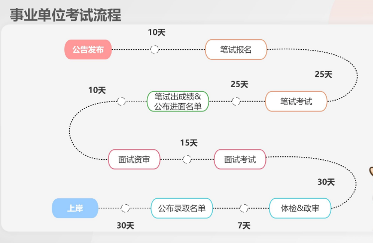

# Table of Contents

* [什么是事业单位？](#什么是事业单位)
* [事业单位与公务员的区别?](#事业单位与公务员的区别)
* [事业单位和公务员的差别在哪里](#事业单位和公务员的差别在哪里)
* [事业编招考流程](#事业编招考流程)
* [事业编联考时间线](#事业编联考时间线)
* [事业编在哪里报考？](#事业编在哪里报考)
* [事业编联考考什么？](#事业编联考考什么)
* [事业编可以报考那些岗位?](#事业编可以报考那些岗位)
* [事业编如何选岗？](#事业编如何选岗)
* [参考链接](#参考链接)

# 什么是事业单位？

事业单位是指由国家行政机关举办，受国家行政机关领导，没有生产收入、所需经费由公共财政支出、不实行经济核算、主要提供教育、科技、文化、卫生等活动非物质生产和劳务服务的社会服务组织，一般都是带有一定的公益性质的机构，才能被称为事业单位，跟公务员那种由国家财政负担工资的，是完全不一样的。一般常见的事业单位有科研单位、教育单位、文化单位，新闻、广播、出版单位，卫生单位，体育单位，勘察设计单位，农业、林业、水利和气象单位，社会福利单位，环境保护单位、交通、城市公用单位等

# 事业单位与公务员的区别?

事业单位目前共有三种形式，分别是全额拨款事业单位，差额拨款事业单位、自收自支事业单位。这三种的事业单位是完全不同形式的，下面一个一个的好好说一下。

首先、全额拨款事业单位是一种由国家直接进行预算拨款的管理形式，这种类别的事业单位通常都是学校、科研单位、疾病预防控制中心、工商管理等类别的，也就是说，这类事业单位里面的人员费用和单位费用等，都是由国家财政进行提供的，工资、福利这些都是最稳定的，能够保证按时发放的。

其次就是差额拨款事业单位，这种事业单位的预算主要由两部分部分组成，一部分是国家财政的拨款，另一部分就是自筹了。目前大部分事业单位人员工资是由财政发放的，之后是否会改变不得而知。但是后续会有很大的可能改成自收自支的单位，据说，一些地方的事业单位已经开始了。

最后，就是自收自支的事业单位了，这也是所有事业单位里面最不稳定的一个，因为这种事业单位是不会有国家财政拨款的，主要就是要靠自己动手，丰衣足食。但是这并不意味着这种单位就是一定是不能考的，还是要看这种单位自己有没有专门的进项，如果能有收入的话，是不会比前面两个差的。但是目前能够做到这点单位的比较少。

# 事业单位和公务员的差别在哪里

首先，就是工作性质和单位性质是不一样的，公务员的工资、福利什么的国家都是有着非常详细和严格的规定。而事业单位人员的工资和福利是没有那种详细和严格的规定的，要不是由财政进行支出，要不就是像自收自支那种由单位自行决定发放。其次就是编制的区别，这点还是挺大的，公务员是正经的行政编制，是政府机构的正式人员，是受到国家的管理的，会更加的严格，而事业单位人员就完全不是这样了，事业单位编制相当于是一个辅助编制，管理就会更加灵活的。

举个最简单的例子就是，做副业这件事，公务员是绝对不会被允许做副业的，一旦被举报就完了，如果你正巧还是一个小领导，那估计你的职业生涯就是到头了。但是，事业单位就比较宽松了，一般都是睁一只眼闭一只眼的，只要不太过分是没有人管的，严重程度是没有公务员高。

# 事业编招考流程
发布公告→注册报名→选岗→交报名费→报名确认→答应准考证→笔试→调剂→面试→体检→录用

# 事业编联考时间线
公告：事业单位公告上半年一般在3月底4月初，下半年8月底9月初发布。

联考：联考笔试时间上半年一般在5月，下半年在10月左。

# 事业编在哪里报考？

[全国事业单位招聘网](https://www.qgsydw.com/qgsydw/area.html)

这是事业编考试最重要的一个网站，里面可以查询全国各地事业单位的招牌资料，尤其后期，你的报名缴费、准考证打印、成绩查询都是在这里；

# 事业编联考考什么？
笔试科目:

《职业能力倾向测验》

考试时限：9 0 分钟，全部为客观题

《综合应用能力》

考试时限为1 2 0 分钟，客观题+主观题

上述两个考试科目满分均为1 5 0分，公共科目成绩按照科目成绩各占5 0 %合成确定。

注：公共科目《职业能力倾向测验》和《综合应用能力》两科考试连续进行，中间不间断。

面试：

常用结构化面试的方式，其次就是无领导小组讨论的方式。

# 事业编可以报考那些岗位?

事业单位联考ABCDE 类分别是：**综合管理类(A 类)、社会科学专技类(B 类)、自然科学专技类(C 类)、中小学教师类(D 类)、医疗卫生类(E 类)。**

一般来说只能报ABC

# 事业编如何选岗？

选岗要素：

不选异地、不选乡镇，异地且乡镇会让你离职冲动更强烈

不选三不限，三不限岗位往往竞争力最大，很容易陷入千人坑

岗位选择尽量选专业性强一点的，限制条件越多，报考的人就会越少，能上岸的几率会更大一些。有的岗位虽然只招一个人，单有时候报名人数很少，因为大家都认为竞争比例肯定很大。所以不要怕报招一个人的岗位。

我个人认为，就重要性而言，选岗大于备考。

事业单位考试本来就是是竞争性考试，越从众竞争越大，且未必适合自己。所以提前查好你要报的岗位往年的考试信息，知道自己考什么，竞争比例如何，提前开始备考。

不知道报什么岗位时，可用公考雷达，帮忙筛选一些合适你的岗位，再来对比，确定一个最优岗位。如果你想深入分析本省考情，根据自己的优劣势选岗，提高录取几率，可以像我一样，白嫖一些免费的事业编小白公开课~

# 参考链接

+ https://zhuanlan.zhihu.com/p/594460918?utm_id=0
+ [事业单位通识手册](./参考资料/【高顿】事业单位通识手册.pdf)
