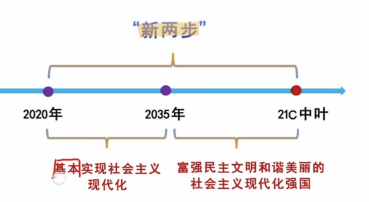

# Table of Contents

* [大纲](#大纲)
* [中国特色主义进入了新时达](#中国特色主义进入了新时达)
  * [社会主义初级阶段、新时代和新发展阶段](#社会主义初级阶段新时代和新发展阶段)
  * [一变2不变](#一变2不变)
* [科学体系-理论和实践](#科学体系-理论和实践)
  * [新思想重大时代课题](#新思想重大时代课题)
  * [科学体系](#科学体系)
    * [核心要义](#核心要义)
  * [科学体系-主要内容](#科学体系-主要内容)
    * [十个明确](#十个明确)
      * [明确党的领导](#明确党的领导)
      * [总任务](#总任务)
      * [主要矛盾](#主要矛盾)
      * [总体布局【5位一体，4个全面】](#总体布局5位一体4个全面)
      * [改革总目标](#改革总目标)
      * [全面依法治国总目标](#全面依法治国总目标)
      * [社会主义基本经济制度](#社会主义基本经济制度)
      * [强军目标](#强军目标)
      * [中国特色大国外交](#中国特色大国外交)
      * [从严治党](#从严治党)
    * [梳理十个明细脉络](#梳理十个明细脉络)
* [历史地位](#历史地位)
* [实现经济高质量发展](#实现经济高质量发展)
  * [概述](#概述)
  * [社会主义基本经济制度](#社会主义基本经济制度-1)
  * [具体措施](#具体措施)
* [发展社会主义民主政治](#发展社会主义民主政治)
  * [国体](#国体)
  * [人民当家做主的制度体系](#人民当家做主的制度体系)
* [文化](#文化)
  * [马克思主义在意识型态领域指导地位的根本制度](#马克思主义在意识型态领域指导地位的根本制度)
  * [配合和践行社会主义核心价值观](#配合和践行社会主义核心价值观)
  * [坚定文化自信，繁荣发展社会主义文化](#坚定文化自信繁荣发展社会主义文化)
* [民生为重点的社会](#民生为重点的社会)
  * [建设高质量教育体系-基础](#建设高质量教育体系-基础)
  * [加强和创新社会治理](#加强和创新社会治理)

# 大纲

+ 总论
  + 中国特色社会主义进入新时代 【背景】
  + 科协体系以及历史地位
+ 分论
  + 五位一体
    + 实现**经济**高质量发展
    + 发展社会主义民主**政治**
    + 建设社会主义**文化**强国
    + 加强以民生为重点的**社会**建设
    + 建设美丽中国【**生态**】
  + 四个全面
    + 全国建成小康社会 全面建设社会主义现代化国家
    + 全面深化改革
    + 全面依法治国
    + 全面从严治党
  + 重要保障
    + 加快国防和军队现代化
    + 坚持一国2制 ，推进祖国统一
    + 中国特色大国外交

# 中国特色主义进入了新时达

+ 中国特色社会主义**进入了新时代**，这是**我国发展新的历史方位**

> 随着国家经济发展，每个时间节点都会有不同的时代特征，就会有不同的思想和解决方案

## 社会主义初级阶段、新时代和新发展阶段

社会主义初级阶段：1956年三大改造完成-20世纪中叶基本实现现代化

1. 2012新时代：一个比较特殊的时间点，一个时代的开端
2. 2020新发展阶段：
   1. 是社会主义一个阶段
   2. 站、富、强
   3. 雄厚的物质基础
3. 2035基本实现现代化：

**共性和个性的关系**！！！

## 一变2不变

+ 社会主要矛盾变化

> 每个时代都有自己的主要矛盾

变的是

19大指出，我国社会主要矛盾已经转化为【**人民日益增长的美好生活需要和不平衡不充分的发展**】之间的矛盾

> 不平衡不充分改变不了消费者，只能改供给侧，是生产力存在问题

19大以前是【**人民日益增长的物质文化需要同落后的社会生产**】之间的矛盾

 没有变得是

1. 我国依然处于社会主义初级阶段
2. 并将长期处于社会主义初级阶段
3. 最大的发展中国家没有变
4. 历史地位没有变

> 问题需要解决，需要新思想应运而生！！

# 科学体系-理论和实践

## 新思想重大时代课题

**18大以来**，围绕【**新时代坚持和发展什么样的中特、怎么坚持和发展中特**】这个重大时代课题，形成了x时代中特实现。

> 任何时代都要解决当前条件下的时代命题
>
> 邓：社会主义
>
> 三：党的建设
>
> 科：发展
>
> 新时代：坚持和发展中特

时代在不断发展，思想也在不断完善和发展，到了**19届6中全会**：【**中特、社会主义现代化强国、长期执政的马克思主义政党**】

**是理论和实践的高度统一**

注意是强国！！！！

## 科学体系

+ 核心要义
+ 十个明确、14个坚持
+ 十三方面成就 20大 16个成就

### 核心要义

**新时代坚持和发展中特**，是改革开放以来我们党全部理论和实践的鲜明主题，也是x新时代中特核心要义

## 科学体系-主要内容

党的二十大报告指出，x新时代中特思想为19大、19大6中全会提出的【10个明确、14个坚持、13个成就】

> 19大：8明确 14坚持
>
> 19大6中：10 明确  13成就
>
> 20大：16成就 

### 十个明确

#### 明确党的领导

明确中国特色社会主义**最本质的特征**是中国共产党领导,中国特色社会主义**制度的最大优势**是中国共产党领导,中国共产党是**最高政治领导力量**,全党必须增强“四个意识”、坚定“四个自信”、做到“两个维护”

> 最本质的特征：
>
> 制度最大优势：
>
> 最高政治领导力量：

出现最本质、制度最大、最高政治领导、总览全局、根本保障、建军之本、强军之魂，一定选和党有关的

>  可以这么想，社会主义是道路，走好这条路需要党的带领

#### 总任务 

总任务实现社会社会主义**现代化**和中华民族伟大**复兴**，在全面建成小康社会的基础上，**分2步**在本世纪中叶建成富强民主文明和谐美丽的社会主义**现代化强国**,以**中国式现代化**推进中华民族伟大复兴。

+ 实现伟大复兴的中国梦

中国梦就是中华民族的伟大复兴

出现什么词选复兴？中国梦、伟大工程、伟大梦想

> 1. 提出：2012年 复兴之路展览
> 2. 本质：国家富强、民族振兴、人民幸福
> 3. 途径
>    1. 走中国道路
>    2. 弘扬中国精神：爱国主义为核心、改革开放创新、
>    3. 凝聚中国力量：人民的力量 全国各民族人民大团结
> 4. 

+ 2步走战略安排

都是10年一个小目标

2020：全面建成小康社会

+ 中心任务

中心任务就是团结带领全国各民族人民全面建成**社会主义现代化强国**，实现**第二个百年**奋斗目标，以**中国式现代化**全面推进中华民族伟大**复兴**

> 第一个百年【党100】：全面建成小康社会
>
> 第二个百年【新中国100】：社会主义现代化强国

#### 主要矛盾

明确新时代我国社会庄要矛盾是人民日益增长的**美好生活需要和不平衡不充分的发展之间**的矛盾,必须坚持以人民为中心的发展思想,发展全过程人民民主,推动人的全面发展、全体人民共同富裕取得更为明显的实质性进展;

#### 总体布局【5位一体，4个全面】

5位一体，4个全面

明确中国特色社会主义事业总体布局是**经济建设、政治建设、文化建设、社会建设、生态文明建设**五位一体,战略布局是**全面建设社会主义现代化国家、全面深化改革、全面依法治国、全面从严治党**四个全面:

#### 改革总目标

明确全面深化改革总目标是完善和发展中国特色社会主义**制度**、推进国家**治理体系**和**治理能力**现代化;

只能从制度上去优化

制度->经济关系->生产关系->生产力

> 改革提供动力，但是社会不一定稳定。

#### 全面依法治国总目标

明确全面推进依法治国总目标是建设中国特色社会主义**法治体系**，建设社会主义**法治国家**;

> 1. 靠法治来维护社会稳定
> 2. 深化改革和依法治国 【车之2轮子，鸟之2翼 大大说的话】

#### 社会主义基本经济制度

明确必须坚持和完善**社会主义基本经济制度**,使**市场**在资源配置中起**决定性作用**,更好发挥**政府**作用，把握**新发展阶段**,贯彻【创新、协调、绿色、开放、共享】的**新发展理念**,加快构建以【**国内大循环为主体**、国内国际双循环相互促进】的**新发展格局**,推动**高质量发展**,统筹发展和安全;

> 新发展理念：18届5中全会，写入宪法
>
> 

+ 社会主义基本经济制度

1. 公有制为主体，多种所有制

   > 1. 公有：
   >    1. 组成：国有、集体、混合所有制国有成分【提高国有竞争力】
   >    2. 主体：**公有资产**在社会总资产占优势、**国有经济**控制经济命脉、**国有企业**是支撑
   > 2. 非共有：
   >    1. 组成：个体、私营、外资、混合所有制非公有 
   >       个体私营：是否产生雇佣关系
   >    2. 根本原因：适应生产力的需要
   >    3. 地位：**社会主义市场经济的主要组成部分**
   >       社会主义经济：纯共有经济
   >       公有制是**社会主义市场经济的主要组成部分**也是对的！！！！

2. 按劳分配为主，多种分配方式并存

   > 1. 公有制-按劳分配	
   >    1. 国企工作人员、农村集体工地、事业单位
   > 2. 非公有制-按要素分配
   >    1. 劳动要素：劳动成果、民营企业员工
   >    2. 资本要素：货币资本、利息、股息、红利
   >    3. 管理要素：
   >    4. 知识产权：

3. 社会主义**市场**经济体制

   > 1. 14大提出 收题
   > 2. 18届三中：处理政府和市场的问题
   > 3. 18届4中全会：本质上是法治经济
   > 4. 19届5中全会：有效市场和有为政府

+ 建设社会主义现代化国家的**战略导向**(三新)

  1. 创新：引领发展**第一动力**->解决发展动力问题

     > 1978 粗放型  地、人、资源  要素投入
     >
     > 科技创新->核心位置

  2. 协调：**持续**健康发展的内在要求->解决发展不平衡问题

     > 保证经济列车不翻车
     >
     > 区域、领域、城乡

  3. 绿色：永续发展必要条件->人与自然和谐共生

  4. 开放：繁荣发展的必由之路->发展内外联动问题

  5. 共享：本质要求->社会公平正义问题

  6. 提出是在18届5中全会
  
  
  
  经济列车

1. 要动力
2. 要稳
3. 环境要好
4. 车门打开 赚钱
5. 实现共享 

+ 新发展格局
  

内涵：**国内大循环为主体**、国内国际双循环相互促进

关键：经济循环的畅通无阻
本质特征：高水平的自立自强

#### 强军目标

明确党在新时代的**强军目标**是建设一支**听党指挥、能打胜仗、作风优良**的人民军队，把人民军队建设成为**世界一流军队**;

#### 中国特色大国外交

明确**中国特色大国外交**要服务民族复兴、促进人类进步,推动建设新型国际关系，推动构建人类命运共同体;

#### 从严治党

明确**全面从严治党**的战略方针,提出**新时代党的建设总要求**,全面推进党的政治建设、思想建设、组织建设、作风建设、纪律建设,**把制度建设贯穿其中**,深入推进反腐败斗争,落实管党治党政治责任,以伟大自我革命引领伟大社会革命。

+ 主线：党的长期执政
+ 统领：政治建设是方向
+ 根基：理想、信念、宗旨

### 梳理十个明细脉络

1. 中国未来必须要有一个坚强的领导：党
2. 党领导我们做什么->总任务
3. 认清中国的实际情况->主要矛盾
4. 如何解决这个矛盾-> 5 4
5. 三个目标作为保障
6. 新增：基本经济制度、从严治党
7. 外部：大国外交

党->总任务->主要矛盾-> 5 4-> 改革、法治、强军

# 历史地位

中国特色社会主义思想是**当代中国马克思主义**、二十一世纪马克思主义是中华文化和中国精神的**时代精华**,实现了**马克思主义中国化时代化新的飞跃**。

> 夸他的肯定要选
>
> 19大：写入党章
>
> 13届人大：写入宪法

# 实现经济高质量发展

## 概述

党的二十大报告指出,**高质量发展**是**全面建设社会主义现代化国家的首要任务**。**发展**是党执政兴国的**第一要务**

发展生产力(根本任务)  --考对应

+ 邓：发展是硬道理
+ 三个：第一要务
+ 科：第一要义
+ 新：基础和关键

高速->中高速->高质量

----

+ 为什么要**高**质量发展？

1. 解决人民美好生活需求
2. 生产端改革：供给侧结构改革
3. 质的稳步提升和量的稳定增长

高质量发展是主题
地位：

## 社会主义基本经济制度

(一)公有制为主体、多种所有制经济共同发展

(二)以按劳分配为主体,多种分配方式并存

(三)社会主义市场经济体制

## 具体措施

1. 贯彻新发展理念 【创新、协调、绿色、开放、共享】
2. 推进供给侧结构性改革 【推进供给**侧结构性改革**作为经济发展的主线】
3. 建设现代化经济体系
   1. 着力点：**实体经济** 【立身之本 财富之源】

# 发展社会主义民主政治

## 国体

中华人民共和国是**工人阶级领导**的、以**工农联盟为基础**的人民民主专政的社会主义国家,国家的一切权力属于人民。**人民民主专政是我国的国体。**人民民主专政的本质是**人民当家作主**

+ 本质：人民当家做主

容易跟**政体**混着考

+ 人民和公民区别
  + 人民：政治概念 ，不分国籍，拥护社会主义
  + 公民：法律概念 公民可能有敌人

## 人民当家做主的制度体系

+ 根本政治制度：人大 
  + 实质：确保人民当家做主 
  + 【政体】：国体决定政体、政体体现国体
+ 基本政治制度
  + 党领导的多党合作和政治协商（政党制度）
    + 内容
      + **共产党是执政党，各名族党派 参政、议政**
      + 前提：坚持党领导、坚持四项基本原则
      + 基本方针：长期共存、互相监督、肝胆相照、荣辱与共
      + 政治上是领导、法律上平等、亲密战友
      + 根本活动准准：遵守宪法和法律
    + 载体
      + **政协会议：爱国统一战线组织** 是组织！！！
      + 职能：政治协商、民主监督、参政、议政【只能商量】
  + 民族区域自治制度
    + 自治地方：区、州、县
    + 自治机关：区、州、县的人大或者政府
  + 基层群众自治【村集体、居委会】
    + 老百姓自己管理自己
    + 后面的**枫桥经验**

# 文化

## 马克思主义在意识型态领域指导地位的根本制度

**意识形态**关乎旗帜、关乎道路、关乎国家安全,**决定文化前进方向和道路**。坚持**马克思主义在意识形态领域指导地位的根本制度**,是坚持和加强党对宣传文化事业全面领导的本质要求，

+ 意识形态为特定阶级服务的
+ 自然科学属于非意识形态

-----

+ 二十大中关于马克思主义

**马克思主义是我们立党立国、兴党兴国的根本指导思想。**实践告诉我们,中国共产党为什么能,中国特色社会主义为什么好,归根到底是马克思主义行,是中国化时代化的马克思主义行。拥有马克思主义科学理论指导是我们党坚定信仰信念、把握历史主动的根本所在。

	1. 马克主义行
 	2. 中国化时代化 马克思主义行

-----

## 配合和践行社会主义核心价值观

**核心价值观**,承载着一个民族、一个国家的精神追求,体现着一个社会评判是非曲直的价值标准,是一个民族赖以维系的精神纽带,是一个国家共同的思想基础

富强、民主、文明、和谐--国家层面
自由、平等、公正、法治--社会层面:
爱国、敬业、诚信、友善--公民层面

> 会考哪个层面对应哪个

## 坚定文化自信，繁荣发展社会主义文化

文化基础是**更基础、更广泛、更深厚**的自信，是一个国家、一个民族、发展中**更基础、更深沉、更持久**的力量

# 民生为重点的社会

**为民造福**是立党为公、执政为民的**本质要求**。必须健全幼有所育、学有所教、劳有所得、病有所医、老有所养、住有所居、弱有所扶等方面国家基本公共服务制度体系,尽力而为,量力而行,注重加强**普惠性、基础性兜底性民生建设**,保障群众基本生活

> 定位词：人民相关
>
> 核心立场、政治立场、本质要求、根本出发点、落脚点、结合点、根本目的 选人民没错

## 建设高质量教育体系-基础

教育是民族振兴、社会进步的**重要基石**。建设教育强国是民族复兴的**基础工程**。**培养什么人、怎样培养人、为谁培养人**是教育的根本问题。

育人的根本在于**立德**

> 民生之基
>
> 百年大计
>
> 教育根本是立德
>
> 

+ 二十大教育观点

**教育、科技、人才**是全面建设社会主义现代化国家的**基础性、战略性支撑**。必须坚持**科技是第一生产力、人才是第一资源、创新是第一动力**,深入实施科教兴国战略、人才强国战略、创新驱动发展战略,开辟发展新领域新赛道,不断塑造发展新动能新优势，

+ 实施就业有限战略

**就业是最基本的民生、最大的民生**,是人民生存的经济基础和基本保障是最大的民生工程、民心工程、**根基工程**

> 民生之本
>
> 就业**优先**战略

+ 优化收入分配结构

**收入分配是民生之源**,是改善民生、实现发展成果由人民共享最重要最直接的方式，
坚持多劳多得,鼓励勤劳致富,促进机会公平,**增加低收入者收入,扩大中等收入群体。规范财富积累机制,保护合法收入,调节过高收入,取缔非法收入。**

> 民生之源
>
> 构建橄榄型社会 中间大2头小

## 加强和创新社会治理

加强社会治理制度建设,要完善**党委领导、政府负责、民主协商、社会协同、公众参与、法治保障、科技支撑**的社会治理体系,充分调动各方面积极性，建设**人人有责、人人尽责、人人享有**的社会治理共同体

> 1. “共建”是基础 ，“共治”是关键，“共享”是目标，“三共”治理理念包容实体上的共同建设、行动上的共同治理、以及成果的共同享有，共建共治共享”三位一体，三者统一于“共”

坚持和发展新时代“**枫桥经验**，畅通和规范群众诉求表达、利益协调权益保障通道,完善信访制度,完善人民调解、行政调解、司法调解联动工作体系,完善社会矛盾纠纷多元预防调处化解机制,努力将**矛盾化解在基层。**

> 毛泽东  1963提出
