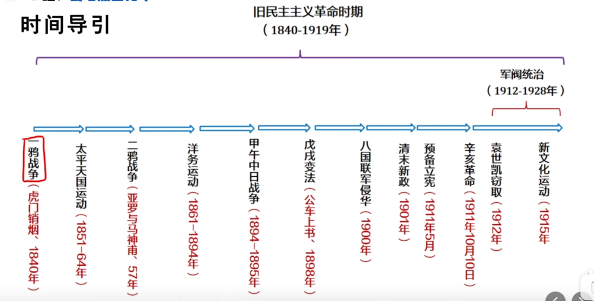
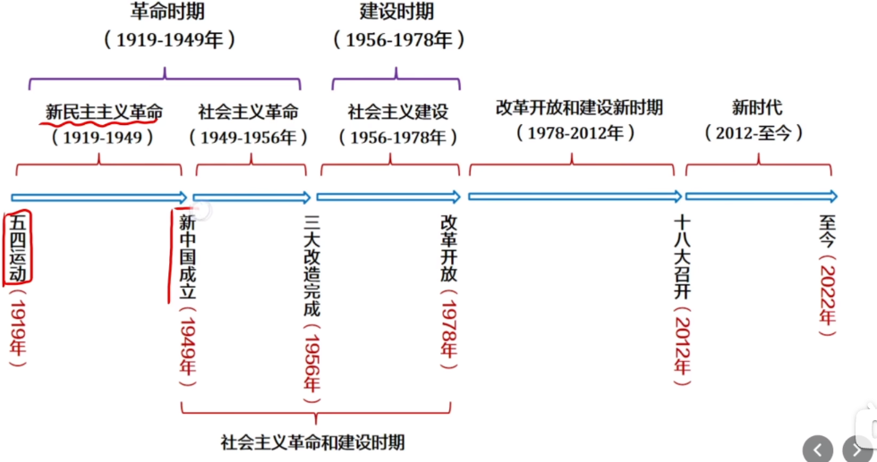

# Table of Contents

* [总时间线](#总时间线)
* [旧民主主义革命(1840-1919)](#旧民主主义革命1840-1919)
* [新民主主义革命(1919-1949)](#新民主主义革命1919-1949)
* [建设时期 (1956-1978)](#建设时期-1956-1978)
* [改革开放建设新时期(1978-2012)](#改革开放建设新时期1978-2012)
* [新时代(2012)](#新时代2012)

# 总时间线

# 旧民主主义革命(1840-1919)

 +   1840 鸦片战争 虎门销烟
 +   太平天国运动【农民阶级不能救中国】
 +   二次鸦片战争
 +   洋务运动 【地主阶级自救不能救中国】
 +   甲午中日战争
 +   戊戌变法
  +   资产阶级-改良派
   +   八国联军侵华
  +   清末新政
   +   辛亥革命 1911
 +   资产阶级革命派 孙中山
  +   半殖民地半封建社会
  +   军阀统治混战
+   袁世凯窃政
 +   	新文化运动 1915年

# 新民主主义革命(1919-1949)

 + 五四运动 1919年 【工人阶级】
 + 巴黎和会失败
 + 彻底反帝反封建
 + 促进马克思主义传播和干部准备
 + 	中共一大 1921 上海嘉兴
 + 中共二大 1922 反帝反封建的革命纲领
 + 中共三大 1923 决定实行国共合作
 + 	1924年 中国国民党一大召开，孙中山提出三大主张，第一次国共合作开始，共同掀起国民大革命
 + 	1927 国共合作破裂
 + 南昌起义
 + 	土地革命 红军长征 1934年
 + 	抗日战争 七七事变 1937年
 + 解放战争1946

# 建设时期 (1956-1978)
 + 三大改造【新民主主义变为社会主义】

# 改革开放建设新时期(1978-2012)

 + 	改革开放

# 新时代(2012)
 + 	十八大

参考链接：https://zhuanlan.zhihu.com/p/365853348
