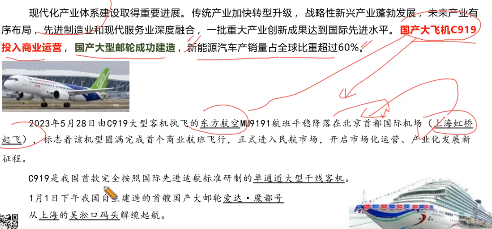
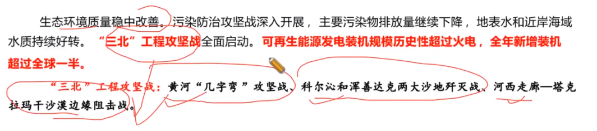
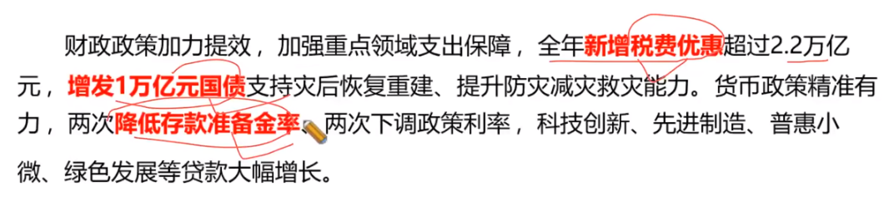
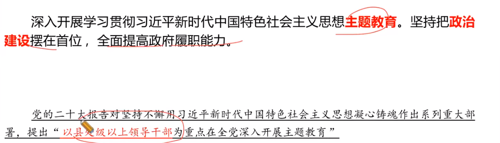
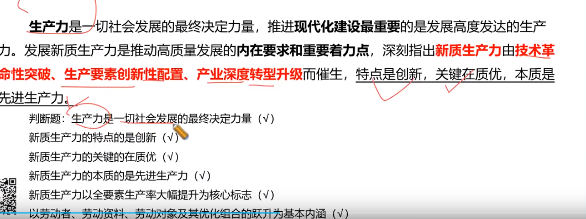
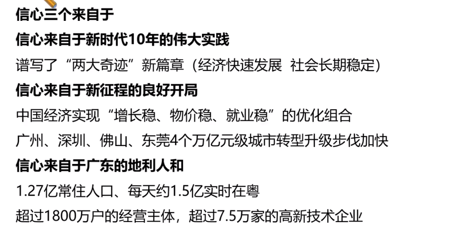
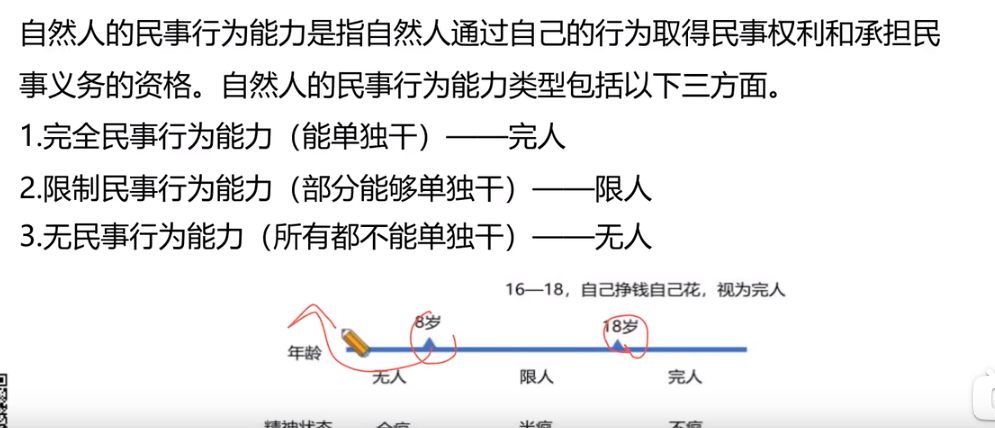
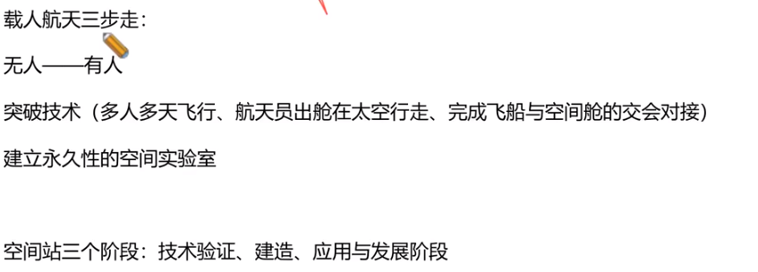

# Table of Contents

* [政府报告](#政府报告)
* [高质量发展大会](#高质量发展大会)
* [宪法](#宪法)
* [民法](#民法)
* [行政法](#行政法)
* [文史](#文史)
* [二十四节气](#二十四节气)

三大主粮：水稻、玉米、小麦

# 政府报告

1. 一点2地：
   1. 扎实打造新发展格局的战略支点
      (坚持软硬联通一起抓)
   2. 加快打造高质量发展的示范地(以产心科技合作为重点，把横琴、前海、南沙、河套这几个龙头舞起来。)
   3. 全力打造中国式现代化的引领地(持续推进就业、教育、医疗、社保等领域合作，支持港澳更好融入国家发展
2. 区域创新7年第一：  首个13万亿，总量连续35年 ：服务5年全国首位
3. 深圳第二个万亿  佛山第二个规模以上工业总值3万亿
4. 三保底线保基本民生、保工资、保运转
5. 海洋生产总值14%，总量29年全国首位
6. 智能化养殖平台：阳江 明天渔一号
7. 全国首 ：珠海云
8. 国内首套百万吨级氢基竖炉项目在**湛江宝钢**点火投产

# 高质量发展大会

# 宪法

+ 1949 年9月召开了具有广泛代表性的中国人民政治协商会议，制定了起临时宪法作用的《中国人民政治协商会议共同纲领》
+ 新中国的第一部社会主义类型的宪法是 **1954年宪法。**
+ 1982 年 12 月4日，通过了新中国的第四部宪法，即现行宪法。全国人民代表大会分别于 1988年、1993年1999 年、2004 年和 2018 年对宪法进行了五次修改。
+ 修改宪法：1/5 提议 2/3通过
+ 全国人大：三席、三高、三提名
+ 全国人常
  + 规定和决定授予国家勋章和荣誉称号
  + 决定特赦
+ 国务院：行政法规
+ “**健全社会主义法制**”修改为“健全社会主义法治”

# 民法

+ 情谊行为不属于民法
+ 平等原则、自愿原则、公平原则、诚实信用原则。
  5.不得违反法律和公序良俗的原则。6.有利于节约资源和保护生态环境的原则(简称绿色原则)
+ 出生正面开始 -死亡证明
+ 
+ 16岁是童工的界定
+ 监护是对**未成年人和无民事行为能力**或者**限制民事行为能力**的成年人监督其行为，并且管理其财产的法律制度。

# 行政法

+ 是官管民

# 文史

+ **不锈钢和铝合金**不能放到微波炉加热
+ 维生素A-维持人的正常视觉--夜盲症
  维生素B1--维持神经系统的正常功能--脚气病
  维生素C--维持肌肉和血管等正常作用--坏血病
  维生素D--促进钙、磷吸收和骨骼发育--向偻病
  维生素E--对抗自由基，抑制过氧化脂质生成--美容
  维生素K--促进血液正常凝固--不正常凝血
+ 矿物质
  碘缺乏会引起甲状腺肿大，铁缺乏会引起缺铁性贫血，锌缺乏会引起食欲不振、生长迟缓、发育不良。最决乏会导致龋齿。
+ 过多燃烧煤炭、石油和天然气导致二氧化碳大量排放，引发地表与低层大气温度增高。温室气体有**二氧化碳、甲烷、臭氧等**
+ 汽车尾气排放的污染物有 PM2.5、氮氧化物等。PM2.5 又称细颗粒物或可入肺颗粒物，指环境空气中空气动力学当量直径小于等于 2.5 微米的颗粒物。氯氧化物在其他化学物质的共同作用下可能导致光化学烟雾。
+ 
+ 神州十二 首次载人飞行任务
+ 神舟十七首次空间中舱外维修
+ 梦天 问天 核心舱是天和  神舟载人、天舟 货运

# 二十四节气

春雨惊春清谷天，

夏满芒夏暑相连。

秋处露秋寒霜降，

冬雪雪冬小大寒。

春季:立春、雨水、惊蛰、春分、清明、谷雨

夏季:立夏、小满、芒种、夏至、小暑、大暑

秋季:立秋、处暑、白露、秋分、寒露、霜降

冬季:立冬、小雪、大雪、冬至、小寒、大寒

春分:春分这一天太阳直射赤道，昼夜等长。
夏至:太阳直射北回归线，白昼最长。
秋分:日光直射赤道，形成昼夜等长:
冬至:太阳直射南回归线，北半球的白昼达到最短，且越往北白昼越短
