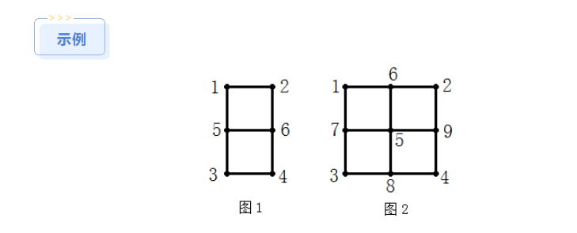
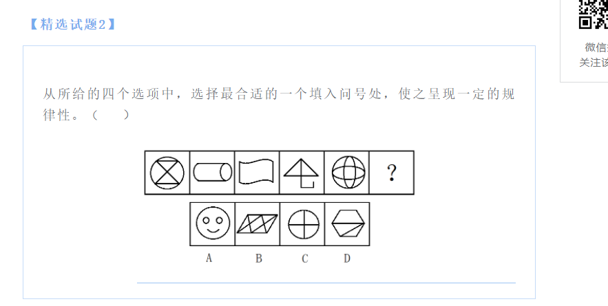

# Table of Contents

  * [一、资料分析——增长量/率和同/环比](#一资料分析增长量率和同环比)
    * [　　1、增长量和增长率](#　　1增长量和增长率)
    * [　　2、同比和环比](#　　2同比和环比)
  * [二、资料分析——易混淆的三个点](#二资料分析易混淆的三个点)
    * [　　1、百分数和百分点](#　　1百分数和百分点)
    * [　　2、倍数和翻番](#　　2倍数和翻番)
    * [　　3、平均数和中位数（略）](#　　3平均数和中位数略)
    * [三、资料分析——比重和指数](#三资料分析比重和指数)
  * [四、数学运算——必考的几个点](#四数学运算必考的几个点)
    * [　　1、行程问题](#　　1行程问题)
    * [　　2、工程问题](#　　2工程问题)
    * [　　3、浓度](#　　3浓度)
    * [　  4、集合](#　--4集合)
  * [五、行程问题必知的几个点](#五行程问题必知的几个点)
    * [　　1、反比](#　　1反比)
    * [　　2、流水行船](#　　2流水行船)
    * [　　3、火车过桥](#　　3火车过桥)
    * [　　4、时钟问题](#　　4时钟问题)
    * [　　5、发车问题](#　　5发车问题)
  * [六、“设1法”的原理](#六设1法的原理)
    * [　　1、原理](#　　1原理)
    * [　　2、改进-最小公倍数](#　　2改进-最小公倍数)
  * [七、整除规律](#七整除规律)
    * [　　1、能被2、3（9）、5整除的数字规律](#　　1能被2395整除的数字规律)
    * [　　2、能被2、4、8或5、25、125整除的数字规律](#　　2能被248或525125整除的数字规律)
    * [　　3、能被7、11、13整除的数字规律](#　　3能被71113整除的数字规律)
    * [　　4、相关例题](#　　4相关例题)
  * [八、数列及其和](#八数列及其和)
    * [　　1、等差数列](#　　1等差数列)
    * [　　2、等比数列](#　　2等比数列)
  * [九、最小公倍数和同余定理](#九最小公倍数和同余定理)
    * [　　1、最小公倍数](#　　1最小公倍数)
    * [　　2、同余定理](#　　2同余定理)
  * [十、排列组合](#十排列组合)
    * [　　1、公式](#　　1公式)
    * [　　2、两个基本原则](#　　2两个基本原则)
  * [十一、图形推理——对称](#十一图形推理对称)
    * [　　1、概念](#　　1概念)
    * [　　2、判断是轴对称还是中心对称：时针法（见后）](#　　2判断是轴对称还是中心对称时针法见后)
  * [十二、图形推理——旋转和翻转](#十二图形推理旋转和翻转)
    * [　　1、概念](#　　1概念-1)
    * [　　2、判断是旋转还是翻转](#　　2判断是旋转还是翻转)
    * [　　3、判断旋转了几度](#　　3判断旋转了几度)
    * [　　4、判断是上下翻转还是左右翻转](#　　4判断是上下翻转还是左右翻转)
* [一眼识别一笔画图形](#一眼识别一笔画图形)
  * [**如何辨别数笔画题型**](#如何辨别数笔画题型)
  * [**如何数图形的笔画数**](#如何数图形的笔画数)
  * [上述方法中，需要注意几个概念](#上述方法中需要注意几个概念)
  * [练习](#练习)
  * [参考链接](#参考链接)
* [参考资料](#参考资料)

## 一、资料分析——增长量/率和同/环比

### 　　1、增长量和增长率

 　思考下面三个问题：

- 今年产量为M比去年产量N多多少？
- 今年产量比去年产量增长了多少百分比？
- 去年产量比今年产量减少了多少百分比？

　　对于M比N这种问题，我们一般将**“比”字后面**的N称为**基期**，“比”字前面的M称为**现期**。

　　所以：

- **增长量** = 现期 - 基期
- **增长率** = 增长量 / 基期

### 　　2、同比和环比

　　同比和环比的都是求增长率，区别在于**基期不同：**

- 同比的基期：上个时间段的同期
- 环比的基期：上期

　　比如2018年1月产量为M，同比增长率10%，环比下降率5%。相当于2018年4月产量为M，比2017年4月增长了10%，比2017年12月增长了5%。

## 二、资料分析——易混淆的三个点

### 　　1、百分数和百分点

　　思考这样一个问题：

- 10%比6%增加了多少百分数？

　　如果你答4%，那么就大错特错了，思考同样的问题“今年产量M比去年产量N增长了多少百分比？”这个问题很明显是求增长率的，所以答案应该 = (10%-6%)/6% = 66.6%。但是如果4%换一个说法也可以作为答案，即“10%比6%增加了4%个百分点”。

　　所以**百分数是求增长率，而百分比是求两个百分数之间的差值**。

### 　　2、倍数和翻番

　　我们常说的倍数就是几倍的意思，而**翻一番是指两倍**的意思，所以翻两番就是四倍的意思。以此类推，

- **翻n番 = 2^n倍。**

### 　　3、平均数和中位数（略）

### 三、资料分析——比重和指数

- 比重是指部分占整体的百分比。
- 指数是指任何两个数字对比形成的**相对数**都可以称为指数。例如一串数字：50、133、154、180
  假设这是第一季度的用电量，求后三个月份的用电增长率。我们可以很容易使用公式 = 本月用电量增量 / 上月用电量。这是数字相对简单的情况，如果很复杂或很多时我们就不容易计算了，所以统计学者考虑到：可以将按某种比例换算成相对数，以此便于计算数据间的比值，这样就得到了一个指数表：100、266、308、360。这样计算就变得简单明了，基本可以口算得到，这就是指数的作用。

> 50、133、154、180 如果计算增长率是比较麻烦的，但是在原有基础上都乘以相同的数 ’2‘，就会变成
> 100、266、308、360 
>
> 计算增长率就会笔记简单点
>
> (266-100)/100=16.6%

## 四、数学运算——必考的几个点

### 　　1、行程问题

　　假设同一时间出发，有以下两种情况：

- 相遇问题：路程和 = 速度和 × 相遇时间
- 追及问题：路程差 = 速度差 × 追及时间

### 　　2、工程问题

- 工作总量 = 工作效率 × 工作时间
- 合作效率 = 个体效率之和

### 　　3、浓度

- 浓度是指单位溶液中所含溶质的量。（这里量可以是质量，也可以是体积）。
- 公式：浓度 = (溶质 / 溶液)×100% = 溶质 / (溶质+溶剂)。

### 　  4、集合

- 并集
- 交集
- 全集和补集

## 五、行程问题必知的几个点

### 　　1、反比

　　基本公式为S = vt。追及问题中则有：v1/v2 = t2/t1。这样有时会方便计算。

### 　　2、流水行船

- 顺流而下的速度 = V船 + V水
- 逆流而上的速度 = V船 - V水　　

### 　　3、火车过桥

### 　　4、时钟问题

- V时针 = 30度/时 = 0.5度/分钟
- V分钟 = 6度/分钟

### 　　5、发车问题

　　设发车间隔为t，那么两车间隔 = V车 × t

## 六、“设1法”的原理

### 　　1、原理

　　例题：假设甲做完一项任务需要6天，乙做完同样的任务需要3天，那么两人一起工作需要几天？

　　很明显这是一个工程问题，那么工作时间 = 工作总量/工作效率。现在我们不知道工作总量是多少，一般我们会假设为1，那么工作时间 = 1 / （1/6+1/3）= 2天，这是因为无论我们将工作总量设为多少，比如m来计算都不会影响计算结果。

　　所以“设1法”的**原理其实就是一个不影响答案的未知数**我们可以**设置为1**来方便计算。

### 　　2、改进-最小公倍数

　　除了设置为1，其实我们可以设置为任意数，那么为了方便计算，我们应该**尽量设置为方便计算的数**，比如：

　　例题：一项工程，甲完成需要6天，乙完成需要4天，那么甲乙一起工作需要几天？

　　同样的，我们可以不设置工程量为1，我们可以设置为6和4的**公倍数**，这样会方便计算，所以需要天数 = 24/(4+6) = 12/5 = 2.4天。

## 七、整除规律

　　掌握一些整除规律能让我们快速排出一些选项。

### 　　1、能被2、3（9）、5整除的数字规律

- 能被2整除的数字一定是偶数
- 能被5整除的数个位一定是0或5
- 各个位置上的数字之和能被3（9）整除的数就能被3整除

### 　　2、能被2、4、8或5、25、125整除的数字规律

- 2（5）：**个位**数字能被2（5）整除
- 4（25）：**最后两位数字**能被4（25）整除
- 8（125）：**末三位数字**能被8（125）整除

### 　　3、能被7、11、13整除的数字规律

- **末三位与末三位之前的数字之差**能被7、11、13整除。比如1122的末三位是122，之前的数字为1，差为121能被11整除，那么1122也能被11整除。

### 　　4、相关例题

　　例1：某班学生在操场上做操，人数在90～110之间，若过排成3排则不多不少，排成完整的5排少2人，排成完整的7排少4人，那么学生人数为？（）

　　A、102   B、98   C、104  D、108

　　分析：首先能被3着整除，根据整除特点直接排出B和C。排成5排少2人，那么这个数字+2就能被5整除，能被5整除的数字各位是0或5，那么学生人数各位就是8或3，排除A，直接选D。

## 八、数列及其和

### 　　1、等差数列

　　计算公式：

- 
- 

　　但我们一般很少使用这个公式求和：

- 使用**平均数法求和**：Sn = n*平均数 = （a1+an）n / 2
- 常见的等差数列：自然数列，公差为1的数列。

### 　　2、等比数列

- 
- 

## 九、最小公倍数和同余定理

### 　　1、最小公倍数

>  如何计算最小公倍数？
>
>  *18*和*30*的最大公约数是*6*，要求*18*和*30*的最小公倍数时，可以先用*18*除以*6*得*3*，再用*3*和*30*相乘得*90*；或者先用*30*除以*6*得*5*，再用*5*和*18*相乘得*90*。这*90*就是*18*和*30*的最小公倍数。

　　例1：一个数除以32、36、48都余15，那么这个数最小为（）

　　A、289    B、297     C、303    D、363

　　解析：其实0可以整除这些数，但答案没有15，我们接着看，假设这个数为x，那么x+15都能被32、36、48整除，要求最小数字，即求最小公倍数，所以这三个数的最小公倍数 = x+15即可求出x。

　　例2：两个数的公约数为2，公倍数为1344，一个数为42，那么另一个数为?（）

　　A、52    B、54     C、62   D、64

　　解析：其实有一个规律：

- **两个数的乘积 = 最大公约数 × 最小公倍数**

　　所以答案很简单就可以计算得到 = 2×1344/42 = 64。

### 　　2、同余定理

1. 余同取余（余同加余）
   如果一个数的除以其他数的得到的余数都相同，那么这个数可能为 = 这些除数的最小公倍数×n + 约数
   例：一个数除以2余1，除以3余1，除以7也余1，那么这个数可能为：
   A、41    B、42      C、85     D、84
   解析：2、3、7的最小公倍数为42，这个数可能为：42n + 1，选项中只有C符合
2. 差同减差
   如果一个数除以其他数得到的余数，对应的除数和余数差值d相同，那么这个数就可能为 = 这些除数的最小公倍数×n - 差值d
   例：一个数除以3余2，除以4余3，除以5余4，那么这个数可能为（）
   解析：3，4，5的最小公倍数为60，上述除数和余的差都为1，所以这个数可能为：60n - 1
3. 和同加和
   如果一个数除以其他数得到的余数，对应的除数和余数和m相同，那么这个数就可能为 = 这些除数的最小公倍数×n + 和m
   例：一个数除以4余3，除以5余2，除以6余1，那么这个数可能为（）
   解析：4、5、6的最小公倍数为60，余数和除数之和都为7，那么这个数可能为 = 60n + 7。

## 十、排列组合

### 　　1、公式

- 
- 

### 　　2、两个基本原则

- 不同的问题要**分类相加**
- 不同的步骤要**分步相乘**
  例：A点到B点有几种出行方式和路线先选择？
  
  解析：A到B首先有三条线路，这是分类相加的情况；每条线路又可以选择不同的出行方式，这是分步相乘的情况。所以A点到B点的出行方式选择有：1+3+2=6种。

## 十一、图形推理——对称

### 　　1、概念

- **沿着某一直线进行对折**能够完全重合的图形称为轴对称图形。
- **沿着某一个点旋转180度**后能和旋转前完全重合的图形称为中心对称图形。

　　

### 　　2、判断是轴对称还是中心对称：时针法（见后）

　　

## 十二、图形推理——旋转和翻转

### 　　1、概念

- 旋转是图形绕某一点的**平面转动**。上面说到的中心对称图形就可以旋转180度而重合。
- 翻转是图像以某一直线进行**空间转动。**上面说到的轴对称图形中折叠就是翻转90度的意思。

### 　　2、判断是旋转还是翻转

- **时针法**：任意找三点画弧线，如果比较的图像旋转方向一致就是旋转，反之为翻转。
  
  

### 　　3、判断旋转了几度

- **箭头法**：
  

### 　　4、判断是上下翻转还是左右翻转

　　

# 一眼识别一笔画图形

## **如何辨别数笔画题型**

笔画规律常考特征图形：**五角星、月亮、“日”、“田”、“日”和“田”**的变形图形、相切的图形。当看到题目中出现以上特征图形时，可以优先考虑数笔画。

## **如何数图形的笔画数**

对于简单图形，可通过画图的方式直接得出。对于复杂图形，可通过下列公式进行计算。

连通图的笔画数计算方法：对一个连通图，含有2n个奇点的图形为n笔画（n≥1），即连通图的**笔画数＝奇点数÷2。**

## 上述方法中，需要注意几个概念

***\*连通图\****：如果图形中任意两点都是连通的，那么该图形被称作连通图。

**奇点**：若以一个点为起点，延伸出的线条数为奇数，则该点为奇点。

***\*偶点\****：若以一个点为起点，延伸出的线条数为偶数，则该点为偶点。

注意：**奇点包括端点**。

图1中，以点1、2、3、4为起点，延伸出来的线都是2条，偶数条，因此它们均为偶点；以点5、6为起点，延伸出来的线都是3条，因此它们均为奇点。图1奇点数为2，可以一笔画成。

图2中，以点1、2、3、4为起点，延伸出来的线都是2条，偶点；以点5为起点延伸出来的线为4条，偶点；以点6、7、8、9为起点，延伸出来的线都为3条，奇点。图2奇点数为4，笔画数＝4÷2＝2，故需两笔画成。

## 练习

题干图形元素组成不同，且无明显属性规律，优先考虑数量规律。题目中出现了考笔画数的特征图，如第二个图是“**日**”的变形图和C项是“**田**”的变形图，以及一眼就可看出一笔画成的第三个图，因此优先考虑笔画数。观察发现题干图形均为一笔画图形，照此规律，第六个图形也应是一笔画图形。观察选项，只有D项符合。故选D。

## 参考链接

+ https://mp.weixin.qq.com/s/7ZHSMn89WlvWrhGnKp4MpQ

# 参考资料

