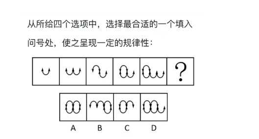
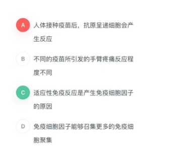

# Table of Contents

* [单定义-其他句式](#单定义-其他句式)
* [数量规律](#数量规律)
* [搭桥](#搭桥)

# 单定义-其他句式

1. 价值工程是指通过对设施、产品、服务或流程等进行功能和全寿命成本分析，谋求创新改进方案，以提高项目或产品价值为目的的方法。价值工程的公式为：价值=功能/成本。
   根据上述定义，下列做法能够达到价值工程要求的有：
   ①某建筑防水施工项目使用一种新型防水卷材，在成本、防水效果不变的情况下，既降低了施工难度，又具备了耐高温功能
   ②某洗发水生产企业在产品物流环节加强管理，使企业的经营成本有所下降
   ③某日用塑料制品生产企业改进了生产工艺，虽然塑料制品的抗压能力有所下降，但成本大幅度降低
   ④某款手机游戏将原来的固定场景改进为玩家可根据个性化需求自行设计，虽然游戏开发成本略有提高，但游戏的可玩性大幅增加

   A 1 B 2 C 3 D 4

   > 找出核心论点  价值=功能/成本
   >
   > 1. 在成本、防水效果不变的情况下，既降低了施工难度，又具备了耐高温功能
   > 2. 使企业的经营成本有所下降
   > 3. 虽然塑料制品的抗压能力有所下降，但成本大幅度降低  
   > 4. 虽然游戏开发成本略有提高，但游戏的可玩性大幅增加  同 3 
   >
   > 遇到这种题型，先找论点，然后根据选项进行排除

# 数量规律

+ 解法一：将 U 整体做一个元素,会发现一个等于2个U,那么图片数量就是 1 2 3 4 5 ？=6
+ 解法二：数箭头 2 3 4 5 6 

**在图形中整体规律由于部分规律**

# 搭桥

手臂疼痛是接种所有疫苗都会产生的副作用。实际上，手臂疼痛是人体对体内注入异物的正常反应。这种反应与抗原呈递细胞有关，这些细胞通常存在于人体肌肉、皮肤和其他组织中。当它们检测到外来入侵者时，就会引发连锁反应，最终产生抗体并针对特定病原体提供长期保护，这一过程被称为适应性免疫反应。因此，当在手臂上接种疫苗时，免疫细胞因子刺激神经是导致手臂疼的原因。
上述论证的成立须补充以下哪项作为前提？

先找出论点和论据

论点：手臂疼痛是接种所有疫苗都会产生的副作用 -》 因此，当在手臂上接种疫苗时，免疫细胞因子刺激神经是导致手臂疼的原因。

论据： 实际上，手臂疼痛是人体对体内注入异物的正常反应。这种反应与抗原呈递细胞有关，这些细胞通常存在于人体肌肉、皮肤和其他组织中。当它们检测到外来入侵者时，就会引发连锁反应，最终产生抗体并针对特定病原体提供长期保护，这一过程被称为适应性免疫反应。

本题论点说的是在手臂上接种疫苗时“免疫细胞因子”刺激神经是导致“手臂疼”的原因，论据说的是“手臂疼痛”与“适应性免疫反应”有关，**二者话题不一致**，且提问方式为“前提”，加强优先考虑搭桥，即在“免疫细胞因子”与“适应性免疫反应”之间建立联系。
