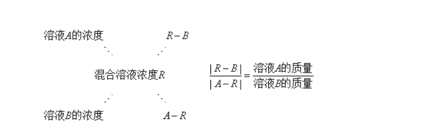
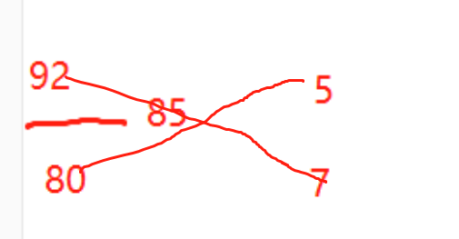
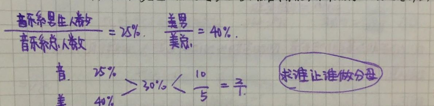
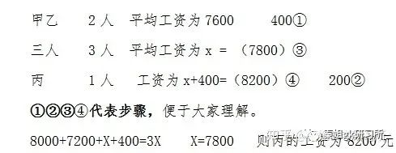
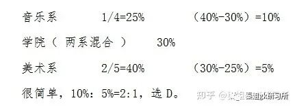
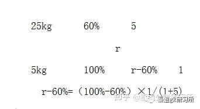
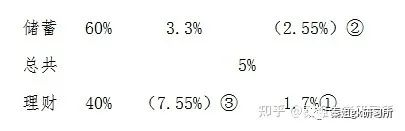

# Table of Contents

* [溶质不变浓度问题](#溶质不变浓度问题)
  * [给溶质 套公式](#给溶质-套公式)
    * [未给溶质 设一个](#未给溶质-设一个)
* [十字相乘](#十字相乘)
  * [二、适用题型](#二适用题型)
  * [三、真题演示](#三真题演示)
    * [（一）溶液混合问题](#一溶液混合问题)
    * [（二）分组平均数混合](#二分组平均数混合)
    * [（三）利润率混合](#三利润率混合)
    * [（四）比例混合](#四比例混合)
    * [（五）增长率混合](#五增长率混合)
* [周期循环](#周期循环)
  * [**求明年的今天是周几问题**](#求明年的今天是周几问题)
* [参考资料](#参考资料)

# 溶质不变浓度问题

## 给溶质 套公式

 无论溶液蒸发、稀释还是混合，溶质的质量都不改变。**抓住“溶质不变”解题。**当题干中没有出现具体的量时，可以赋值。别忘了解盐水问题还有“十字相乘”这把利器！ 

> 核心公式：浓度=溶质/溶液
>
> 
>
>   溶液=溶质+溶剂  **记住多加一个溶质 ，溶液的量也会发生变化**
>
> 

 例1.某盐溶液100克，加入20克水稀释，浓度变为50%，然后加入80克浓度为25%的盐溶液，求此时混合后的盐溶液浓度。 

120的一半是60     （60+20）/（100+20+80）=40%

例2 【2014国考 第62题】烧杯中装了100克浓度为10%的盐水。每次向该烧杯中加入**不超过**14克浓度为50%的盐水。问最少加多少次之后，烧杯中的盐水浓度能达到25%？(假设烧杯中盐水不会溢出)（ ） 

设最大为x 

(10+7x)/(100+14x)=1/4

40+28x=100+14x

​		10x=60  x=5

例3   (2013浙江)瓶中装有浓度为20%的酒精溶液1000克,现在又分别倒入200克和400克的A、B两种酒精溶液,瓶里的溶液浓度变为15%,已知A种酒精溶液的浓度是B种酒精溶液浓度的2倍。那么A种酒精溶液的浓度是多少?

A. 5%  B. 6% C. 8% D.  10%

$$
((1000  \times 0.2 )+200 X+200X ) \div 1000+200+400 =0.15
$$

> **本质还是根据公式去套** **对于这种题目 问什么就设什么为x**

### 未给溶质 设一个

例4.一个容器内有一定量盐水，第一次加入适量水后，容器内盐水浓度为3%，第二次加入同样多水后，容器内盐水浓度为2%，则第三次加入同样多水后盐水浓度是多少？

 分析：1.题干中未出现具体的质量值，可以赋值，赋值赋一个好算的

​      2.赋值溶质质量为6g，根据盐水浓度为3%可求得第一次加水后溶液的质量

​      3.根据溶质质量为6g和盐水浓度为2%，可求得第二次加水后溶液的质量

​      4.求出每次加水的质量

​      5.求解

# 十字相乘

+ 原理 

  

> 看到人数一般就是 十字相乘

例子: 某单位共有职工72人，年底考核平均分数为85分。根据考核分数，90分以上的职工评为优秀职工，已知优秀职工的平均分数为92分，其他职工的平均分数是80分，问优秀职工的人数是多少

一看就是混合类问题：根据题目列公式 

  12x=72 x=6  5x=30

 例: 某高校艺术学院分音乐系和美术系两个系，已知学校男生人数占总人数的30%，且音乐系男女生之比为1：3，美术系男女生人数之比为2：3，问音乐系和美术系的总人数之比为多少？ 

 分析：求总人数之比，则令总人数为公式里的C，列式：男生所占比例=男生人数/总人数 

换个思路问： 求美术系和音乐系女生之比？

分析：求女生 那就是女生做分母    2/3  /   1/3     混合 3/7   = 2/5

## 二、适用题型

凡是满足Aa+Bb=（A+B)r=Ar+Br这一表达式的，均可使用十字交叉法。常见的有以下五个题型：

1.**溶液混合问题**——十字交叉得到的比例为混合前溶液的质量比

2.**分组平均数混合**——十字交叉得到的比例为两组数据的数量之比

3.**比例混合**——十字交叉得到的比例为两组数据的整体量之比

4.**利润率混合**——十字交叉得到的比例为混合前对应商品的销量之比

5.**增长率混合**——十字交叉得到的比例为两个年份的基期量之比

## 三、真题演示

### （一）溶液混合问题

*（16联考-8）甲、乙两个相同的杯子分别装满了浓度为20%和30%的两种溶液，将甲杯中倒出一半溶液，用乙杯中的溶液将甲杯加满混合，然后再将已经加满的甲杯中的溶液全部倒入一杯清水中且未溢出，溶液浓度变为20%。若该溶液密度与水完全相同，问原甲杯中溶液的质量是这杯清水质量的多少倍？*

*A.1 B.2 C.3 D.4*

**解析：**水可看作0%溶液。第一次甲乙混合后浓度为25%的溶液，与浓度为0%的水，混合后变为20%：

得到20%：5%=4:1。选D

*（16京-2）将1千克浓度为X的酒精，与2千克浓度为20%的酒精混合后，浓度变为0.6X。则X的值为？*

*A.50% B.48% C.45% D.40%*

**解析：**

得到0.6X-0.2X=20% X=50%。选A

*（19沪B-66）有一瓶浓度为15%的盐水500克，每次加入34克浓度为60%的盐水，则至少加（ ）次该盐水，使这瓶盐水的浓度超过30%。*

*A.6 B.7 C.8 D.9*

**解析：**若混合后浓度刚好为30%

十字交叉可得两种盐水的溶液之比=（60%-30%）：（30%-15%）=2:1。由此比例可得500克：X=2:1，因此X=250，因每次加入34克盐水，则250÷34≈7.4，可得至少加8次，选C

### （二）分组平均数混合

**公式：数量1×平均数1+数量2×平均数2=总数×总平均数**

*（17联A-19）甲乙两队举行智力抢答比赛，两队平均得分为92分，其中甲队平均得分为88分，乙队平均得分为94分，则甲乙两队人数之和可能是:*

*A.20 B.21 C.23 D.25*

**解析：**十字交叉

可得甲乙两队人数比=（94-92）：（92-88）=2：4=1：2，

那么甲：乙=1:2，则甲乙总人数为3的倍数，选B。

注意两个量的数量之比，分别对应对方的比例与整体比例之差。结合此题式子好好理解，可以省去写十字交叉的时间，熟练后可以直接心算。

*（18浙A-52）甲、乙和丙是同一公司的同事，甲工资为8000元/月，乙工资为7200元/月，丙工资比3人工资的平均值高400元/月。问丙的工资为多少元/月？*

*A、7800 B、8000 C、8200 D、8400*

**解析：**十字交叉——三人=甲乙+丙，设三人平均工资为X

8000+7200+X+400=3X 则X=7800 则丙的工资为8200元。选C

*（19省部-71、地市-67）某单位有2个处室，甲处室有12人，乙处室有20人。现在将甲处室最年轻的4人调入乙处室，则乙处室的平均年龄增加了1岁，甲处室的平均年龄增加了3岁。问在调动之前，两个处室的平均年龄相差多少岁？*

*A、8 B、12 C、14 D、15*

**解析：**设甲处室原平均年龄为a，乙处室原平均年龄为b，

故a-6=b+6 即a=b+12 则选B

### （三）利润率混合

十字交叉得到的比例为混合前对应商品的销量（销售数量）之比

*（17联A-14）商场以每件80元的价格购进了某品牌衬衫500件，并以每件120元的价格销售了400件，要达到盈利45%的预期目标，剩下的衬衫最多可以降价：*

*A.15元 B.16元 C.18元 D.20元*

**解析：**预期总利润=80×500×45%=18000元，前400件的利润=（120-80）×400=16000元，后100件的利润至少为18000-16000=2000元、每件利润20元，降价120-100=20元，选D

*（19苏A-51）某银行为一家小微企业提供了年利率分别为6％、7％的甲、乙两种贷款，期限均为一年。若两种货款的合计数额为400万元，企业需付利息总额为25万元，则乙种贷款的数额是：*

*A.100万元 B.120万元 C.130万元 D.150万元*

**解析：**十字交叉 甲：乙=（7%-6.25%）:（6.25%-6%）=3：1 则乙=400×1/4=100 选A

### （四）比例混合

*（16联考-17）某高校艺术学院分音乐系和美术系两个系别，已知学院男生人数占总人数的30%，且音乐系男女生人数之比为1：3，美术系男女生人数之比为2：3。问音乐系和美术系的总人数之比为多少？*

*A.5:2 B.5:1 C.3:1 D.2:1*

**解析：**凡含比例两部分混合均可用十字交叉法。注意比例要一致：

很简单，10%：5%=2:1，选D。

*（19苏B-65）某景区门票夏季打7折、冬季打3折，对8岁及以下儿童免门票，车20元/人次，游乐设施10元/人次。小朱去年夏季和冬季都带4岁的儿子去该景区1次，每次都陪孩子坐车1次、让孩子玩游乐设施1次。若他们两人夏季在该景区的游玩费用比冬季多50％，则该景区门票的全价是：*

*A.100元 B.90元 C.80元 D.60元*

**解析：**设门票全价为a，则0.3a×7/3+50×1=（0.3a+50）×3/2

十字交叉，得0.3a：50=(1/2):(5/6)=3:5 故a=100 则A

3/2-1=1/2 7/3-3/2=5/6

*（18B-5）小张家养了一只大狗和一只小狗。现在，小狗的体重只有大狗的一半。如果两只狗的体重各增加5千克，那么小狗的体重将达到大狗的60%。据此可知，若两只狗的体重各增加10千克，小狗、大狗的体重比将会是：*

*A.1:2 B.2:3 C.3:4 D.4:5*

**解析：**大狗前量×（小狗/大狗）+大狗增量×（小狗增量/大狗增量）=大狗现量×（小狗现量/大狗现量）

另外

得到r-60%=（100%-60%）×1/(1+5) 选B

### （五）增长率混合

十字交叉得到的比例为两个年份的基期量之比

*（19浙A-12）小张去年底获得一笔总额不超过5万的奖金，她将其中的60%用来储蓄，剩下的用来购买理财产品，一年后这笔奖金增值了5%。已知储蓄的奖金增值了3.3%，问购买理财产品的奖金增值了多少？*

*A、5.35% B、6.45% C、7.55% D、8.65%*

**解析：**

选C

*（19浙A-73）某企业四个分公司今年的销售额之和是去年的1.2倍。其中，甲分公司的销售额增长了50%，乙分公司的销售额与去年相同，丙和丁分公司的销售额均增长了25%。已知去年甲、丙、丁三个分公司的销售额之比为2：3：5，则乙分公司今年的销售额占4个分公司总量的：*

*A.1/3 B.2/7 C.4/13 D.5/18*

**解析：**设甲、丙、丁去年分别为8、12、20，则今年分别为12、15、25。（40+a）×1.2=a+52 a=20 20/72=5/18。选D

*（15鲁-53）某市制定了峰谷分时电价方案，峰时电价为原电价的110%，谷时电价为原电价的八折，小静家六月用电400度，其中峰时用电210度，谷时用电190度，实行峰谷分时电价调整方案后小静家用电成本为调整前的多少？*

*A、95.75% B、87.25% C、90.5% D、85.5%*

**解析：**更靠近量大的，选A

# 周期循环

周期循环是指事物的某一特征按照一定规律反复出现，从第一次开始到结束为一个周期

+ 自己总结周期或者循环，然后推测某一位置的情况
+ 和星期相关的周期问题，难点在于根据已知的‘’某日是星期x ‘去确定 另外一个日期是星期几

##  **求明年的今天是周几问题** 

例1：2012年3月份的最后一天是星期六，则2013年3月的最后一天是星期几？

平年：365=52周+1 

闰年：366=52周+2

# 参考资料
+ https://mp.weixin.qq.com/mp/appmsgalbum?__biz=Mzk0ODM5Mzg1OQ==&action=getalbum&album_id=2526910158070071297&scene=173&from_msgid=2247483662&from_itemidx=1&count=3&nolastread=1#wechat_redirect
+ 花生十三
