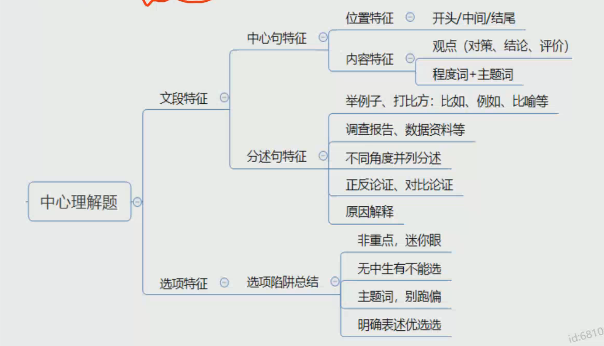
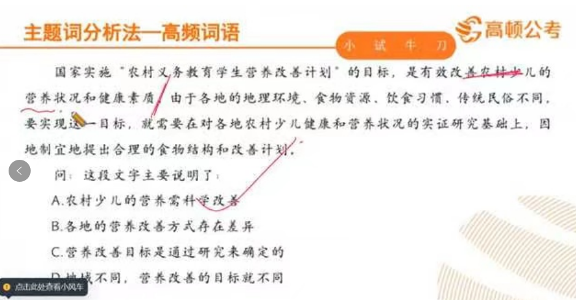
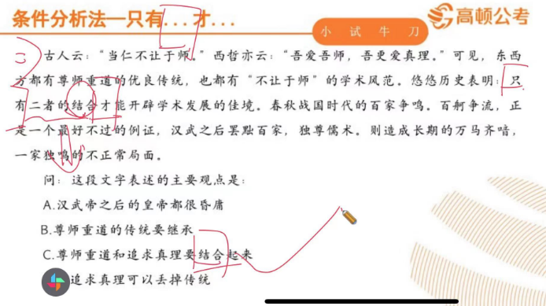
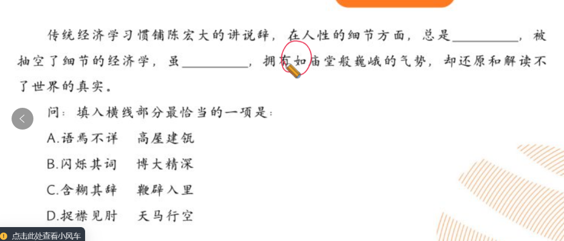

# Table of Contents

* [公共方法](#公共方法)
  * [主题概括](#主题概括)
  * [条件分析法。](#条件分析法)
* [这段文字接下来可能讲](#这段文字接下来可能讲)
* [语句表达](#语句表达)
  * [语句排序](#语句排序)
* [逻辑填空](#逻辑填空)
  * [比喻法](#比喻法)
* [参考资料](#参考资料)

# 公共方法

+ 无中生有：题目没有的肯定是错的。
+ 对比择优：最能概括题目中心意思的
+ 注意概念偷换：文中出现的和题目出现的不一样

## 主题概括

主体；频率高

+ 有主体词的选项可能是对的，没有选项一定是错的。 
+ 转折后面是关键词，如 然而 但是 因此  一定要注意这个!!!!!!!
+ 

## 条件分析法。

只有。。。。才  中间是我们的正确选项

条件关系
满足什么条件..... 才

# 这段文字接下来可能讲

+ 注意转折词 

# 语句表达 

## 语句排序

+ 下定义的语句在前
+ 先引出观点在前
+ 话意相近的是在一起的

# 逻辑填空

+ 选词搭配  根据填空上下文进行选择
+ 团队合作 不能光看一个填空
+ 择优选择 如果有更适合的选择更适合的

## 比喻法

比喻=本+喻

找喻体附近的填空。然后从选项中选择最贴近的。

出现2个喻体，一定会有喻体被使用了

# 参考资料
+ 一些公开课
+ 郭熙
+ 
