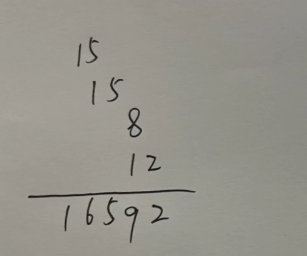
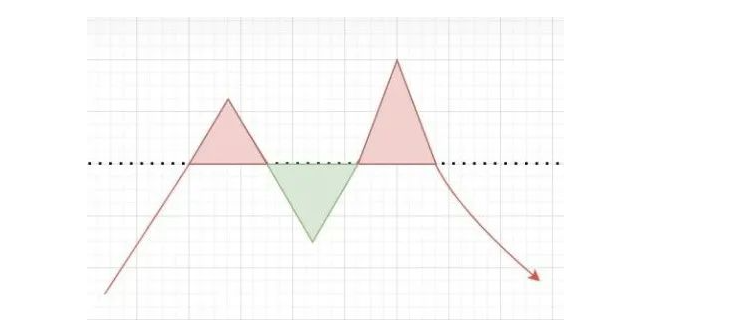
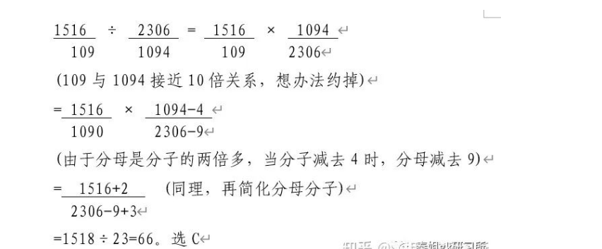

# Table of Contents

* [**做题顺序**](#做题顺序)
* [基期与现期](#基期与现期)
* [增长量](#增长量)
* [增长率](#增长率)
  * [增长率比较](#增长率比较)
  * [年均增长率](#年均增长率)
  * [混合增长率](#混合增长率)
* [加法常用技巧](#加法常用技巧)
  * [尾数法](#尾数法)
  * [高位叠加](#高位叠加)
  * [削峰填谷](#削峰填谷)
* [减法常用技巧](#减法常用技巧)
  * [整数基准值法](#整数基准值法)
  * [“21”“12”分段法](#2112分段法)
* [乘法常用技巧](#乘法常用技巧)
  * [**百化分**](#百化分)
  * [**乘法拆分**](#乘法拆分)
  * [2位数乘法快速计算](#2位数乘法快速计算)
* [除法常用技巧](#除法常用技巧)
  * [拆分法](#拆分法)

# **做题顺序**

# 基期与现期

作为对比参照的时期称为基期，而相对于基期的称为现期。描述具体数值时我们称之为基期量和现期量。

**假设增长率为r**

**现期量=基期量×（1+r）**

**基期量=现期量/（1+r）=现期量−增长量**

打个简单的比方，某商场2021年4月的营业额为6000万元，2022年4月的营业额为6800万元。那么可以计算出营业额增加了800万元，增长率为0.13%。在这里，“2021年4月”就叫做基期，“6000万元”就叫做基期量；“2022年4月”就叫做现期，“6800万元”就叫做现期量。其中800万元则为增长量，0.13%为增长率，后面会单独讲到。

通过例题更容易理解：

*【例1】2013年，全国共有工业企业法人单位241万个，从业人员14025.8万人，分别比2008年增长26.6%和19.5%。2008 年，全国共有工业企业从业人员约为多少亿人？*

*A．1.0 B．1.2 C．1.3 D．1.5*

**解析：**题中，2008年工业企业从业人员数为基期，2013年工业企业从业人员数为现期。已知现期为14025.8万人，增长率为19.5%，求基期。基期量=现期量/（1+r）=14025.8/（1+19.5%）≈1.2亿，选B

注意：从选项来看，各选项之间的差距较大，那么式子列出后，首选估算法，尽量将数据往整数上靠近，**分子14025.8可看做14000，分母1.195可以直接看做1.2**；于是转化为14÷12≈1.17，更接近选项B，那么这样一来计算量就大大的简化了。

**资料分析并不是需要你多么精准的计算出答案，而是需要你在找出数据之间的数量关系之后，分析出结果。所以请大胆的进行估算。**

*【例 2】2016 年，某市全年规模以上计算机、通信和其他电子设备制造业实现利润 84.8 亿元，增长 36.8%；专用设备制造业实现利润 73.9 亿元，增长 70.3%。2015 年该市规模以上专用设备制造业约实现利润多少亿元？*

*A．22 B．33 C．43 D．55*

**解析：**题中，2015年该市规模以上专用设备制造业利润为基期，2016年该市规模以上专用设备制造业利润为现期。已知现期为73.9亿元，增长率为70.3%，求基期。基期量=现期量/（1+r）=73.9/（1+70.3%）≈43.5，选C

注意：从选项来看，各选项之间的差距较大，那么式子列出后，首选估算法，尽量将数据往整数上靠近，**分子73.9可看做74，分母1.703可以直接看做1.7**；于是转化为74÷17≈4.35，接近选项C，那么这样一来计算量就大大的简化了。

*【例3】2017 年末，全国民用汽车保有量 21743 万辆，比上年末增长 11.8%。其中私人汽车保有量 18695 万辆，增长 12.9%；民用轿车保有量 12185 万辆，增长 12.0%，其中私人轿车保有量 11416 万辆，增长 12.5%。2016 年末全国私人轿车保有量为：*

*A.10148 万辆 B.11006 万辆*

*C.13879 万辆 D.16559 万辆*

**解析：**题中，2016年末全国私人轿车保有量为基期，2017年末全国私人轿车保有量为现期。已知现期为18695万辆，增长率为12.9%，求基期。基期量=现期量/（1+r）=18695/（1+12.9%）≈16559，选D

注意：从选项来看，各选项之间的差距较大，那么式子列出后，首选估算法，尽量将数据往整数上靠近，**分子18695可看做187，分母1.129可以直接看做11**；于是转化为187÷11=17，更接近选项D，这样一来计算量就大大的简化了。

#  增长量

增长量是指基期量与现期量增长（或减少）的绝对量。增长量是具体值，有单位。

**增长量=现期量－基期量；增长量有正负，负值代表减少量**

**增长量大小比较：**

**1.现期值大，增长率大，大大则大。意思就是：现期大于基期，增长率也比之前的大，那么增长量也比之前的大。**

**2.近似比较 现期量×r 乘积的大小，近似比较 A×r1 和 B×r2 的大小（应用范围为增长率的差距在20%）**

**3.如果增长率之间的差距很大，列出完整式子进行估算**

通过例题更容易理解：

*【例1】2012 年末全国就业人员 76704 万人，比上年末增加 284 万人；其中城镇就业人员 37102 万人，比上年末增加 1188 万人，乡村就业人员 39602 万人。相较于 2011 年，2012 年的乡村就业人员（）。*

*A．减少 904 万人 B．增加 904 万人*

*C．增加 1472 万人 D．减少 1472 万人*

题中，2011年乡村就业人员数量为基期，2012年乡村就业人员数量为现期。已知现期为39602万人，求增长量。2012全国总就业人员增加284万人，则2011年全国总就业人员a为76704-284=76420万人，而2011年城镇就业人员数量b为37102-1188=35914万人；所以基期X=76420-35914=40506万人。

增长量=现期量-基期量=39602-40506=-904万人，选A

注意：观察选项大家可以看到，选项数值之间差距较大，直接估算，**估算完后只需要分清正负**，即是增长还是减少就行。

另外，**因为选项尾数不同，也可以使用尾数法**，式子列出后，只计算尾数，然后确定正负即可。

*【例3】2015 年全国共建立社会捐助工作站、点和慈善超市 3.0 万个，比上一年减少 0.2 万个，其中：慈善超市 9654 个，同比下降 5.1%。2015 年，全国建立的慈善超市较 2014 年约：*

*A．增加 519 个 B．减少 519 个*

*C．增加 686 个 D．减少 686 个*

**解析：**题中，2014年全国建立的慈善超市数为基期，2015年全国建立的慈善超市数为现期，已知现期为个，增长率为-5.1%，求增长量。基期量=现期量/（1+r）=9654/（1-5.1%）≈10173个。增长量=现期量-基期量=9654-10173=-519个，选B

*例4】2012 年，某省规模以上工业增加值 10875 亿元，比上年增长 7.1%，月度增速从 1—2 月的 2.9%回升到 10—12 月的 10%以上。大型、中型和小微型企业增加值分别为 3074、3217 和 4584 亿元，比上年分别增长 8.2%、6.8%和 6.7%。与 2011 年相比，2012 年该省规模以上工业增加值约增加了多少亿元？*

*A．600 B．720 C．840 D．960*

**解析：**题中，2011年该省规模以上工业增加值为基期，2012年该省规模以上工业增加值为现期。已知现期为10875亿元，增长率为7.1%，求增长量。基期量=现期量/（1+r）=10875/（1+7.1%）≈10154亿元。增长量=现期量-基期量=10875-10154=721个，选B

*【例5】2017 年粮食产量 61791 万吨，比上年增加 166 万吨，增产 0.3%。全年棉花产量 549 万吨，比上年增产 3.5%。油料产量 3732 万吨，增产 2.8%。糖料产量12556 万吨，增产 1.7%。茶叶产量 255 万吨，增产 6.0%。2017 年，我国棉花的产量比 2016 年约增产了（ ）万吨。*

*A.7 B.19 C.31 D.48*

**解析：**题中，2016年我国棉花产量为基期，2017年我国棉花产量为现期。已知现期为549万吨，增长率为3.5%，求增长量。基期量=现期量/（1+r）=549/（1+3.5%）≈530万吨。增长量=现期量-基期量=549-530=19万吨，选B

# 增长率

1. 增长率=增长量/基期量=(现期-基期)/基期量
2. 基期增长率=现期增长率±百分点(增幅、增速)

*【例1】2013年 1-3 月，全国规模以上工业企业实现利润 11740.1 亿元，比上年同期增长12.1%，增幅比 1-2 月回落5.1 个百分点。2013年 1-2 月规模以上工业企业实现利润同比增长率：（ ）*

*A.7% B.12.1% C.17.2% D.17.4%*

**解析：**求1-2 月增长率。已知1-3 月增长率为12.1%，增幅比1-2 月回落5.1 个百分点。基期增长率=现期增长率±百分点，则1-2月增长率为12.1%+5.1%=17.2%。选C

## 增长率比较

现期量/基期量”倍数越大，增长率越大

若“现期/基期”倍数相同，则比较“增长量/基期量”

通过例题更容易理解：

*【例1】2014年我国粮食种植面积11274万公顷，比上年增加 78 万公顷。棉花种植面积422 万公顷，减少13 万公顷。油料种植面积 1408 万公顷，增加 6 万公顷。糖料种植面积 191 万公顷、减少 9 万公顷。2014年，我国粮食种植面积同比增速比油料种植面积同比增速（ ）。*

*A．高不到 1 个百分点 B．高 1 个百分点以上*

*C．低不到 1 个百分点 D．低 1 个百分点以上*

**解析**：增长率=增长量/基期量，2014年我国粮食种植面积增长率=78÷11274≈0.7%。2014年我国油料种植面积增长率=6÷1408≈0.43%。比较大小后，选A

注意：式子列出后可用估算法，估算成整数更容易计算，将分子78 看做80，将分母11274 看做11000。分子变大，分母变小，可以中和误差，即粮食种植面积增速为80÷11000≈0.7%；同理，将分母1408 看做1400，即油料种植面积增速为6÷1400≈0.4%。

*【例2】我国 2017 年粮食种植面积为 11222 万公顷，比上年减少 81 万公顷。其中，小麦种植面积 2399 万公顷，减少 20 万公顷；稻谷种植面积 3018 万公顷，减少0.2 万公顷；玉米种植面积 3545 万公顷，减少 132 万公顷。棉花种植面积 323 万公顷，减少 12 万公顷。2017 年，我国小麦、稻谷、玉米、棉花四种农作物中，种植面积减少速度最快的是（）。*

*A.小麦 B.稻谷 C.玉米 D.棉花*

**解析：**小麦种植面积减速=20÷2399≈0.8%；稻谷种植面积减速=0.2÷3018≈0.007%；玉米种植面积减速=132÷3545≈3.723%；棉花种植面积减速=12÷323≈3.715%。比较大小后，选C

注意：拿到题目后，首先分析数据，这里要此较的是四个增速的大小，可以先根据数据特征排除掉明显不可能的选项。粗略估算，第一个可以排除的就是稻谷。因为减少的0.2几乎可以忽略不计，即持平：而小麦20 万公顷，减速不到1%。那么其实真正要进行比较的是玉米和棉花。

## 年均增长率

基期量(1+年均增长率r%)N=现期量

当N+r﹤10,(1+r%)N≈1+N×r%

通过例题更容易理解：

*【2012 年浙江】2010 年农村居民得到的转移性收入人均 453 元，比 2005 年增加 305 元。其中，2010 年各级政府给予的农业生产补贴收入人均 118 元，比 2005 年增加 100 元，增长 5.5.倍；2010 年农村居民领取的离退休金、养老金人均 113 元，比 2005 年增加 82 元，增长 2.7 倍。“十一五”期间，我国农村居民人均转移性收入的年均增长率约为：*

*A．10% B．15% C．20% D．25%*

**解析：**已知2010年农村居民得到的转移性收入人均453元，比2005年增加305元，求“十一五”期间，我国农村居民人均转移性收入的年均增长率。2005年农村居民得到的转移性收入=453-305=148元，增长率=305÷148≈206%，5次开方约等于15%，选B

注意：在这里 “十一五”期间的年均增长率。其实就是从2005 -2010 年之间每年平均增长了多少。那么先求出基期2005年的原始参照额为148 元，再将5年总的增长量来除以这个原始参照额，就能够得到5年总的增长率 为 305÷148 转化为300÷150≈200%。求出总的增长率之后，年均增长率就可以得出了。

## 混合增长率

整体包括两部分，整体的增长率介于两部分增长率之间，且靠近基期较大的一方。

A×B的增长率=a%+b%+a%×b%

A的增长率a%，B的增长率b%

通过例题更容易理解：

*【例1】2015 年江西省财政总收入 3021.5 亿元，比上年增长 12.7%，财政总收入占生产总值的比重为 18.1%，比上年提高 1.0 个百分点。其中，税收收入 2373.0 亿元，增长 8.9%，占财政总收入比重为 78.5%，其他收入 648.5 亿元。2015 年江西省财政总收入中的其他收入比上年（ ）*

*A．减少了 2.9% B．减少了 29.2%*

*C．增加了 2.9% D．增加了 29.2%*

**解析：**已知，财政总收入由税收收入和其他收入两部分组成。2015年江西省财政总收入3021.5，增长率为12.7%；税收2373，增长率为8.9%；其他收入648.5，求其他收入的增长率。由于整体的增长率介于两部分增长率之间，且靠近基期较大的一方。则12.7%介于8.9%和其他收入的增长率之间，且更靠近8.9%，因此结合选项，只有29.2%符合条件，选D。仅靠分析即可得出答案，根本不用计算。

*【例2】2013年3月末，主要金融机构及小型农村金融机构、外资银行人民币房地产贷款余额 12.98 万亿元，同比增长 16.4%。地产开发贷款余额 1.04 万亿元，同比增长 21.4%。房产开发贷款余额 3.2 万亿元，同比增长 12.3%。个人购房贷款余额 8.57 万亿元，同比增长 17.4%。保障性住房开发贷款余额 6140 亿元，同比增长 42.4%。2013 年 3 月末，房地产开发贷款余额同比增速约为（ ）。*

*A.14.4% B.12.3% C.19.3% D.21.4%*

**解析：**已知地产开发贷款余额增长率为 21.4%，房产开发贷款余额增长率为 12.3%，求房地产开发贷款余额增长率。由于整体的增长率介于两部分增长率之间，且靠近基期较大的一方。则房地产开发贷款余额增长率位于12.3%和21.4%之间，且更靠近12.3%，结合选项，选A。仅靠分析即可得出答案，根本不用计算。

*【例3】2017 年，A 省完成邮电业务总量 6065.71 亿元。其中，电信业务总量 3575.86亿元，同比增长 75.8%；邮政业务总量 2489.85 亿元，增长 32%。2017 年 A 省邮电业务总量同比增速在以下哪个范围之内？*

*A．低于 25% B．25%~50%之间*

*C．50%~75%之间 D．超过 75%*

**解析：**已知电信业务总量增长率为 75.8%，邮政业务总量增长率为 32%，求邮电业务总量增长率。由于整体的增长率介于两部分增长率之间，且靠近基期较大的一方。则邮电业务总量增长率位于32%和75.8%之间，且更靠近75.8%，结合选项，选C。仅靠分析即可得出答案，根本不用计算。

*【例4】2015 年上半年全国水产品产量 2700.09 万吨，同比增长 3.20%，其中养殖水产品产量 2114.38 万吨，同比增长 4.13%。2015 年上半年，非养殖水产品产量与上年同期相比的变化最接近以下哪个数字？*

*A．-20% B．0% C．5% D．10%*

**解析：**已知全国水产品产量增长率为 3.20%，养殖水产品产量增长率为 4.13%，求非养殖水产品产量增长率。由于整体的增长率介于两部分增长率之间，且靠近基期较大的一方。则全国水产品产量增长率3.20%位于4.13%和非养殖水产品产量增长率之间，且更靠近4.13%，结合选项，排除CD，因总量处于正增长，排除A，选B。仅靠分析即可得出答案，根本不用计算。

# 加法常用技巧

## 尾数法

尾数法：通过计算式子的末几位数从而确定选项的速算方法叫尾数法

*【2019上海】2015年全市全年新增汽车驾驶人30.58万人，新增汽车驾驶人人数比2014年高出1.47万人。2014—2015年，N市总计新增汽车驾驶人约（ ）万人。*

*A. 58.22 B. 59.69 C. 61.16 D. 62.63*

**解析**：根据题干已知条件可得出2014年新增汽车驾驶人数量为30.58-1.47，因此2014-2015年，总计新增是30.58+30.58-1.47。**式子列出后，观察选项的尾数各不相同，可以采用尾数法，计算最末一位即可，8+8-7=9**，故答案选B。

*【例2】经初步核算，2009年上半年我国国内生产总值同比增长7.1%，比一季度加快1.0个百分点。其中第一产业增加值为12025亿元，增长3.8%;第二产业增加值为70070亿元，增长6.6%;第三产业增加值为57767亿元，增长8.3%。问2009年上半年，我国国内生产总值为多少亿元?*

*A.139862 B.147953 C.148632 D.151429*

**解析**：题干中的时间为2009年上半年，所求为现期国内生产总值之和，即一二三产业增加值之和为12025+70070+57767，**式子列出后，观察选项最末两位数字互不相同，可采用尾数法，仅计算最末两位即可，为25+70+67计算结果为62**，则直接选择A选项

## 高位叠加

高位叠加：从高位加起，抓住问题主要矛盾

如4156＋6913＋5523，结果16592，使用高位叠加法，先算高位，千位4＋6＋5为15，则最高位为万位1，百位1＋9＋5为15，十位5＋1＋2为8，个位6＋3＋3为12，那写下来应为

## 削峰填谷

削峰填谷：几个数字相近，可以先找出基准值，再根据 **偏离总和**，求总和或平均值

如求5641、5642、5643、5641、5643、5638、5639的平均数中，括号内所有加数**都接近于5640**，我们可以选择5640作为基准数，然后再后面依次补上超出或不足的部分。

其实这样一看就很简单了，直接就是（3+1+3）÷7+5640=5641。极大减少了计算量。

# 减法常用技巧

## 整数基准值法

**.整数基准值法:**被减数一减数=(被减数一基准值)十(基准值一减数);例如“632 一589”，我们可以加入600作为基准值，则632一589= ( 632-600) +( 600- 589 )。 **一般来说是数字比较相近的用**

例如：80021-79978

=（80021-80000）+（80000-79978）

=21+22

=43

##  “21”“12”分段法

**“21”“12”分段法:**将三位数的减法分成“21”或“12”两段，尽可能保证不用借位，减少思考和出错。

如: 632-427。

后两位相减为正数，则可以用“12”两段，百位: 6-4=2，后两位: 32-27=05，则答案为205，不用借位。

# 乘法常用技巧

## **百化分**

**.百化分:即将百分数转化为分数，若乘法中有某个乘数可以近似的转化为某个常见分数，我们可以将多位数乘法转化为简单除法计算。**

需记忆的常用小数如下:

50%=1/2

33.3%=1/3

25%=1/4

20%=1/5

16.7%=1/6

14.3%=1/7

12.5%=1/8

11.1%=1/9

如: 228*167 167≈1/6 (只考虑有效数字)

即228*167=228/6=38 (只考虑有效数字)

*【例2】2015年1-7月，我国机电产品出口额44359.4元，同比增长1.2%，占出口总额的57.2%。问：2015年1-7月，我国出口总额为（ ）。*

*A.63534.0元 B.77551.4元 C.82907.1元 D.95772.7元*

**解析**：出口总额为44359.4÷57.2%。式子列出后，可用百化分，**57.2≈57.1约等于4/7**。则44358÷4×7，观察选项，此时只计算前两位44÷4×7=77已经可以得出正确答案了。选B。

## **乘法拆分**

若乘法中有某个乘数为百分数且能拆成两个简单数值( 50%、10%、5%等),我们可以将该百分数拆成两部分再相乘。 **常用的小数拆分如下**:

45%= 50%-5%;

55%= 50%+5%;

15%= 10%+5%;

60%= 50%+10%;

95%=1-5%，

90%= 1-10%，

所有50%、100%附近数等。

如: 319*78%可以转化为319*( 100%-20%-2%) =319-63.8-6.38。

*【例】:某地区2014年的地区生产总值为1500亿元，第一产业生产值占地区生产总值的17.8%,问该地区2014年的第一产业生产总值是多少?*

**解析**:先把式子列出来：1500×17.8%，此时可用拆分法。观察得17.8%=20%-2%-0.2%，则1500×(20%-2%-0.2%)，这样整个式子就非常好算了，300-30-3=267。

【例】94.5*44.2%= 94.5 * (4/9-0.2%)

【例】620*45%= 620 * (50%-6%)=310-31=279

【例】1694*97%= 1694-17 * 3=1643

## 2位数乘法快速计算

# 除法常用技巧

## 拆分法

列除法竖式做除法是同学们最熟悉的一种除法解法，也被我们称之为直除法;直除法简单直观，是绝大多数同学在考场上最信赖的解法，但直除法包含一个难点:当被除数和除数均较大时，商到底应上哪个数字，有时需要长时间的思考。

拆分法并不是一种估算方法，和直除法一样，拆分法也是精确求解。拆分法是把误差逐渐减少趋向于零的过程，我们可以根据选项设置决定何时停止计算。拆分的本质是对直除进行优化，规避掉了直除法中存在的难点。在熟练掌握拆分法之后，所有的除法均可用拆分法解决。

顾名思义，**拆分法的本质是将被除数由大到小拆成几部分分别计算，通过逐步分解，从而得出结果。这与哲学中的抓住主要矛盾、抓住矛盾的主要方面原理一致，抓住被除数的绝大部分，即使小部分存在误差，对最终结果影响也有限。**

**拆分法使用规则:**

**规则一:如果分数大小接近1(分子分母相差不大),可用100%减去;**

> 398/462=1-64/462=1-(46+14)/462=1-10%-3%=87%

**规则二：如果分子在分母的50%附近，先拆出50%;**

> 428/976=(488-60)/976=(488-60)/976=50%-6.2%=43.8%

**规则三:如果分子很小，可根据实际情况拆出10%或5%或1%;**

**规则四:在不满足上述情况时，可根据首位比值，拆出其他特殊分数(例如1/4,1/3,2/3,3/4,4/5等），此规则运用次数极少，了解即可。**

[注]在做多位数除法时，分子只保留前三位即可，分母可根据情况保留三四五位，即三位/三位、三位/四位、三位/五位均可。

[注]为方便计算，使用拆分法时可将分母写成偶数形式(因经常出现除以2的情况，偶数显然较奇数计算简单)。同理，在拆出1/4时，尽可能将分母写成4的倍数;拆出1/3时，尽可能将分母写成3的倍数。

如: 332/688

先拆出50%;344-12/688=50%-2%=48%

再比如：1226÷4884

拆分为（1221+5）÷4884

=1221÷4884+5÷4884

=25%+可以忽略不计的数

此时就可以根据选项选出最接近于25%的那个选项。

# 速算之误差估算法

所谓估算，是在精度要求并不太高的情况下，进行粗略估值的速算方式，一般在选项相差较大，或者在被比较数据相差较大的情况下使用。

## 误差估算法的原理

**在除法计算中，分子分母如果同比例放大或缩小，计算结果是不变的**。误差分析其实就运用到这个原理，面对计算复杂的分式，我们通过**接近等比例地改变分子和分母的大小**（优先减去分母，然后根据分母与分子之间的倍数关系减去分子），简化计算难度 ，这样既加快解题速度，也能保证计算结果的准确性。

**取舍规则：**

+ **除法：**分子不变，**分母**取前三位(四舍五入)

打个比方，计算52348÷26035，估算法中可以直接将分母保留前三位260，即变为52348÷260，在减少计算量的同时，保证误差在可接受范围内。

+ **乘法：**

  + 1.全舍：**第三位有效数字全是0、1、2**

    打个比方，如何求**1319.2×4820.4**的值。这两个数各有5位有效数字，保留前两位有效数字即保留13和48，后面的有效数字怎么取舍则看第三位有效数字：分别是1和2，两边都是0到2中的小数字，所以可以全部舍掉忽略不计，直接估算为**1300×4800**=6240000。

  + 2.全进：**第三位有效数字全是8或9**

    打个比方，如何求**5289×13.9%**的值。大家可以看到5289有四位有效数字，13.9%则有三位有效数字。保留前两位有效数字即保留52和13，第三位有效数字分别为8和9，这些都是很大的数字，所以全部往前进一位。将乘法估算为**5300×14%**=742。

  + 3.一进一舍

    很多时候我们的第三位有效数字并不是0-2或8-9，都是介于中间，那么我们就不能简单的将其全进或全舍。

    这时就要遵循“**小数四舍五入，大数反向变化**”。

    **前两位有效数字大的为大数，前两位有效数字小的为小数**，先让小数根据第三位有效数字的大小四舍五入，大数这边就只需要根据小数的变化反着来就可以了，保证一进一舍。

    打个比方，如何求**56345.3×63.4%**的值。这两个数保留前两位有效数字为56和63，那么前面为小数，后面为大数。观察第三位有效数字分别是3和4，判断出需要一进一舍。小数有取舍的优先权，因为56345这个数的第三位有效数字是“3”，所以四舍五入应该舍掉，这个数就估算为“56000”。既然小数舍，要满足一进一舍，那么大数就要进，即使“63.4%”的第三位有效数字为4，也要往前进一位，估算为“64%”。**56000×64%**=35840。这样一进一舍才能确保误差在一个较小的范围。

## 例题解析

*【例1】629÷(1+12.5%)=（ ）*

*A.550.2 B.553.4 C.556.5 D.559.1*

**解析**：在这个题目中除法我们直接可以用有效数字法计算，即629÷1.13=556.6。此时选项C与它接近，但是除数1.13>1.125，所以我们计算的值偏小，选D

*【例2】911÷(1+23.5%)=（ ）*

*A.730.1 B.734.7 C.737.7 D.741.3*

**解析**：用有效数字计算，即911÷1.24=734.7，接近B选项，同样除数1.24>1.235.所以计算值偏小，但是在选项中较大的有C、D。所以此时我们要知道到底在估算的时候小了多少，这也就是误差差距分析，除数由1.235到1.24涨了0.4%。所以估算值要想和实际值一样大，911也应该涨0.4%，即为3.6左右，所以应该737.7左右，选C

*【例3】 611×911=（ ）*

*A.451000 B.553000 C.555000 D.557000*

**解析**：我们用乘法有效数字法，第三位有效数字为1和1。全舍，即为61×91=555000.因为第三位有效数字全舍。所以，估算结果偏小，选D

*【例4】629×918=（ ）*

*A.571100 B.573200 C.577400 D.579600*

**解析**：用有效数字法，第三位为9和8，全进，即为630×920=579600，此值等于D选项，但是因为第三位有效数字全进，所以选择较小的C

*【例5】233×123=（ ）*

*A.26231 B.28659 C. 28974 D.29533*

**解析**：同样，我们用有效数字，一进一舍。即为240×120=28800，可以看出这个估计值处于B、C之间。所以需要判断两个数字的取舍误差，123舍弃3，大概降低2.4%，233进了7，大概进了3%。所以结合来看，进的较多，估算值偏大，选较小的，选B

*【例6】2011全年,棉花产量660,同比增长10.7%;油料产量3279,同比增长1.5%;烤烟产量287,增产5.1%;茶叶产量162,增产9.9%｡请问增产量最大的是( )*

*A棉花 B油料 C烤烟 D茶叶*

**解析**:棉花产量､增长率均大于烤烟､茶叶,则棉花增长量大于烤烟茶叶,CD排除,则比较AB即棉花原产量乘以10.7%与油料原产量乘以1.5%的大小,棉花增率是油料的7倍多,而棉花原产量大于油料的7分之一,故选择A

*【例7】2015年我国钟表行业进出口总额为92.5亿美元，同比增长4%，完成出口总额为57.7亿美元，同比增长8.3%，进口额34.8亿美元。则 2014年我国钟表行业贸易顺差约为多少亿美元？*

*A.27 B.25 C.23 D.18*

**解析**：进出口总额的增长率位于进出口分别增长率之间，所以15年进口增长率低于4%，则15年出口总额与增长率均大于进口，增长量就大于进口，所以15年贸易顺差大于14年，而15年贸易顺差为57.7-34.8=22.9，则14年贸易顺差小于22.9，选择D

*【2016年国考】2014年，全国新登记注册市场主体1292.5万户，比上年同期增加160.97万户。其中，企业365.1万户，个体工商户896.45万户。2014年，全国新登记注册市场主体中个体工商户所占比重约为( )*

*A、75% B、69% C、85% D、81%*

**解析**：通过观察，我们发现选项相差较大，将1292.5粗看成1290，为计算便捷可自动忽视后面的0。所以照抄三位（粗算）即可，列出等式：896÷129=（896+7）÷（129+1）【由于分母是分子的七倍多，当分母加上1时，分子加上7】。即可看成903÷13=69。与B项接近，所以选择B

*【2018年甘肃】2016年，全国艺术表演团体共演出230.60万场，比上年增长9.4%，其中赴农村演出151.60万场，增长9.0%；在2015年全国艺术表演团体演出场次中，赴农村演出占比约为( )*

*A.64.77% B.65.74% C.65.97% D.6.91%*

**解析**：选项很接近（需要细算），直接列出等式如下，选C

大家在资料分析题列式过程中，遇到增长率这类百分数，千万不要再写（1+x%）这种式子，而是要迅速将其转换成普通数字，这样才能保证解题时间充足。