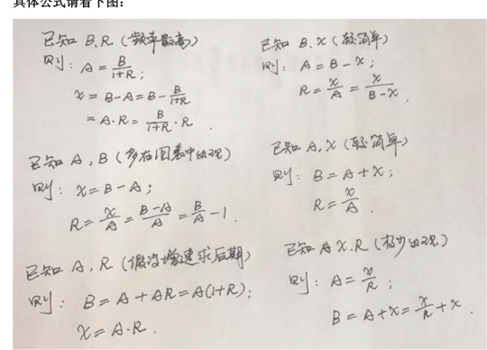

# Table of Contents

* [**做题顺序**](#做题顺序)

# **做题顺序**

# 资料分析ABRX四量关系

+ A: 前期
+ B:本期
+ X:变化量
+ R:变化率

> X=B-A  R=X/A

# 加法常用技巧

## 尾数法

尾数法：通过计算式子的末几位数从而确定选项的速算方法叫尾数法

*【2019上海】2015年全市全年新增汽车驾驶人30.58万人，新增汽车驾驶人人数比2014年高出1.47万人。2014—2015年，N市总计新增汽车驾驶人约（ ）万人。*

*A. 58.22 B. 59.69 C. 61.16 D. 62.63*

**解析**：根据题干已知条件可得出2014年新增汽车驾驶人数量为30.58-1.47，因此2014-2015年，总计新增是30.58+30.58-1.47。**式子列出后，观察选项的尾数各不相同，可以采用尾数法，计算最末一位即可，8+8-7=9**，故答案选B。

*【例2】经初步核算，2009年上半年我国国内生产总值同比增长7.1%，比一季度加快1.0个百分点。其中第一产业增加值为12025亿元，增长3.8%;第二产业增加值为70070亿元，增长6.6%;第三产业增加值为57767亿元，增长8.3%。问2009年上半年，我国国内生产总值为多少亿元?*

*A.139862 B.147953 C.148632 D.151429*

**解析**：题干中的时间为2009年上半年，所求为现期国内生产总值之和，即一二三产业增加值之和为12025+70070+57767，**式子列出后，观察选项最末两位数字互不相同，可采用尾数法，仅计算最末两位即可，为25+70+67计算结果为62**，则直接选择A选项

## 高位叠加

高位叠加：从高位加起，抓住问题主要矛盾

如4156＋6913＋5523，结果16592，使用高位叠加法，先算高位，千位4＋6＋5为15，则最高位为万位1，百位1＋9＋5为15，十位5＋1＋2为8，个位6＋3＋3为12，那写下来应为

## 削峰填谷

削峰填谷：几个数字相近，可以先找出基准值，再根据 **偏离总和**，求总和或平均值

如求5641、5642、5643、5641、5643、5638、5639的平均数中，括号内所有加数**都接近于5640**，我们可以选择5640作为基准数，然后再后面依次补上超出或不足的部分。

其实这样一看就很简单了，直接就是（3+1+3）÷7+5640=5641。极大减少了计算量。

# 减法常用技巧

## 整数基准值法

**.整数基准值法:**被减数一减数=(被减数一基准值)十(基准值一减数);例如“632 一589”，我们可以加入600作为基准值，则632一589= ( 632-600) +( 600- 589 )。 **一般来说是数字比较相近的用**

例如：80021-79978

=（80021-80000）+（80000-79978）

=21+22

=43

##  “21”“12”分段法

**“21”“12”分段法:**将三位数的减法分成“21”或“12”两段，尽可能保证不用借位，减少思考和出错。

如: 632-427。

后两位相减为正数，则可以用“12”两段，百位: 6-4=2，后两位: 32-27=05，则答案为205，不用借位。

