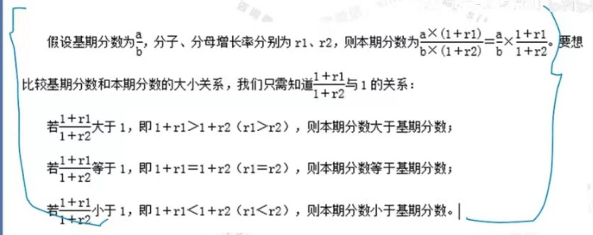
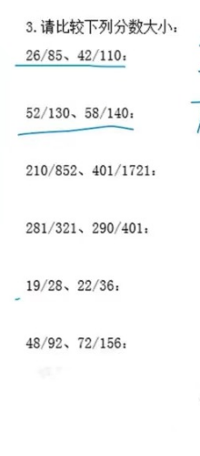
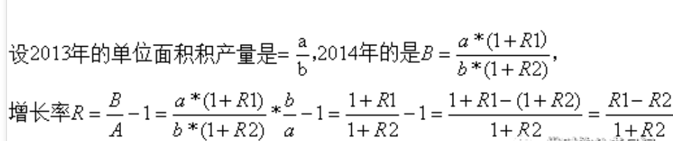
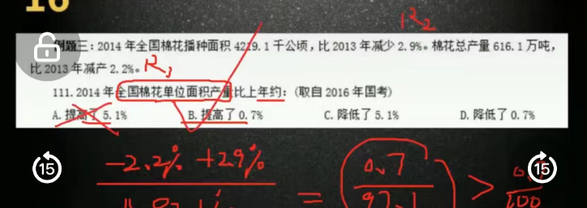
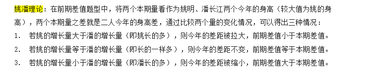
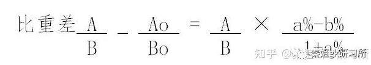
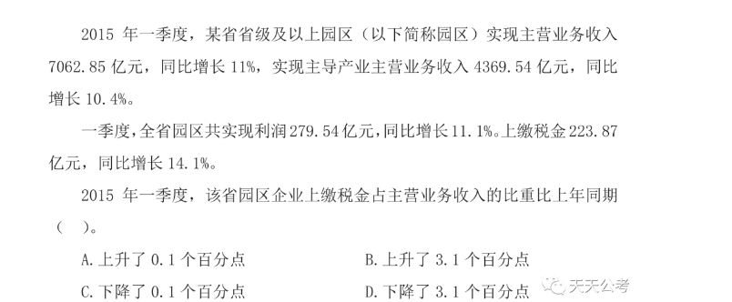
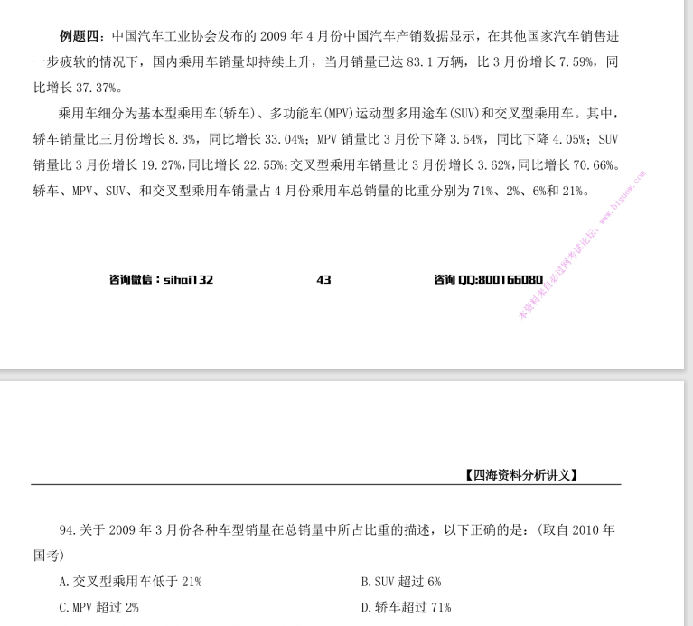
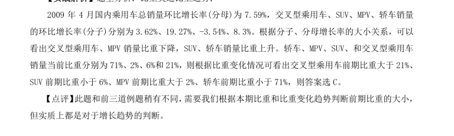

# Table of Contents

* [ABRX](#abrx)
  * [基期与现期](#基期与现期)
  * [增长量](#增长量)
  * [增长率](#增长率)
    * [增长率比较](#增长率比较)
    * [年均增长率](#年均增长率)
    * [混合增长率](#混合增长率)
  * [加法常用技巧](#加法常用技巧)
    * [尾数法](#尾数法)
    * [高位叠加](#高位叠加)
    * [削峰填谷](#削峰填谷)
  * [减法常用技巧](#减法常用技巧)
    * [整数基准值法](#整数基准值法)
    * [“21”“12”分段法](#2112分段法)
  * [乘法常用技巧](#乘法常用技巧)
    * [**百化分**](#百化分)
    * [**乘法拆分**](#乘法拆分)
    * [2位数乘法快速计算](#2位数乘法快速计算)
  * [除法常用技巧](#除法常用技巧)
    * [拆分法](#拆分法)
  * [速算之误差估算法](#速算之误差估算法)
    * [误差估算法的原理](#误差估算法的原理)
    * [例题解析](#例题解析)
  * [速算之截位直除法](#速算之截位直除法)
    * [截位直除法的原理](#截位直除法的原理)
    * [使用方法](#使用方法)
    * [真题分析](#真题分析)
  * [速算之“百化分”-重点](#速算之百化分-重点)
    * [原理](#原理)
    * [常用“百化分”数据](#常用百化分数据)
    * [例题分析](#例题分析)
    * [百化分的误差修正 -重点](#百化分的误差修正--重点)
  * [速算之“份数法”-重点](#速算之份数法-重点)
    * [份数法的原理](#份数法的原理)
    * [注意事项](#注意事项)
    * [例题分析](#例题分析-1)
  * [速算之'分配法'](#速算之分配法)
    * [原理](#原理-1)
    * [适用](#适用)
  * [增长趋势比较法](#增长趋势比较法)
  * [做题思路](#做题思路)
    * [求增长量](#求增长量)
    * [求增长率](#求增长率)
      * [比较2个x趋势大小](#比较2个x趋势大小)
      * [间隔增长率](#间隔增长率)
      * [**年均增长率**](#年均增长率-1)
      * [**混合增长率**](#混合增长率-1)
      * [**比值增长率**](#比值增长率)
    * [求前期](#求前期)
    * [求本期](#求本期)
  * [ABRX总结](#abrx总结)
* [比重](#比重)
  * [现期比重](#现期比重)
    * [隔期比重](#隔期比重)
  * [基期比重](#基期比重)
  * [比重差](#比重差)
  * [比重趋势](#比重趋势)
    * [做题思路](#做题思路-1)
  * [比重差和比值增长率的区别](#比重差和比值增长率的区别)
* [参考资料](#参考资料)

# ABRX

 **A为基期，B现期（benqi，可以根据拼音记忆），R为增长率，X为增长量。** 

B=A*(1+R)

A=B/(1+R)

## 基期与现期

作为对比参照的时期称为基期，而相对于基期的称为现期。描述具体数值时我们称之为基期量和现期量。

**假设增长率为r**

**现期量=基期量×（1+r）**

**基期量=现期量/（1+r）=现期量−增长量**

打个简单的比方，某商场2021年4月的营业额为6000万元，2022年4月的营业额为6800万元。那么可以计算出营业额增加了800万元，增长率为0.13%。在这里，“2021年4月”就叫做基期，“6000万元”就叫做基期量；“2022年4月”就叫做现期，“6800万元”就叫做现期量。其中800万元则为增长量，0.13%为增长率，后面会单独讲到。

通过例题更容易理解：

*【例1】2013年，全国共有工业企业法人单位241万个，从业人员14025.8万人，分别比2008年增长26.6%和19.5%。2008 年，全国共有工业企业从业人员约为多少亿人？*

*A．1.0 B．1.2 C．1.3 D．1.5*

**解析：**题中，2008年工业企业从业人员数为基期，2013年工业企业从业人员数为现期。已知现期为14025.8万人，增长率为19.5%，求基期。基期量=现期量/（1+r）=14025.8/（1+19.5%）≈1.2亿，选B

注意：从选项来看，各选项之间的差距较大，那么式子列出后，首选估算法，尽量将数据往整数上靠近，**分子14025.8可看做14000，分母1.195可以直接看做1.2**；于是转化为14÷12≈1.17，更接近选项B，那么这样一来计算量就大大的简化了。

**资料分析并不是需要你多么精准的计算出答案，而是需要你在找出数据之间的数量关系之后，分析出结果。所以请大胆的进行估算。**

*【例 2】2016 年，某市全年规模以上计算机、通信和其他电子设备制造业实现利润 84.8 亿元，增长 36.8%；专用设备制造业实现利润 73.9 亿元，增长 70.3%。2015 年该市规模以上专用设备制造业约实现利润多少亿元？*

*A．22 B．33 C．43 D．55*

**解析：**题中，2015年该市规模以上专用设备制造业利润为基期，2016年该市规模以上专用设备制造业利润为现期。已知现期为73.9亿元，增长率为70.3%，求基期。基期量=现期量/（1+r）=73.9/（1+70.3%）≈43.5，选C

注意：从选项来看，各选项之间的差距较大，那么式子列出后，首选估算法，尽量将数据往整数上靠近，**分子73.9可看做74，分母1.703可以直接看做1.7**；于是转化为74÷17≈4.35，接近选项C，那么这样一来计算量就大大的简化了。

*【例3】2017 年末，全国民用汽车保有量 21743 万辆，比上年末增长 11.8%。其中私人汽车保有量 18695 万辆，增长 12.9%；民用轿车保有量 12185 万辆，增长 12.0%，其中私人轿车保有量 11416 万辆，增长 12.5%。2016 年末全国私人轿车保有量为：*

*A.10148 万辆 B.11006 万辆*

*C.13879 万辆 D.16559 万辆*

**解析：**题中，2016年末全国私人轿车保有量为基期，2017年末全国私人轿车保有量为现期。已知现期为18695万辆，增长率为12.9%，求基期。基期量=现期量/（1+r）=18695/（1+12.9%）≈16559，选D

注意：从选项来看，各选项之间的差距较大，那么式子列出后，首选估算法，尽量将数据往整数上靠近，**分子18695可看做187，分母1.129可以直接看做11**；于是转化为187÷11=17，更接近选项D，这样一来计算量就大大的简化了。

##  增长量

增长量是指基期量与现期量增长（或减少）的绝对量。增长量是具体值，有单位。

**增长量=现期量－基期量；增长量有正负，负值代表减少量**

**增长量大小比较：**

**1.现期值大，增长率大，大大则大。意思就是：现期大于基期，增长率也比之前的大，那么增长量也比之前的大。**

**2.近似比较 现期量×r 乘积的大小，近似比较 A×r1 和 B×r2 的大小（应用范围为增长率的差距在20%）**

**3.如果增长率之间的差距很大，列出完整式子进行估算**

通过例题更容易理解：

*【例1】2012 年末全国就业人员 76704 万人，比上年末增加 284 万人；其中城镇就业人员 37102 万人，比上年末增加 1188 万人，乡村就业人员 39602 万人。相较于 2011 年，2012 年的乡村就业人员（）。*

*A．减少 904 万人 B．增加 904 万人*

*C．增加 1472 万人 D．减少 1472 万人*

题中，2011年乡村就业人员数量为基期，2012年乡村就业人员数量为现期。已知现期为39602万人，求增长量。2012全国总就业人员增加284万人，则2011年全国总就业人员a为76704-284=76420万人，而2011年城镇就业人员数量b为37102-1188=35914万人；所以基期X=76420-35914=40506万人。

增长量=现期量-基期量=39602-40506=-904万人，选A

注意：观察选项大家可以看到，选项数值之间差距较大，直接估算，**估算完后只需要分清正负**，即是增长还是减少就行。

另外，**因为选项尾数不同，也可以使用尾数法**，式子列出后，只计算尾数，然后确定正负即可。

*【例3】2015 年全国共建立社会捐助工作站、点和慈善超市 3.0 万个，比上一年减少 0.2 万个，其中：慈善超市 9654 个，同比下降 5.1%。2015 年，全国建立的慈善超市较 2014 年约：*

*A．增加 519 个 B．减少 519 个*

*C．增加 686 个 D．减少 686 个*

**解析：**题中，2014年全国建立的慈善超市数为基期，2015年全国建立的慈善超市数为现期，已知现期为个，增长率为-5.1%，求增长量。基期量=现期量/（1+r）=9654/（1-5.1%）≈10173个。增长量=现期量-基期量=9654-10173=-519个，选B

*例4】2012 年，某省规模以上工业增加值 10875 亿元，比上年增长 7.1%，月度增速从 1—2 月的 2.9%回升到 10—12 月的 10%以上。大型、中型和小微型企业增加值分别为 3074、3217 和 4584 亿元，比上年分别增长 8.2%、6.8%和 6.7%。与 2011 年相比，2012 年该省规模以上工业增加值约增加了多少亿元？*

*A．600 B．720 C．840 D．960*

**解析：**题中，2011年该省规模以上工业增加值为基期，2012年该省规模以上工业增加值为现期。已知现期为10875亿元，增长率为7.1%，求增长量。基期量=现期量/（1+r）=10875/（1+7.1%）≈10154亿元。增长量=现期量-基期量=10875-10154=721个，选B

*【例5】2017 年粮食产量 61791 万吨，比上年增加 166 万吨，增产 0.3%。全年棉花产量 549 万吨，比上年增产 3.5%。油料产量 3732 万吨，增产 2.8%。糖料产量12556 万吨，增产 1.7%。茶叶产量 255 万吨，增产 6.0%。2017 年，我国棉花的产量比 2016 年约增产了（ ）万吨。*

*A.7 B.19 C.31 D.48*

**解析：**题中，2016年我国棉花产量为基期，2017年我国棉花产量为现期。已知现期为549万吨，增长率为3.5%，求增长量。基期量=现期量/（1+r）=549/（1+3.5%）≈530万吨。增长量=现期量-基期量=549-530=19万吨，选B

## 增长率

1. 增长率=增长量/基期量=(现期-基期)/基期量
2. 基期增长率=现期增长率±百分点(增幅、增速)

*【例1】2013年 1-3 月，全国规模以上工业企业实现利润 11740.1 亿元，比上年同期增长12.1%，增幅比 1-2 月回落5.1 个百分点。2013年 1-2 月规模以上工业企业实现利润同比增长率：（ ）*

*A.7% B.12.1% C.17.2% D.17.4%*

**解析：**求1-2 月增长率。已知1-3 月增长率为12.1%，增幅比1-2 月回落5.1 个百分点。基期增长率=现期增长率±百分点，则1-2月增长率为12.1%+5.1%=17.2%。选C

### 增长率比较

现期量/基期量”倍数越大，增长率越大

若“现期/基期”倍数相同，则比较“增长量/基期量”

通过例题更容易理解：

*【例1】2014年我国粮食种植面积11274万公顷，比上年增加 78 万公顷。棉花种植面积422 万公顷，减少13 万公顷。油料种植面积 1408 万公顷，增加 6 万公顷。糖料种植面积 191 万公顷、减少 9 万公顷。2014年，我国粮食种植面积同比增速比油料种植面积同比增速（ ）。*

*A．高不到 1 个百分点 B．高 1 个百分点以上*

*C．低不到 1 个百分点 D．低 1 个百分点以上*

**解析**：增长率=增长量/基期量，2014年我国粮食种植面积增长率=78÷11274≈0.7%。2014年我国油料种植面积增长率=6÷1408≈0.43%。比较大小后，选A

注意：式子列出后可用估算法，估算成整数更容易计算，将分子78 看做80，将分母11274 看做11000。分子变大，分母变小，可以中和误差，即粮食种植面积增速为80÷11000≈0.7%；同理，将分母1408 看做1400，即油料种植面积增速为6÷1400≈0.4%。

*【例2】我国 2017 年粮食种植面积为 11222 万公顷，比上年减少 81 万公顷。其中，小麦种植面积 2399 万公顷，减少 20 万公顷；稻谷种植面积 3018 万公顷，减少0.2 万公顷；玉米种植面积 3545 万公顷，减少 132 万公顷。棉花种植面积 323 万公顷，减少 12 万公顷。2017 年，我国小麦、稻谷、玉米、棉花四种农作物中，种植面积减少速度最快的是（）。*

*A.小麦 B.稻谷 C.玉米 D.棉花*

**解析：**小麦种植面积减速=20÷2399≈0.8%；稻谷种植面积减速=0.2÷3018≈0.007%；玉米种植面积减速=132÷3545≈3.723%；棉花种植面积减速=12÷323≈3.715%。比较大小后，选C

注意：拿到题目后，首先分析数据，这里要此较的是四个增速的大小，可以先根据数据特征排除掉明显不可能的选项。粗略估算，第一个可以排除的就是稻谷。因为减少的0.2几乎可以忽略不计，即持平：而小麦20 万公顷，减速不到1%。那么其实真正要进行比较的是玉米和棉花。

### 年均增长率

基期量(1+年均增长率r%)N=现期量

当N+r﹤10,(1+r%)N≈1+N×r%

通过例题更容易理解：

*【2012 年浙江】2010 年农村居民得到的转移性收入人均 453 元，比 2005 年增加 305 元。其中，2010 年各级政府给予的农业生产补贴收入人均 118 元，比 2005 年增加 100 元，增长 5.5.倍；2010 年农村居民领取的离退休金、养老金人均 113 元，比 2005 年增加 82 元，增长 2.7 倍。“十一五”期间，我国农村居民人均转移性收入的年均增长率约为：*

*A．10% B．15% C．20% D．25%*

**解析：**已知2010年农村居民得到的转移性收入人均453元，比2005年增加305元，求“十一五”期间，我国农村居民人均转移性收入的年均增长率。2005年农村居民得到的转移性收入=453-305=148元，增长率=305÷148≈206%，5次开方约等于15%，选B

注意：在这里 “十一五”期间的年均增长率。其实就是从2005 -2010 年之间每年平均增长了多少。那么先求出基期2005年的原始参照额为148 元，再将5年总的增长量来除以这个原始参照额，就能够得到5年总的增长率 为 305÷148 转化为300÷150≈200%。求出总的增长率之后，年均增长率就可以得出了。

### 混合增长率

整体包括两部分，整体的增长率介于两部分增长率之间，且靠近基期较大的一方。

A×B的增长率=a%+b%+a%×b%

A的增长率a%，B的增长率b%

通过例题更容易理解：

*【例1】2015 年江西省财政总收入 3021.5 亿元，比上年增长 12.7%，财政总收入占生产总值的比重为 18.1%，比上年提高 1.0 个百分点。其中，税收收入 2373.0 亿元，增长 8.9%，占财政总收入比重为 78.5%，其他收入 648.5 亿元。2015 年江西省财政总收入中的其他收入比上年（ ）*

*A．减少了 2.9% B．减少了 29.2%*

*C．增加了 2.9% D．增加了 29.2%*

**解析：**已知，财政总收入由税收收入和其他收入两部分组成。2015年江西省财政总收入3021.5，增长率为12.7%；税收2373，增长率为8.9%；其他收入648.5，求其他收入的增长率。由于整体的增长率介于两部分增长率之间，且靠近基期较大的一方。则12.7%介于8.9%和其他收入的增长率之间，且更靠近8.9%，因此结合选项，只有29.2%符合条件，选D。仅靠分析即可得出答案，根本不用计算。

*【例2】2013年3月末，主要金融机构及小型农村金融机构、外资银行人民币房地产贷款余额 12.98 万亿元，同比增长 16.4%。地产开发贷款余额 1.04 万亿元，同比增长 21.4%。房产开发贷款余额 3.2 万亿元，同比增长 12.3%。个人购房贷款余额 8.57 万亿元，同比增长 17.4%。保障性住房开发贷款余额 6140 亿元，同比增长 42.4%。2013 年 3 月末，房地产开发贷款余额同比增速约为（ ）。*

*A.14.4% B.12.3% C.19.3% D.21.4%*

**解析：**已知地产开发贷款余额增长率为 21.4%，房产开发贷款余额增长率为 12.3%，求房地产开发贷款余额增长率。由于整体的增长率介于两部分增长率之间，且靠近基期较大的一方。则房地产开发贷款余额增长率位于12.3%和21.4%之间，且更靠近12.3%，结合选项，选A。仅靠分析即可得出答案，根本不用计算。

*【例3】2017 年，A 省完成邮电业务总量 6065.71 亿元。其中，电信业务总量 3575.86亿元，同比增长 75.8%；邮政业务总量 2489.85 亿元，增长 32%。2017 年 A 省邮电业务总量同比增速在以下哪个范围之内？*

*A．低于 25% B．25%~50%之间*

*C．50%~75%之间 D．超过 75%*

**解析：**已知电信业务总量增长率为 75.8%，邮政业务总量增长率为 32%，求邮电业务总量增长率。由于整体的增长率介于两部分增长率之间，且靠近基期较大的一方。则邮电业务总量增长率位于32%和75.8%之间，且更靠近75.8%，结合选项，选C。仅靠分析即可得出答案，根本不用计算。

*【例4】2015 年上半年全国水产品产量 2700.09 万吨，同比增长 3.20%，其中养殖水产品产量 2114.38 万吨，同比增长 4.13%。2015 年上半年，非养殖水产品产量与上年同期相比的变化最接近以下哪个数字？*

*A．-20% B．0% C．5% D．10%*

**解析：**已知全国水产品产量增长率为 3.20%，养殖水产品产量增长率为 4.13%，求非养殖水产品产量增长率。由于整体的增长率介于两部分增长率之间，且靠近基期较大的一方。则全国水产品产量增长率3.20%位于4.13%和非养殖水产品产量增长率之间，且更靠近4.13%，结合选项，排除CD，因总量处于正增长，排除A，选B。仅靠分析即可得出答案，根本不用计算。

## 加法常用技巧

### 尾数法

尾数法：通过计算式子的末几位数从而确定选项的速算方法叫尾数法

*【2019上海】2015年全市全年新增汽车驾驶人30.58万人，新增汽车驾驶人人数比2014年高出1.47万人。2014—2015年，N市总计新增汽车驾驶人约（ ）万人。*

*A. 58.22 B. 59.69 C. 61.16 D. 62.63*

**解析**：根据题干已知条件可得出2014年新增汽车驾驶人数量为30.58-1.47，因此2014-2015年，总计新增是30.58+30.58-1.47。**式子列出后，观察选项的尾数各不相同，可以采用尾数法，计算最末一位即可，8+8-7=9**，故答案选B。

*【例2】经初步核算，2009年上半年我国国内生产总值同比增长7.1%，比一季度加快1.0个百分点。其中第一产业增加值为12025亿元，增长3.8%;第二产业增加值为70070亿元，增长6.6%;第三产业增加值为57767亿元，增长8.3%。问2009年上半年，我国国内生产总值为多少亿元?*

*A.139862 B.147953 C.148632 D.151429*

**解析**：题干中的时间为2009年上半年，所求为现期国内生产总值之和，即一二三产业增加值之和为12025+70070+57767，**式子列出后，观察选项最末两位数字互不相同，可采用尾数法，仅计算最末两位即可，为25+70+67计算结果为62**，则直接选择A选项

### 高位叠加

高位叠加：从高位加起，抓住问题主要矛盾

如4156＋6913＋5523，结果16592，使用高位叠加法，先算高位，千位4＋6＋5为15，则最高位为万位1，百位1＋9＋5为15，十位5＋1＋2为8，个位6＋3＋3为12，那写下来应为

### 削峰填谷

削峰填谷：几个数字相近，可以先找出基准值，再根据 **偏离总和**，求总和或平均值

如求5641、5642、5643、5641、5643、5638、5639的平均数中，括号内所有加数**都接近于5640**，我们可以选择5640作为基准数，然后再后面依次补上超出或不足的部分。

其实这样一看就很简单了，直接就是（3+1+3）÷7+5640=5641。极大减少了计算量。

## 减法常用技巧

### 整数基准值法

**.整数基准值法:**被减数一减数=(被减数一基准值)十(基准值一减数);例如“632 一589”，我们可以加入600作为基准值，则632一589= ( 632-600) +( 600- 589 )。 **一般来说是数字比较相近的用**

例如：80021-79978

=（80021-80000）+（80000-79978）

=21+22

=43

###  “21”“12”分段法

**“21”“12”分段法:**将三位数的减法分成“21”或“12”两段，尽可能保证不用借位，减少思考和出错。

如: 632-427。

后两位相减为正数，则可以用“12”两段，百位: 6-4=2，后两位: 32-27=05，则答案为205，不用借位。

## 乘法常用技巧

### **百化分**

**.百化分:即将百分数转化为分数，若乘法中有某个乘数可以近似的转化为某个常见分数，我们可以将多位数乘法转化为简单除法计算。**

需记忆的常用小数如下:

50%=1/2

33.3%=1/3

25%=1/4

20%=1/5

16.7%=1/6

14.3%=1/7

12.5%=1/8

11.1%=1/9

如: 228*167 167≈1/6 (只考虑有效数字)

即228*167=228/6=38 (只考虑有效数字)

*【例2】2015年1-7月，我国机电产品出口额44359.4元，同比增长1.2%，占出口总额的57.2%。问：2015年1-7月，我国出口总额为（ ）。*

*A.63534.0元 B.77551.4元 C.82907.1元 D.95772.7元*

**解析**：出口总额为44359.4÷57.2%。式子列出后，可用百化分，**57.2≈57.1约等于4/7**。则44358÷4×7，观察选项，此时只计算前两位44÷4×7=77已经可以得出正确答案了。选B。

### **乘法拆分**

若乘法中有某个乘数为百分数且能拆成两个简单数值( 50%、10%、5%等),我们可以将该百分数拆成两部分再相乘。 **常用的小数拆分如下**:

45%= 50%-5%;

55%= 50%+5%;

15%= 10%+5%;

60%= 50%+10%;

95%=1-5%，

90%= 1-10%，

所有50%、100%附近数等。

如: 319*78%可以转化为319*( 100%-20%-2%) =319-63.8-6.38。

*【例】:某地区2014年的地区生产总值为1500亿元，第一产业生产值占地区生产总值的17.8%,问该地区2014年的第一产业生产总值是多少?*

**解析**:先把式子列出来：1500×17.8%，此时可用拆分法。观察得17.8%=20%-2%-0.2%，则1500×(20%-2%-0.2%)，这样整个式子就非常好算了，300-30-3=267。

【例】94.5*44.2%= 94.5 * (4/9-0.2%)

【例】620*45%= 620 * (50%-6%)=310-31=279

【例】1694*97%= 1694-17 * 3=1643

### 2位数乘法快速计算

## 除法常用技巧

### 拆分法

列除法竖式做除法是同学们最熟悉的一种除法解法，也被我们称之为直除法;直除法简单直观，是绝大多数同学在考场上最信赖的解法，但直除法包含一个难点:当被除数和除数均较大时，商到底应上哪个数字，有时需要长时间的思考。

拆分法并不是一种估算方法，和直除法一样，拆分法也是精确求解。拆分法是把误差逐渐减少趋向于零的过程，我们可以根据选项设置决定何时停止计算。拆分的本质是对直除进行优化，规避掉了直除法中存在的难点。在熟练掌握拆分法之后，所有的除法均可用拆分法解决。

顾名思义，**拆分法的本质是将被除数由大到小拆成几部分分别计算，通过逐步分解，从而得出结果。这与哲学中的抓住主要矛盾、抓住矛盾的主要方面原理一致，抓住被除数的绝大部分，即使小部分存在误差，对最终结果影响也有限。**

**拆分法使用规则:**

**规则一:如果分数大小接近1(分子分母相差不大),可用100%减去;**

> 398/462=1-64/462=1-(46+14)/462=1-10%-3%=87%

**规则二：如果分子在分母的50%附近，先拆出50%;**

> 428/976=(488-60)/976=(488-60)/976=50%-6.2%=43.8%

**规则三:如果分子很小，可根据实际情况拆出10%或5%或1%;**

**规则四:在不满足上述情况时，可根据首位比值，拆出其他特殊分数(例如1/4,1/3,2/3,3/4,4/5等），此规则运用次数极少，了解即可。**

[注]在做多位数除法时，分子只保留前三位即可，分母可根据情况保留三四五位，即三位/三位、三位/四位、三位/五位均可。

[注]为方便计算，使用拆分法时可将分母写成偶数形式(因经常出现除以2的情况，偶数显然较奇数计算简单)。同理，在拆出1/4时，尽可能将分母写成4的倍数;拆出1/3时，尽可能将分母写成3的倍数。

如: 332/688

先拆出50%;344-12/688=50%-2%=48%

再比如：1226÷4884

拆分为（1221+5）÷4884

=1221÷4884+5÷4884

=25%+可以忽略不计的数

此时就可以根据选项选出最接近于25%的那个选项。

## 速算之误差估算法

所谓估算，是在精度要求并不太高的情况下，进行粗略估值的速算方式，一般在选项相差较大，或者在被比较数据相差较大的情况下使用。

### 误差估算法的原理

**在除法计算中，分子分母如果同比例放大或缩小，计算结果是不变的**。误差分析其实就运用到这个原理，面对计算复杂的分式，我们通过**接近等比例地改变分子和分母的大小**（优先减去分母，然后根据分母与分子之间的倍数关系减去分子），简化计算难度 ，这样既加快解题速度，也能保证计算结果的准确性。

**取舍规则：**

+ **除法：**分子不变，**分母**取前三位(四舍五入)

打个比方，计算52348÷26035，估算法中可以直接将分母保留前三位260，即变为52348÷260，在减少计算量的同时，保证误差在可接受范围内。

+ **乘法：**

  + 1.全舍：**第三位有效数字全是0、1、2**

    打个比方，如何求**1319.2×4820.4**的值。这两个数各有5位有效数字，保留前两位有效数字即保留13和48，后面的有效数字怎么取舍则看第三位有效数字：分别是1和2，两边都是0到2中的小数字，所以可以全部舍掉忽略不计，直接估算为**1300×4800**=6240000。

  + 2.全进：**第三位有效数字全是8或9**

    打个比方，如何求**5289×13.9%**的值。大家可以看到5289有四位有效数字，13.9%则有三位有效数字。保留前两位有效数字即保留52和13，第三位有效数字分别为8和9，这些都是很大的数字，所以全部往前进一位。将乘法估算为**5300×14%**=742。

  + 3.一进一舍

    很多时候我们的第三位有效数字并不是0-2或8-9，都是介于中间，那么我们就不能简单的将其全进或全舍。

    这时就要遵循“**小数四舍五入，大数反向变化**”。

    **前两位有效数字大的为大数，前两位有效数字小的为小数**，先让小数根据第三位有效数字的大小四舍五入，大数这边就只需要根据小数的变化反着来就可以了，保证一进一舍。

    打个比方，如何求**56345.3×63.4%**的值。这两个数保留前两位有效数字为56和63，那么前面为小数，后面为大数。观察第三位有效数字分别是3和4，判断出需要一进一舍。小数有取舍的优先权，因为56345这个数的第三位有效数字是“3”，所以四舍五入应该舍掉，这个数就估算为“56000”。既然小数舍，要满足一进一舍，那么大数就要进，即使“63.4%”的第三位有效数字为4，也要往前进一位，估算为“64%”。**56000×64%**=35840。这样一进一舍才能确保误差在一个较小的范围。

### 例题解析

*【例1】629÷(1+12.5%)=（ ）*

*A.550.2 B.553.4 C.556.5 D.559.1*

**解析**：在这个题目中除法我们直接可以用有效数字法计算，即629÷1.13=556.6。此时选项C与它接近，但是除数1.13>1.125，所以我们计算的值偏小，选D

*【例2】911÷(1+23.5%)=（ ）*

*A.730.1 B.734.7 C.737.7 D.741.3*

**解析**：用有效数字计算，即911÷1.24=734.7，接近B选项，同样除数1.24>1.235.所以计算值偏小，但是在选项中较大的有C、D。所以此时我们要知道到底在估算的时候小了多少，这也就是误差差距分析，除数由1.235到1.24涨了0.4%。所以估算值要想和实际值一样大，911也应该涨0.4%，即为3.6左右，所以应该737.7左右，选C

*【例3】 611×911=（ ）*

*A.451000 B.553000 C.555000 D.557000*

**解析**：我们用乘法有效数字法，第三位有效数字为1和1。全舍，即为61×91=555000.因为第三位有效数字全舍。所以，估算结果偏小，选D

*【例4】629×918=（ ）*

*A.571100 B.573200 C.577400 D.579600*

**解析**：用有效数字法，第三位为9和8，全进，即为630×920=579600，此值等于D选项，但是因为第三位有效数字全进，所以选择较小的C

*【例5】233×123=（ ）*

*A.26231 B.28659 C. 28974 D.29533*

**解析**：同样，我们用有效数字，一进一舍。即为240×120=28800，可以看出这个估计值处于B、C之间。所以需要判断两个数字的取舍误差，123舍弃3，大概降低2.4%，233进了7，大概进了3%。所以结合来看，进的较多，估算值偏大，选较小的，选B

*【例6】2011全年,棉花产量660,同比增长10.7%;油料产量3279,同比增长1.5%;烤烟产量287,增产5.1%;茶叶产量162,增产9.9%｡请问增产量最大的是( )*

*A棉花 B油料 C烤烟 D茶叶*

**解析**:棉花产量､增长率均大于烤烟､茶叶,则棉花增长量大于烤烟茶叶,CD排除,则比较AB即棉花原产量乘以10.7%与油料原产量乘以1.5%的大小,棉花增率是油料的7倍多,而棉花原产量大于油料的7分之一,故选择A

*【例7】2015年我国钟表行业进出口总额为92.5亿美元，同比增长4%，完成出口总额为57.7亿美元，同比增长8.3%，进口额34.8亿美元。则 2014年我国钟表行业贸易顺差约为多少亿美元？*

*A.27 B.25 C.23 D.18*

**解析**：进出口总额的增长率位于进出口分别增长率之间，所以15年进口增长率低于4%，则15年出口总额与增长率均大于进口，增长量就大于进口，所以15年贸易顺差大于14年，而15年贸易顺差为57.7-34.8=22.9，则14年贸易顺差小于22.9，选择D

*【2016年国考】2014年，全国新登记注册市场主体1292.5万户，比上年同期增加160.97万户。其中，企业365.1万户，个体工商户896.45万户。2014年，全国新登记注册市场主体中个体工商户所占比重约为( )*

*A、75% B、69% C、85% D、81%*

**解析**：通过观察，我们发现选项相差较大，将1292.5粗看成1290，为计算便捷可自动忽视后面的0。所以照抄三位（粗算）即可，列出等式：896÷129=（896+7）÷（129+1）【由于分母是分子的七倍多，当分母加上1时，分子加上7】。即可看成903÷13=69。与B项接近，所以选择B

*【2018年甘肃】2016年，全国艺术表演团体共演出230.60万场，比上年增长9.4%，其中赴农村演出151.60万场，增长9.0%；在2015年全国艺术表演团体演出场次中，赴农村演出占比约为( )*

*A.64.77% B.65.74% C.65.97% D.6.91%*

**解析**：选项很接近（需要细算），直接列出等式如下，选C

大家在资料分析题列式过程中，遇到增长率这类百分数，千万不要再写（1+x%）这种式子，而是要迅速将其转换成普通数字，这样才能保证解题时间充足。

## 速算之截位直除法

 但是大家在做估算的时候，都会有过疑惑，到底应该保留几位，估算才不会错，从而又尽可能减少计算量呢？一些同学也反映说，一遇到复杂计算问题，本能的就只会用乘除法。这样也没错，但是如果你能够掌握截位直除法的速算技巧，那就是一个大大提升速度的捷径。截位直除法在资料分析中属于非常快速的计算方法，不管是多个分数或者是一个分数，多种题型都能适用，简单粗暴效果好。 

### 截位直除法的原理

举个例子，23456这个数字，如果截取两位有效数字是23000，估算值比原数据减小了456，误差大约为-2%；如果截取三位有效数字是23500，估算值比原数据增大了44，误差大约为2‰。

通过这个例子我们可以看到截取两位数字误差可以控制在百分之几，那么截取三位的话，误差可以控制在千分之几，千分以内的误差在我们资料分析的估算中是足够的。

### 使用方法

**1.截位对象：** **一步除法只截分母，两步除法分子分母都截。** 资料分析中大部分都是一部除法

**2.截取位数：**  **选项首位不同，选项差距大，截两位计算；选项首位相同，选项差距小，截三位计算。**

打个比方，如果四个选项值分别为486、678、841、935，我们看到首位分别为4、6、8、9，完全不一样，那么我们在计算的时候大胆一点，只需要截取两位进行计算就好了。

但是如果四个选项分别是6486、6678、6841、6935呢，这个时候，我们就必须要截取三位来计算了，因为首位都是一样的，你需要计算到第二位去才能筛选出答案。

**3.分母截位三位有效数字是上限：**判定截取两位还是三位有效数字，要根据选项的差距来决定。

如果选项是10 、20、30、40， 选项之间的差距很大，我们就可以估算的粗略一点，放肆一点，截取两位去估算，没毛病。

如果选项是11、12、13、14 ，选项之间的差距很小，我们就需要估算的精细一点，谨慎一点，但是截取三位是足够的。

如果选项之间的差距都在10%以上，我们就认为差距大，截取两位估算。如果选项之间的差距在10%以内，我们认为差距小，截取三位估算。

> 画重点！！！！
>
> 别看上面说了那么多，这句话才是关键，如果选项之间的差距都在10%以上，我们就认为差距大，截取两位估算。如果选项之间的差距在10%以内，我们认为差距小，截取三位估算。

【例1】45.38÷1.2635=（ ）

A、21 B、36 C、57 D、110

解析：根据选项首位均不同，判定我们截取两位有效数字，只估算分母即可，原式估算为4538/13，（小数点不影响计算结果），首位直除为3，选B。

【例2】2013年，广东固定资产投资总量迈上新台阶，共完成22858.53亿元，增长18.3%，比2012年加快2.8个百分点。其中，城镇投资18907.34亿元，增长18.6%；农村投资3951.19亿元，增长17.0%。2013年，广东城镇投资约为农村投资的（ ）倍。

A.1.2 B.2.2 C.4.8 D.5.8

解析：题目要计算2013年广东城镇投资约为农村投资的多少倍，只需要广东城镇投资额除以农村投资额即可。观察选项首位不同，可以考虑除数截两位计算。由材料可知2013年广东城镇投资18907.34亿元；农村投资3951.19亿元。计算公式为18907.34÷3951.19,分母截取前两位后，原式=18907.34/40直除首位商4，直接选C。

【例2】2011年上半年，我国软件产业实现软件业务收入8065亿元，同比增长29.3%，增速比去年同期高0.2年百分点；实现利润103亿元，同比增长34.9%。其中，6月份完成软件业务收入1828亿元，同比增长32.9%，增速比5月份回升3.6个百分点。2011年6月份我国软件产业软件业务收入占上半年总值的比重约为：

A. 22.7% B. 24.6% C. 26.5% D. 29.1%

解析：题目求2011年6月份我国软件业务收入占上半年总值比重，只需用6月份我国软件业务收入除以上半年的软件收入即可。观察选项，首位相同，最接近的两项24.6%和26.5%次位差为2，等于首位2，可以考虑分母截三位计算。由材料可知，2011年上半年，我国软件产业实现软件业务收入8065亿元，6月份完成软件业务收入1828亿元，占比=1828÷8065。分母截前三位后，原式=1828/807直除首两位商22，直接选A。

### 真题分析

截位直除法核心：只估算分母即可。

例如12345/1369，假设我们需要截取三位估算，那么我们只要算12345/137即可；为什么？

首先，如果分子和分母都保留三位应该是12300/137，大家动笔计算一下，分子分母都估算有没有减少我们的计算量？并没有。

其次，分子分母同时估算，分子减小，分母增加，最后会导致误差放大。

【2017年浙江】2015年F省城镇消费品零售额9448.57亿元，增长12.2%；乡村消费品零售额1057.36亿元，增长14.1%。2015年，F省城镇消费品零售额约是乡村消费品零售额的多少倍？

A.8.2倍 B.8.5倍 C.8.6倍 D.8.9倍

解析：先列式，9448.57/1057.36，根据选项首位有相同的，我们保留三位有效数字，只估算分母即可，原式为9448.57/106，直除两位得到89即可，选D。

【2015年联考】2013年二季度，我国税收月收入同比增速逐步提高，分别为7.9%、8.3%和12.9%。截至2013年6月，全国税收总收入完成59260.61亿元，同比增长7.9%，较上年同期回落1.9个百分点。2012年1-6月全国税收总收入为：

A．52973.28亿元 B．54921.79亿元

C．56938.68亿元 D．63942.19亿元

解析：先列式，59260.61/（1+7.9%）=59260.61/1.079，根据选项首位有相同的，我们保留三位有效数字，只估算分母即可，原式为59260.61/108，直除两位得到54即可，选B。

【2018年浙江】2016年出口总额中，机电产品出口1357.20亿元，高新技术产品出口424.23亿元，分别增长8.3%和7.6%2015年，H市高新技术产品出口额约为( )。

A.385.6亿元 B.394.3亿元

C.398.6亿元 D.412.5亿元

解析：先列式，424.23/（1+7.6%）=424.23/1.076，根据选项首位有相同的，我们保留三位有效数字，只估算分母即可，原式为424.23/1.08，直除三位大约为393，选B。

注意，很多同学看到BC选项的时候犹豫了，这两个太接近了，不敢保留三位估算了，其实大可放心，还是在我们可控的误差范围内的，不信自己去算一下。

【2016年国考】2014年，全国新登记注册市场主体1292.5万户，比上年同期增加160.97万户；注册资本（金）20.66万亿元，比上年同期增加9.66万亿元。其中，企业365.1万户，个体工商户896.45万户，农民专业合作社30.95万户。2014年，全国新登记注册市场主体中个体工商户所占比重约为（ ）。

A．69% B．75% C．81% D．85%

解析：先列式896.45/1292.5，根据选项首位有相同的，保留三位有效数字估算，只估算分母即可，896.45/129，直除首位是6，选择A。

注意，其实本题，分母1292.5，保留三位129或者保留两位130都是可以的，两者之间太接近了，估算为1300误差也在百分之一以内，完全可以的，误差可以灵活把控，不是死的。

【2018年浙江】2016年，H市实现货物进出口总额4485.97亿元，增长8.7%。其中，出口总额3313.80亿元，增长6.7%2016年，H市货物出口总额占进出口总额的比重约为( )。

A.74% B.76% C.78% D.80%

解析：先列式，3313.80/4485.97，根据选项首位有相同的，保留三位有限数字，只估算分母，于是3313.80/449，449和450太接近了，误差就在1/450，千分之二的误差，灵活一点可以估算为450进行计算，3313.80/45，直除两位接近74，选A。

## 速算之“百化分”-重点

> 上面乘法技巧里面其实已经介绍了百化分，但是没有结合 其他来进行应用，以及百化分的修正

大家知道，资料分析里很多数据都跟百分数有关，但是百分数如果不加改造，计算量是非常大的。那么有没有一种简易的方法能够显著降低百分数的计算量呢？

当然有，那就是“百化分”，完整说就是“将百分数转化成分数”。这样一说，大家是不是感觉又回到了初中数学，没错，这本来就是初中数学，只是大家长时间不接触，已经遗忘了而已。

### 原理

即把百分数转化为对应的分数，比如10%=1/10，25%=1/4等。

如果我们用A表示现期量，a%表示增长率，假设a%对应的分数为1/N，a%和N之间有如下关系：a%×N=1。

根据增长量的公式，可以得出增长量=A×a%/(1+a%)。

我们把其中的a%用1/N替换，则增长量=A×(1/N)/(1+1/N)=A/(1+N)。通过百化分的转化之后，计算量明显减少，并且不容易出错。

例如：A×12.5%/（1+12.5%），用1/8代替12.5%，则可以化简为A/9。

### 常用“百化分”数据

我们只需要记住常用的1/2 到 1/10 后面的直接*2就可以了

### 例题分析

【2018国考127】2016年广东省公园绿地面积达89591公顷，占全国公园绿地面积的比重约为14%。则 2016年，全国公园绿地面积约为多少万公顷？

A.64 B.20 C.640 D.200

**解析**：算式为89591/14%，我们发现14%非常接近1/7，在选项差距比较大的情况下，可以结合估算法，将**89591估算为9万，14%估算为1/7**，这样就直接把算式简化为了9×7=63万，最接近的选项为A。

【2009秋季联考】2006年全国共有生产力促进中心1331家，比上年增加61家。生产力促进中心在全国分布广泛，但地区分布不均，四川、山西、黑龙江、广西、福建等地较多，分别为136，99，96，94，83家。生产力促进中心数量最多的三个省份的中心数量占全国总数的比重是：

A.19.7% B.22.7% C.23.0% D.24.9%

**解析**：观察选项，发现BC之间差距很小，差了0.3个百分点，相当于差了1%左右，所以根据误差控制的1/3原则，我们计算过程中，误差需要控制在3‰以内，这需要非常高的计算精度，所以我们先把算式精确地列出来：（136+99+96）/1331=331/1331，很明显≈**1/3÷4/3**=25%，选D。如果很不巧，答案接近BC中的一个，因为BC差距很小，这时候，我们就需要精确的计算了。

【2012北京-132】俄罗斯是世界最大的管道天然气出口国，占管道天然气总出口量的27.8%，2009年出口量为1764.8亿立方米，较2008年增长14.3%，2009年俄罗斯管道天然气出口较上年增长了多少亿立方米?( )

A.110 B. 221 C. 332 D. 443

**解析**：列出算式为1764.8×14.3%/（1+14.3%），**因为14.3%高度接近1/7**，所以我们直接用百化分的n+1方法，1765/8=221，选B。

【例4】2010年，某省广电实际总收入为145.83亿元，同比增长32.07%。其中，广告收入为67.08亿元，同比增长25.88%;有线网络收入为45.38亿元，同比增长26.35%;其他收入为33.37亿元，同比增长57.3%。2009年，该省的有线网络收入约为多少亿元?

A. 21 B. 36 C. 57 D. 110

**解析**：先将算式列出为45.38/（1+26.35%），观察选项之间差距较大，可用估算法，**将26.35%转化为分数，最接近于1/4，将分母转化为整数45**，于是就简化为45×4/5=36，选B。

【例5】2010年1～3月，法国货物贸易进出口总额为2734.4亿美元，同比增长13.4%。其中，出口1264.7亿美元，同比增长14.5%;进口1469.7亿美元，同比增长12.4%;逆差205.0亿美元，同比增长1.0%。2010年1～3月，法国货物贸易进出口总额比上年同期增长了约多少?()

A.323亿美元 B.356亿美元 C.389亿美元 D.410亿美元

**解析**：首先列出式子2734.4/(1+13.4%)，进出口总额的增长率为13.4%，没有比较明确对应的百分数，已知**14.3%=1/7，12.5%=1/8，13.4%在14.3%和12.5%之间，可以估算为1/7.5**。因此进出口总额的增长量为2734.4/(1+7.5)=2734.4/8.5=321.69，与A选项最接近，选A

### 百化分的误差修正 -重点

 百化分很好用，但是，不巧的是，很多a%并不完美地等价于1/n，

**比如12.5%换成13%，怎么办呢？我们依然可以用1/8代替13%，但是这个替代过程使得计算结果缩小了，13%×8=104%，1/8×8=100%，所以这个替换使得计算结果缩小了大概4%，所以我们只需要在计算结果上再加4%即可。** 

 同理，用1/8代替12%，计算结果变大4%，计算结果要相应的减去4%。这个替换固然使得分母也变了，但是因为分母前面有个1，所以这个替换对分母的改变极小，在精度要求不高的时候，可以忽略不计。1+13%和1+1/8只差不到0.5%，如果只考虑分子不够精确，可以再把分母考虑进去，这样的话，13%换成1/8的较为精确误差应该是4%-0.5%=3.5%。 

【2015深圳-86】人均可支配收入为14265元，比上年增长17.0%，则人均可支配收入比上年增加了（ ）元。

A.2072.7 B. 2065.7 C. 2425.1 D. 2467.9

**解析**：算式为14265×17%/（1+17%），我们用1/6代替17%，计算结果为14265/7=2040左右，故答案在AB之中，考虑到这个替换使得分子缩小了2%（1/6×6=100%，17%×6=102%），所以我们得让计算结果增大2%，大概增大40，结果变为2080，这样的话选A，如果不放心，我们再考虑分母的影响，分母缩小了大概17%-1/6≈0.3%，所以我们应该再让结果减少0.3%，即6，结果进一步修正到2074，确定选A无疑。

**百化分及误差修正是适用范围很广的一种计算方式，大家务必掌握。**

【2018联考-117】2017年上半年，人均财产净收入1056元，增长9.6%。2017年上半年，人均财产净收入比上年增加多少元？

A.92 B.102 C.112 D.122

**解析：**算式为1056×9.6%/（1+9.6%），我们用1/10代替9.6%，计算结果为1056/11=1056-106=95左右，答案最为接近的是A，考虑到这个替换使得计算结果变大了，我们可以直接选A。如果很不巧，还有一个选项是90，怎么办呢？我们就可以对计算结果进行修正，上述替换使得结果变大了4%，所以我们应该在95的基础上减去4%，结果是91+，还是得选A。

【2019辽宁-112】2019年1—8月份，西部地区投资18506亿元，增长16.0%，增速加快0.9个百分点。2019年1-8月，西部地区投资比去年同期增长约（ ）亿元。

A.2812 B.2643 C.2552 D.2313

**解析：**算式为18506×16%/（1+16%），我们用1/6代替16%，计算结果为18506/7=2643，这时候很多同学就会直接选B。实际上，这个题选项差距比较小，BC之间差4%，用1/6代替16%发生的误差也是4%，所以我们需要误差修正，我们用1/6代替16%使得分子扩大了4%，所以我们的计算结果要缩小4%，即100左右，答案选C。

**在精度要求不是特别高的情况下，分母的影响一般不需要考虑。只有在要求的精度在千分之几的时候，我们才去考虑分母的影响。**

## 速算之“份数法”-重点

份数法其实是前面讲的“百化分”的进阶版，将百分比转换为分数，分子和分母分别代表着某两个数值之间的比例关系，如果已知分子或分母对应的数值，根据份数比例关系，可以快速求出另一个数值。

对于求增长量和基期量的题目，如果已知的增长率可表示为a/b的分数形式，则基期量为b份（分母），增长量为a份（分子），现期量为b±a份，**再根据材料中已知的现期量，算出1份所对应的具体数值，进而解决问题。**

### 份数法的原理

举例说明︰小明非常喜欢做蛋糕，并且每天都做。今天他做了一个重量是500g的水果蛋糕，比昨天增重了25%（减少了25%呢?），问小明昨天做的蛋糕多重?

增长率R=25%=1/4，则有

增重25%时:把昨天的蛋糕平均分成4份，增重1/4即增重了1份，则今天做的蛋糕为4+1=5份，对应的是500g，进而可以求出1份的量=500/5=100g

减少25%时:同样把昨天的蛋糕平均分成4份，减少1/4即减少了1份，则今天做的蛋糕为4-1=3份，对应的是500g，进而可以求出1份的量=500/3=170g略少

增加就是在份数基础上进行相加 1/4 就是4+1=5.减法反之：4-1=3

**注意：误差估计：将增长率估大，则一份变大，将增长率估小，则一份变小。**

运用步骤为：

1.小数化分数

2.分数化份数

3.求一份的值

4.求增量（注意增加对应几份）

### 注意事项

1.对于求增长量的题目，若人为把增长率调小，则计算出来的增长量比真实值偏小，若把增长率调大则计算出来的增长量比真实值偏大（变化一致）

变化量≈计算结果×增长率的相对误差

增长率的相对误差如何计算呢？例如R=16.0%，人为调整成16.7%时，则相对误差=（16.7-16.0）/16.0

=0.7/16=5%略小

2.对于求基期量的题目，若人为把增长率调小，则计算出来的基期量比真实值偏大，若把增长率调大则计算出来的基期量比真实值偏小（变化相反）

变化量≈计算结果×增长率的绝对误差

增长率的绝对误差如何计算呢？例如R=16.0%，人为的调整成16.7%时，则绝对误差=16.7%-16.0%=0.7%

### 例题分析

*【2018江苏A类】2017年末，全国民用汽车保有量21743万辆，比上年末增长11.8%。其中私人汽车保有量18695万辆，增长12.9%；民用轿车保有量12185万辆，增长12.0%，其中私人轿车保有量11416万辆，增长12.5%；全国新能源汽车保有量153.0万辆，其中新能源汽车新注册登记65.0万辆，比上年增加15.6万辆。2016年末全国私人轿车保有量为*

*A.10148万辆 B.11006万辆 C.13879万辆 D.16559万辆*

**解析：**此题求基期量，我们需要用到的数据是“私人轿车保有量11416万辆，增长12.5%”，已知增长率R=12.5%=1/8，利用份数法，则基期量为分母8份，增长量为分子1份，现期量为8+1=9份，即9份=11416，进而我们可以求出1份=114/9=13略小（11416取114计算是因为取前三位一定能满足精度），再用114-13=101得到基期，因此选A

*【2019辽宁】2019年1-8月，东部地区房地产开发投资44857亿元，同比增长8.8%，增速比1-7月回落0.4个百分点；中部地区投资17809亿元，增长9.8%，增速加快0.3个百分点；西部地区投资18506亿元，增长16.0%，增速加快0.9个百分点；东北地区投资3418亿元，增长9.7%，增速回落1.3个百分点。2019年1-8月，西部地区投资比去年同期增加约（ ）亿元。*

*A.2812 B.2643 C.2552 D.2313*

**解析：**此题求增量，我们需要用到的数据是“西部地区投资18506亿元，增长16.0%”。已知增长率R=16.0%≈16.7%=1/6，利用份数法，则基期量为分母6份，增长量为分子1份，现期量为6+1=7份，即7份=18506，进而我们可以求出1份=18506/7=2643。此处需要稍加分析。此题我们人为的把增长率调大了，根据上边的结论，计算出来的增量也应该是偏大的，因此我们要在CD中选，那么到底大了多少呢？需要用“变化量≈计算结果×增长率的相对误差”这个公式来计算，即变化量≈2643*5%=132（5%为前边算出的增长率相对误差），也就是偏大了132左右，然后用2643-132=2511，选C。

*【例3】2015年，江西规模以上工业增加值7268.9亿元，比上年增长9.2%。2014年江西规模以上工业增加值为（）。*

*A．6656.5亿元 B.6945.3亿元 C.7268.9亿元 D.7937.6亿元*

**解析：**把9.2%看成10%，按照份数法，去年应该是10份，增加1份，今年是11份，已知今年总数是7269，那么1份=7269/11，大概是660，所以去年=7269-660=6609，我们是把9.2%估成10%，估大了才变成6609，所以实际值要比6609大一点，但也大不了多少，所以答案呼之欲出，选A。

*【例4】2015年12月份，全国重点电厂供煤11240万吨，环比增长22.31%，同比下降5.43%；耗煤11211万吨，环比增长15.43%，同比减少7.78%。那么2015年12月份全国重点电厂供煤量约比11月多多少亿吨？*

*A.0.2 B.0.4 C.0.7 D.0.9*

**解析：**求11月和12月供煤量的增量。12月供煤环比增长22.31%，那么这个增量就是现期11240万吨的22.31%，因为要求的单位为“亿吨”，因此将11240转换为1.124亿吨。在这里可将22.31%近似看做20%，即1/5。则基期量为分母5份，增长量为分子1份，那么现期量为5+1=6份=1.124，可求得1份大约为0.18。在求增长量的题目中，因为我们将增长率22.31%调小为20%，所以计算出来的增长量比实际值偏小，因此答案应该比0.18略大，则选A。

*【例5】2016年，该省小微服务业样本企业实现营业收入80.1亿元，同比增长15.4%，高于规模以上重点服务业企业8.2个百分点，增速比上年回落0.6个百分点。2016年，该省小微服务业样本企业的营业收入比2015年大约多多少亿元？*

*A.5.3 B.10.7 C.12.3 D.23.0*

**解析：**求样本企业的营业收入增量。2016年样本企业实现营业收入80.1亿元，同比增长15.4%，那么要求的这个增量就是80.1亿元的15.4%。将15.4%近似看做14.3%，即1/7，则基期量为分母7份，增长量为分子1份，那么现期量为7+1=8份=80.1，可求得1份大约为10。在求增长量的题目中，因为我们将增长率15.4%调小为14.3%，所以计算出来的增长量比实际值偏小，因此答案应该比10略大，则选B。

## 速算之'分配法'

### 原理

举个例子:因工作出色,某部门的处长和科员一共获得了12350元奖金,根据两人的贡献,按照100:7.5的比例进行分配,在没有计算器、笔纸的条件下,我们怎样才能将奖金分的精确呢？

我们可以按照如下做法分配奖金:首先分给处长10000元,根据比例科员会分得750元,此时还剩余1600元;我们再分给处长1500元,按照比例科员会分得112.5元(估算过程为1000元的7.5%为75元,500元的7.5%为75/2=37.5元),此时会多分配12.5元;需要处长和科员按照比例返回12.5元,12.5元和总奖金相比过小,对实际分配结果影响有限,我们粗略计算即可,即处长返还12元,科员返还0.5元。

综上可知:处长共得到10000+1500-12=11488元,科员共得到750+112.5-0.5=862元。精确计算的结果是处长应分得11488.37元,科员应分得861.63元。这与我们上述估算的结果非常接近,误差在资料分析计算中完全可以忽略不计。

在资料分析模块,这样的问题不应该陌生:本期B=12350,增长率R=7.5%,让我们求前期A或变化量X。这个问题和上述例子本质是一样的,此时的本期B即为总奖金,前期A为处长,变化量X为科员,增长率R为分配比例100:7.5,上述的分配方法即是分配法在资料分析当中的应用。

### 适用

1.能初步判断出前期靠近一个整数（5000、10000 等）时，可使用分配法；当求前期或变化量只是计算过程的中间步骤时，可使用分配法。

2.当无法应用份数法（增长率R不能化成熟悉的分数），或选项离得近，份数法误差大时，可利用分配法求增量。

3.在增长率很小（一般认为小于 10%）或增长率不在任何分数附近时，求前期或变化量可使用分配法。

 **注意事项：分配法不适用于增长率为负的情况。** ！！！！

 *【例1】* 

*例2】2015年，江西规模以上工业增加值7268.9亿元，比上年增长9.2%。2014年江西规模以上工业增加值为（）。*

*A．6656.5亿元 B.6945.3亿元 C.7268.9亿元 D.7937.6亿元*

 **解析：**将2015年增加值看做7269，增长率为9.2%。设去年为整数7000（还剩下269），增加值为7000×9.2%=644，644-269=375，多出了375，再按照9份和1份进行拆分，约为350和25。那么去年=7000-350，大概是6650，选A。 

## 增长趋势比较法

分子增速大于分母增速，则分数变大（比重上升）； 

分子增速等于分母增速，则分数相等（比重不变）。

 分子增速小于分母增速，则分数变小（比重下降）。

例子：

28/64     45/92  谁更大？

28    +17      45

64     +28     92

分子涨幅，超过一半

分母涨幅，小于一半

分数变大   45/92 更大 

## 做题思路

### 求增长量

+ 已知B和R，求A和X

1. 当R小于10%时，X约等于B*R
2. 当R比较接近百分之几的时候，直接用份数法 -百分比修正
3. 当R比较远离百分之几且不是负数的的时候，直接用假设分配法
4. 其他情况直接用截位直除法

### 求增长率

#### 比较2个x趋势大小

1. 使用增长趋势比较法

####  间隔增长率

中间隔一年的增长率。

如2020年比2019年增长5%，2019年比2018年增长6%，求2020年比2018年增长多少。**计算公式为：r1+r2+r1\*r2，r1 、r2代表后两年的同比增长率。**如这里2020年比18年增长5%+6%+5%*6%=11.3%。

【提示】r1和r2均小于10%时，r1 *r2 可忽略（很小）。

####  **年均增长率** 

给定2011 年的小麦产量为 1000，2014年小麦产量为1200，求2011年到2014年的年均增长率。

**计算公式：**基期×（1+r）^n =现期；（1+r）^n =现期÷基期。r为年均增长率。

一般出比较类题目，**直接比较现期/基期即可。**

####  **混合增长率** 

 部分与总体之间的关系。如 2015 年全国男性人口为5亿，增加 3%，女性人口为4.5亿，增加 5%。求总人口增长率（男女混合）。 

整体包括两部分，**整体的增长率介于两部分增长率之间，且靠近基期较大的一方。**

#### **比值增长率**

> 比值增长率如何区别 ab 谁是分子 谁就是a

顾名思义是一个除法（把这个式子看成整体）的增长率，

举一道例题：2014年全国棉花播种面积4219.1千公顷，比2013年减少2.9%。棉花总产量616.1万吨，比2013年减产2.2%。问2014年全国棉花单位面积产量比上年约：A.提高了5.1%  B.提高了0.7%  C.降低了5.1%  D.降低了0.7%

题中单位面积产量就是一个除法（），求这个除法的增长率，以下是推导过程：

所以比值增长率，其中R1是被除数对应的增长率，R2对应的是除数的增长率

### 求前期

+ 直接求A
+ 间接求A
+ 前期差值，**需要我们求出两个前期做差**

2016年，行测学员686人，同比增长28.7%，申论学员584人，比去年下降了11%

问：2015年，行测学院比申论学员多多少人？

分析1：本期差值：686-584=102 因为28.7%>11%

分析2：也可以直接用假设分配法求2个前期

### 求本期

两种考法，

+ 一是已知前期求本期，B=A*(1+R)。*
+   二是已知本期，预设增长率求未来几年后的本期（未来本期），没有简便算法，只能生算。B=A*(1+R)n

 

## ABRX总结 

1. 其实常规的415 和假设分配可以解决大多数问题了，但是有些题目即使用了技巧也会算的比较慢，这就诞生了一些推导公式

   间隔增长率、平均增长率、混合增长率、比值增长率以及姚潘理论等快速计算公式。

# 比重

**比重是指一种事物在整体中所占的分量，一般用百分数来表示。**

下面我们来分别看看现期比重、基期比重、比重差和比重趋势。

假设A为现期部分，Ao为基期部分，增长率为a%；

B为现期整体，Bo为基期整体，增长率为b%。

A/B即现期比重，Ao/Bo即基期比重。（全文同）

**这里注意：所有的比重都是做差！！！**

## 现期比重

**A为现期部分，B为现期整体，则A/B为现期比重。**

比重=部分值/整体值

整体值=部分值/比重

部分值=整体值×比重

举个例子，某商场2021年4月的营业额为6000万元，其中服饰类营业额为1800万元；2022年4月的营业额为6800万元，其中服饰类营业额为2720万元。

这里面，2720万元则为现期部分（服饰类营业额），6800万元则为现期整体（总营业额），那么现期比重为2720÷6800=40%，即服饰类营业额占总营业额的比重（比例）为40%

整体值=2720÷40%=6800

部分值=6800×40%=2720

通过例题更容易理解：

*【例1】2013 年，某省工业企业全年实现主营业务收入 37864 亿元、税金 1680 亿元、利润 2080亿元，分别增长 19.1%、19.4%、26.4%，分别高出全国 7.9、8.4、14.2个百分点。该省工业企业主营业务收入占全国工业的 3.7%，比上年提高 0.3个百分点。百户重点企业主营业务收入、税金、利润分别增长 10.2%、11.1%、20.8%，分别占全省工业，分别占全省工业的 29.5%、51%、27.6%。2013 年全国工业企业主营业务收入约为多少万亿元？（ ）
A. 84 B. 90 C. 97 D. 102*

**解析：**已知某省求全国，即通过部分求整体。现期整体=现期部分/现期比重。根据材料定位数据，现期部分为某省37864亿元，现期比重为占全国3.7%，所以现期整体=37864÷3.7%＞100，选D

**注意：将数量关系找出，式子列出后，可以不用计算。分析数字37864大于37000，则其除以3.7%之后的结果一定大于100，符合条件的只有D，不用计算。**

### 隔期比重

有一种情况是存在大集合包含中集合，中集合包含小集合，此时小集合占大集合的比重，即为隔级比重。

**公式：**

隔级比重= 小集合 × 中集合

中集合 大集合

> 某中学高二年段，班级女生占班级人数40%，班级人数占高二年段10%，问，该班级女生占高二年级的比重。

星然解析：

这道题中，年段人数为大集合，班级人数为中集合，班级女生为小集合，可套用公式，即40%×10%=4%。

## 基期比重

**Ao为基期部分，增长率为a%；Bo为基期整体，增长率为b%。基期比重为Ao/Bo。**

**推导之后可得公式：基期比重Ao/Bo=A（1+b%）/B（1+a%）**

举个例子，某商场2021年4月的营业额为6000万元，其中服饰类营业额为1800万元；2022年4月的营业额为6800万元，其中服饰类营业额为2720万元。

这里面，1800万元则为基期部分（服饰类营业额），6000万元则为基期整体（总营业额）。那么基期比重为Ao/Bo=1800÷6000=30%，即服饰类营业额占总营业额的比重（比例）为30%。

又因为，基期部分为1800，现期部分为2720，那么可得出部分增长率为51%；基期整体为6000，现期整体为6800，那么可得出部分增长率为13.3%。

A（1+b%）=2720×（1+13.3%）=3081.76

B（1+a%）=6800×（1+51%）=10268

A（1+b%）/B（1+a%）=3081.76÷10268=30%

这就是Ao/Bo=A（1+b%）/B（1+a%）的推导过程。

通过例题更容易理解：

*【例1】2018年全国规模以上工业增加值为30.52万亿元，同比增长6.6%；广东规模以上工业增加值为3.23万亿元，同比增长6.3%。则2017年广东规模以上工业增加值约占全国的（ ）。
A. 6.6% B. 8.6% C. 10.6% D. 12.6%*

**解析**：已知数据都是2018年，要求2017年的比重，则是求基期比重。再看一下增长率，全国规模以上工业增加值的是6.2%，广东的是6.3%，相差无几，同一幅度增长，可以判断去年跟今年比重差不多。大胆用2018的数据进行估算，即3.23÷30.52≈10.6%，选C。

**注意：可以进一步简化算式为32÷300≈0.107，其实根本不用计算到最后，只要算到0.10就可以选出C选项。**

> （3.23/30.52 ）/(1.066/1.063)
>
> 前面计算大概是 30.52一份是0.3052 3.23差不多是10分 
>
> 后面1.066/1.063 大于1  一个数乘以大于1的数肯定大于他本身  直接选C

## 比重差

**比重差就是将基期比重与现期比重进行比大小，分析比重变化(变大多少或变小多少)。**

推导之后可得公式：

通过例题更容易理解：

*【例1】2015年一季度，该省园区实现主营业务收入7062.85亿元，同比增长11%，上缴税金223.87亿元，同比增长14.1%。2015年一季度，该省园区企业上缴税金占主营业务收入的比重比上年同期：
A上升了0.1个百分点 B上升了3.1个百分点
C下降了0.1个百分点 D下降了3.1个百分点*

**解析：**已知该省园区企业上缴税金A=223.87亿元，增长率a%=14.1%，主营业务收入B=7062.85亿元，b%=11%，代入公式

比重差=（223.87÷7062.85）×{（14.1%-11%）÷（1+14.1%）}

**先别急着计算，分析一下。观察选项，两个上升，两个下降，先判断变化性质。部分增长率14.1快于整体增长率11，所以比重会上升，那么是0.1，还是3.1呢。注意，3.1是14.1-11的结果，可是式子前面还带了一个A/B,可以看做是这个式子的系数，是224/7063，不到1/30，它起到什么作用呢？就是把3.1%变成0.1%。选A**

## 比重趋势

**题型识别：**题干中涉及两个时间（两期）+比重/平均（比例）

**计算公式：**两期比例差：A/B-（A/B）*（1+b）/（1+a）=（A/B）  * （a-b）

/（1+a）。
### 做题思路

**升降判断：**先找到分子（a）、分母（b）分别是谁，然后判断 a 和 b 大小。a＞b，比例上升；a＜b，比例下降；a=b，比例不变。

**比重差的定量计算：**比重差必然小于增长率之差：（A/B）*（a-b）/（1+a）＜|a-b|。

通过例题更容易理解：

*【2011年江苏省考A类-87】2010年全国完成城镇固定资产投资241415亿元，同比增长24.5%，其中，第一、二、三产业分别完成3966亿元、101048亿元和136401亿元，分别增长18.2%、23.2%和25.6%；而同期江苏完成城镇固定资产投资17419亿元，增长22.1%，其中，第一、二、三产业分别完成55.2亿元、8250.8亿元和9113.0亿元，分别增长22.5%、21.7%和22.4%。与2009年相比，2010年江苏城镇固定资产投资于第一、二、三产业的投资分别占全国同类投资的比重表现为：( )
A.第一产业比重增大，第二产业比重减小，第三产业比重减小
B.第一产业比重减小，第二产业比重增大，第三产业比重城小
C.第一产业比重增大，第二产业比重增大，第三产业比重增大
D.第一产业比重增大，第三产业比重减小，第三产业比重增大*

**解析**：题目问的是现期比重对比基期比重的变化，对象有三个。找出对应数据，江苏第一、二、三产业城镇固定资产投资增长率(分子)分别为22.5%、21.7%、22.4%。全国第一、二、三产业城镇固定资产投资增长率(分母)分别为18.2%、23.2%、25.6%。

第一产业，增长率江苏大，比重上升；第二产业，增长率江苏小，比重下降；第三产业，江苏小，比重下降。选A

分析： 

## 比重差和比值增长率的区别

我们看下定义就明白了

+ 比重差=前期B/前期A**-**基期A/基期B=A/B * (a%-b%)/(1+a%)

+ 比值增长率=(前期B/前期A**-**基期A/基期B)/(基期A/基期B)

  

# 比较类

+ 比值大小比较
+ 增量大小比较
+ 表格查找类比较

## 比值类问题

主要包括：增幅、降幅、平均数、倍数、百分数、百分点等。

## 一、增幅、降幅、变化幅度

**增幅：**一般就是指增长率，有正有负。注意，增长率、增速、

增幅或者增长幅度都是一个概念。

**降幅：**指下降的幅度，前提必须为下降，降幅扩大是减，降幅收窄是减 。降幅比较大小时只比较绝对值（正增长率不参与降幅的比较）。

**变化幅度：**指增长或下降的绝对比率，变化幅度比较大小时用增长率的绝对值。

通过例题更容易理解：

*【例1】2013年1～9月，苏南、苏中、苏北工业用电量分别为1683.1亿千瓦时、400.7亿千瓦时、539.6亿千瓦时，同比分别增长5.4%、5.3%、10.8%，苏北增幅比全省平均高4.8个百分点；沿海地区工业用电量384.4亿千瓦时，同比增长13.8%，增幅比全省平均高7.8个百分点。2013年1～9月，苏中、苏北工业用电量占江苏省工业用电总量的比重同比分别（ ）。*

*A.提高、提高 B.提高、降低*

*C.降低、提高 D.降低、降低*

**解析：**从文中第二段可知，苏中、苏北工业用电量同比分别增长5.3%、10.8%，苏北增幅比全省平均高4.8个百分点，得出全省用电量同比增长为10.8%－4.8%=6%，则2013年1—9月，苏中工业用电量增长率5.3%小于江苏省工业用电总量增长率6%，故所占比重降低；苏北工业用电量增长率10.8%大于江苏省工业用电总量增长率6%，故所占比重增加。选C

## 二、平均数

平均数趋势：总体数增速大，平均数变大；总体数增速小，平均数变小

通过例题更容易理解：

*【例1】2011年全国全年粮食种植面积11057万公顷，比上年增加70万公顷；棉花种植面积504万公顷，增加19万公顷；油料种植面积1379万公顷，减少10万公顷；糖料种植面积195万公顷，增加4万公顷。全年粮食产量57121万吨，比上年增加2473万吨，增产4.5%。其中，夏粮产量12627万吨，增产2.5%，早稻产量3276万吨，增产4.5%；秋粮产量41218万吨，增产5.1%。全年棉花产量660万吨，比上年增产10.7%。油料产量3279万吨，增产1.5%。糖料产量12520万吨，增产4.3%。茶叶产量162万吨，增产9.9%。2011年全国全年粮食、棉花平均亩产量与2010年相比（ ）。*

*A.粮食有所提高，棉花有所降低*

*B.粮食有所降低，棉花有所提高*

*C.两者均有所降低*

*D.两者均有所提高*

解析：2011年全国全年粮食产量增产4.5%；种植面积11057万公顷，比上年增加70万公顷，增长率为70/(11057-70)，**可以估算简化为70/11000**，明显可以得出这个比例连1%都不到，一定是<4.5%，产量增长率大于面积增长率，所以2011年全国全年粮食平均亩产量与2010年相比提高；2011年全国全年棉花产量比上年增产10.7%；棉花种植面积504万公顷，增加19万公顷，增长率为19/(504-19)，**可以估算简化为20/500，**明显可以得出这个比例在4%左右，一定是<10%，产量增长率大于面积增长率，所以2011年全国全年棉花平均亩产量与2010年相比提高。选D

## 三、倍数

1.是几倍数=A/B

2.是几倍=增长率+1

3.多几倍数=A/B - 1

通过例题更容易理解：

*【例1】2015年1—5月，B区规模以上文化创意产业实现利润总额-0.4亿元，亏损额比1—4月略有扩张，亏损额同比略有收窄。其中，新闻出版亏损额进一步扩大，实现利润总额-0.3亿元，比上年同期亏损额增加0.2亿元；软件、网络及计算机服务受个别企业业务整合的影响，降幅较大，实现利润0.2亿元，同比下降81.3%；其他辅助服务亏损额大幅收窄，实现利润-0.1亿元，亏损额同比减少1.1亿元。2014年1—5月B区其他辅助服务产业亏损约是新闻出版业的多少倍？*

*A.0.3 B.2.4 C.5.5 D.12.0*

**解析**：根据条件“2015年1—5月，新闻出版亏损额进一步扩大，实现利润总额-0.3亿元，比上年同期亏损额增加0.2亿元；…其他辅助服务亏损额大幅收窄，实现利润-0.1亿元，亏损额同比减少1.1亿元。”可知，2014年1—5月，新闻出版亏损额为-0.3+0.2=-0.1亿元；2014年1—5月，其他辅助服务亏损额为-1.1+（-0.1）=-1.2亿元**（这里面一定要将正负搞准，亏损就相当于利润为负）**。因此得到2014年1-5月其他辅助服务产业亏损额约是新闻出版业的-1.2/-0.1=12倍。选D。

*【例2】2014年，金融业增加值增速较快，比第三产业增加值增速8.1%快2.1个百分点；电子商务全国网上零售额增长赢得最佳绩，比全社会消费品零售总额增速12.0%快37.7个百分点，并拉动快递业量继上年增长61.6%之后再创51.9%的高增速。工业高技术产业超越传统产业，增加值同比增长12.3%，较规模以上工业增速快4.0个百分点。2014年我国的快递业务量约是2012年的（ ）*

*A.1.8倍 B.2.1倍 C.2.5倍 D.3.3倍*

**解析**：本题考查的是倍数计算。2014年我国的快递业务量相对于2012年的增长率为61.6%+51.9%+61.6%×51.9%≈113.5%+32%=145.5%，所以2014年我国的快递业务量约是2012年的145.5%+1=2.5倍。选C

**注意，这里可以用百化分简化计算。61.6%可以约等于3/5,51.9%可以约等于1/2。那么61.6%+51.9%+61.6%×51.9%≈3/5+1/2+（3/5×1/2）=14/10=7/5。因此7/5+1=12/5=2.4,最接近C选项。**

*【例3】2005年-2011年江苏省天然气消费量分别为1362百万立方米、3130百万立方米、4485百万立方米、6313百万立方米、6343百万立方米、7214百万立方米、9374百万立方米。则2011年江苏省天然气消费量比2005年增长了（ ）。*

*A.4.88倍 B.5.88倍 C.6.88倍 D.7.88倍*

**解析**：2011年江苏省天然气消费量比2005年增长了(9374/1362)-1=5.88倍。选B

**注意，可以采用估算法，将9374看做9300，将1362看做1300，这样可以大大减少计算量，无需计算出精确值，只需要计算出与选项最接近的数值即可。**

## 四、百分数和百分点

**百分数**：用来反映量之间的比例关系。
（1）部分在整体中所占的比重；

（2）表示某个指标的增长率或者减少率。

注意：占、超、为、增的含义：“占计划百分之几”用完成数÷计划数×100%。例如，计划为100,完成80,占计划就是80%。

“超计划的百分之几”要扣除基数。例如，计划为100,完成120,超计划的就是（120-100）×100%=20%.

**百分点**：用来反映百分数的变化。指速度、指数、构成等的变动幅度，和百分数基本类似，但百分点不带百分号。表示的是增长率、比例等以百分数表示的指标的变化情况，一般通过百分数相减得到，在资料分析题目中通常用在以下情况：

（1）两个增长率、比例等以百分数表示的数值的差值；

（2）在A拉动B增长几个百分点

通过例题更容易理解：

*【13国考-116】某省高新技术产业完成总产值3763.00亿元，实现增加值896.31亿元。增加值同比增长30.74%，比规模以上工业增加值高11.64个百分点。2011年前十一个月，该省规模以上工业增加值同比增长约为多少？*

*A.11.64% B.19.10% C.30.74% D.42.38%*

**解析**：已知某省高新技术产业总产值增加值同比增长30.74%，比规模以上工业增加值高11.64个百分点。规模以上工业增加值同比增长30.74%-11.64%=19.10%，选B

*【19北京-132】2017年上半年，B市全市第三产业实现增加值10198.2亿元，按可比价计算，同比增长7.2%。上半年，信息传输、软件和信息技术服务业实现增加值1319.5亿元，同比增长9.3%。2017年上半年，B市信息传输、软件和信息技术服务业实现增加值同比增速比第三产业实现增加值同比增速（ ）*

*A.低2.1个百分点 B.高2.1个百分点*

*C.低31.6个百分点 D.高31.6个百分点*

**解析**：已知“2017年上半年，信息传输、软件和信息技术服务业实现增加值同比增长9.3%”；“2017年上半年，B市第三产业实现增加值同比增长7.2%”。则9.3%-7.2%=2。1%，即高2.1个百分点。选B

# 总结 

+ 资料分析重在分析，而不是计算
  + 一看题目问的时间，是不是跟材料一样
  + 二看题目问的关键词在材料中找到出处
  + 三看题目问的问题，看是那种题型
  + 四套用公式进行计算

# 参考资料

+ 花生十三视频
+ https://mp.weixin.qq.com/mp/appmsgalbum?__biz=Mzk0ODM5Mzg1OQ==&action=getalbum&album_id=2526912159390613505&scene=173&from_msgid=2247483725&from_itemidx=1&count=3&nolastread=1#wechat_redirect
+ 假设分配法解析：https://www.zhihu.com/zvideo/1417124748278632448
